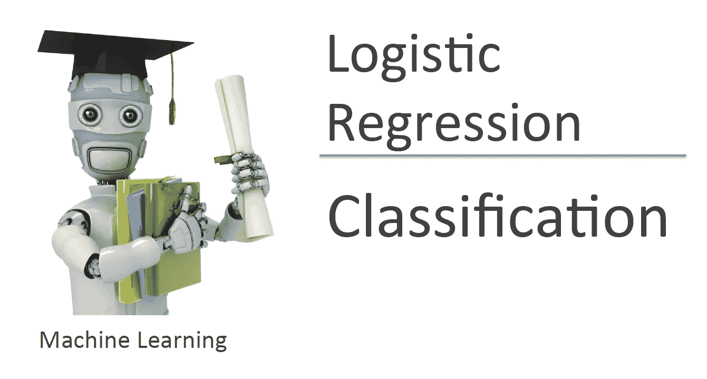
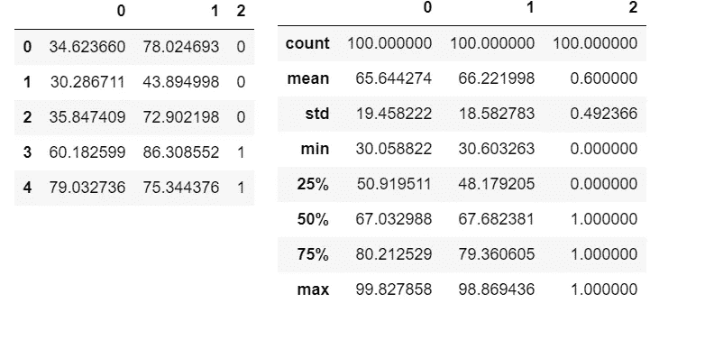
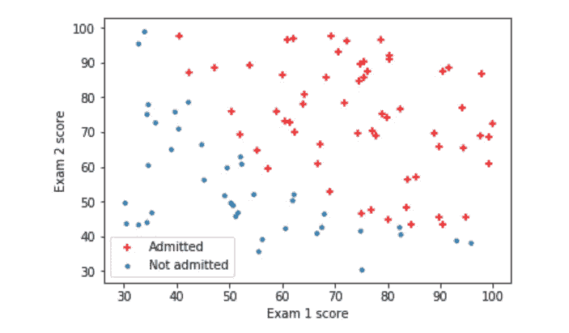
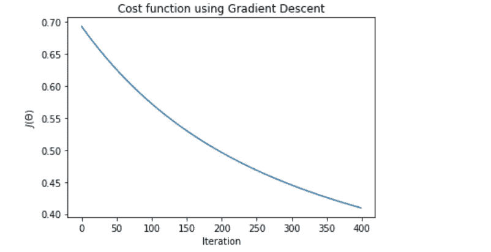
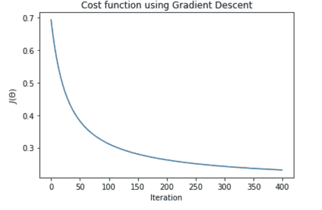
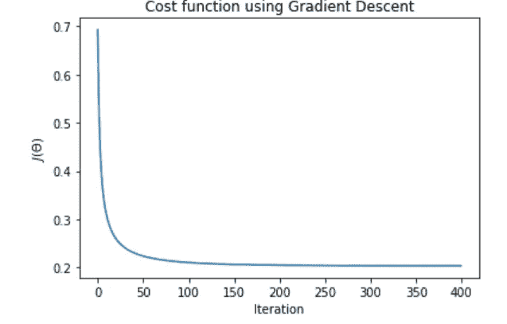
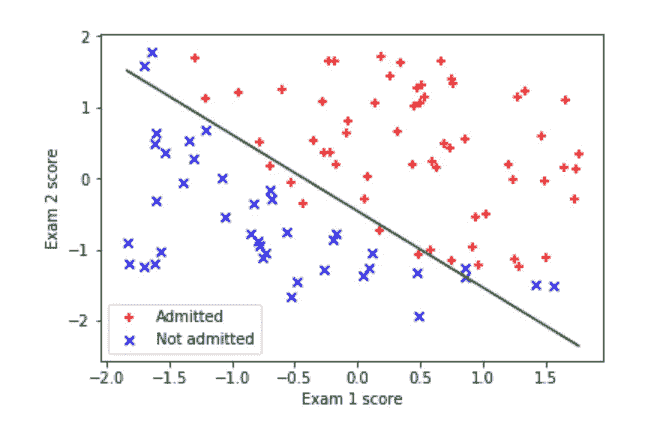

# 吴恩达的 Python(逻辑回归)机器学习课程

> 原文：<https://towardsdatascience.com/andrew-ngs-machine-learning-course-in-python-logistic-regression-c0ae25509feb?source=collection_archive---------6----------------------->



Machine Learning – Andrew Ng

继续这个系列，这将是吴恩达关于逻辑回归的机器学习课程的 python 实现。

与标签为连续变量的线性回归相比，逻辑回归用于标签为离散类别数的分类问题。

和往常一样，我们从导入库和数据集开始。这个数据集包含 2 个不同的学生考试成绩和他们的大学录取状态。我们被要求根据学生的考试成绩来预测他们是否被大学录取。

```
import numpy as np
import matplotlib.pyplot as plt
import pandas as pddf=pd.read_csv("ex2data1.txt",header=None)
```

理解数据

```
df.head()
df.describe()
```



数据绘图

```
pos , neg = (y==1).reshape(100,1) , (y==0).reshape(100,1)
plt.scatter(X[pos[:,0],0],X[pos[:,0],1],c="r",marker="+")
plt.scatter(X[neg[:,0],0],X[neg[:,0],1],marker="o",s=10)
plt.xlabel("Exam 1 score")
plt.ylabel("Exam 2 score")
plt.legend(["Admitted","Not admitted"],loc=0)
```

由于这不是标准的散点图或线图，为了便于理解，我将逐步分解代码。对于分类问题，我们将独立变量彼此相对绘制，并识别不同的类别以观察它们之间的关系。因此，我们需要区分导致大学录取的 x1 和 x2 的组合和没有导致大学录取的组合。变量`pos`和`neg`就是这样做的。通过用不同的颜色和标记画出被大学录取的 x1 和 x2 的组合，我们成功地将这种关系可视化。



两次考试分数都较高的学生果然被大学录取了。

区分逻辑回归和线性回归的 sigmoid 函数

```
def sigmoid(z):
    """
    return the sigmoid of z
    """

    return 1/ (1 + np.exp(-z))# testing the sigmoid function
sigmoid(0)
```

运行`sigmoid(0)`功能返回 0.5

计算成本函数 J(θ)和梯度(J(θ)相对于每个θ的偏导数)

```
def costFunction(theta, X, y):
    """
    Takes in numpy array theta, x and y and return the logistic regression cost function and gradient
    """

    m=len(y)

    predictions = sigmoid(np.dot(X,theta))
    error = (-y * np.log(predictions)) - ((1-y)*np.log(1-predictions))cost = 1/m * sum(error)

    grad = 1/m * np.dot(X.transpose(),(predictions - y))

    return cost[0] , grad
```

设置 initial_theta 并测试成本函数

```
m , n = X.shape[0], X.shape[1]
X= np.append(np.ones((m,1)),X,axis=1)
y=y.reshape(m,1)
initial_theta = np.zeros((n+1,1))
cost, grad= costFunction(initial_theta,X,y)
print("Cost of initial theta is",cost)
print("Gradient at initial theta (zeros):",grad)
```

打印语句将打印:初始角增量的成本是`0.693147180559946`初始角增量处的梯度(零):`[-0.1],[-12.00921659],[-11.26284221]`

现在是优化算法。在任务本身中，我们被告知使用 Octave 中的`fminunc`函数来寻找无约束函数的最小值。至于 python 实现，有一个库可以用于类似的目的。你可以在这里找到官方文档。有各种各样优化方法可供选择，在我之前，许多其他人都在他们的 python 实现中使用过这些方法。在这里，我决定使用梯度下降来进行优化，并将结果与 Octave 中的`fminunc`进行比较。

在进行梯度下降之前，永远不要忘记对多元问题进行特征缩放。

```
def featureNormalization(X):
    """
    Take in numpy array of X values and return normalize X values,
    the mean and standard deviation of each feature
    """
    mean=np.mean(X,axis=0)
    std=np.std(X,axis=0)

    X_norm = (X - mean)/std

    return X_norm , mean , std
```

正如讲座中提到的，梯度下降算法与线性回归非常相似。唯一的区别是假设 *h(x)* 现在是 g(θ^tx)其中 g 是 sigmoid 函数。

```
def gradientDescent(X,y,theta,alpha,num_iters):
    """
    Take in numpy array X, y and theta and update theta by taking num_iters gradient steps
    with learning rate of alpha

    return theta and the list of the cost of theta during each iteration
    """

    m=len(y)
    J_history =[]

    for i in range(num_iters):
        cost, grad = costFunction(theta,X,y)
        theta = theta - (alpha * grad)
        J_history.append(cost)

    return theta , J_history
```

我一直很喜欢干(不要重复自己)在编码上的说法。由于我们之前已经有了一个计算梯度的函数，我们就不重复计算了，在这里添加一个α项来更新θ。

由于作业没有实现梯度下降，我不得不测试一些 alpha 和 num_iters 值来找到最佳值。

使用`alpha=0.01, num_iters=400`，



梯度下降在每次迭代中降低成本函数，但是我们可以做得更好。用`alpha = 0.1, num_iters =400`，



好多了，但我会尝试另一个值，只是为了确保。与`alpha=1, num_iters=400`，



下降更剧烈，并且成本函数在 150 次迭代左右达到平稳。使用这个 alpha 和 num_iters 值，优化的θ是`[1.65947664],[3.8670477],[3.60347302]`，结果成本是`0.20360044248226664`。与最初的`0.693147180559946`相比有了显著的改进。与 Octave 中使用`fminunc`的优化成本函数相比，它与任务中获得的`0.203498`相差不远。

接下来是使用优化的θ绘制决策边界。在课程资源中有关于如何绘制决策边界的逐步解释。链接可以在[这里](https://www.coursera.org/learn/machine-learning/resources/fz4AU)找到。

```
plt.scatter(X[pos[:,0],1],X[pos[:,0],2],c="r",marker="+",label="Admitted")
plt.scatter(X[neg[:,0],1],X[neg[:,0],2],c="b",marker="x",label="Not admitted")
x_value= np.array([np.min(X[:,1]),np.max(X[:,1])])
y_value=-(theta[0] +theta[1]*x_value)/theta[2]
plt.plot(x_value,y_value, "r")
plt.xlabel("Exam 1 score")
plt.ylabel("Exam 2 score")
plt.legend(loc=0)
```



使用优化的 theta 进行预测

```
x_test = np.array([45,85])
x_test = (x_test - X_mean)/X_std
x_test = np.append(np.ones(1),x_test)
prob = sigmoid(x_test.dot(theta))
print("For a student with scores 45 and 85, we predict an admission probability of",prob[0])
```

打印语句将打印:对于一个分数为 45 和 85 的学生，我们预测录取概率为`0.7677628875792492`。使用`fminunc`非常接近`0.776291`。

为了找到分类器的准确性，我们计算训练集上正确分类的百分比。

```
def classifierPredict(theta,X):
    """
    take in numpy array of theta and X and predict the class 
    """
    predictions = X.dot(theta)

    return predictions>0p=classifierPredict(theta,X)
print("Train Accuracy:", sum(p==y)[0],"%")
```

如果被大学录取的概率大于 0.5，函数`classifierPredict` 返回一个带有`True`的布尔数组，否则返回`False`。取`sum(p==y)`将所有正确预测 y 值的实例相加。

print 语句 print: Train Accuracy: 89 %，表明我们的分类器正确预测了 89 %的训练集。

这都是为了逻辑回归。像往常一样，Jupyter 笔记本上传到我的 GitHub，网址是([https://GitHub . com/Ben lau 93/Machine-Learning-by-Andrew-Ng-in-Python](https://github.com/Benlau93/Machine-Learning-by-Andrew-Ng-in-Python))。

对于本系列中的其他 python 实现，

*   [线性回归](https://medium.com/@ben_lau93/andrew-ngs-machine-learning-course-in-python-linear-regression-dd04fba8e137)
*   [正则化逻辑回归](https://medium.com/@ben_lau93/andrew-ngs-machine-learning-course-in-python-regularized-logistic-regression-lasso-regression-721f311130fb)
*   [神经网络](https://medium.com/@ben_lau93/andrew-ngs-machine-learning-course-in-python-neural-networks-e526b41fdcd9)
*   [支持向量机](https://medium.com/@ben_lau93/andrew-ngs-machine-learning-course-in-python-support-vector-machines-435fc34b7bf9)
*   [无监督学习](https://medium.com/@ben_lau93/andrew-ngs-machine-learning-course-in-python-kmeans-clustering-pca-b7ba6fafa74)
*   [异常检测](https://medium.com/@ben_lau93/andrew-ngs-machine-learning-course-in-python-anomaly-detection-1233d23dba95)

感谢您的阅读。