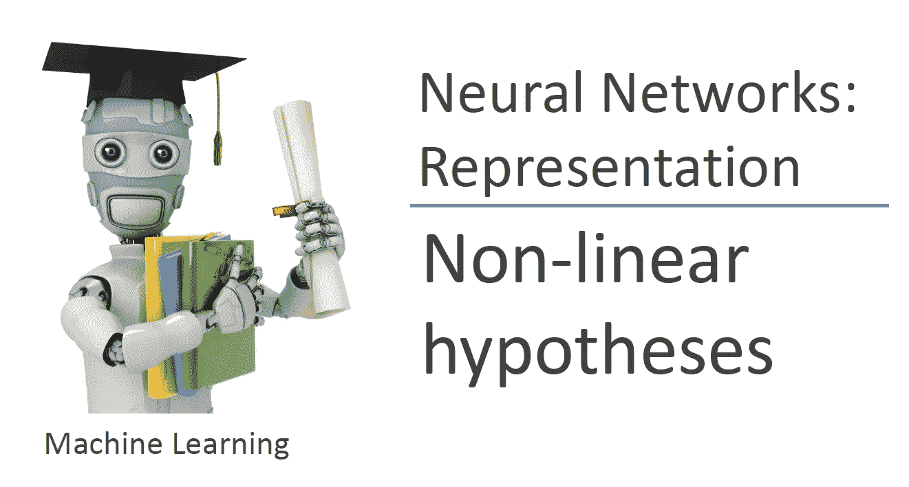
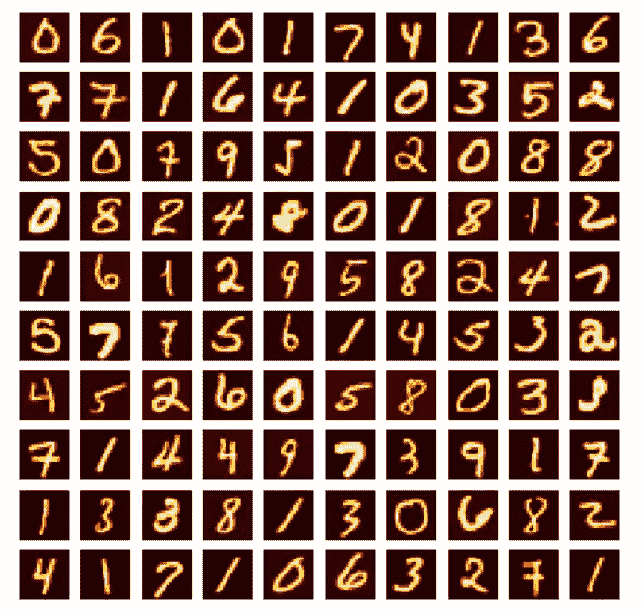
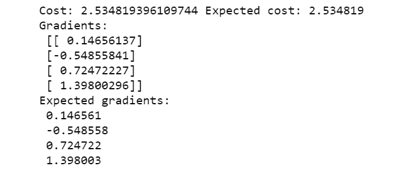
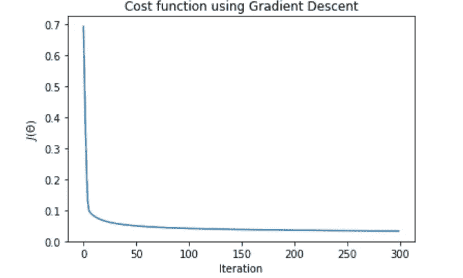
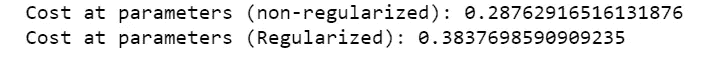
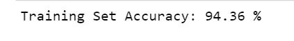

# 吴恩达的 Python(神经网络)机器学习课程

> 原文：<https://towardsdatascience.com/andrew-ngs-machine-learning-course-in-python-neural-networks-e526b41fdcd9?source=collection_archive---------5----------------------->



Machine Learning — Andrew Ng

本文将着眼于吴恩达的机器学习课程中关于神经网络的编程作业 3 和 4。这也是我们在课程中遇到的第一个复杂的非线性算法。我不知道你是怎么想的，但是对我来说，这个任务绝对有一个陡峭的学习曲线。神经网络形成深度学习的基础，深度学习具有广泛的应用，例如计算机视觉或自然语言处理。因此，获得最基本的权利是很重要的，用 python 编写这些赋值代码是确保这一点的一种方法。

B 在进入神经网络之前，让我们完成逻辑回归的最后一部分——多类逻辑回归。

这一系列练习利用了由 5000 个训练示例组成的手写数字数据集，其中每个示例都是数字的 20 像素乘 20 像素灰度图像。

加载数据集

```
import numpy as np
import pandas as pd
import matplotlib.pyplot as plt
from scipy.io import loadmat# Use loadmat to load matlab files
mat=loadmat("ex3data1.mat")
X=mat["X"]
y=mat["y"]
```

因为数据集是在。mat 格式而不是通常的格式。txt 格式，我不得不使用 scipy loadmat 函数来完成这项工作。官方文档可以在[这里](https://docs.scipy.org/doc/scipy-0.19.0/reference/generated/scipy.io.loadmat.html)找到。自装载垫装载以来。mat 文件作为一个以变量名为关键字的字典，给 X 和 y 赋值就像用变量的关键字访问字典一样简单。

```
X.shape, y.shape
```

为了更好地理解数据集，拥有数据的形状可以告诉我们数据的维度。X 具有对应于 5000 个训练样本的形状`5000,400`，每个训练样本具有来自其 20×20 像素的 400 个特征。y 有一个`5000,1`的形状，其中每个训练样本有一个从 1 到 10 的标签(在这个数据集中‘0’数字被标记为‘10’)。

可视化数据

```
import matplotlib.image as mpimg
fig, axis = plt.subplots(10,10,figsize=(8,8))
for i in range(10):
    for j in range(10):
        axis[i,j].imshow(X[np.random.randint(0,5001),:].reshape(20,20,order="F"), cmap="hot") #reshape back to 20 pixel by 20 pixel
        axis[i,j].axis("off")
```

上面的代码块构建了 100 个子情节，并使用 [plt.imshow](https://matplotlib.org/users/image_tutorial.html) 从 5000 个训练示例中随机可视化 100 个。请注意，我们必须将训练样本重新整形回 20 X 20 像素，然后才能将其可视化，并将`order="F"`作为参数添加到整形函数中，以确保图像的方向是垂直的。



计算成本函数和梯度

```
def sigmoid(z):
    """
    return the sigmoid of z
    """

    return 1/ (1 + np.exp(-z))def lrCostFunction(theta, X, y, Lambda):
    """
    Takes in numpy array of theta, X, y, and float lambda to compute the regularized logistic cost function 
    """

    m=len(y)
    predictions = sigmoid(X @ theta)
    error = (-y * np.log(predictions)) - ((1-y)*np.log(1-predictions))
    cost = 1/m * sum(error)
    regCost= cost + Lambda/(2*m) * sum(theta[1:]**2)

    # compute gradient
    j_0= 1/m * (X.transpose() @ (predictions - y))[0]
    j_1 = 1/m * (X.transpose() @ (predictions - y))[1:] + (Lambda/m)* theta[1:]
    grad= np.vstack((j_0[:,np.newaxis],j_1))
    return regCost[0], grad
```

这类似于我们在[逻辑回归](/andrew-ngs-machine-learning-course-in-python-regularized-logistic-regression-lasso-regression-721f311130fb)任务中使用的成本函数。

```
theta_t = np.array([-2,-1,1,2]).reshape(4,1)
X_t =np.array([np.linspace(0.1,1.5,15)]).reshape(3,5).T
X_t = np.hstack((np.ones((5,1)), X_t))
y_t = np.array([1,0,1,0,1]).reshape(5,1)
J, grad = lrCostFunction(theta_t, X_t, y_t, 3)
print("Cost:",J,"Expected cost: 2.534819")
print("Gradients:\n",grad,"\nExpected gradients:\n 0.146561\n -0.548558\n 0.724722\n 1.398003")
```



现在是分类任务。由于我们有不止一个类，我们将不得不使用一对一的分类方法来训练多个逻辑回归分类器(每个类一个分类器)。

```
def gradientDescent(X,y,theta,alpha,num_iters,Lambda):
    """
    Take in numpy array X, y and theta and update theta by taking num_iters gradient steps
    with learning rate of alpha

    return theta and the list of the cost of theta during each iteration
    """

    m=len(y)
    J_history =[]

    for i in range(num_iters):
        cost, grad = lrCostFunction(theta,X,y,Lambda)
        theta = theta - (alpha * grad)
        J_history.append(cost)

    return theta , J_history def oneVsAll(X, y, num_labels, Lambda):
    """
    Takes in numpy array of X,y, int num_labels and float lambda to train multiple logistic regression classifiers
    depending on the number of num_labels using gradient descent. 

    Returns a matrix of theta, where the i-th row corresponds to the classifier for label i
    """
    m, n = X.shape[0], X.shape[1]
    initial_theta = np.zeros((n+1,1))
    all_theta = []
    all_J=[]
    # add intercept terms

    X = np.hstack((np.ones((m,1)),X))

    for i in range(1,num_labels+1):
        theta , J_history = gradientDescent(X,np.where(y==i,1,0),initial_theta,1,300,Lambda)
        all_theta.extend(theta)
        all_J.extend(J_history)
    return np.array(all_theta).reshape(num_labels,n+1), all_J
```

`gradientDescent`函数是我们之前实现的常用优化函数。至于`oneVsAll`，它遍历所有的类，并使用梯度下降为每个类训练一组θ(在赋值中使用了`fmincg`函数)。`all_theta`然后在一个列表中捕获所有优化的 theta，并作为一个 numpy 数组返回，重新整形为一个 theta 矩阵，其中第 I 行对应于标签 I 的分类器。`np.where`在这里派上用场，为每个类获取一个 1/0 的 y 向量，以在每次迭代中执行我们的二元分类任务。

绘制成本函数只是为了确保梯度下降按预期工作

```
plt.plot(all_J[0:300])
plt.xlabel("Iteration")
plt.ylabel("$J(\Theta)$")
plt.title("Cost function using Gradient Descent")
```



alpha = 1, num_iters = 300

为了进行预测，计算每个类别的 x(i)的概率，并且该预测是具有最高概率的类别

```
def predictOneVsAll(all_theta, X):
    """
    Using all_theta, compute the probability of X(i) for each class and predict the label

    return a vector of prediction
    """
    m= X.shape[0]
    X = np.hstack((np.ones((m,1)),X))

    predictions = X @ all_theta.T
    return np.argmax(predictions,axis=1)+1pred = predictOneVsAll(all_theta, X)
print("Training Set Accuracy:",sum(pred[:,np.newaxis]==y)[0]/5000*100,"%")
```

打印报表打印:`Training Set Accuracy: 91.46 %`

最后，神经网络的时间到了。对于相同的数据集，我们旨在使用更复杂的算法(如神经网络)来实现更高的准确性。对于练习的第一部分，优化的θ值被给我们，我们应该实现前馈传播以获得预测和模型精度。

优化 theta 的加载

```
mat2=loadmat("ex3weights.mat")
Theta1=mat2["Theta1"] # Theta1 has size 25 x 401
Theta2=mat2["Theta2"] # Theta2 has size 10 x 26
```

使用前馈传播进行预测

```
def predict(Theta1, Theta2, X):
    """
    Predict the label of an input given a trained neural network
    """
    m= X.shape[0]
    X = np.hstack((np.ones((m,1)),X))

    a1 = sigmoid(X @ Theta1.T)
    a1 = np.hstack((np.ones((m,1)), a1)) # hidden layer
    a2 = sigmoid(a1 @ Theta2.T) # output layer

    return np.argmax(a2,axis=1)+1pred2 = predict(Theta1, Theta2, X)
print("Training Set Accuracy:",sum(pred2[:,np.newaxis]==y)[0]/5000*100,"%")
```

打印报表打印:`Training Set Accuracy: 97.52 %`。与多类逻辑回归相比，准确度高得多！

在作业 4 中，我们从零开始实现一个神经网络。我们从计算成本函数和θ的梯度开始。

```
def sigmoidGradient(z):
    """
    computes the gradient of the sigmoid function
    """
    sigmoid = 1/(1 + np.exp(-z))

    return sigmoid *(1-sigmoid) def nnCostFunction(nn_params,input_layer_size, hidden_layer_size, num_labels,X, y,Lambda):
    """
    nn_params contains the parameters unrolled into a vector

    compute the cost and gradient of the neural network
    """
    # Reshape nn_params back into the parameters Theta1 and Theta2
    Theta1 = nn_params[:((input_layer_size+1) * hidden_layer_size)].reshape(hidden_layer_size,input_layer_size+1)
    Theta2 = nn_params[((input_layer_size +1)* hidden_layer_size ):].reshape(num_labels,hidden_layer_size+1)

    m = X.shape[0]
    J=0
    X = np.hstack((np.ones((m,1)),X))
    y10 = np.zeros((m,num_labels))

    a1 = sigmoid(X @ Theta1.T)
    a1 = np.hstack((np.ones((m,1)), a1)) # hidden layer
    a2 = sigmoid(a1 @ Theta2.T) # output layer

    for i in range(1,num_labels+1):
        y10[:,i-1][:,np.newaxis] = np.where(y==i,1,0)
    for j in range(num_labels):
        J = J + sum(-y10[:,j] * np.log(a2[:,j]) - (1-y10[:,j])*np.log(1-a2[:,j]))

    cost = 1/m* J
    reg_J = cost + Lambda/(2*m) * (np.sum(Theta1[:,1:]**2) + np.sum(Theta2[:,1:]**2))

    # Implement the backpropagation algorithm to compute the gradients

    grad1 = np.zeros((Theta1.shape))
    grad2 = np.zeros((Theta2.shape))

    for i in range(m):
        xi= X[i,:] # 1 X 401
        a1i = a1[i,:] # 1 X 26
        a2i =a2[i,:] # 1 X 10
        d2 = a2i - y10[i,:]
        d1 = Theta2.T @ d2.T * sigmoidGradient(np.hstack((1,xi @ Theta1.T)))
        grad1= grad1 + d1[1:][:,np.newaxis] @ xi[:,np.newaxis].T
        grad2 = grad2 + d2.T[:,np.newaxis] @ a1i[:,np.newaxis].T

    grad1 = 1/m * grad1
    grad2 = 1/m*grad2

    grad1_reg = grad1 + (Lambda/m) * np.hstack((np.zeros((Theta1.shape[0],1)),Theta1[:,1:]))
    grad2_reg = grad2 + (Lambda/m) * np.hstack((np.zeros((Theta2.shape[0],1)),Theta2[:,1:]))

    return cost, grad1, grad2,reg_J, grad1_reg,grad2_reg
```

该赋值一步一步地遍历整个过程，首先计算成本，然后是正则化成本、梯度，最后是正则化梯度。如果您想继续，我修改了代码，只要您使用正确的索引，它就会返回中间步骤的值。

```
input_layer_size  = 400
hidden_layer_size = 25
num_labels = 10
nn_params = np.append(Theta1.flatten(),Theta2.flatten())
J,reg_J = nnCostFunction(nn_params, input_layer_size, hidden_layer_size, num_labels, X, y, 1)[0:4:3]
print("Cost at parameters (non-regularized):",J,"\nCost at parameters (Regularized):",reg_J)
```



`flatten()`这里的函数将数组折叠成一维，而`np.append`将参数“展开”成一个向量。

讲座中讨论了初始θ的对称性问题。为了打破这种对称性，需要随机初始化。

```
def randInitializeWeights(L_in, L_out):
    """
    randomly initializes the weights of a layer with L_in incoming connections and L_out outgoing connections.
    """

    epi = (6**1/2) / (L_in + L_out)**1/2

    W = np.random.rand(L_out,L_in +1) *(2*epi) -epi

    return Winitial_Theta1 = randInitializeWeights(input_layer_size, hidden_layer_size)
initial_Theta2 = randInitializeWeights(hidden_layer_size, num_labels)
initial_nn_params = np.append(initial_Theta1.flatten(),initial_Theta2.flatten())
```

最后，轮到我们使用前馈传播和反向传播来优化θ值。我使用的优化算法还是以前的梯度下降法。

```
def gradientDescentnn(X,y,initial_nn_params,alpha,num_iters,Lambda,input_layer_size, hidden_layer_size, num_labels):
    """
    Take in numpy array X, y and theta and update theta by taking num_iters gradient steps
    with learning rate of alpha

    return theta and the list of the cost of theta during each iteration
    """
    Theta1 = initial_nn_params[:((input_layer_size+1) * hidden_layer_size)].reshape(hidden_layer_size,input_layer_size+1)
    Theta2 = initial_nn_params[((input_layer_size +1)* hidden_layer_size ):].reshape(num_labels,hidden_layer_size+1)

    m=len(y)
    J_history =[]

    for i in range(num_iters):
        nn_params = np.append(Theta1.flatten(),Theta2.flatten())
        cost, grad1, grad2 = nnCostFunction(nn_params,input_layer_size, hidden_layer_size, num_labels,X, y,Lambda)[3:]
        Theta1 = Theta1 - (alpha * grad1)
        Theta2 = Theta2 - (alpha * grad2)
        J_history.append(cost)

    nn_paramsFinal = np.append(Theta1.flatten(),Theta2.flatten())
    return nn_paramsFinal , J_historynnTheta, nnJ_history = gradientDescentnn(X,y,initial_nn_params,0.8,800,1,input_layer_size, hidden_layer_size, num_labels)
Theta1 = nnTheta[:((input_layer_size+1) * hidden_layer_size)].reshape(hidden_layer_size,input_layer_size+1)
Theta2 = nnTheta[((input_layer_size +1)* hidden_layer_size ):].reshape(num_labels,hidden_layer_size+1)
```

对执行代码的人的警告。根据您的计算能力，计算将花费相当多的时间，如果您正在优化 alpha 和 num_iters 值，时间甚至会更长。我对 alpha 使用 0.8，对 num_iters 使用 800，但是我相信通过更多的调整可以得到更好的精确度。

```
pred3 = predict(Theta1, Theta2, X)
print("Training Set Accuracy:",sum(pred3[:,np.newaxis]==y)[0]/5000*100,"%")
```



至此，我已经完成了这个系列的一半。Jupyter 笔记本会上传到我的 GitHub 上([https://GitHub . com/Ben lau 93/Machine-Learning-by-Andrew-Ng-in-Python](https://github.com/Benlau93/Machine-Learning-by-Andrew-Ng-in-Python))。

对于本系列中的其他 python 实现，

*   [线性回归](https://medium.com/@ben_lau93/andrew-ngs-machine-learning-course-in-python-linear-regression-dd04fba8e137)
*   [逻辑回归](https://medium.com/@ben_lau93/andrew-ngs-machine-learning-course-in-python-logistic-regression-c0ae25509feb)
*   [正则化逻辑回归](https://medium.com/@ben_lau93/andrew-ngs-machine-learning-course-in-python-regularized-logistic-regression-lasso-regression-721f311130fb)
*   [支持向量机](https://medium.com/@ben_lau93/andrew-ngs-machine-learning-course-in-python-support-vector-machines-435fc34b7bf9)
*   [无监督学习](https://medium.com/@ben_lau93/andrew-ngs-machine-learning-course-in-python-kmeans-clustering-pca-b7ba6fafa74)
*   [异常检测](https://medium.com/@ben_lau93/andrew-ngs-machine-learning-course-in-python-anomaly-detection-1233d23dba95)

感谢您的阅读。