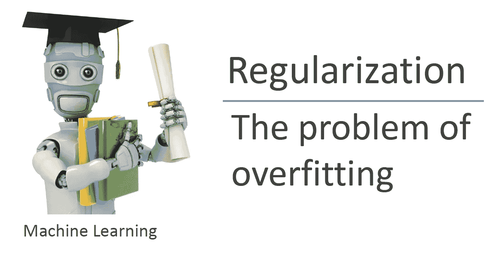
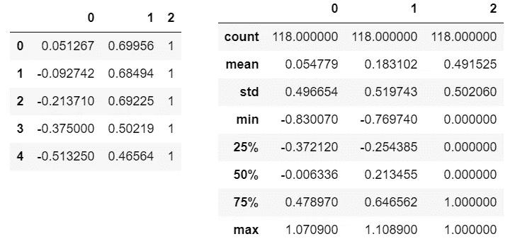
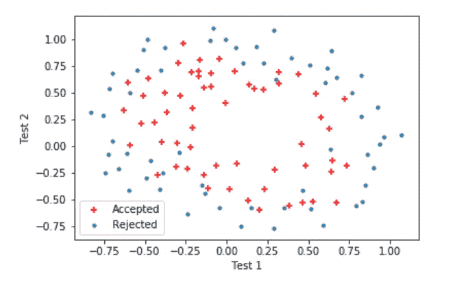
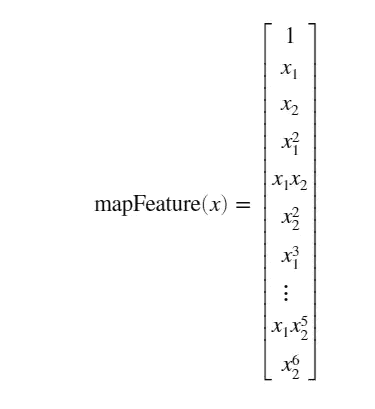
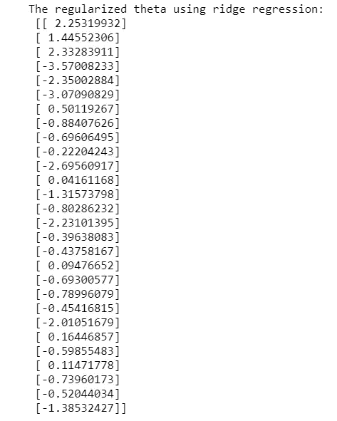
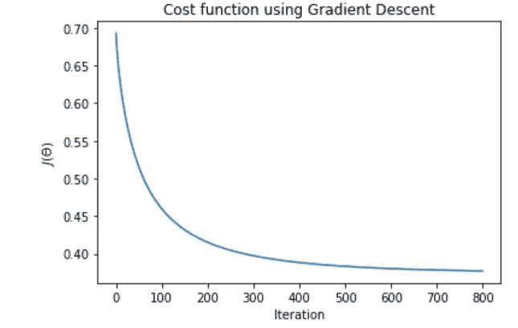
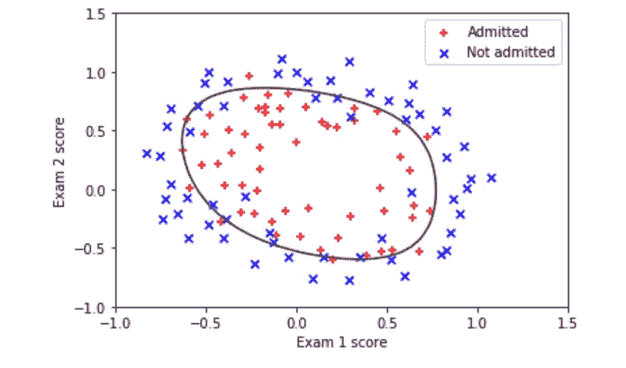
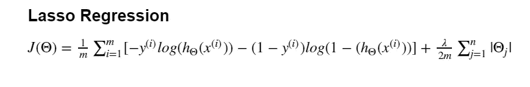
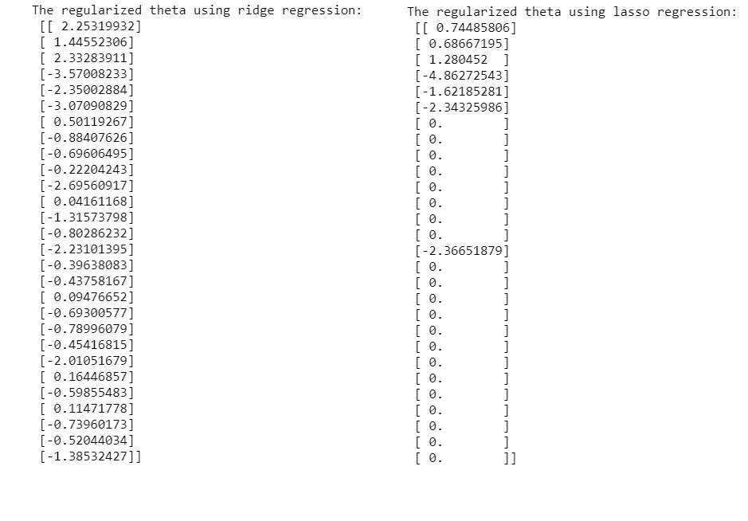

# 吴恩达的机器学习教程 Python(正则化 Logistic 回归)+ Lasso 回归

> 原文：<https://towardsdatascience.com/andrew-ngs-machine-learning-course-in-python-regularized-logistic-regression-lasso-regression-721f311130fb?source=collection_archive---------8----------------------->



Machine Learning — Andrew Ng

从编程任务 2 [(逻辑回归)](https://medium.com/@ben_lau93/andrew-ngs-machine-learning-course-in-python-logistic-regression-c0ae25509feb)继续，我们现在将继续进行 python 中的正则化逻辑回归，以帮助我们处理过度拟合的问题。

正则化是收缩方法，通过减少模型的方差，将系数收缩到零，以防止过度拟合。

直接进入任务，我们从导入所有相关的库和数据集开始。这一次，数据集包含了一个工厂中微芯片的两个测试结果，我们将使用测试结果来预测微芯片应该被接受还是被拒绝。

```
import numpy as np
import pandas as pd
import matplotlib.pyplot as pltdf=pd.read_csv("ex2data2.txt", header=None)
df.head()
df.describe()
```



如您所见，这是一个多变量、二元分类问题，我们可以使用逻辑回归来解决。

现在来看数据。与之前的逻辑回归可视化一样，x1 和 x2 的每种组合导致接受微芯片，相对于导致拒绝的组合作图

```
X=df.iloc[:,:-1].values
y=df.iloc[:,-1].valuespos , neg = (y==1).reshape(118,1) , (y==0).reshape(118,1)
plt.scatter(X[pos[:,0],0],X[pos[:,0],1],c="r",marker="+")
plt.scatter(X[neg[:,0],0],X[neg[:,0],1],marker="o",s=10)
plt.xlabel("Test 1")
plt.ylabel("Test 2")
plt.legend(["Accepted","Rejected"],loc=0)
```



绘制数据清楚地表明，区分不同类别的决策边界是非线性的。这导致下一步的特征映射，我们添加额外的多项式项来尝试和更好地拟合数据(正常的逻辑回归只能拟合线性决策边界，在这种情况下不会做得很好)。在作业中决定，我们将增加多项式的 6 次方项。

```
def mapFeature(x1,x2,degree):
    """
    take in numpy array of x1 and x2, return all polynomial terms up to the given degree
    """
    out = np.ones(len(x1)).reshape(len(x1),1)
    for i in range(1,degree+1):
        for j in range(i+1):
            terms= (x1**(i-j) * x2**j).reshape(len(x1),1)
            out= np.hstack((out,terms))
    return outX = mapFeature(X[:,0], X[:,1],6)
```

`mapFeature`函数还将一列 1 加到 X 上，这样我们就不必在以后处理它了。这里，我决定使用`np.hstack`而不是`np.append`向 numpy 数组添加一个新列。我发现与我通常使用的`np.append`相比，`np.hstack`的代码更加简洁。在这里，我允许 degree 作为一个参数，而不是像在作业中那样将其固定为 6，可以随意使用不同的 degree 并比较结果。



这个图表有助于形象化我们正在做的事情和涉及的多项式项。

接下来，我们继续定义计算正则化成本函数和梯度的函数。请记住，成本函数现在有一个由λ控制的附加收缩损失。

```
def sigmoid(z):
    """
    return the sigmoid of z
    """

    return 1/ (1 + np.exp(-z))def costFunctionReg(theta, X, y ,Lambda):
    """
    Take in numpy array of theta, X, and y to return the regularize cost function and gradient
    of a logistic regression
    """

    m=len(y)
    y=y[:,np.newaxis]
    predictions = sigmoid(X @ theta)
    error = (-y * np.log(predictions)) - ((1-y)*np.log(1-predictions))
    cost = 1/m * sum(error)
    regCost= cost + Lambda/(2*m) * sum(theta**2)

    # compute gradient
    j_0= 1/m * (X.transpose() @ (predictions - y))[0]
    j_1 = 1/m * (X.transpose() @ (predictions - y))[1:] + (Lambda/m)* theta[1:]
    grad= np.vstack((j_0[:,np.newaxis],j_1))
    return regCost[0], grad
```

您可以使用相同的`costFunction`代码并添加一个λ项来计算正则化成本函数。根据官方 numpy [文档](https://docs.scipy.org/doc/numpy-1.15.0/reference/generated/numpy.dot.html)，我发现用`@`替换`np.dot`是矩阵乘法的首选选项。写`@`也容易多了，所以我觉得很酷。如果你不熟悉 numpy 广播，你可以在这里查看。广播是我需要使用`y=y[:,np.newaxis]`给 y 添加一个新轴的原因，以确保线性代数操作如我所料。如果你已经注意到了，我在之前的实现中使用了`reshape()`来处理广播(告诉你们我正在边做边学)。顺便说一下，`np.vstack`在这里添加到新的一行而不是一列，用于`np.hstack`。

```
# Initialize fitting parameters
initial_theta = np.zeros((X.shape[1], 1))# Set regularization parameter lambda to 1
Lambda = 1#Compute and display initial cost and gradient for regularized logistic regression
cost, grad=costFunctionReg(initial_theta, X, y, Lambda)print("Cost at initial theta (zeros):",cost)
```

打印报表 print:初始θ(零)处的成本:`0.6931471805599461`

至于优化算法，我再次使用标准梯度下降，而不是`fminunc`。python 做`fminunc`的方式可以在[这里](https://docs.scipy.org/doc/scipy-0.10.0/reference/tutorial/optimize.html)找到。

```
def gradientDescent(X,y,theta,alpha,num_iters,Lambda):
    """
    Take in numpy array X, y and theta and update theta by taking num_iters gradient steps
    with learning rate of alpha

    return theta and the list of the cost of theta during each iteration
    """

    m=len(y)
    J_history =[]

    for i in range(num_iters):
        cost, grad = costFunctionReg(theta,X,y,Lambda)
        theta = theta - (alpha * grad)
        J_history.append(cost)

    return theta , J_historytheta , J_history = gradientDescent(X,y,initial_theta,1,800,0.2)print("The regularized theta using ridge regression:\n",theta)
```

print 语句将打印:



同样，没有给出 alpha、num_iters 和λ值，尝试一些值的组合，得出最佳值。

```
plt.plot(J_history)
plt.xlabel("Iteration")
plt.ylabel("$J(\Theta)$")
plt.title("Cost function using Gradient Descent")
```

使用我陈述的值，这是相对于迭代次数绘图的结果成本函数。



降低成本函数—检查
成本函数平稳—检查

```
def mapFeaturePlot(x1,x2,degree):
    """
    take in numpy array of x1 and x2, return all polynomial terms up to the given degree
    """
    out = np.ones(1)
    for i in range(1,degree+1):
        for j in range(i+1):
            terms= (x1**(i-j) * x2**j)
            out= np.hstack((out,terms))
    return outplt.scatter(X[pos[:,0],1],X[pos[:,0],2],c="r",marker="+",label="Admitted")
plt.scatter(X[neg[:,0],1],X[neg[:,0],2],c="b",marker="x",label="Not admitted")# Plotting decision boundaryu_vals = np.linspace(-1,1.5,50)
v_vals= np.linspace(-1,1.5,50)
z=np.zeros((len(u_vals),len(v_vals)))
for i in range(len(u_vals)):
    for j in range(len(v_vals)):
        z[i,j] =mapFeaturePlot(u_vals[i],v_vals[j],6) @ thetaplt.contour(u_vals,v_vals,z.T,0)
plt.xlabel("Exam 1 score")
plt.ylabel("Exam 2 score")
plt.legend(loc=0)
```

绘制非线性决策边界，包括绘制分隔不同类别的等高线。我做了一些谷歌搜索，这个 [stackoverflow](https://stackoverflow.com/questions/22294241/plotting-a-decision-boundary-separating-2-classes-using-matplotlibs-pyplot) 答案可能会对在座的一些人有所帮助。代码只是简单的翻译了作业中给出的八度音阶代码，为了代码背后的数学和直觉，请查看上面给出的 stackoverflow 链接。



我会说非常好！

为了检查模型的准确性，我们再次利用训练数据的正确分类百分比。

```
def classifierPredict(theta,X):
    """
    take in numpy array of theta and X and predict the class 
    """
    predictions = X.dot(theta)

    return predictions>0p=classifierPredict(theta,X)
print("Train Accuracy:", (sum(p==y[:,np.newaxis])/len(y) *100)[0],"%")
```

打印报表打印:训练精度:`83.05084745762711%`。接近，但没有使用`fminunc`在赋值中获得的`88.983051%`高。

接下来，我想谈谈套索回归，另一种用于防止过度拟合的正则化方法。参考《统计学习导论》，Lasso 回归比岭回归(我们刚刚做的正则化)有明显的优势。也就是说，虽然岭回归将系数缩小到零，但它永远不会将其减小到零，因此，无论系数的值有多小，所有要素都将包含在模型中。另一方面，套索回归能够将系数缩小到恰好为零，减少特征的数量，同时充当特征选择工具。这使得套索回归在高维情况下很有用，并有助于模型的可解释性。

对于 Lasso 回归，要最小化的成本函数与岭回归非常相似。



它不是将θ平方之和相加，而是使用绝对值，由于它涉及绝对值，计算起来很困难，因为它是不可微的。各种算法可用于计算这一点，使用 sklearn 库可以找到一个这样的例子。

```
from sklearn.linear_model import LogisticRegressionclf = LogisticRegression(penalty="l1")
clf.fit(X,y)thetaLasso=clf.coef_
print("The regularized theta using lasso regression:\n",thetaLasso.reshape(28,1))
```

θ值的并排比较。



如您所见，lasso 回归将几个要素减少到 0，从而降低了问题的维度并提高了模型的可解释性。

这是我所有的正规化。Jupyter 笔记本会上传到我的 GitHub 上([https://GitHub . com/Ben lau 93/Machine-Learning-by-Andrew-Ng-in-Python](https://github.com/Benlau93/Machine-Learning-by-Andrew-Ng-in-Python))。

对于本系列中的其他 python 实现，

*   [线性回归](https://medium.com/@ben_lau93/andrew-ngs-machine-learning-course-in-python-linear-regression-dd04fba8e137)
*   [逻辑回归](https://medium.com/@ben_lau93/andrew-ngs-machine-learning-course-in-python-logistic-regression-c0ae25509feb)
*   [神经网络](https://medium.com/@ben_lau93/andrew-ngs-machine-learning-course-in-python-neural-networks-e526b41fdcd9)
*   [支持向量机](https://medium.com/@ben_lau93/andrew-ngs-machine-learning-course-in-python-support-vector-machines-435fc34b7bf9)
*   [无监督学习](https://medium.com/@ben_lau93/andrew-ngs-machine-learning-course-in-python-kmeans-clustering-pca-b7ba6fafa74)
*   [异常检测](https://medium.com/@ben_lau93/andrew-ngs-machine-learning-course-in-python-anomaly-detection-1233d23dba95)

感谢您的阅读。