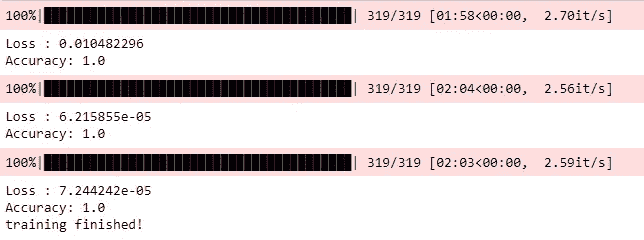
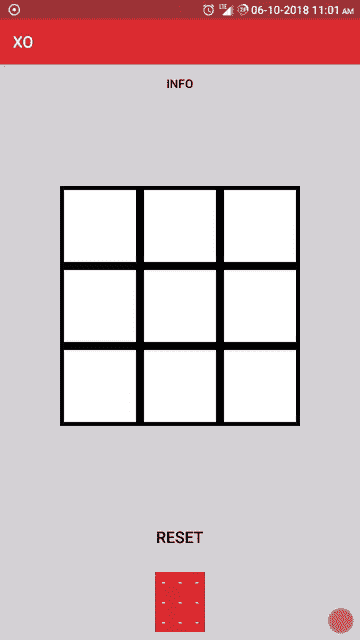

# Android 中的 ConvolutionNeuralNetwork(CNN)——TIC tactoe . ai(第 1 部分)

> 原文：<https://towardsdatascience.com/android-with-tensorflow-part-1-6897ba617b1e?source=collection_archive---------3----------------------->


Image source from- [https://techcrunch.com/2017/05/17/googles-tensorflow-lite-brings-machine-learning-to-android-devices/](https://techcrunch.com/2017/05/17/googles-tensorflow-lite-brings-machine-learning-to-android-devices/)

Google Tensorflow 现在已经在 Android 中用于集成机器学习模型。

所以我想用 Tensorflow 创建一个 Android 应用程序，因为其他人只是使用 Tensorflow 的预训练模型，并将其集成到应用程序中。但我想尝试一些新的东西，所以我训练了自己的模型，并了解了 Tensorflow 如何与 Android 交互。了解如何保存模型以供移动使用。

# 张量流

我已经实现了卷积神经网络的代码来分类 TicTacToe 游戏的 X 和 O。


Image sources from :- [https://www.analyticsvidhya.com/blog/2017/06/architecture-of-convolutional-neural-networks-simplified-demystified/](https://www.analyticsvidhya.com/blog/2017/06/architecture-of-convolutional-neural-networks-simplified-demystified/)

输入图像大小为 28x28，输出图层大小为 2。因为我们必须将图像分类为 X 和 o。

在建立模型的时候，你必须定义哪个是你的**输出节点**，哪个是你的**输入节点**，给那些节点一些特定的名字。

然后是模型的训练，我已经在 6000 张不同的 X 和 O 的图像上训练了我的模型，运行了 3 个时期



Training result of CNN

由于训练模型已经训练了权重，这给出了 X 和 o 的完美分类。现在，我们必须保存具有权重的张量流的图形。

冻结图形时，我们需要输入和输出节点名称的列表，这就是为什么我们给输入和输出节点命名，这在冻结图形时很有帮助。

冻结图由获得输出必须执行的操作序列组成。操作包括矩阵乘法、加法和用训练模型的冻结权重对矩阵进行整形。

下面是冻结保存模型的代码。

```
freeze_graph.freeze_graph('out/' + MODEL_NAME + '.pbtxt', **None**, **False**,'out/' + MODEL_NAME + '.chkp', output_node_name, "save/restore_all","save/Const:0", 'out/frozen_' + MODEL_NAME + '.pb', **True**, "")

input_graph_def = tf.GraphDef()
**with** tf.gfile.Open('out/frozen_' + MODEL_NAME + '.pb', "rb") **as** f:
    input_graph_def.ParseFromString(f.read())

input_node_names = ['input']

output_graph_def = optimize_for_inference_lib.optimize_for_inference(
        input_graph_def, input_node_names, [output_node_name],
        tf.float32.as_datatype_enum)

**with** tf.gfile.FastGFile('out/opt_' + MODEL_NAME + '.pb', "wb") **as** f:
    f.write(output_graph_def.SerializeToString())
```

查看我的项目[的冻结图](https://raw.githubusercontent.com/harsh2011/XO-Models/master/out/opt_xo_differ.pb)

# 带 Tensorflow 的 Android

从 Android 开始，首先，我们已经集成了 Tensorflow 库，只需将它添加到依赖项中。

```
dependencies {
.....
implementation ‘org.tensorflow:tensorflow-android:+’
}
```

由于 Tensorflow 是用 C++编写的，所以你必须将 NDK 集成到我们的 Android 项目中。然后将模型复制到 android 目录的 asset 文件夹中。

如何使用 Java 在 Android 中运行图形？

```
// added the path of model
private static final String MODEL_FILE_CNN = "file:///android_asset/opt_xo_differ_v2.pb";
//declare the input and output
private static final String INPUT_NODE = "input";
private static final String OUTPUT_NODE = "output"private TensorFlowInferenceInterface inferenceInterface;//load graph
inferenceInterface = new TensorFlowInferenceInterface(getAssets(),MODEL_FILE_CNN);
```

正在加载模型。pd 文件，并创建一个**tensorflowenceinterface**对象

为了检测，我创建了一个方法来读取浮动中的图像像素。因为 DrawView 是一个画布，它为我们提供画布绘制图像的像素值，然后将它们转换为 float，并将其传递给**tensorflowenceinterface**对象。

因此，首先您必须将数据输入到**输入节点(input_node 和 keep_prob)，**中，然后使用**输出节点**运行推理接口

```
public float[] getDetectofDV(DrawView d){float pixels[] = d.getPixelData();inferenceInterface.feed(INPUT_NODE, pixels,1,28,28,1);
inferenceInterface.feed("keep_prob", new float[] { 1 });final Operation operation = inferenceInterface.graphOperation(OUTPUT_NODE);final int numClasses = (int) operation.output(0).shape().size(1);// this run the operation of the graph
inferenceInterface.run(new String[]{OUTPUT_NODE},false);float [] outputarray = new float[numClasses];
//get the output
inferenceInterface.fetch(OUTPUT_NODE,outputarray);return outputarray;
}
```

**outputarray** 如果一个索引 0 值大于索引 1，则返回具有 2 个值的检测结果。则图像被检测为‘0’，否则为‘X’。



这是将模型与 Android 整合后的结果。就像在触摸监听器上工作一样，当你从画布上拿起手指时，它会传递图像进行分类，你会在下面的矩阵中得到输出。

查看 playstore 上的应用程序。[https://play.google.com/store/apps/details?id=com.harsh.xo](https://play.google.com/store/apps/details?id=com.harsh.xo)

# 未来的工作

首先，我会尽量缩小模型的尺寸。CNN 的模型大小是 17MB，因为它在应用程序中占用了大量空间。应用程序的最终大小为 55 MB。

致力于在同一应用程序中集成新模型。一个人可以玩电脑。

https://play.google.com/store/apps/details?id=com.harsh.xo