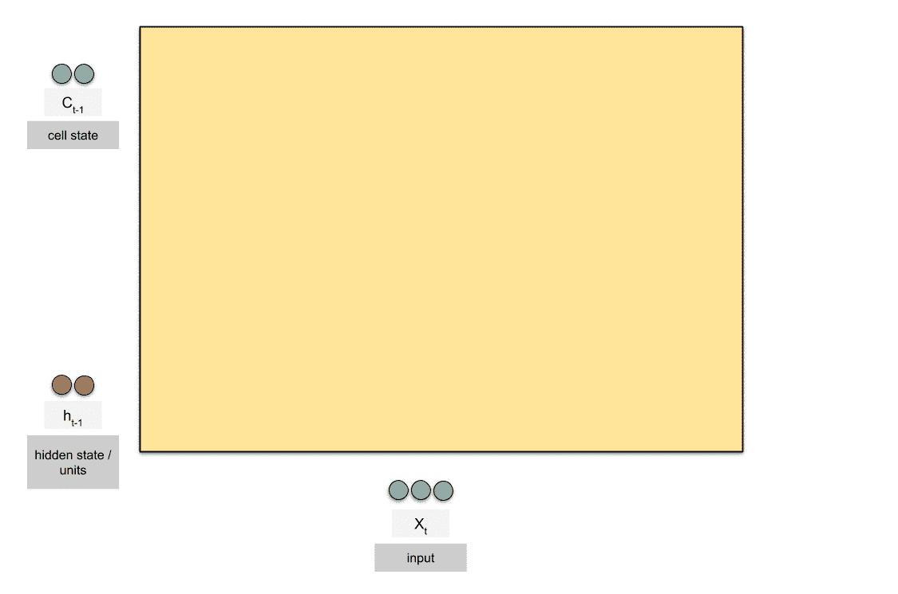
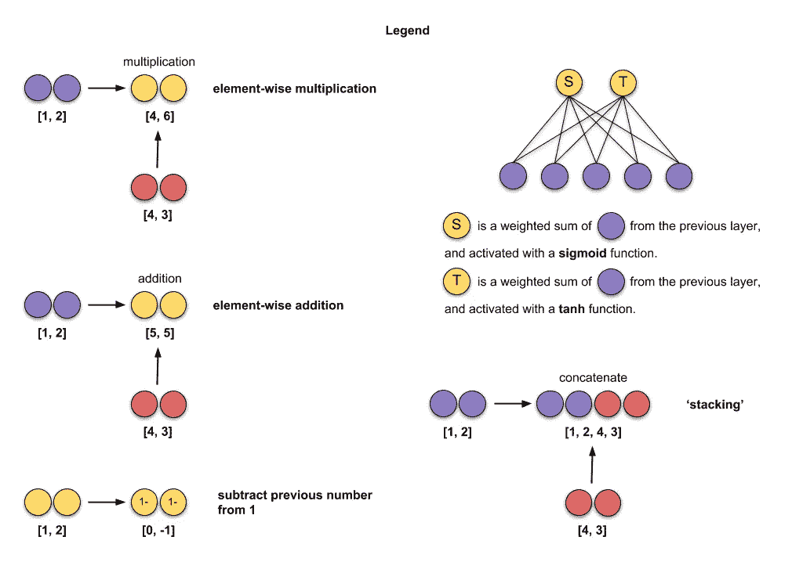
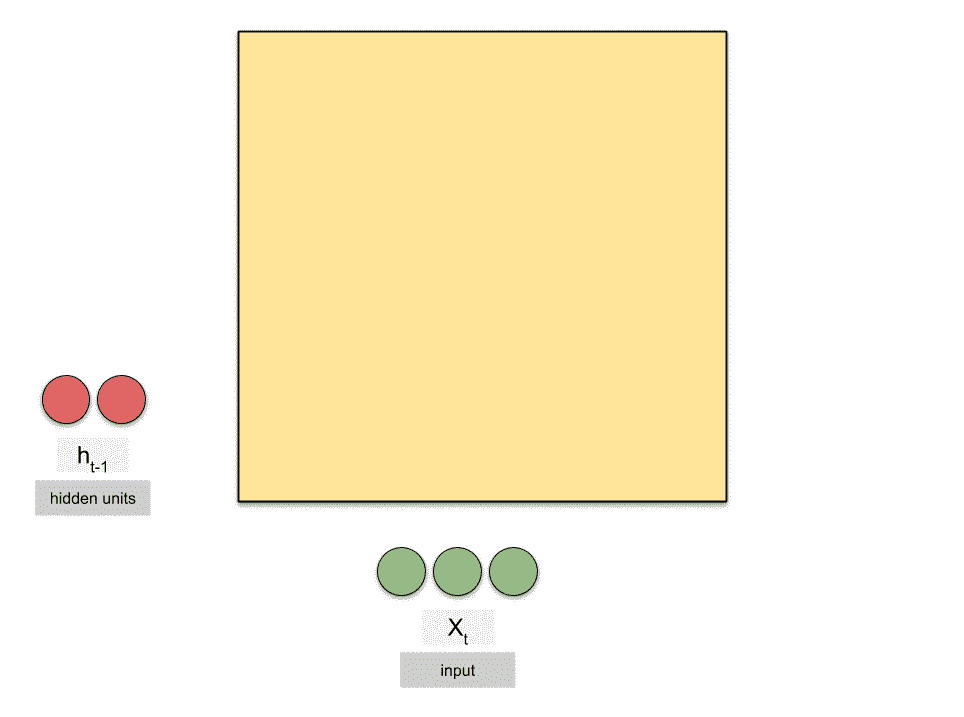
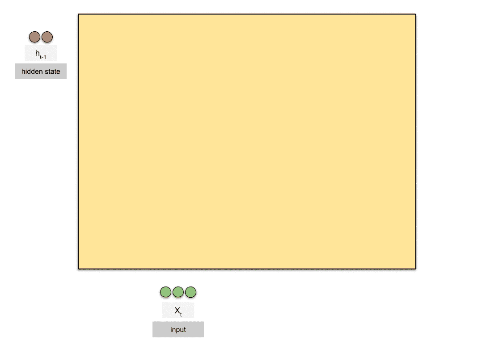
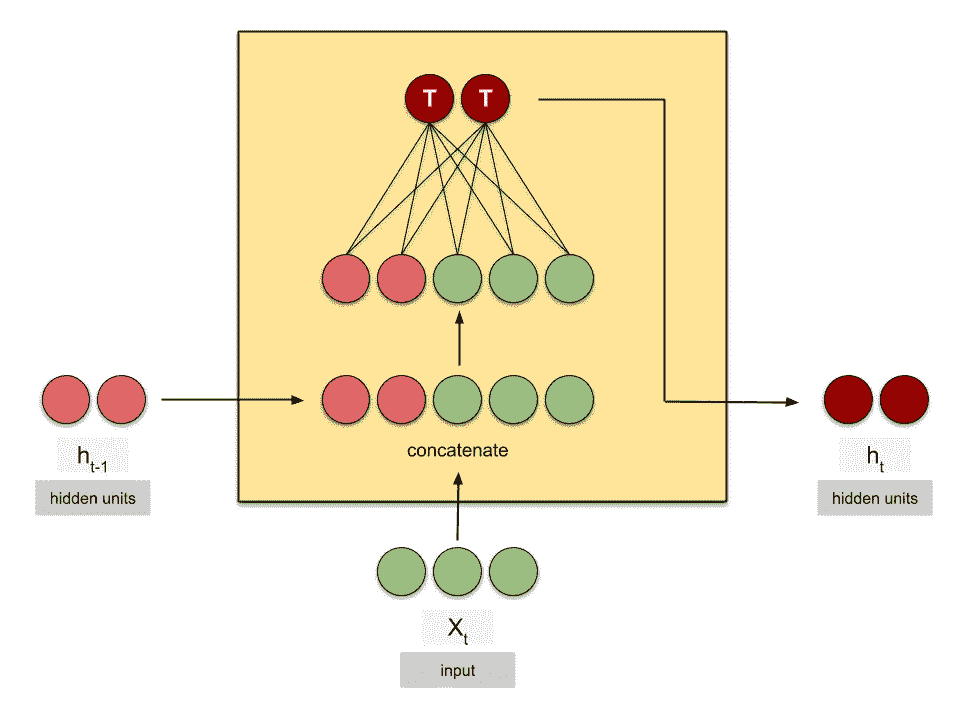
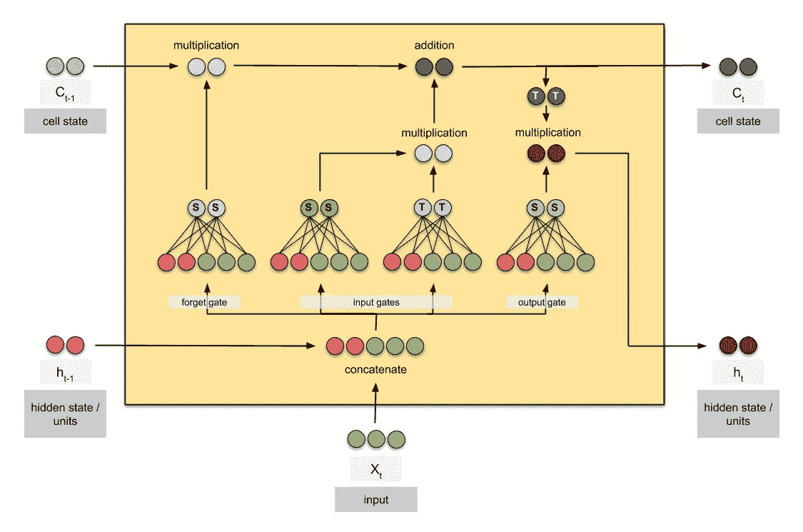
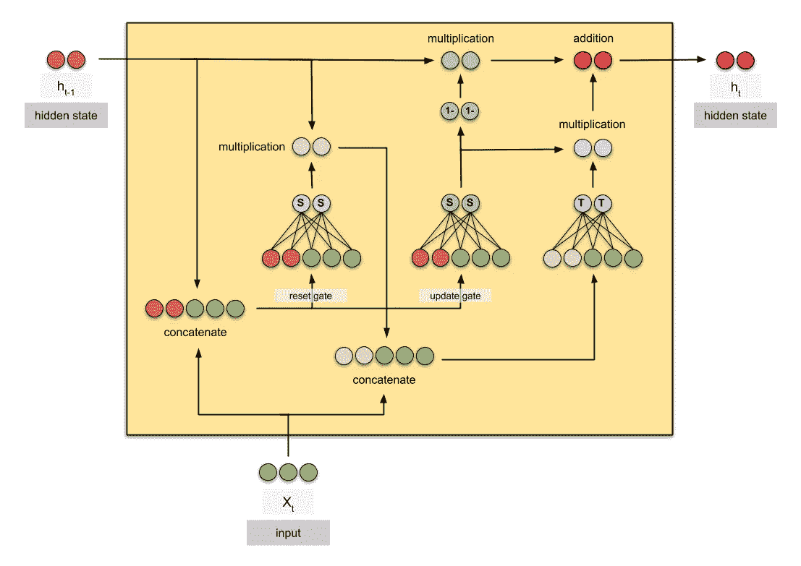

# 动画 RNN，LSTM 和 GRU

> 原文：<https://towardsdatascience.com/animated-rnn-lstm-and-gru-ef124d06cf45?source=collection_archive---------0----------------------->

## gif 中的递归神经网络细胞

*变更日志:*

【2020 年 7 月 4 日:移除 GRU 的“输出门”标签

R 通用神经网络(RNNs)是一类人工神经网络，通常用于序列数据。3 种最常见的递归神经网络是

1.  香草 RNN，
2.  长短期记忆(LSTM)，由 [Hochreiter 和 Schmidhuber 于 1997 年](https://www.researchgate.net/publication/13853244_Long_Short-term_Memory)提出，以及
3.  门控循环单元(GRU)，由 Cho 等人提出。2014 年的 al。

> 请注意，我将使用“RNNs”来统称固有递归的神经网络架构，使用“香草 RNN”来指代最简单的递归神经网络架构，如图[图 1](#50f0) 所示。

有许多关于循环神经网络的图解。我个人最喜欢的是迈克尔·阮(Michael Nguyen)在《走向数据科学》中发表的文章，因为他为我们提供了对这些模型的直觉，更重要的是，他提供了美丽的插图，使我们易于理解。但是我的帖子背后的动机是为了更好地可视化这些细胞中发生的事情，以及节点是如何被共享的，以及它们如何转化为输出节点。我也受到了迈克尔的动画的启发。

这篇文章探讨了香草 RNN，LSTM 和 GRU 细胞。这是一篇简短的阅读材料，是为那些对这些主题有所了解的人准备的。(我建议在看这个帖子之前先看看 Michael 的文章。)重要的是要注意，以下动画是连续的以引导人眼，但并不反映矢量化机器计算期间的时间顺序。

这是我在插图中使用的图例。

Fig. 0: Legend for animations

注意，动画显示了在**一个时间步长**中发生的数学运算(由 *t* 索引)。此外，我使用了输入大小为 3(绿色)和 2 个隐藏单元(红色)，批量大小为 1。

我们开始吧！

## 香草 RNN

Fig. 1: Animated vanilla RNN cell

*   *t* —时间步长
*   *X —* 输入
*   *h —* 隐藏状态
*   *X 的长度—* 输入的大小/尺寸
*   *h 的长度—* 隐蔽单元的数量。注意，不同的库对它们的称呼不同，但意思是一样的:
    - Keras — `[state_size](https://keras.io/layers/recurrent/)` *，*`[units](https://keras.io/layers/recurrent/#lstm)` -py torch—`[hidden_size](https://pytorch.org/docs/stable/nn.html#rnn)`
    -tensor flow—`[num_units](https://www.tensorflow.org/api_docs/python/tf/nn/rnn_cell/BasicLSTMCell)`

## LSTM

Fig. 2: Animated LSTM cell

*   *C —* 细胞状态

请注意，单元状态的维度与隐藏状态的维度相同。

## 苏军总参谋部情报总局

Fig. 3: Animated GRU cell

希望这些动画对你有所帮助！以下是静态图像中单元格的摘要:

Fig. 4: Vanilla RNN cell

Fig. 5: LSTM cell

Fig. 6: GRU cell

## 笔记

我用谷歌制图创建了这些图形。

## 参考

 [## 了解 LSTM 网络——colah 的博客

### 这些循环使得循环神经网络看起来有点神秘。然而，如果你想得更多一点，事实证明…

colah.github.io](https://colah.github.io/posts/2015-08-Understanding-LSTMs/)  [## LSTM 和 GRU 的图解指南:一步一步的解释

### 嗨，欢迎来到长短期记忆(LSTM)和门控循环单位(GRU)的图解指南。我是迈克尔…

towardsdatascience.com](/illustrated-guide-to-lstms-and-gru-s-a-step-by-step-explanation-44e9eb85bf21) 

## 深度学习相关文章

[逐行 Word2Vec 实现](/an-implementation-guide-to-word2vec-using-numpy-and-google-sheets-13445eebd281)(关于单词嵌入)

[带随机梯度下降的线性回归分步指南](/step-by-step-tutorial-on-linear-regression-with-stochastic-gradient-descent-1d35b088a843)

[10 种梯度下降优化算法+备忘单](/10-gradient-descent-optimisation-algorithms-86989510b5e9)

[统计深度学习模型中的参数数量](/counting-no-of-parameters-in-deep-learning-models-by-hand-8f1716241889)

[经办人:图文并茂](/attn-illustrated-attention-5ec4ad276ee3)

[图文并茂:自我关注](/illustrated-self-attention-2d627e33b20a)

*感谢* [*德里克*](https://medium.com/@derekchia)*[*任杰*](https://medium.com/@renjietan) *对本文的想法、建议和修正。**

**关注我上* [*推特*](https://www.twitter.com/remykarem) *@remykarem 或者*[*LinkedIn*](http://www.linkedin.com/in/raimibkarim)*。你也可以通过 raimi.bkarim@gmail.com 联系我。欢迎访问我的网站*[*remykarem . github . io*](https://remykarem.github.io/)*。**