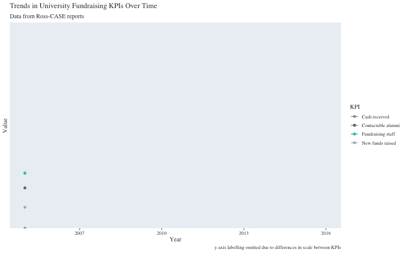
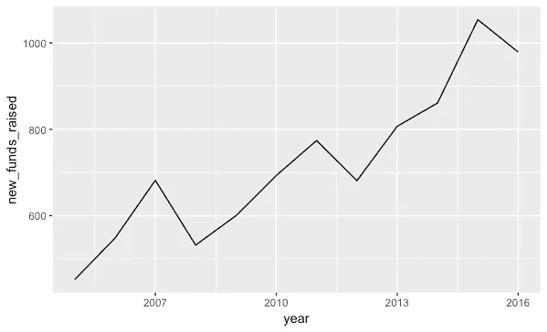
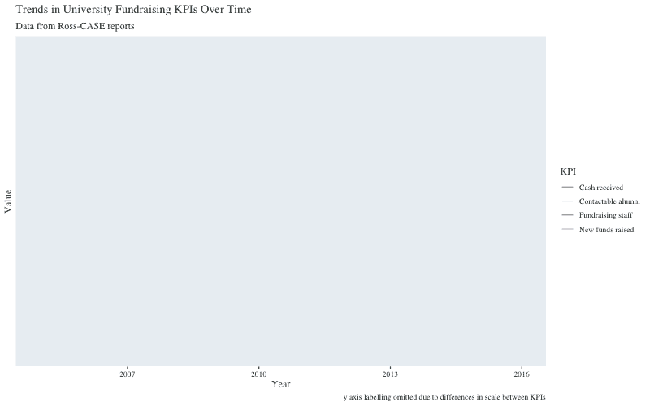
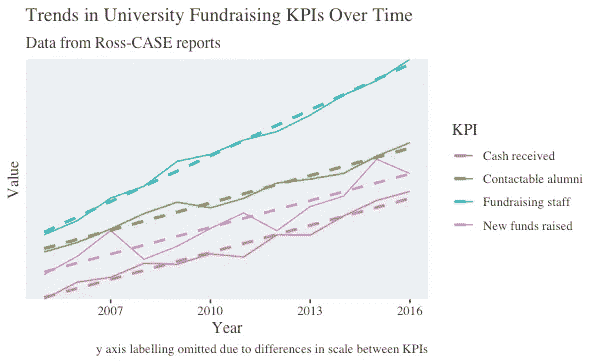
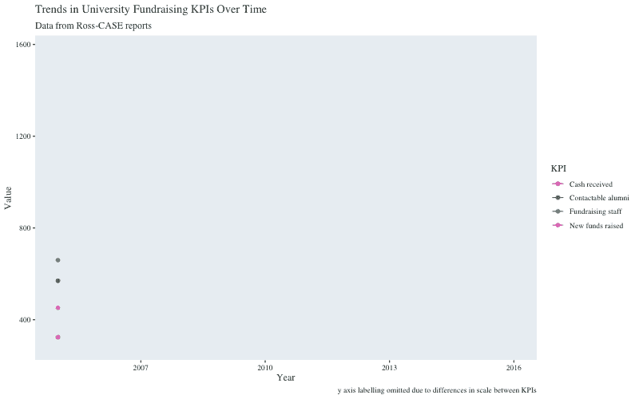
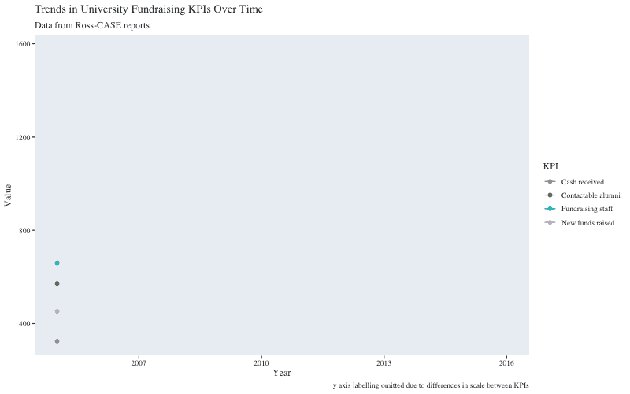

# 使用 broom 和 ggplot2 在 R 中制作回归模型动画

> 原文：<https://towardsdatascience.com/animating-regression-models-in-r-using-broom-and-ggplot2-da798e6638be?source=collection_archive---------9----------------------->

## 这可能对信息没有帮助，但在 Twitter 上看起来不错



我在《走向数据科学》中的第一篇文章是我给自己设定的一个小练习的结果，这个小练习是为了让那些灰色的小细胞保持运转。这是一个类似的练习，尽管与我正在做的一个项目更相关一些。由于我在营销部门工作，我不得不习惯于身兼两职。

通常，这些帽子是相互排斥的。在这种情况下，分歧是另一个动画数据可视化的形式。与动画苏格兰橄榄球冠军图一样，这个例子并没有真正受益于添加动画作为情节的另一个维度。

这张图表只是为了显示英国大学筹款的一些指标随时间变化的趋势。我只需要用 *x* 和 *y* 来表示价值和年份，但是这有什么意思呢？这是那种我们可以用`ggplot2`轻松可笑地绘制出来的东西:

```
ggplot(fund_tidy, aes(x = year, 
                      y = value,
                      colour = kpi)) +
  geom_line()
```

为什么不把它作为一个学习练习呢？我以前玩过`gganimate`包，但是从来没有真正花过时间。这似乎是一个好机会。

## dataviz 冲突

这就把我们带到了帽子的对接上。我不认为一个动画情节是表现这些数据的最佳方式。我不知道它在技术上是否算作非数据墨水，但你会明白:它只是没有必要。如果已经拍摄了 *x* 和 *y* ，并且我想展示这两个值是如何随时间变化的，那么动画以一种易于理解的方式呈现了这些变化。在这种情况下，它是多余的。

> *要进一步探索市场营销与数据科学的结合，* [*在 Twitter 上关注 Chris*](https://twitter.com/chrisBowdata)*。*

但是很多图做出来并不是为了尽可能简单准确的表示数据，而是为了引起注意。在许多情况下，特别是在营销机构的世界里，有一种趋势是把一个清晰、直截了当的条形图变成一个完全新颖的信息图。一段时间内的游客流量用一只卡通脚表示，脚趾的大小代表每年的价值，有人知道吗？但那是以后的事了。

事实是，动画吸引眼球，它可以增加停留时间，让读者有时间来理解标题、坐标轴标签、图例和信息。可能吧。以及增加任何品牌的曝光率。不过，我确实有一些原则，所以我不会故意制作一张误导人的图表。摆弄配色方案和布局，让它看起来更时尚一点？当然，但是数据必须是第一位的。

## 趋势的例子

我一直在做一些大学筹款工作，看着历史性的[罗斯案例报告](https://www.case.org/Samples_Research_and_Tools/Benchmarking_and_Research/Surveys_and_Studies/Ross-CASE_Survey/Ross-CASE_2018_Report.html)，觉得看看一些关键绩效指标如何随着时间的推移而变化会很有趣。我以前看过一些主要的，但没有看过其他几个，觉得把它们放在一起看可能会很有趣。这将是一些很好的`ggplot2`和`gganimate`练习。让我们开始吧。

注意:因为这个练习的目的是比较潜在的趋势，并花更多的时间在 gganimate 上，而不是产生一个出版物质量的数字，因此对 *y* 轴标签的态度有点“漫不经心”！

## 这里没有洋葱皮

和以往一样，导入我预先制作的数据集并快速浏览是我的首要任务:

```
# import yearly data (total, summed values, not means or medians)
# dataset compiled from historical Ross-CASE reportslibrary(readr)fund_df <- read_csv("year_sum.csv")# quick look at datalibrary(dplyr)glimpse(fund_df) Observations: 12
Variables: 6
$ year               <int> 2005, 2006, 2007, 2008, 2009, 2...
$ new_funds_raised   <int> 452, 548, 682, 532, 600, 693, 7...
$ cash_received      <int> 324, 413, 438, 511, 506, 560, 5...
$ fundraising_staff  <int> 660, 734, 851, 913, 1043, 1079,...
$ contactable_alumni <dbl> 5.7, 6.2, 6.9, 7.7, 8.3, 8.0, 8...
$ contact_alum_x100  <dbl> 570, 620, 690, 770, 830, 800, 8... library(ggplot2)ggplot(fund_df, aes(x = year,
                    y = new_funds_raised)) +
  geom_line()
```



好了，我们有了一个数据集，它看起来像是我从以前的工作中期望的那样，所以希望我没有在第一个障碍就把事情搞砸了。前进！

因为 contactable _ aluminum 的值与其他值相差几个数量级，所以我创建了一个新列，将这些值乘以 100，使它们处于相同的范围内。然后，我将数据整理成一个整齐的“长”格式:

```
# create contactable alumni x100 variable to place values on equivalent scalefund_df <-
  fund_df %>%
  mutate(contact_alum_x100 = contactable_alumni * 100)# create tidy dataframelibrary(tidyr)fund_tidy <-
  fund_df %>%
  gather(kpi, value, - year) %>%
  mutate(kpi = as.factor(kpi))glimpse(fund_tidy) Observations: 60
Variables: 3
$ year  <int> 2005, 2006, 2007, 2008, 2009, 2010, 2011, 20...
$ kpi   <fct> new_funds_raised, new_funds_raised, new_fund...
$ value <dbl> 452, 548, 682, 532, 600, 693, 774, 681, 807,...
```

随着数据的转换，我们准备创建我们的第一个动画情节，记得从过滤掉原始的`contactable_alumni`变量开始:

```
# create animated plotlibrary(gganimate)
library(transformr)first_animate <-
  fund_tidy %>%
  filter(kpi != "contactable_alumni") %>%
  ggplot(aes(x = year, 
             y = value,
             colour = kpi)) +
  geom_line() + 
# this next line is where the magic happens:
  transition_reveal(kpi, year) +
  labs(title = "Trends in University Fundraising KPIs Over Time",
       subtitle = "Data from Ross-CASE reports",
       x = "Year",
       y = 'Value',
       caption = "y axis labelling omitted due to differences in scale between KPIs",
       colour = "KPI") +
  scale_colour_discrete(labels = c("Cash received", 
                                   "Contactable alumni",
                                   "Fundraising staff",
                                   "New funds raised")) +
  scale_y_discrete(labels = NULL) +
  theme_chris()
```



我们出发了。但这是最好的结果吗？我不这么认为。对我来说最重要的是，因为我们对趋势感兴趣，我们也应该有趋势线。如何着手去做…？

为了以非动画的方式做到这一点，我们只需在绘图代码中添加一个`geom_smooth()`:

```
# create non-animated plot with trendlinesfund_tidy %>%
  filter(kpi != "contactable_alumni") %>%
  ggplot(aes(x = year, 
             y = value,
             colour = kpi)) +
  geom_line() +
  geom_smooth(method = "lm", linetype = "dashed", se = FALSE) +
  labs(title = "Trends in University Fundraising KPIs Over Time",
       subtitle = "Data from Ross-CASE reports",
       x = "Year",
       y = 'Value',
       caption = "y axis labelling omitted due to differences in scale between KPIs",
       colour = "KPI") +
  scale_colour_discrete(labels = c("Cash received", 
                                   "Contactable alumni",
                                   "Fundraising staff",
                                   "New funds raised")) +
  scale_y_discrete(labels = NULL) +
  theme_chris()
```



但是我们能简单地这样做并添加`transition_reveal()`行以同样的方式制作动画吗？我不能以任何方便的方式找到并相信我，在我失败的过程中产生了一些令人印象深刻的情节。很可能有一种简单的方法可以用`geom_smooth()`来实现，但是搜索 Stackoverflow 五分钟都没有找到，于是我有了另一个想法。我的下一个想法是创建趋势线作为过程中的一个独立阶段，建立另一个数据框架来构建我的动画情节:

```
#---- create linear model and augmented dataframe ----# build pre-filtered dataframefund_tidy2 <-
  fund_tidy %>%
  filter(kpi != "contactable_alumni")# build linear modellin_mod <- lm(value ~ year + kpi, data = fund_tidy2)# augment linear model to produce tidy dataframe with fitted valueslibrary(broom)aug_mod <- augment(lin_mod)# create animated graphaug_animate <-
  aug_mod %>%
  ggplot(aes(x = year, 
             y = value,
             colour = kpi)) +
  geom_line(aes(group = kpi, y = .fitted), size = 0.5, linetype = "dashed") +
  geom_point(size = 2) +
  geom_line(aes(group = kpi)) +
  transition_reveal(kpi, year) +
  labs(title = "Trends in University Fundraising KPIs Over Time",
       subtitle = "Data from Ross-CASE reports",
       x = "Year",
       y = 'Value',
       caption = "y axis labelling omitted due to differences in scale between KPIs",
       colour = "KPI") +
  scale_colour_discrete(labels = c("Cash received", 
                                   "Contactable alumni",
                                   "Fundraising staff",
                                   "New funds raised")) +
  theme_chris()# animate and saveaug_animated <- animate(aug_animate, height = 500, width = 800)anim_save("aug_animated.gif", animation = aug_animated)
```



哦，亲爱的，当然，这没有用。嗯，动画部分已经完全如我们所愿，但趋势线是错误的。由于我们构建模型的方式，我们已经创建了一个[平行斜率](https://blog.markgrowth.com/the-roas-might-look-like-0-but-is-your-display-campaign-actually-working-192f5e132f2a)类型的线性回归。在这样做的时候，我们失去了数据的关键发现:筹款人员的数量增长速度快于新基金的收购。

## 多个模型

为了得到我们想要的，我们必须为每个 KPI 建立一个单独的模型。使用 r 中的 tidy 原则很容易做到这一点。通过按 KPI 分组并嵌套在 tibble 中，我们可以使用`purrr`包中的`map`函数快速轻松地构建多个模型。

另一种方法是为每个 KPI 创建一个单独的数据框架，分别构建和扩充模型，然后将它们重新绑定在一起。这是一个很好的解决方案，但不具备真正的可扩展性。也就是说，这是我在决定咬紧牙关尝试以“正确”的方式做这件事之前首先做的事情:

```
#---- build multiple models for animated plot with trendlines ----# build nested tibblefund_nested <-
  fund_tidy2 %>%
  group_by(kpi) %>%
  nest()# build separate regression modelsfund_models <- 
  fund_nested %>%
  mutate(lm_mod = map(data, 
                     ~lm(formula = value ~ year, 
                         data = .x)))# augment models and unnest tibblefund_models_aug <-
  fund_models %>%
  mutate(aug = map(lm_mod, ~augment(.x))) %>% 
  unnest(aug)case_animate <-
fund_models_aug %>%
  ggplot(aes(x = year, 
             y = value,
             colour = kpi)) +
  geom_line(aes(group = kpi, y = .fitted), size = 0.5, linetype = "dashed") +
  geom_point(size = 2) +
  geom_line(aes(group = kpi)) +
  transition_reveal(kpi, year) +
  labs(title = "Trends in University Fundraising KPIs Over Time",
       subtitle = "Data from Ross-CASE reports",
       x = "Year",
       y = 'Value',
       caption = "y axis labelling omitted due to differences in scale between KPIs",
       colour = "KPI") +
  scale_colour_discrete(labels = c("Cash received", 
                                   "Contactable alumni",
                                   "Fundraising staff",
                                   "New funds raised")) +
  scale_fill_discrete() +
  theme_chris()
```



这就是我们想要的。为了美观，我添加了一个单独的 geom_point()，我们还可以做一些事情来使事情变得更漂亮，但是，总的来说，任务完成了，知识得到了加强！

*F* [*在 Twitter 上关注克里斯*](https://twitter.com/chrisBowdata) *。*

本文中的代码可以在 GitHub 上找到。