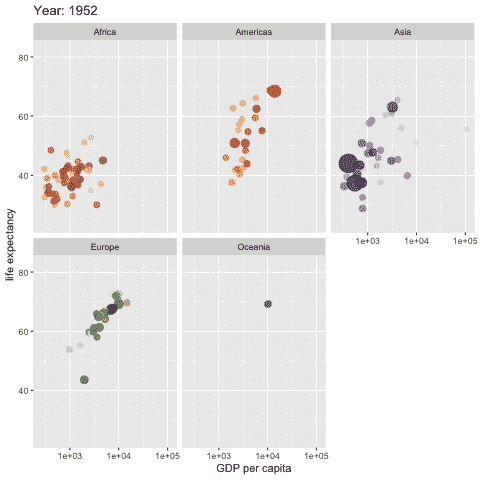
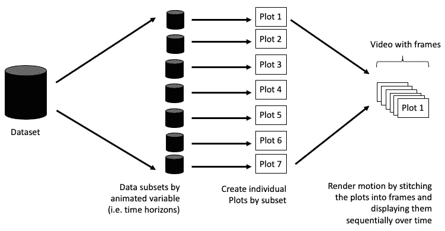
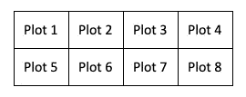
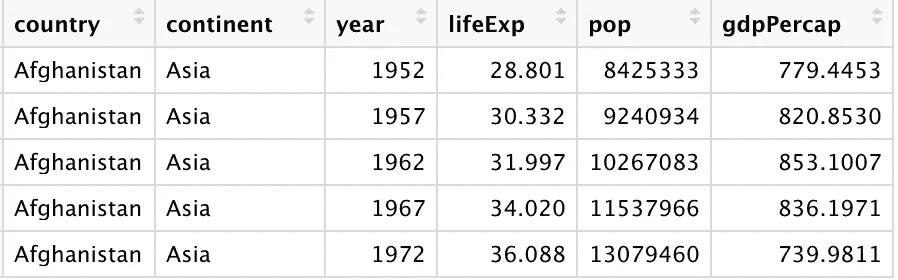
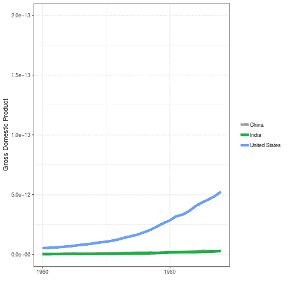
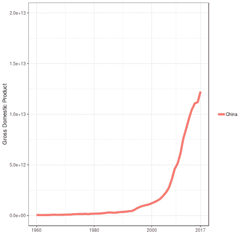
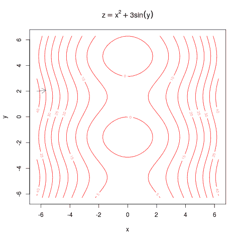
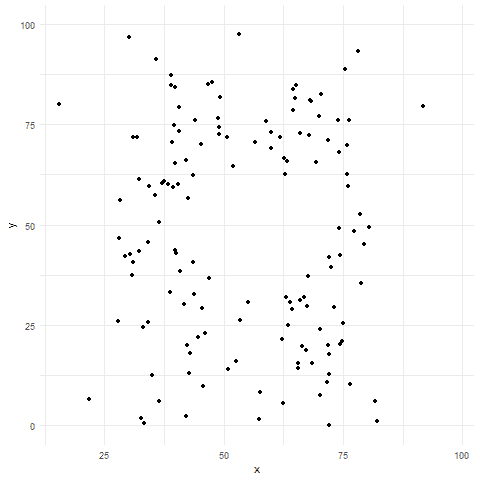

# 使用 R 将您的数据可视化制作成动画，就像老板一样

> 原文：<https://towardsdatascience.com/animating-your-data-visualizations-like-a-boss-using-r-f94ae20843e3?source=collection_archive---------2----------------------->

## R 中动画库的回顾与教程



[Gapminder Inspired: Animated Viz by Pedersen](https://github.com/thomasp85/gganimate/blob/master/man/figures/README-unnamed-chunk-4-1.gif)

在讲述数据驱动的故事时，没有什么比动作更能吸引眼球了。我们的眼睛自然会被明亮的颜色和运动所吸引。一个好的视觉效果能抓住观众的兴趣并留下印象。幸运的是，通过一些易于使用的 R 包，制作这样的显示器变得非常简单。[本文中的所有可视化示例都可以从这个 Github repo](https://github.com/isaacfab/tinker/tree/master/animate_with_r) 中派生出来。我假设你对基本的绘图有所了解。

在你开始让你的图表跳舞之前，你应该先问问你自己:这样做有意义吗？如果您正在进行探索性的数据分析，一个运动图形可能不值得您投入时间。然而，如果你正在做一个演示，一些放置得很好的动画图片可以比静态图片更好地帮助观众理解你的主题。

创建动画时，情节实际上并不移动。相反，许多单独的情节被构建，然后缝合在一起成为电影帧，就像一个老派的翻页书或漫画一样。当传达运动时，每一帧都是不同的图，这是使用聚合数据的一些相关子集构建的。当拼接在一起时，子集驱动动画的流动。



How Animation is Done For Data Visualizations

子集越多，你的图就越平滑。这是你制作动画的重要考虑因素。如果您的数据太薄，您将只有几帧，这可能不会引人注目。在这种情况下，使用静态面板图而不是动画可能会更好。这些可以在 ggplot 中创建，例如，使用[面](https://ggplot2.tidyverse.org/reference/facet_grid.html)。另一个选择是使用插值和 [tweener 包](https://github.com/thomasp85/tweenr)来扩展你的数据集。



Panel Plot Structure with 2 rows and 4 columns

动画的最大好处是，它允许您可以可视化的变量数量的扩展。动画图的运动由数据集中的变量“驱动”。上面的图是使用包含六个变量的数据集构建的。动画很好地捕捉到了这六个场景！以下是数据示例:



A Sample of the Gapminder Data

我们可以对这六个值中的任何一个进行动画处理。然而，这是危险的！有些变量比其他变量更适合制作动画。例如，随着时间的推移动画变化是显而易见的；然而，对分类变量采用同样的方法会造成混乱。

**GDP 的好动画:放慢你的脚步中国！**😯



**糟糕的 GDP 动画:我不知道发生了什么…🙄**



以下是动画创造有价值见解的几次机会:

*   随着时间的变化
*   迭代/递归技术的变化(如梯度下降或贝尔曼方程)
*   模拟过程中的变化

这里的关键点是突出显示驱动动画的变量的数据中的重要变化。说够了-让我们建立一些动画可视化！所有创建这些可视化效果的源代码都可以在 Github repo 这里找到。

## 包裹

我通常使用四个包选项来制作 R 中的数据动画:

*   [动画](https://yihui.name/animation/):可用于制作任何剧情类型的动画，由[谢一辉](https://yihui.name/)编写
*   [gganimate](https://github.com/thomasp85/gganimate) :用于专门制作 ggplot 图形的动画，由[托马斯·林·彼得森](https://github.com/thomasp85)编写
*   [plottly](https://plot.ly/r/animations/):具有动画特性的交互式绘图库
*   [googlevis](https://cran.r-project.org/web/packages/googleVis/vignettes/googleVis_examples.html) :有一个基于 flash 的运动图表选项

一般来说，动画包提供了最大的控制，对于基本图来说很棒，但是可能会很冗长。另一方面，gganimate 包只限于一个绘图库，但它使在 ggplot 中构建运动变得极其容易(在您的绘图中有一两行额外的代码)。与 gganimate 类似，plotly 只能从自己的库中制作可视化动画。Googlevis 是最受限制的，只提供一种需要 flash 的动作情节，这种东西越来越不常见。出于这个原因，我不会做这个库的例子，看看[这里](https://cran.r-project.org/web/packages/googleVis/vignettes/googleVis_examples.html)如果你已经安装了 flash。

## 使用动画

使用 animate 包，您有五个导出选项，假设您安装了正确的依赖项(参见文档)。

*   HTML(带控件)
*   视频(mp4)
*   GIF 格式
*   乳液
*   闪光

这个包很棒，部分是因为它内置了一些惊人的统计图形作为示例。这是一个动画**渐变下降**并创建一个带有控件的 HTML 页面:

```
library(animate)desc = c("This is a super cool example of Gradient Descent")saveHTML({ f1 = function(x, y) x^2 + 3 * sin(y)
  xx = grad.desc(f1, pi * c(-2, -2, 2, 2), c(-2 * pi, 2))

 xx$persp(col = "lightblue", theta = 30, phi = 30)},title = "Demo of Gradient Descent", description = desc, verbose = FALSE)
```



Gradient Descent Example from The animate package

有时你希望你的用户能够控制动画。在本例中，最后一帧是您可能想要暂停的表面的 3D 图像。此处链接的 Github repo 中有这个动画的现场版，带有这样的控件。

这个包最强大的地方是你可以用任何可视化工具来构建你的框架。例如，上面的好的和坏的动画都是使用这个库和 ggplot [构建的(参见 Github repo)。](https://github.com/isaacfab/tinker/tree/master/animate_with_r)

## 使用 gganimate

使用 gganimate，默认的导出是 GIF(使用 [gifski](https://github.com/r-rust/gifski) ，你必须安装 **rust** ，但是根据你的具体需求也有其他选项。本文中的第一个动画示例是使用 gganimate 包构建的(事实上，它是该包的自述文件中唯一完整的真实数据示例)。这是 wiki(作者 [Tom Westlake](https://github.com/tomwestlake121) )渲染成视频文件的另一个例子。一个有趣的关于[安斯科姆的四重奏，](https://en.wikipedia.org/wiki/Anscombe%27s_quartet)这个动画是一系列的情节，都有相同的汇总统计，其中一个是恐龙！所有这一切只需要对一个基本的 ggplot 添加几行代码。

```
library(datasauRus)
library(ggplot2)
library(gganimate)

ggplot(datasaurus_dozen, aes(x=x, y=y))+
  geom_point()+
  theme_minimal() +
  transition_states(dataset, 3, 1) + 
  ease_aes('cubic-in-out')
```



The datasauRus!

## 使用 Plotly

这里涉及的最后一个包是 plotly。许多可视化实践者和这个包有一种爱恨交加的关系。它允许简单地创建美丽的互动情节。然而，这种轻松带来了灵活性和风格上的一些损失。你还必须处理所有东西上的 plotly 标志。但是，我个人认为权衡通常是值得的。以下是我们在 gganimate 包中看到的同一 gapminder 数据集的 plotly 文档(使用**帧参数**)中的动画示例:

```
library(plotly)
library(gapminder)p <- gapminder %>%
  plot_ly(
    x = ~gdpPercap, 
    y = ~lifeExp, 
    size = ~pop, 
    color = ~continent, 
    frame = ~year, 
    text = ~country, 
    hoverinfo = "text",
    type = 'scatter',
    mode = 'markers'
  ) %>%
  layout(
    xaxis = list(
      type = "log"
    )
  )
```

一旦你有了情节，你可以把它推给 plotly 服务托管。这将允许您嵌入包含所有组件的情节，包括播放按钮。这实际上是在介质上获得交互式图形的唯一方法之一！一个缺点是 plotly 托管服务在免费层上有 25 个地块的限制。

Plotly Version of Gapminder Visualization

## 包扎

现在，您已经拥有了在 r 中构建自己令人惊叹的动画可视化所需的一切。您可以将这些产品整合到您的演示文稿、网站和博客中。记住，权力越大，责任越大。别让我抓到你在分类变量上动来动去🤨。

在 LinkedIn 上与我联系！[https://www.linkedin.com/in/isaacfaber/](https://www.linkedin.com/in/isaacfaber/)