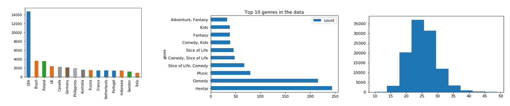
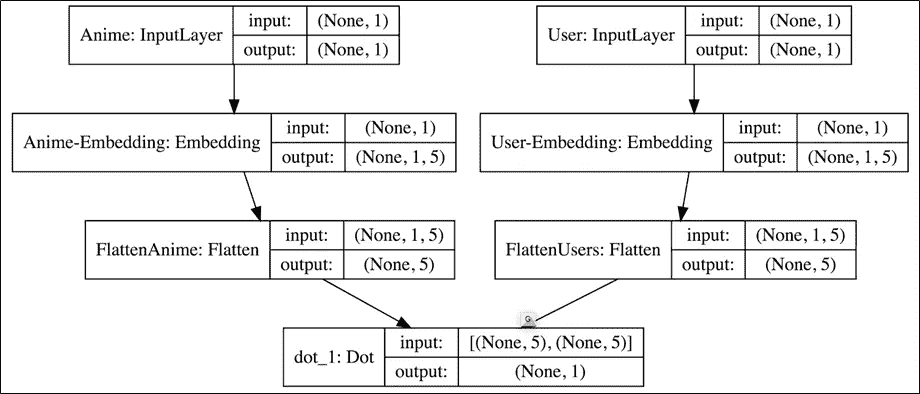
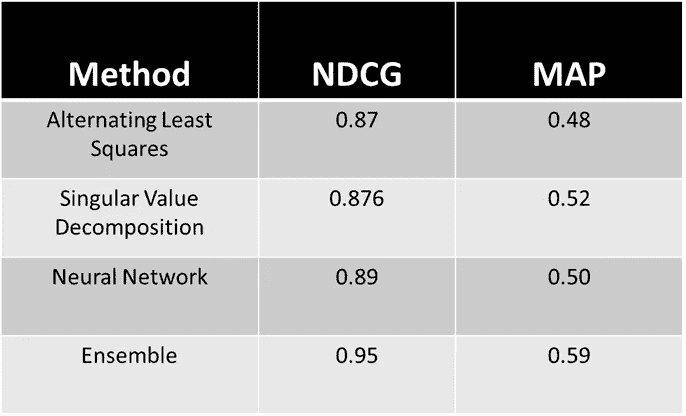
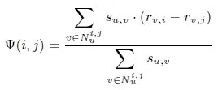
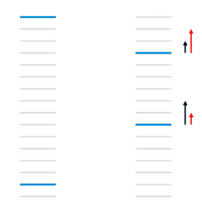
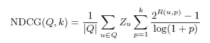

# 动漫推荐引擎:从矩阵分解到学习排序

> 原文：<https://towardsdatascience.com/anime-recommendation-engine-from-matrix-factorization-to-learning-to-rank-845d4a9af335?source=collection_archive---------9----------------------->

## 动漫痴迷过头了！！

**宅男** *张哲伦、陈可辛、、普瑞蒂卡·斯里瓦斯塔瓦和切莉·阿加瓦尔*

如今，互联网上托管的大量数据导致了信息泛滥，因此不断需要改善用户体验。推荐引擎是一个通过为用户提供适当的预测建议来帮助支持用户决策的系统。它们已经成为我们日常生活的一部分。从购物到美食到娱乐，他们无处不在。动漫是一种新的狂热，每天都在流行，尤其是在非亚洲国家。然而，没有一个推荐引擎可以帮助新手和经验丰富的宅男在这个领域里聪明地进步。因此，我们这些宅男决定开发一个作为我们学术项目的一部分。

## 数据预处理和探索

该数据取自 [Kaggle](https://www.kaggle.com/azathoth42/myanimelist) 。它包含了动漫的信息和看过的用户以及对它的评价。这个数据集中有超过 3000 万的观测，10 万的用户，6K 的动画电影。启发性地，我们决定去掉那些评价很少的动漫和没有评价的动漫，来训练我们的推荐引擎。通过研究数据，我们发现大多数用户来自美国，其次是巴西和波兰。最受欢迎的类型是喜剧、音乐和冒险。此外，我们的大多数用户年龄在 20 到 30 岁之间。

Fig: Exploratory Data Analysis

## 模型和算法

> **协同过滤**

已经有推荐引擎来满足各种需求，它们都有不同的底层算法来解决问题。最传统的是使用协同过滤，你倾向于将评级矩阵(R)分成 U *ser-Embedding (U)* 和 Anime *-Embedding (P)* 。这些嵌入本质上就是我们所说的潜在特征(在监督机器学习中)。为了探索这种方法，我们尝试了三种算法，即。即。交替最小二乘法、奇异值分解和神经网络。

**ALS** :这是一个两步迭代优化过程。在每次迭代中，它试图通过求解 U 来优化评级矩阵(U*P ),首先保持 P 不变，然后 P 保持 U 不变。我们使用 P *ySpark* 来运行这个使用 *MLlib* 的算法。

**SVD:** 为了估计所有的未知量并得到嵌入，我们通过随机梯度下降最小化正则化平方误差。我们偶然发现了伟大的“[惊喜](http://surpriselib.com/)，并使用其奇异值分解的实现来训练我们的算法。

**神经网络:**这里我们使用两个嵌入层来表示用户，动画作为我们的输入。互动(评级矩阵)是目标变量。对于每个用户-动画对，我们计算一个分数，取其潜在表示的点积。然后，我们尝试通过反向传播将损耗降至最低，并优化嵌入层(示意图如下所示)。

**Fig:** **Neural Network schematic for estimating embedddings**

我们运行了这个模型 10 个时期，由于计算量很大，我们在谷歌云平台上用 Keras(Tensorflow backend)运行了这个模型。这个模型比之前的要好，但并没有全面超越它们。我们得到了另一个绝对免费的模型！*猜猜看*？合奏！！。这个模型只是将上述三个模型的预测结果进行了平均。

Fig: Comparison of different algorithms with NDCG@10 and MAP@10

正如可以看到的，集成特别优于所有三种算法，并给出了与 NDCG 和地图(稍后更多)的伟大结果。最初，我们基于 RMSE 评估我们的模型。然而，我们的教授 Ghosh 博士建议我们研究学习排序(LTR)算法。

问题来了，为什么我们需要转移到 LTR 算法？请这样想:假设我们有两个项目 I 和 j，已知它们的真实评分分别为 3 和 4，两种不同的方法预测 I 和 j 的评分分别为{2，5}和{4，3}。就通过与真实评级的绝对偏差来测量的评级预测准确性而言，两组预测之间没有差异。然而，使用预测{4，3}，项目 I 和 j 将被错误地排序，而预测{2，5}确保了正确的顺序。

> **学习排名**

学习排序预测项目列表的排序，而不是评级。基于 LTR 算法的现状，python 中没有太多的开源资源可以实现它们。在这个项目中，我们有机会深入研究了微软关于 LTR 的[论文，并从头开始用 python 对它们进行编码。这是我们给致力于 reco-engine 的开源社区的两分钱，如果他们想试验这些算法的话。因为这是一个学术项目，这些被证明对我们的概念学习也非常有益。我们成功地通过了其中的两个，即 EigenRank 和 LambdaMART。EigenRank 是面向排序的协同过滤版本，而 LambdaMART 是监督机器学习 weds 信息检索的典型。](https://www.microsoft.com/en-us/research/publication/from-ranknet-to-lambdarank-to-lambdamart-an-overview/)

**Eigen Rank:**It**是第一个基于排序的协同过滤算法。对于每个用户 u，它试图使用 [Kendall Tau 等级相关系数](https://en.wikipedia.org/wiki/Kendall_rank_correlation_coefficient)找到它的邻域(Nu ),然后计算如下所示的偏好函数。**

Fig: Formula for Preference function. Nu represents neighborhood and r represents rating by user ‘u’ to item ‘i’

Nu 中的用户分配比 *j* 更高的 *i* 的次数越多，ψ(I，j) > 0 和ψ(j，i) < 0 的证据就越强。偏好函数给邻居的动画列表中的每对动画 I，j 分配一个分数。最后为了给这些动漫排序，我们使用了一种贪婪算法的方法。

**LambdaMART:** 使用梯度提升树直接优化特定等级成本函数(如 NDCG)。不幸的是，成本函数不是在所有的点上都是可微的。因此，我们需要梯度的代理，这里称为*λ*。它可以被认为是一种推动动画在排行榜上上下移动的力量(如下图)。最好的部分是，它还利用了动漫和用户的特点，如受欢迎程度，持续时间，类型，特定用户观看的次数，发行年份等。利用 LambdaMART 的这一特性，我们可以为新用户提供建议。

Fig: Schematic of Lambda pushing the items in list up and down and thus reducing incorrectly ordered pair. source: original paper

对于这些 LTR 模型，我们再次使用 NDCG(归一化累积贴现收益)和 MAP(平均精度)等评估指标。

如前所述，因为我们为前面提到的两个算法编写了代码，所以它不是超级可伸缩的。在我们努力使我们的代码成为黄金标准的同时，我们在较小的数据(~0.5M)上测试了它的效用，它表现很好，实现了 NDCG as: 0.72(本征秩)和 0.60(λmart)；映射为 0.63 (EigenRank)和 0.56(LambdaMART)。

所以让我们打破 NDCG 和地图上的悬念..

## **评估措施**

**NDCG 归一化折扣累积收益**:量化预测排名列表与理想排名列表(将只是基于评分的项目排序)的偏差。它还认识到高度相关的文档比不太相关的文档更有用的事实。

Fig: Zu is the Normalization factor (inverse of Ideal NDCG), Q represents all the users and R(u,p) is the rating given by user u to anime at rank p

NDCG@K 只是从我们的引擎为前 K 个推荐计算的 NDCG。

**MAP-Mean Average Precision:**它捕捉了所有推荐动漫中相关动漫的百分比(测试数据中的用户已经看过这些动漫并给予了高度评价)。

Fig: Formula for Mean Average Precision. AP(q) is the average precision for each user q

MAP@K 只是为来自我们引擎的前 K 个推荐计算的 MAP。

到目前为止，我们推荐是基于用户的观看历史。 ***如果有新用户来向我们推荐动画，我们该怎么办？*** 为了帮助新用户加入动画世界，我们使用 ***K-means 聚类*** 将对不同类型有共同爱好的用户分组到不同的群中。总之，我们提出了 5 个不同的群体:*科幻迷、无偏好者、憎恨者、活泼的年轻人*和*热血战士*。

## 开演时间

这里有一个很酷的视频，展示了我们尝试过的算法的相对优势:

Fig: Video Demonstration of the recommendation engine

**前进的道路**
(i)用于学习排序算法的可扩展性增强，可能通过在 Cython 中编码它们。
(ii)LambdaMART 更好的特征工程。(iii)建立一个前端来托管我们的推荐引擎
(iv)完成(I)、(ii)和(iii)，然后可能会尝试接近一个风险投资家来资助我们的推荐引擎网站！！

完整的项目和代码可以在[https://github.com/Preetikasri/Anime-Recommendation-Engine](https://github.com/Preetikasri/Anime-Recommendation-Engine)查看

感谢阅读！！