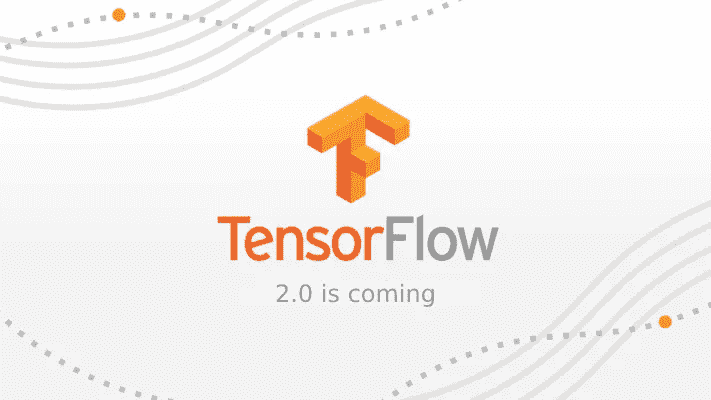

# 公告:TensorFlow 2.0 来了！

> 原文：<https://towardsdatascience.com/announcement-tensorflow-2-0-is-coming-7e17e8e333e3?source=collection_archive---------4----------------------->

## 而 TensorFlow 1.x 将会是…

备受期待的流行机器学习框架 TensorFlow 的更新于 8 月初由谷歌人工智能的马丁·维克(Martin Wicke)宣布。

这个令人兴奋的消息是在他的[谷歌团队](https://groups.google.com/a/tensorflow.org/forum/?#!topic/announce/qXfsxr2sF-0)上宣布的，它已经引起了关于框架的下一个主要版本——tensor flow 2.0 的讨论。如果你和我一样兴奋，并渴望了解 2.0 开发的最新细节，我强烈建议你订阅 [**谷歌群组**](https://groups.google.com/a/tensorflow.org/forum/#!topic/announce/qXfsxr2sF-0) ！

更吸引人的是，您可以成为即将到来的[公共设计评审](https://github.com/tensorflow/community/blob/master/governance/TF-RFCs.md)的一部分，甚至通过表达您的关注和提出更改来为 TensorFlow 2.0 的功能做出贡献！这正是我喜欢开源开发的原因，因为社区为了共同的目标一起工作并相互支持。

# 那么 TensorFlow 1.x 有什么问题呢？

如果你是 TensorFlow 的初学者，你可能会发现学习曲线非常陡峭，因为它是一个低级框架，不像 [Keras](https://keras.io/) 。因此，一些用户可能会发现学习和应用起来相对困难。

然而，TensorFlow 已经成为世界上最广泛采用的机器学习框架，迎合了广泛的用户和用例。

这些快速的变化推动了 TensorFlow 的下一个主要版本，这将是一个以易用性为重点的[重要里程碑](https://www.tensorflow.org/community/roadmap)。

虽然在 TensorFlow 2.0 的早期版本中，TensorFlow 1.x 仍将得到维护和开发，但已宣布一旦 TensorFlow 2.0 的最终版本发布，将不再开发 **TensorFlow 1.x。** TensorFlow 团队仍将在 TensorFlow 2.0 发布日期后的一年内继续发布上一个 TensorFlow 1.x 版本的安全补丁。

# [我们对 TensorFlow 2.0 有什么期待？](https://www.tensorflow.org/community/roadmap)

[(Source)](https://unsplash.com/photos/qDY9ahp0Mto)

## 高级 API

*   Keras、Eager 和 Estimators 更强的集成，使用相同的数据管道、API 和序列化格式(保存的模型)。
*   TensorFlow Core 中常用 ML 模型(如时间序列、RNNs、TensorForest、附加提升树功能)和相关功能(如序列功能列)的固定估计器(从 contrib 迁移，如果存在)。

## 急切的执行

*   使用 DistributionStrategy 利用多个 GPU 和多个 TPU 内核。
*   分布式训练支持(多机)。
*   性能改进。
*   更简单地导出到 GraphDef/SavedModel。

## 参考模型

*   构建一套横跨图像识别、对象检测、语音、翻译、推荐和强化学习的[模型](https://github.com/tensorflow/models/tree/master/official)，展示最佳实践，并作为高性能模型开发的起点。
*   越来越多的高性能云 TPU 参考模型。

## 贡献

*   弃用`[tf.contrib](https://www.tensorflow.org/api_docs/python/tf/contrib)`中存在于`[tf.contrib](https://www.tensorflow.org/api_docs/python/tf/contrib)`之外的优选实现的部分。
*   尽可能将`[tf.contrib](https://www.tensorflow.org/api_docs/python/tf/contrib)`内部的大型项目转移到单独的存储库。
*   在 TensorFlow 2.0 中，当前形式的`[tf.contrib](https://www.tensorflow.org/api_docs/python/tf/contrib)`模块将停止使用。实验性开发将在未来的其他存储库中进行。

# 最后的想法

[(Source)](https://media.giphy.com/media/5GoVLqeAOo6PK/giphy.gif)

感谢您的阅读。

这么多激动人心又人性化的功能，真的很期待 TensorFlow 2.0 的早日发布。TensorFlow 2.0 的预览版将于今年晚些时候发布，也就是下个月的 12 月份！

同时，如果您有兴趣了解 TensorFlow 2.0 下一版本的最新发展，您可以随时订阅[邮件列表](https://www.tensorflow.org/community/lists)或[在此加入社区](https://www.tensorflow.org/community/groups)！

一如既往，如果您有任何问题或意见，请随时在下面留下您的反馈，或者您可以随时通过 [LinkedIn](https://www.linkedin.com/in/admond1994/) 联系我。在那之前，下一篇文章再见！😄

## 关于作者

[**Admond Lee**](https://www.linkedin.com/in/admond1994/) 目前是东南亚排名第一的商业银行 API 平台 [**Staq**](https://www.trystaq.com) **—** 的联合创始人/首席技术官。

想要获得免费的每周数据科学和创业见解吗？

你可以在 [LinkedIn](https://www.linkedin.com/in/admond1994/) 、 [Medium](https://medium.com/@admond1994) 、 [Twitter](https://twitter.com/admond1994) 、[脸书](https://www.facebook.com/admond1994)上和他联系。

 [## 阿德蒙德·李

### 让每个人都能接触到数据科学。Admond 正在通过先进的社交分析和机器学习，利用可操作的见解帮助公司和数字营销机构实现营销投资回报。

www.admondlee.com](https://www.admondlee.com/)