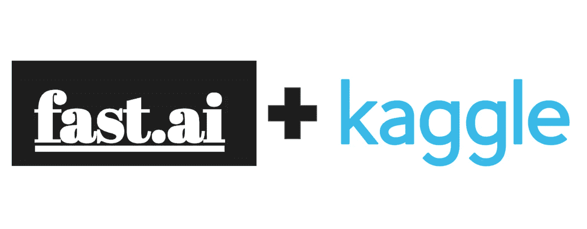
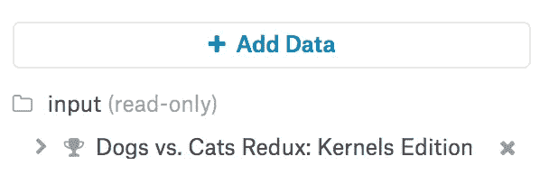
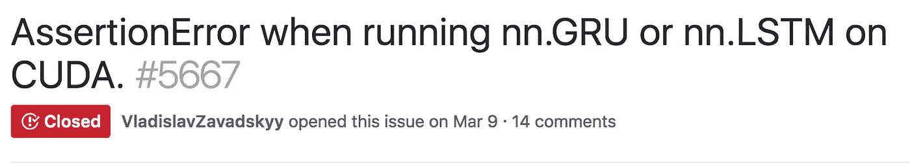

# 宣布 fast.ai 第 1 部分现在作为 Kaggle 内核提供

> 原文：<https://towardsdatascience.com/announcing-fast-ai-part-1-now-available-as-kaggle-kernels-8ef4ca3b9ce6?source=collection_archive---------6----------------------->

现在是开始使用 Kaggle 内核进行深度学习的好时机！

最近，我有机会在哥伦布的 PyOhio 做了我的第一次会议演讲。我谈到了进入深度学习，我使用 Kaggle 内核演示了来自 [fast.ai 课程](http://course.fast.ai/)第一课的一些材料。

第二天我偶然看到了一篇名为[“使用支持 GPU 的 kaggle 内核和 fastai MOOC 学习深度学习”](https://hackernoon.com/learn-deep-learning-with-gpu-enabled-kaggle-kernels-and-fastai-mooc-72fee41bb4b5)的媒体文章，我很高兴看到更多人认识到这个平台的能力。

**所以我想，如果我们要让人们容易地开始在 Kaggle 内核上进行深度学习，为什么不把整个 fast.ai 课程公之于众？**

# **ka ggle 内核的好处**

根据该文档，“ [Kaggle Kernels 是一个云计算环境，支持可重复的协作分析。基本上，你可以专注于编写代码，Kaggle 负责设置执行环境并在他们的服务器上运行。我认为这种设置为刚开始学习深度学习的人提供了优势，有几个原因:](https://www.kaggle.com/docs/kernels)

*   **无需等待/批准的免费 GPU:**你可以立即免费访问 GPU，这是开始深度学习的一大步。当我第一次开始时，你唯一的选择是等待 AWS 批准你的 GPU 实例，然后付钱给他们运行它(希望你没有忘记关闭它)。在 GPU 和 CPU 上运行意味着你的训练可以在几分钟内完成，而不是几个小时。
*   **预装深度学习包:**这对初学者来说是又一个巨大的胜利，为你节省了几个小时的设置时间和谷歌模糊的错误信息。使用 Kaggle 维护的 [docker-python repo](https://github.com/Kaggle/docker-python) 中的 docker 文件设置内核环境。它设置了 CUDA 和 CUDNN，即 NVIDIA 用于在 GPU 上加速深度学习的库，并安装了用于深度学习的流行 python 库:除了 fastai 之外，还有 keras、tensorflow、pytorch 和 pytorch 等。
*   **访问数据:**大多数 fast.ai 课程都使用 Kaggle 比赛来获取训练数据，而在 Kaggle 内核中，访问这些数据就像点击“添加数据集”一样简单。这也使得无需任何额外的步骤就可以很容易地将经验应用到其他过去的比赛中。如果你找不到你需要的数据，你可以上传你自己的数据集并与 Kaggle 社区分享。

It’s as easy as a single click!

*   **平台的社交特性:**我认为 Kaggle 内核的一些社交特性也使其成为一个很好的学习环境。您可以“派生”现有的内核，并对它们进行调整以制作您自己的版本，这使您能够进行实验并查看不同代码更改的影响。您可以对内核进行评论，向作者提问或试图追踪一个 bug。向上投票有助于你看到流行的内核，这可能会引导你进入下一个你想学习的有趣话题。

# **抓到你了**

如果您习惯于在 AWS 或您自己的机器上工作，或者如果您正在遵循针对这些环境的说明，那么在使用内核时需要注意一些事情。这些差异解释了我需要对最初的 fast.ai 笔记本进行的大部分更改，以使它们作为内核运行。

*   **只读输入数据:**默认情况下，您加载到内核中的数据位于`../input`下。但是数据所在的目录是只读的。这给 fast.ai 带来了两个问题——首先，在某些情况下，您需要移动数据以符合特定的目录结构。这可以通过以不同的形式将数据传递给学习者来解决(在第 1 课中，我使用了文件名和标签的列表，这是由`from_names_and_array` 方法支持的)。此外，默认情况下，学习者将 tmp 数据和模型权重写入与数据相同的目录，这可以通过将`tmp_name`和`models_name`选项传递给学习者来修改。
*   **等待软件包更新:**我提到过，软件包安装由 Kaggle 维护在 Dockerfile 中，这在很大程度上对您有利，节省了您配置东西的时间。唯一的缺点是，当他们重建 Docker 映像时，您只能获得软件包更新。当我处理这些问题时，我注意到在最新的 fast.ai 版本中已经修复了几个问题，我不得不通过猴子修补一些类来将这些修复移植到我自己身上。我也无法完成第 4 课和第 6 课(RNN)，因为 pytorch 0.3.1 和 CUDNN 7.1 中出现了一个[错误。(针对 GPU 内核的 pytorch 0.4.0 更新正在进行中](https://github.com/pytorch/pytorch/issues/5667))

Not fun when your debugging path eventually leads here…

*   非持久文件系统:如果你重启你的内核，你会丢失你已经写到磁盘上的文件。对于运行 fast.ai 课程来说，这不是一个主要问题，但如果你正在试验不同的模型或超参数，并试图节省权重，这对你来说可能很难。

# **内核**

事不宜迟，他们来了！我希望这有助于你的深度学习之旅——没有什么比看到这些东西以新的有趣的方式被分叉、调整和应用更让我高兴的了。

[第一课](https://www.kaggle.com/hortonhearsafoo/fast-ai-lesson-1)
[第二课](https://www.kaggle.com/hortonhearsafoo/fast-ai-lesson-2) [第三课](https://www.kaggle.com/hortonhearsafoo/fast-ai-lesson-3) [第四课](https://www.kaggle.com/hortonhearsafoo/fast-ai-lesson-4)
[第五课](https://www.kaggle.com/hortonhearsafoo/fast-ai-lesson-5)
[第六课【SGD】](https://www.kaggle.com/hortonhearsafoo/fast-ai-lesson-6-sgd)
[第六课【RNN】](https://www.kaggle.com/hortonhearsafoo/fast-ai-lesson-6-rnn) [第七课【cifar 10】](https://www.kaggle.com/hortonhearsafoo/fast-ai-lesson-7-cifar10)
[第七课【CAM】](https://www.kaggle.com/hortonhearsafoo/fast-ai-lesson-7-cam)

如果你有任何问题，请随时联系 fast.ai 论坛或 Twitter:[@ hortonhearsafoo](https://twitter.com/hortonhearsafoo)。