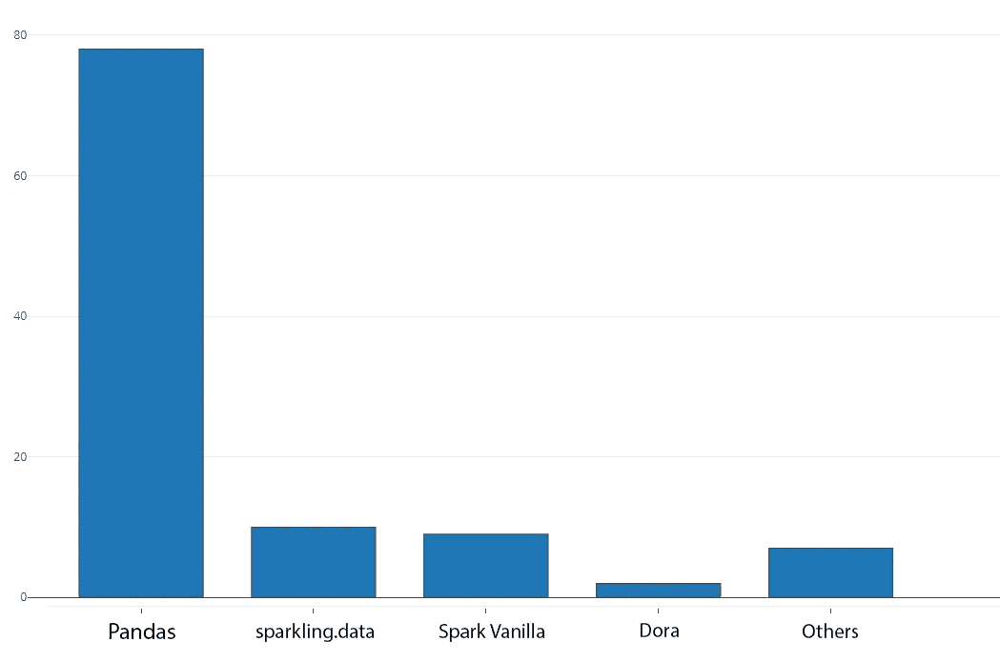
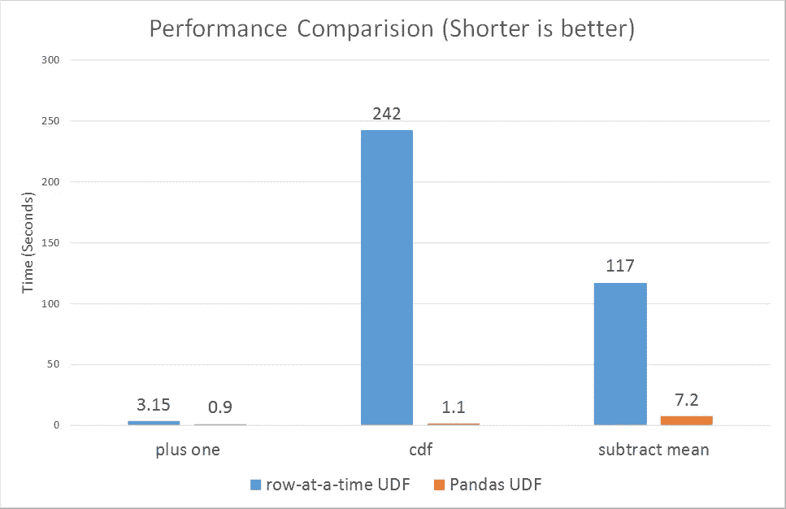
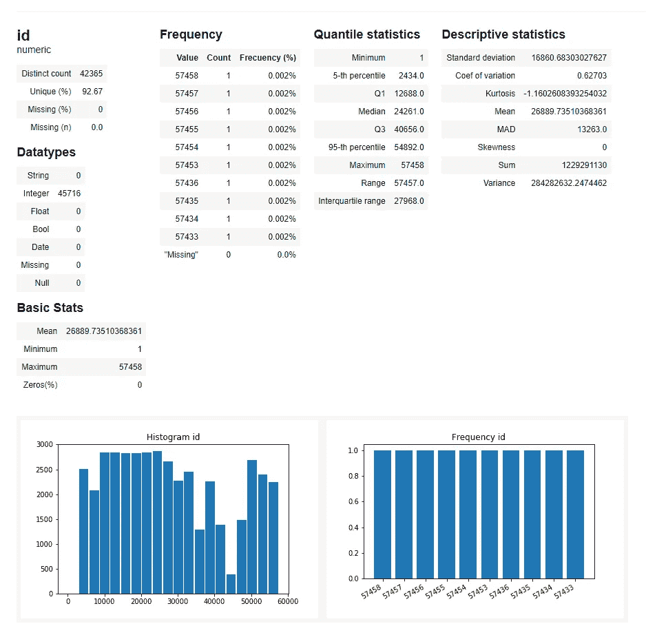

# 宣布 Optimus v2 —简化敏捷数据科学工作流程

> 原文：<https://towardsdatascience.com/announcing-optimus-v2-agile-data-science-workflows-made-easy-c127a12d9e13?source=collection_archive---------13----------------------->

## 作为一名数据科学家，您是否正在寻找一个库来提升您的工作效率？看看这个。


Photo by [Timothy Eberly](https://unsplash.com/@timothyeberly?utm_source=medium&utm_medium=referral) on [Unsplash](https://unsplash.com?utm_source=medium&utm_medium=referral)

几年前，我们为一个零售客户项目清理、处理和应用 ML 聚类算法。

当时，我们正在寻找一种工具，让我们能够轻松地处理数据。我们尝试了 trifacta，这是一个制作精美的工具，可以让你通过点击界面以可视化的方式应用转换。问题是可用的脚本语言不足以按照我们喜欢的方式处理数据。

我们还尝试了令人惊叹的熊猫图书馆，但我们的数据大到足以让它哭泣。

所以，大约一年前我们推出了擎天柱。Optimus 由 Spark (Pyspark)提供支持，允许您使用自己的或一组预先创建的数据转换函数清理数据，对其进行分析并应用机器学习，所有这些都很容易，并且具有 python 的所有功能。

# 🚚Optimus v2 测试版推出

现在，我们准备发射擎天柱 v2。借助 Apache Spark 和 Pyarrow 的全面重写，Optimus 提供了一种访问、转换数据和创建大规模机器学习和深度学习模型的单一方式。

对于这个新版本，在我们惊人的用户反馈后，我们决定致力于三个主要目标:

*   创建一个可靠的 API 来访问和处理数据。
*   让用户可以轻松地从熊猫迁移。
*   让数据探索更容易。

# 目标 1:创建可靠的 API 来访问和处理数据



我们经营游泳池快一年了。结论，Pandas 和 Spark 是用于数据清理的主要库。因此，我们使用 Optimus 的目标是创建一种可预测的、简单的方法来访问和处理数据。不管是来自熊猫，还是火花。

下表显示了火花，熊猫和我们用擎天柱创造的东西。

Basic data operations API for Pandas Spark and Optimus

我们在这里看到了一些东西:

*   Spark API 对于基本函数没有任何一致性。
*   对于 Pandas，只有追加列/过滤器不一致。

因此，第一步是为我们认为的核心数据操作创建一个一致的基础:

*   **创建**数据帧
*   **用**追加**行或列()**
*   **用 **select()** 选择**行或列
*   **用 **apply()** 更新**或转换列数据
*   **用 **drop()删除**行或列**

其他基本功能是 **read()** 和 **write()** 操作，用于加载和保存数据帧。因为我们认为 Apache Spark API 是一致且强大的，所以我们将其直接映射到 Optimus，不做任何更改。

下面是所有基本操作的示例:

```
df = op.create.df(
    [
        ("names", "str", True),
        ("height", "float", True),
        ("function", "str", True),
        ("rank", "int", True),
    ],
    [
        ("bumbl#ebéé  ", 17.5, "Espionage", 7),
        ("Optim'us", 28.0, "Leader", 10),
        ("ironhide&", 26.0, "Security", 7),
    ]).show()df.rows.append(["Grimlock",80.0,"Commander",9])+------------+------+---------+----+
|       names|height| function|rank|
+------------+------+---------+----+
|bumbl#ebéé  |  17.5|Espionage|   7|
|    Optim'us|  28.0|   Leader|  10|
|   ironhide&|  26.0| Security|   7|
+------------+------+---------+----+df.rows.append(["Grimlock",80.0,"Commander",9])\
    .rows.select(df["rank"]>7)\
    .cols.select(["names","height","function"])\
    .cols.apply_expr("height", df["height"]-1)\
    .cols.drop("function")\
.table()+--------+------+
|   names|height|
+--------+------+
|Optim'us|  27.0|
|Grimlock|  79.0|
+--------+------+
```

# 列操作

除了这个基本操作之外，我们还识别了列上的其他操作。这里的想法是一样的，创建一个简单和一致的方法来操作数据。所有手术的设计和命名都尽可能接近熊猫。此外，您可以轻松地对单个、多个或整个列数据集应用操作。

## 聚集

让我们从聚合开始。我们扩展了 Apache Spark 操作，并创建了一种访问统计函数的简单方法。

```
print(df.cols.min("height"))
print(df.cols.percentile(['height', 'rank'], [0.05, 0.25, 0.5, 0.75, 0.95]))
print(df.cols.max("height"))
print(df.cols.median(["height","rank"]))
print(df.cols.range(["height","rank"]))
print(df.cols.std(["height","rank"]))17.5   
{'height': {0.05: 17.5, 0.25: 17.5, 0.5: 26.0, 0.75: 28.0, 0.95: 28.0}, 'rank': {0.05: 7.0, 0.25: 7.0, 0.5: 7.0, 0.75: 10.0, 0.95: 10.0}}
28.0
{'height': 26.0, 'rank': 7.0}
{'height': {'min': 17.5, 'max': 28.0}, 'rank': {'min': 7, 'max': 10}}
{'height': {'stddev': 5.575242894559244}, 'rank': {'stddev': 1.7320508075688772}}
```

## 转换和链接

有了擎天柱，你不仅可以链接擎天柱变形，还可以链接火花操作👏。让我们来看看这个:

**。行**和。 **cols** 可能会觉得有点冗长，但是看看你如何可以很容易地看到你的数据发生了什么，哪些列或行受到了影响，以及将要应用什么转换。

通过链接，您可以利用 Spark 惰性评估的强大功能。链接转换，apache Spark 将通过 Catalyst 处理这个问题的更好的方法。

```
df = df\
    .rows.sort(["rank","height"])\
    .cols.lower(["names","function"])\
    .cols.remove_accents("names")\
    .cols.remove_special_chars("names")\
    .cols.trim("names").show()+---------+------+---------+----+
|    names|height| function|rank|
+---------+------+---------+----+
|  optimus|  28.0|   leader|  10|
| ironhide|  26.0| security|   7|
|bumblebee|  17.5|espionage|   7|
+---------+------+---------+----+
```

## 嵌套操作

这是从多个列创建一个新列的操作*->1。**(**)可以压缩到**字符串**、**数组**或**向量**列。

```
df.cols.nest(["names", "function"], output_col = "new_col", shape ="string").show()+---------+------+---------+----+-------------------+
|    names|height| function|rank|            new_col|
+---------+------+---------+----+-------------------+
|  optimus|  28.0|   leader|  10|     optimus leader|
| ironhide|  26.0| security|   7|  ironhide security|
|bumblebee|  17.5|espionage|   7|bumblebee espionage|
+---------+------+---------+----+-------------------+
```

## 非嵌套操作

从单个列创建多个列的操作 1--> *。 **unnest()** 可以扩展**字符串**、**数组**和**向量**列。

```
df.cols.unnest("new_col", " ").cols.drop("new_col")+---------+------+---------+----+---------+---------+
|    names|height| function|rank|new_col_0|new_col_1|
+---------+------+---------+----+---------+---------+
|  optimus|  28.0|   leader|  10|  optimus|   leader|
| ironhide|  26.0| security|   7| ironhide| security|
|bumblebee|  17.5|espionage|   7|bumblebee|espionage|
+---------+------+---------+----+---------+---------+
```

# 自定义转换

Spark 有多种多样的方式来转换数据:

*   列表达式
*   南非民主统一战线(United Democratic Front)
*   熊猫 UDF
*   结构化查询语言
*   RDD

这里的问题是你必须学习如何处理每个 API 的细节。Optimus 有两个函数 **apply()** 和 **apply_expr()** ，在其中你可以实现函数(UDF 或熊猫 UDF)或列表达式。

```
from pyspark.sql import functions as F
def func(value, args):
    return value + 1df\
    .cols.apply("height", func, "int")\
    .cols.apply_expr("rank", F.col("rank")+1)\
    .show()+---------+------+---------+----+
|    names|height| function|rank|
+---------+------+---------+----+
|  optimus|    29|   leader|  11|
| ironhide|    27| security|   8|
|bumblebee|    18|espionage|   8|
+---------+------+---------+----+
```

列表达式是最快的，所以总是尝试将它们与 **apply_expr()** 一起使用

如果你需要更多的灵活性，你可以使用 **apply()** 来转换你的数据。如果 *PyArrow* 出现，apply() 将尝试使用熊猫 UDF，否则擎天柱将退回到标准的 UDF。

熊猫 UDF 比标准 UDF 快很多。检查下面的基准:



Pandas UDF Vs UDF

如图表所示，Pandas UDFs 的性能比一次一行的 UDF 好得多，从 3 倍到 100 倍不等。[https://databricks . com/blog/2017/10/30/introducing-vectorized-UDFs-for-py spark . html](https://databricks.com/blog/2017/10/30/introducing-vectorized-udfs-for-pyspark.html)

## 抽象 UDF

Optimus 提出了抽象 UDF 的概念，其中你可以使用列表达式、UDF 和熊猫 UDF，而不用担心下划线的实现。**抽象 udf** 函数就是什么权力 **apply()** 和 **apply_expr()。**

```
from optimus.functions import abstract_udf as audf
def func(val, args):
    return val>8df.rows.select(audf("rank", func, "bool")).show()+-------+------+--------+----+
|  names|height|function|rank|
+-------+------+--------+----+
|optimus|  28.0|  leader|  10|
+-------+------+--------+----+
```

你可以发挥想象力，使用一些论据:

```
def func(val, args):
    return val+args[0]+args[1]df.withColumn("height", audf ("height", func, "int", [1,2])).show()+---------+------+---------+----+
|    names|height| function|rank|
+---------+------+---------+----+
|  optimus|    31|   leader|  10|
| ironhide|    29| security|   7|
|bumblebee|    20|espionage|   7|
+---------+------+---------+----+
```

或者只使用列表达式

```
def func(col_name, args):
    return F.col(col_name) + argsdf.withColumn("height", audf ("height", func, "int", 2, "column_exp")).show()+---------+------+---------+----+
|    names|height| function|rank|
+---------+------+---------+----+
|  optimus|  30.0|   leader|  10|
| ironhide|  28.0| security|   7|
|bumblebee|  19.5|espionage|   7|
+---------+------+---------+----+
```

正如你所看到的，可以将抽象 udf 与标准 Spark 函数一起使用。

## 结构化查询语言

如果你觉得使用 SQL 很舒服，你可以通过 **df.sql()** 轻松使用它。例如:

```
df.registerTempTable("autobots")
df.sql("SELECT * FROM autobots").show()+---------+------+---------+----+
|    names|height| function|rank|
+---------+------+---------+----+
|  optimus|  28.0|   leader|  10|
| ironhide|  26.0| security|   7|
|bumblebee|  17.5|espionage|   7|
+---------+------+---------+----+
```

# 目标 2:让用户轻松地从熊猫迁移

让我们再次回顾一下池图表:


在总共 106 名投票者中，73%的人使用熊猫作为数据清理库。这给了我们一个很好的启示，告诉我们应该如何对待擎天柱。让擎天柱对熊猫尽可能友好。

> 在总共 106 名投票者中，73%的人使用熊猫作为数据清理库。

考虑到这一点，我们搜索并找到了来自 riselab 的 Devin Petersohn 的惊人作品。他在 ka ggle([https://rise . cs . Berkeley . edu/blog/Pandas-on-ray-early-lessons/](https://rise.cs.berkeley.edu/blog/pandas-on-ray-early-lessons/))上发表了一篇关于更常用的 Pandas 方法的文章。我们用这个来增强和调整擎天柱。下面你可以找到这个功能，以及它与 Spark 和 Optimus 的比较。

Top 20 most used Pandas compared with Spark and Optimus

NI=未实施
NA=未实施

我们实现了几乎所有可以应用于 Spark 的函数(暂时没有 **get** 或者 **subtract** )。有些像 **reset_index()** 是不可能的，因为 Spark 不处理索引。

这一定够每个熊猫新人追上擎天柱了🙌

# 让数据探索更容易

Optimus 有一个强大的内置数据分析器，除了所有的基本操作外，它还能给你一些独特的东西。您可以看到特定列中存在多少数据类型。

例如，您有一百万行，颜色值为白色、黑色、红色和数百种其他颜色。你怎么能确定一百万行中没有“1”呢？此功能是一个额外的步骤，可以帮助您使您的数据处于完美的状态，以做您的 ML 和 DL 模型。



Optimus Profiler

但是我们想更进一步。虽然 Jupyter 笔记本是一个不可思议的数据转换和模型创建工具，但我们认为数据探索领域可以大大改进。工作区似乎永远不足以可视化你的东西，你有很多绘图选项，如 plotly，seaborn，matplotlib an a big 等，每个人都有不同的 API，你必须做很多工作才能使它们交互。

## 🚗大黄蜂 Alpha 卷展

我们希望为用户提供探索数据的最佳工具。

Bumblebee 是一个使用 Vue.js 构建的 GUI，它与 Optimus 协同工作，并向您准确地展示您需要什么来决定如何转换您的数据。

Bumbleebee in action

此刻，邦布尔伯可以:

*   使用交互式绘图浏览您的数据。
*   轻松检查丢失的数据。
*   查看数据样本以检查数据结构。
*   查看描述性和分位数分析。
*   查看直方图和频率表。
*   检测数字和分类列，并相应地为您提供额外的数据。

大黄蜂和擎天柱不是直接连在一起的。事实上，Bumblebee 可以与从 Pandas 到 dplyr(R)的任何数据处理库一起使用。如果你想从你最喜欢的库中创建一个“连接器”,你只需要用 bumblebee 格式写一个 JSON 文件。

想了解更多关于大黄蜂的信息，请访问 Github [repo](https://github.com/ironmussa/Bumblebee) 。

# 包裹

我们希望 Optimus/Bumblebee 成为处理、探索和制作大数据模型的事实库。为此，我们需要您的反馈，所以我们将推出 Optimus v2 的测试版，为期几周，以听取您对我们所走道路的意见。

如果您想投稿，请:

*   [安装擎天柱](https://github.com/ironmussa/Optimus)，玩一玩，跟我们说说你在 Gitter 上的经历。
*   如果你对擎天柱对我们的回购有意见，请填写问题。

在这里，我们只是在探索擎天柱的表面功能。请访问 docs.hioptimus.com 的[，访问我们的](http://docs.hioptimus.com/en/latest/)[网站](https://www.hioptimus.com/)或访问[笔记本](https://github.com/ironmussa/Optimus/tree/master/examples)示例，看看 Optimus 能为您的数据做些什么。