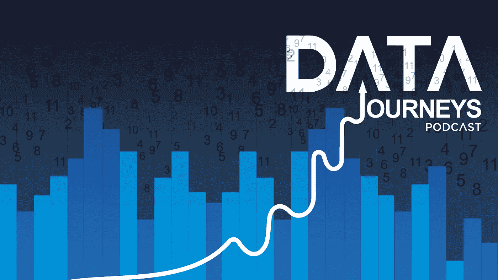

# 宣布数据旅程播客

> 原文：<https://towardsdatascience.com/announcing-the-data-journeys-podcast-57dbbab0f21e?source=collection_archive---------19----------------------->

我很激动地宣布我的新播客正式发布，数据之旅:[https://www.ajgoldstein.com/podcast/](https://www.ajgoldstein.com/podcast/)

**数据之旅是一个面向有抱负的数据科学家的播客，在这里我将采访世界级的数据科学家，讲述他们的学习之旅。**

在每一集里，我们的目标是让他们讲述自己的故事，用世界上最优秀的人曾经使用过的战略、战术和工具来装备后起之秀，让他们达到今天的成就。

我与从美国军方到硅谷、从学术界高层到澳大利亚基层的嘉宾交谈，重点是他们如何弥合获取技术技能和创造现实世界影响之间的差距。

例如，两位即将到来的嘉宾是斯坦福大学 Coursera 的联合创始人[吴恩达](https://en.wikipedia.org/wiki/Andrew_Ng)和加州大学伯克利分校 Jupyter 笔记本的创始人[费尔南多·佩雷兹](https://twitter.com/fperez_org)。

**你可以通过 iTunes、Soundcloud、Google Play Music 等网站的链接收听或订阅该节目:**[https://www.ajgoldstein.com/podcast/](https://www.ajgoldstein.com/podcast/)

享受表演吧！

 [## 播客

### 数据之旅数据之旅是 AJ Goldstein 为有抱负的数据科学家制作的播客，他采访了世界一流的…

www.ajgoldstein.com](https://www.ajgoldstein.com/podcast)