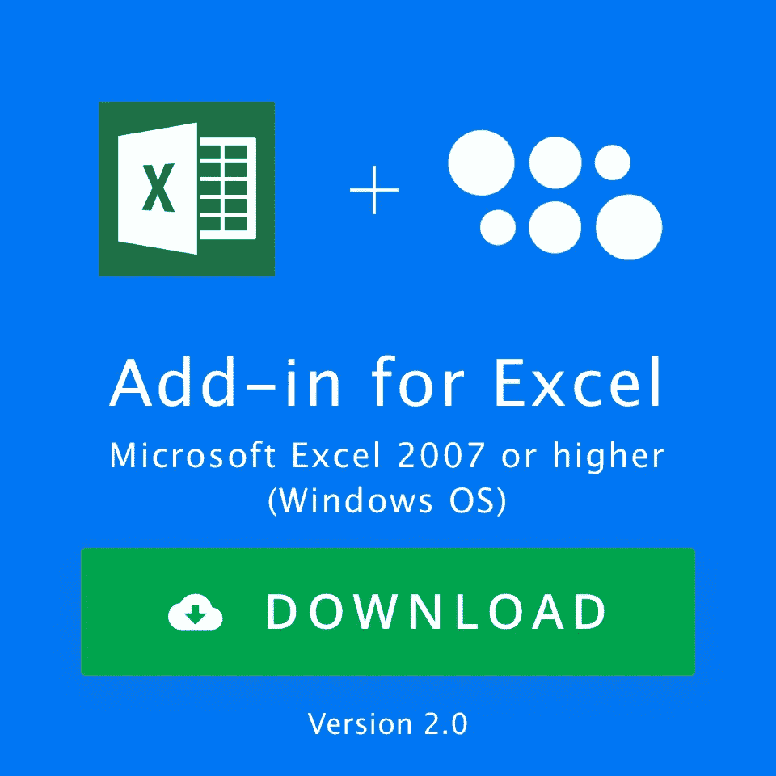
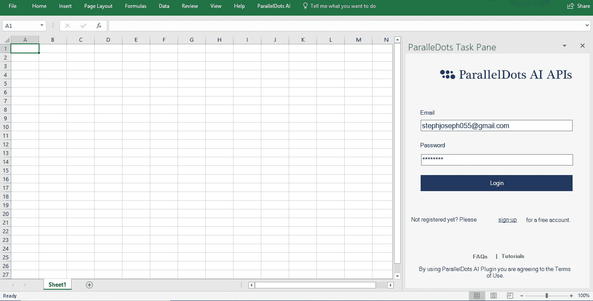
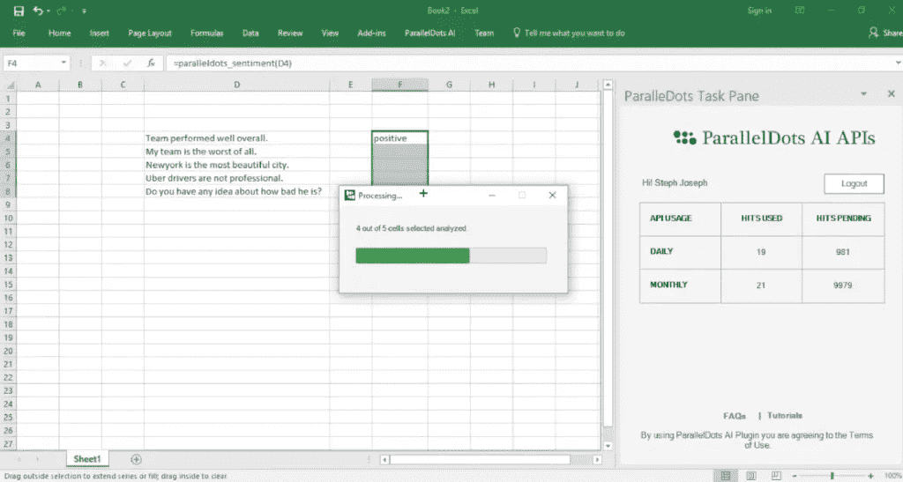
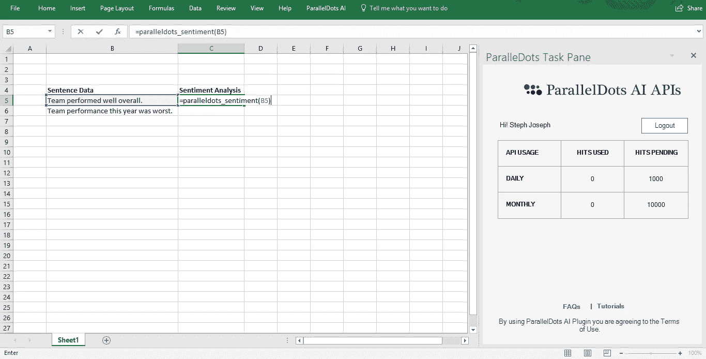

# 宣布推出新的文本分析 Excel 插件版本:这是什么改进！

> 原文：<https://towardsdatascience.com/announcing-the-launch-of-new-text-analytics-excel-add-in-version-heres-what-improved-c3592a9a162?source=collection_archive---------11----------------------->

去年 11 月，我们推出了 Excel 插件，作为我们为那些想使用我们的文本分析产品而无需编写一行代码的用户提供的服务的重要组成部分。这个插件已经被下载了 1000 多次，用来分析超过百万行文本。

我们还从用户那里得到了一些关于 Excel 插件的反馈。在 ParallelDots，我们将客户的反馈放在心上，因此，我们很高兴地宣布我们新的改进版 ParallelDots Excel 加载项的发布。新版本可以立即下载，并且可以从[这里](https://www.paralleldots.com/excel-plugin)访问。

这个新的、改进的 Excel 加载项版本将具有以下主要功能:

1.  **不需要记住 API 键:**使用你的 ParallelDots 帐户直接从加载项的任务窗格登录。

1.  **修复了错误并提高了稳定性:**当前版本不会冻结超过 1000 行的数据，并允许您在分析数据时最小化 Excel 以执行其他任务。它还为您提供了一个任务进度条，这样您就知道已经分析了多少文本。

3.**在任务窗格中检查您的 API 使用情况:**登录您的帐户后，您可以在任务窗格中检查 API 使用情况。免费和高级用户都可以使用。

感谢您的反馈和建议，这有助于我们使这个版本更加稳定和用户友好。

**安全和隐私**

Excel 插件建立在我们的 API 上，这意味着您的数据在我们的服务器上处理，以获得最终输出。我们非常重视用户隐私，我们的隐私政策可在此处访问。所有用户数据都根据我们的隐私政策进行存储，以确保高标准的安全性。

然而，在某些情况下，由于合同义务或其他原因，用户可能希望将数据保存在内部，在这种情况下，我们可以在内部部署这些算法，并相应地构建插件。请[向我们发送一个请求](https://www.paralleldots.com/contact-us)来部署本地 API 和您希望我们构建的任何自定义功能。

我们希望新的插件版本将帮助您分析客户满意度调查中成千上万个开放式问题的答案，或者分析来自电子商务门户网站的产品评论，而无需离开您舒适的电子表格。

点击阅读更多关于 Excel 插件[的使用案例。](https://blog.paralleldots.com/product/use-cases-excel-add-text-analysis/)

Excel 插件已被证明是一种强大且经济高效的方式，可以开始将尖端智能添加到您的分析中。在您决定扩展您的分析之前，大量的免费层可让您测试并了解加载项中可用的不同功能。

我们希望你喜欢这篇文章。请[注册](http://user.apis.paralleldots.com/signing-up?utm_source=blog&utm_medium=chat&utm_campaign=paralleldots_blog)免费的 ParallelDots 账户，开始你的 AI 之旅。你也可以在这里查看[的人工智能 API 的演示。](https://www.paralleldots.com/ai-apis)