# 异常检测-关键特性

> 原文：<https://towardsdatascience.com/anomaly-detection-def662294a4e?source=collection_archive---------2----------------------->

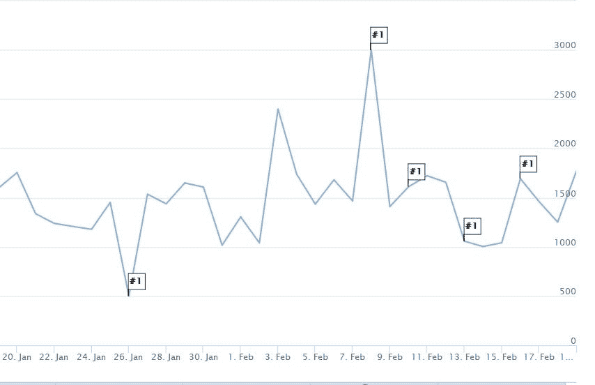

我最近与 [CleverTap](https://clevertap.com/) 合作了一个项目，其中包括为定期拥有时间序列类型数据的客户创建“异常检测”功能。异常检测对于每个营销人员密切关注公司的发展非常有帮助。在我实习期间，我们实现了一些基本方法，然后转向更复杂的算法。

**“这个特性有什么帮助？”**

异常检测可以手动完成。但是由于事件和 KPI 的增加，这个任务很难维持。此外，营销人员没有兴趣知道异常是否发生在 4 个月或 6 个月前。因此，如果营销人员每天都收到异常情况发生时的警报，这将有助于找到其背后的原因，并尽快修复它。这就是为什么我们决定每天都这样做，如果事件以令人惊讶的方式发生，营销人员将收到“检测到异常”的警报。

**“什么是异常？”**

在深入研究我们开发的这项功能背后的算法之前，我们先来回答上面的问题。

**“异常是观察到的世界中意料之外的行为”。**

从营销人员的角度来看，异常的例子有 **:**

1.  电影票销售数量的减少。
2.  该应用程序的下载量上升。
3.  网站访问量的增加。

异常可以是正的，也可以是负的。积极的异常现象在市场上最受欢迎。

**“有哪些方法？”**

有各种方法来检测异常。在讨论这些方法之前，让我们先看看我们的时间序列数据。

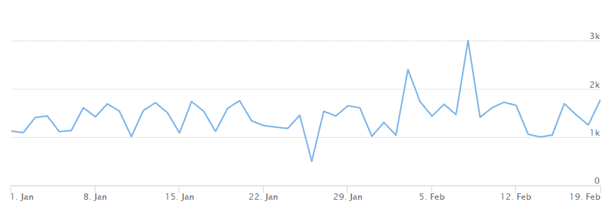

Figure 1: Time Series of a number of visits to a particular website.

这里，图 1 中的时间序列是社交媒体上特定网站每天的访问次数的数据示例(横轴为日期，纵轴为计数)。在这个时间序列中，我们的目标是能够检测到 1 月 21 日之后的异常情况。

1.**移动平均法**:

在这种方法中，借助于过去数据的移动平均值，可以估计当前值。移动平均线可以是指数移动平均线或简单移动平均线。与简单移动平均线给出的同等权重不同，指数移动平均线给最近的数据更多的权重。

该方法可以通过两种方式执行 **:**

A.每日移动平均线

在我们将要讨论的所有方法中，这是一个非常基本且易于执行的方法。在这种方法中，前几天的[移动平均值](https://en.wikipedia.org/wiki/Moving_average)被认为是当天的期望值。下一步包括检查估计值是否在预定义的置信带内。置信区间是一个范围，我们将其定义为前一天移动平均线的标准差的倍数

在对上述时间序列应用该算法后，产生了两个异常 **:**

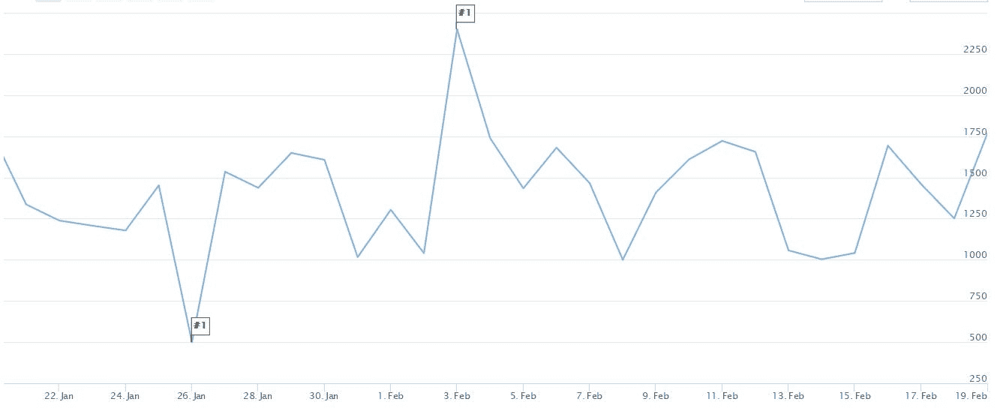

Figure 2 : Anomalies detected in Moving Average Method(daily basis) are flagged.

下表解释了上述标记值的异常性质:

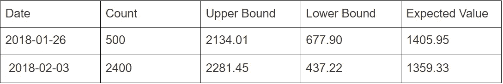

Figure 3 : Results from MA(Daily Basis) method.

如果我试着用置信带来表示，2 月 3 日的反常性质可以解释如下:

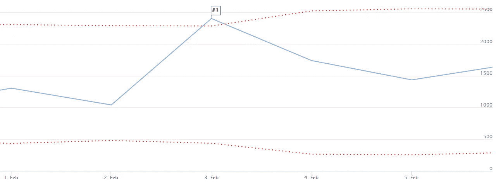

Figure 4 : Plot showing the anomalous nature of 3rd February through Confidence band.

在上图中，该值被标记为(异常)，因为它超过了当天的预期最大值(置信区间上限)。

B.工作日移动平均值

这个方法是对上面解释的方法的一个微小的修改。在这种方法中，会考虑以前工作日的数据。也就是说，为了估计当前星期一的价值，以前星期一的数据是有用的。置信区间是以前工作日数据标准差的倍数。

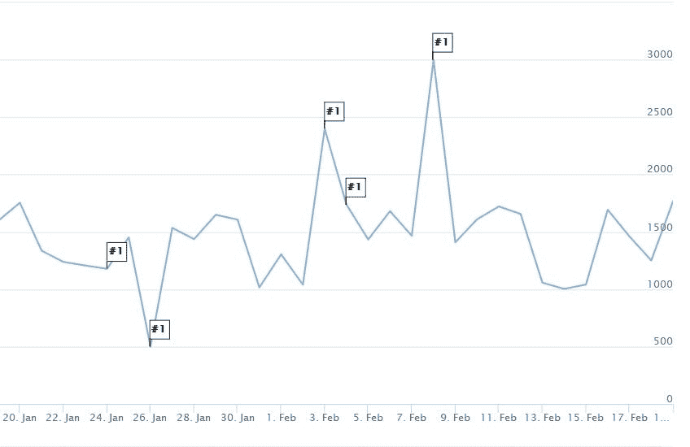

Figure 5: Anomalies detected in Moving Average Method(Weekday basis) are flagged

上图中的反常自然点可以用下表来解释:

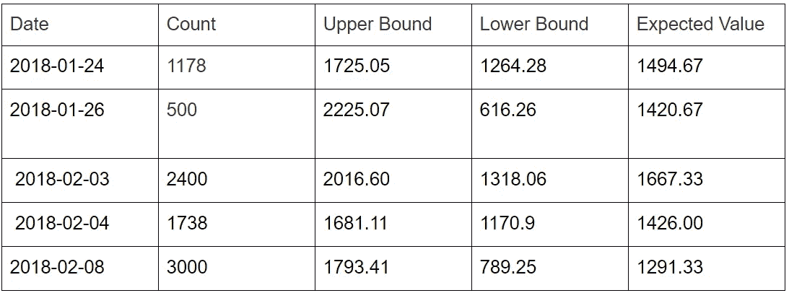

Figure 6: Results from MA(Weekday Basis)

但是这种方法也导致了类似 2 月 4 日(星期日)的虚假异常。我们来看看周日的数据:

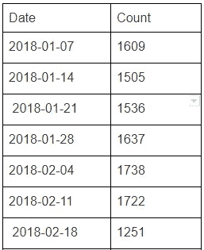

Figure 7: Sunday Counts

如果你看上面显示周日数据的表格，你会发现在 2 月 4 日之前，访问量平稳增长。因此，这不是一个异常现象。相反，它应该将 2 月 18 日显示为异常，因为正如您从上表中看到的，计数在 2 月 18 日突然下降。

2. **ARIMA** :

与上面的方法相比，这是一种更复杂的方法。 [ARIMA](https://en.wikipedia.org/wiki/Autoregressive_integrated_moving_average) (自回归综合移动平均)方法优于上述方法，因为它使用了[自回归](https://en.wikipedia.org/wiki/Autoregressive_model)和[移动平均](https://en.wikipedia.org/wiki/Moving_average)的组合来估计当天的值。

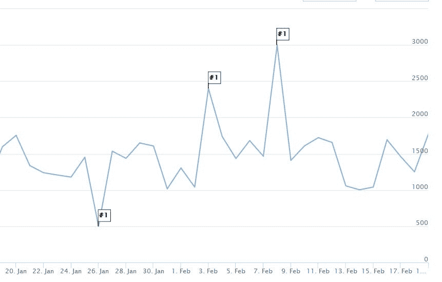

Figure 8: Anomalies detected in the ARIMA method are flagged

上述各点的异常性质如下:

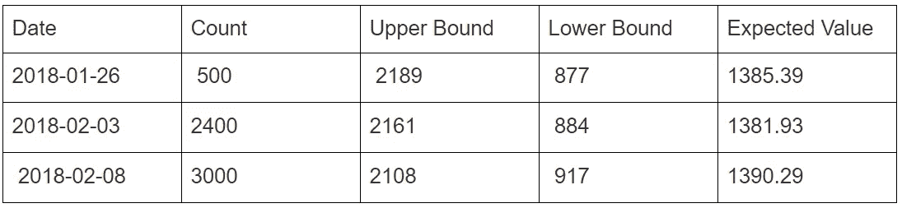

Figure 9: Results from ARIMA method

ARIMA 模型检测到这些点是一个异常，乍一看似乎是一个异常。

3.**先知**:

脸书出版的《预言家》使用了[加性回归模型](https://en.wikipedia.org/wiki/Additive_model)。这个模型有助于发现异常。Prophet 通过从数据中选择变化点来自动检测趋势的变化，并通过傅立叶变换等技术对季节成分(年、月)进行一些修改。Prophet 使用蒙特卡罗模拟来估计不确定性区间。“不确定性 _ 样本”参数控制模拟。它是用于估计不确定性区间的样本数(默认为 1000)。我们可以使用“interval_width”参数设置这个间隔的宽度。

Figure 10: Anomalies detected in the Prophet method are flagged

Prophet 根据下表计算了异常情况:

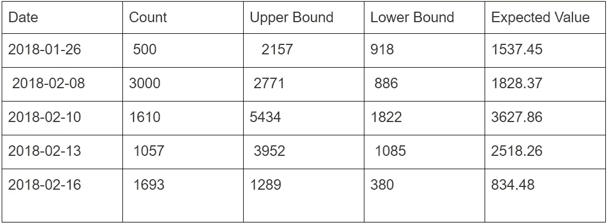

Figure 11: Results from Prophet method

4. **SH-ESD** :

在我实习期间，我们希望实现一些简单的统计计算和更透明的过程。Twitter 发布了季节性杂交[极端学生化偏离技术](https://arxiv.org/pdf/1704.07706.pdf)。在 [CleverTap](https://clevertap.com/) 我们修改了(S-ESD)算法并试图实现它。

**算法**

这一两步过程允许 SH-ESD 检测超出预期季节性最小值和最大值的全球异常和被季节性掩盖的局部异常。

这种改进的算法是在时间序列的“余数”部分上实现的。

残差=时间序列—中位数—季节性

**“为什么余数？”**

上式中的“余数”项是时间序列中“无法解释的部分”。残差具有单峰分布，该分布服从于异常检测技术的应用，例如 ESD( [极端学生化偏差](https://www.itl.nist.gov/div898/handbook/eda/section3/eda35h3.htm))。

**残差计算**:

如上所述，残差计算对于无法解释的行为非常重要。在计算残差时，从原始值中去除了中值和季节性。

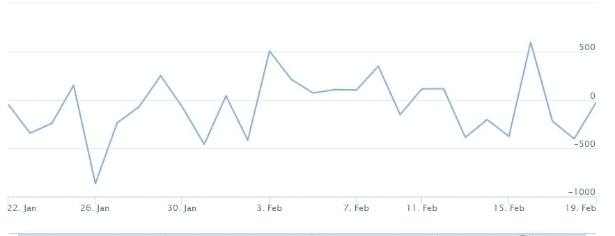

Figure 12: Remainder component of the time series

这里，季节性是使用[STL](https://en.wikipedia.org/wiki/Decomposition_of_time_series)变量法计算的(使用黄土法计算季节性)。使用中值代替趋势，以避免虚假异常。

**“为什么季节性被去除了？”**

考虑一个电影预订应用程序，其中电影票的销售额在每个星期六都很高，那么特定一周中的星期六的高价值对于营销人员来说不应该是一个惊喜。因此，季节性被去除以避免由于季节性行为造成的虚假异常。

**“如何处理剩余组件？”**

为了找出异常值，我们对剩余数据进行了修正的 ESD 测试。这种改进的 ESD 测试分为两步:

。该测试的第一步是计算修改后的 z 分数。这是对原始分数低于或高于中位数的平均偏差的度量。z 分值越高，意味着与中位数的平均偏差越高。

修改后的 Z 得分= (X 中值)/MAD

X =原始数据

MAD =中位数绝对偏差

注意:与一般的 z 值不同，中值和 MAD(中值绝对偏差)术语用于代替“平均值”和“标准差”。原因是后来离群值对它们有更多的影响。这解释了上述术语中的“修改”部分。

。第二步从移除与中值偏差最大的值开始。我们再次计算 Z 得分的新值。在应用置信度后，新的修改后的 z 分值将给出实际的异常值。原始数据中对应于残差数据中异常值索引的值是异常值。

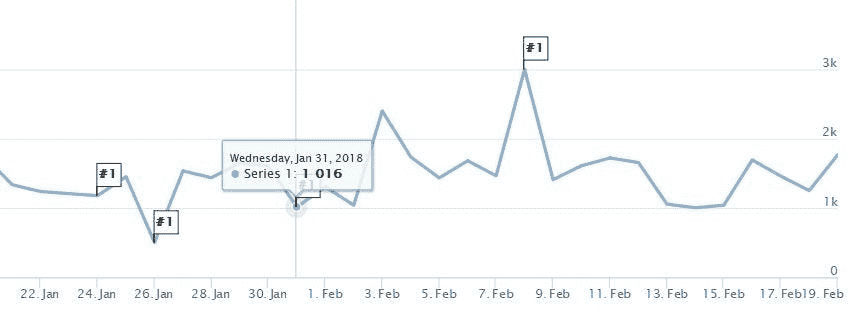

Figure 13: Anomalies detected from the modified SH-ESD method

在对剩余数据进行修改后的 [ESD](https://www.itl.nist.gov/div898/handbook/eda/section3/eda35h3.htm) 测试后，结果标记为 1 月 31 日，乍一看并不像异常。

**“为什么 1 月 31 日是个例外？”**

由于我们使用的是每周季节性，周三图应该可以解释 1 月 31 日的反常性质。

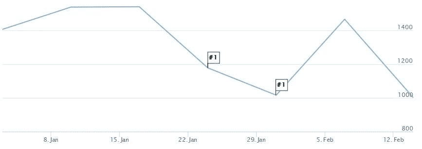

Figure 14: The above plot shows the Wednesday trend

1 月 31 日周三数据计数的下降导致了一个异常现象。

**“如何利用异常信息？”。**

有许多方法可以使用这些信息。此功能的主要用途是，营销人员将收到警报，这将有助于保护这种异常行为的任何负面影响。

考虑一个例子，其中应用规范已经被修改，第二天公司收到关于应用下载数量突然减少的警报。营销人员会在公司特定团队的帮助下，试图在修改后的规范中找到问题。

**结论**:

我们看到了各种检测异常的方法。这些方法在执行难度和结果方面各不相同。移动平均等基本方法易于执行，但结果较差，而 ARIMA、Prophet 等复杂方法的结果较好，但在大型数据库级别难以执行。因此，改进的 SH-ESD 是最好的方法，具有简单的统计计算、更透明的过程和令人敬畏的结果。