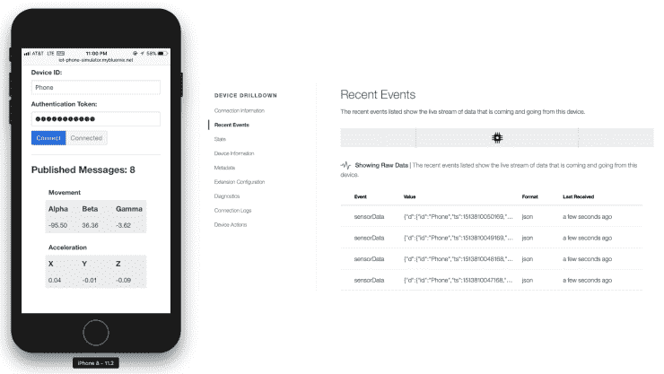
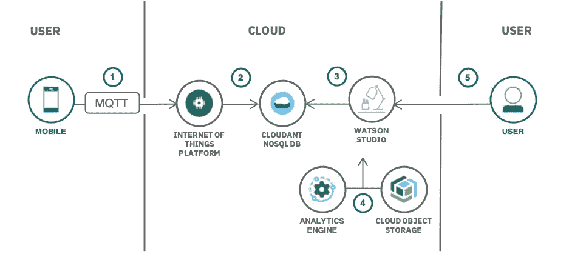

# 基于机器学习的移动传感器数据异常检测

> 原文：<https://towardsdatascience.com/anomaly-detection-in-mobile-sensor-data-48ef62d0f7fc?source=collection_archive---------3----------------------->

本帖摘自我们的解决方案教程—“[**收集、可视化和分析物联网数据**](https://cloud.ibm.com/docs/solution-tutorials?topic=solution-tutorials-gather-visualize-analyze-iot-data)**”**。该教程将引导您设置物联网设备，在 [Watson](https://vmacwrites.wordpress.com/category/cloud/cognitive/) 物联网平台中收集移动传感器数据，探索数据并创建可视化效果，然后使用高级机器学习服务来分析数据并检测历史数据中的异常。

# 那么，什么是异常检测呢？

> 异常检测是一种用于识别不符合预期行为的异常模式(称为异常值)的技术。它在商业中有许多应用，从入侵检测(识别网络流量中可能预示黑客攻击的奇怪模式)到系统健康监控(在 MRI 扫描中发现恶性肿瘤)，从信用卡交易中的欺诈检测到操作环境中的故障检测。

在我们的日常生活中，无论是有意还是无意，我们都会携带物联网设备。它是我们内置传感器的手机，提供来自加速度计和陀螺仪的数据。将这些传感器数据保存在某个地方并检测数据中的异常情况如何？

那听起来是个很酷的主意。如何才能实现这一点？我需要编写一个应用程序并要求用户从商店下载吗？不需要。运行在移动浏览器上的简单 node.js 应用程序将为我们提供传感器数据。

本教程使用以下 IBM [云](https://vmacwrites.wordpress.com/category/cloud/)产品:

*   [IBM Watson 物联网平台](https://cloud.ibm.com/catalog/services/internet-of-things-platform)
*   [Node.js 应用](https://cloud.ibm.com/catalog/starters/sdk-for-nodejs)
*   [沃森工作室](https://cloud.ibm.com/catalog/services/data-science-experience)
*   [IBM 分析引擎](https://cloud.ibm.com/catalog/services/analytics-engine)
*   [IBM 云对象存储](https://cloud.ibm.com/catalog/services/cloud-object-storage)
*   IBM Cloudant

这是流程或架构图，

Architecture diagram

因此，您将创建一个 node.js 应用程序，**在浏览器**上运行它，将加速度计和陀螺仪数据**存储到 Cloudant NoSQL 数据库**，然后我如何检测异常？

这就是 IBM Watson Studio 派上用场的地方。您将使用 IBM Watson Studio 服务中提供的 Jupyter 笔记本来加载历史数据，并使用 z-score 检测异常。您将首先创建一个新项目，然后导入 Jupyter 笔记本(。ipynb)通过 URL。

> 将使用 z 分数进行异常检测。Z-score 是一个标准分数，表示一个元素相对于平均值的标准偏差。可以通过以下公式计算 z 得分:`z = (X - µ) / σ`其中 z 是 z 得分，X 是元素的值，是总体均值，σ是标准差。

## 此链接[https://cloud.ibm.com/docs/solution-tutorials?提供最新教程 topic =解决方案-教程-收集-可视化-分析-物联网-数据](https://cloud.ibm.com/docs/solution-tutorials?topic=solution-tutorials-gather-visualize-analyze-iot-data)