# 另一个使用 Python 的 Twitter 情感分析—第 1 部分

> 原文：<https://towardsdatascience.com/another-twitter-sentiment-analysis-bb5b01ebad90?source=collection_archive---------1----------------------->


Photo by [Clint Patterson](https://unsplash.com/@cbpsc1?utm_source=medium&utm_medium=referral) on [Unsplash](https://unsplash.com?utm_source=medium&utm_medium=referral)

距离我上次发帖已经有一段时间了。我不在灵媒期间，我的生活发生了很多事情。我最终鼓起勇气辞去了工作，加入了伦敦大会的数据科学沉浸式课程。

这是我一生中的一个重大决定，但我不后悔。事实上，我认为这是我迄今为止做的最好的决定。这门课程相当紧张，但我很享受其中的每一点。我学到了很多更严谨的数据科学方法，最重要的是，我从导师和同学那里得到的反馈真的帮助我提高了。不容易但是绝对值得！

我目前在第八周，并为我的顶点项目做准备。正如标题所示，这将是关于 Twitter 的情绪分析。

起初，我并不确定我应该为我的顶点做些什么，但毕竟，我感兴趣的领域是自然语言处理，Twitter 似乎是我 NLP 之旅的一个很好的起点。你可以从[这里](https://prezi.com/view/W1D0h1w5DBQGWJNxEPTu/)找到我最初的项目创意提案。

给你一个关于这个项目的简要总结，它是关于建立一个可以检测情绪的模型，这样我就可以将这个模型应用到来自不同城市的推文中，并比较/分析来自不同城市的推文有多快乐。这是从我自己的好奇心开始的。对我来说，快乐是生活中相当重要的因素，我认为它很大程度上取决于你的环境。所以很自然地，我想看看不同城市的市民有多幸福。

# **训练数据**

可以有许多不同的方法来进行情感分析，一些库提供了开箱即用的情感分析功能，你可以直接在文本上使用，但这并不有趣(是吗？).所以我决定训练我自己的模型，我可以将它应用到我收集的推文中。为了让一个模型有不错的性能，我需要一个相对较大的数据集来训练。用于训练的数据集，我选择的是源自斯坦福大学的“Sentiment140”。关于数据集的更多信息可以从链接中找到。【http://help.sentiment140.com/for-students/ 

数据集可以从下面的链接下载。
[http://cs . Stanford . edu/people/Alec MgO/training and test data . zip](http://cs.stanford.edu/people/alecmgo/trainingandtestdata.zip)

通过查看链接中数据集的描述，可以找到每个字段的信息。

0 —推文的极性(0 =负，2 =中性，4 =正)
1 —推文的 id(2087)
2—推文的日期(2009 年 5 月 16 日星期六 23:58:44 UTC)
3—查询(lyx)。如果没有查询，那么这个值就是 NO_QUERY。
4 —发推文的用户(robotickilldozr)
5 —推文的文本(Lyx 很酷)

好，我们先来看看数据

```
import pandas as pd  
import numpy as np
import matplotlib.pyplot as plt
cols = ['sentiment','id','date','query_string','user','text']
df = pd.read_csv("./trainingandtestdata/training.1600000.processed.noemoticon.csv",header=None, names=cols)
# above line will be different depending on where you saved your data, and your file name
df.head()
```

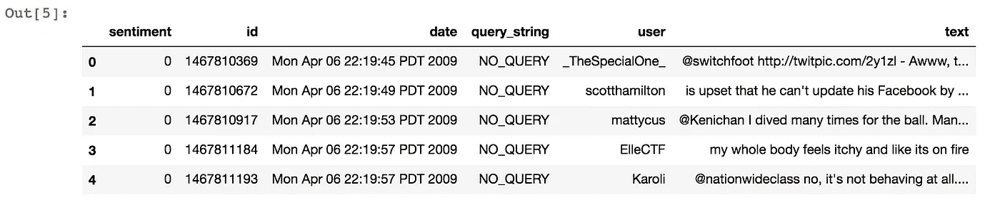

```
df.sentiment.value_counts()
```

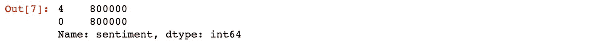

数据集有 160 万个条目，没有空条目，重要的是对于“情绪”列，即使数据集描述提到了中性类，训练集也没有中性类。
50%的数据带有负标签，另外 50%带有正标签。我们可以看到在阶级划分上没有偏斜。

```
df.drop(['id','date','query_string','user'],axis=1,inplace=True)
```

我首先删除了不需要用于情感分析的列。

“id”列是每条推文的唯一 ID
“date”列是推文的日期信息
“QUERY _ string”列指示推文是否使用任何特定的查询关键字收集，但是对于该列，100%的条目都具有值“NO _ QUERY”
“user”列是发布推文的用户的 twitter 句柄名称

我决定放弃四列以上。

```
df[df.sentiment == 0].head(10)
```

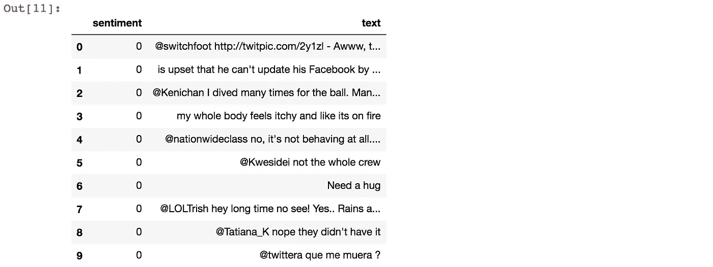

```
df[df.sentiment == 4].head(10)
```

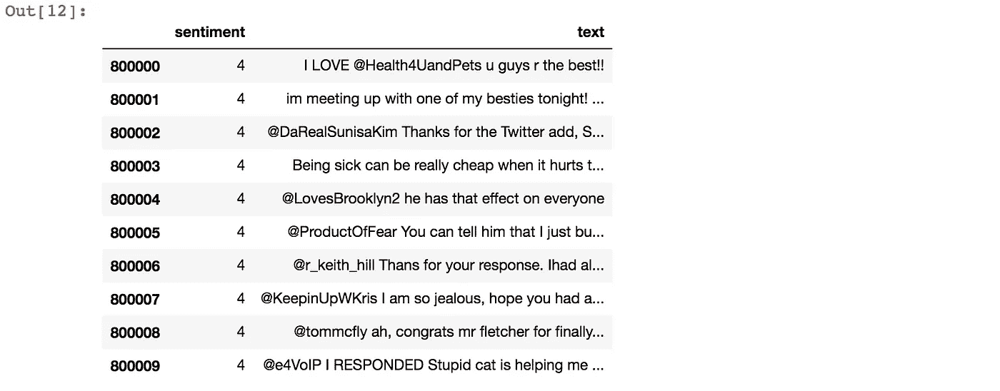

通过查看每个类的一些条目，似乎所有负类都是从 0 ~ 799999 索引，正类条目从 800000 开始到数据集的末尾。

# 数据准备

作为健全性检查的一种方式，让我们看看每个条目的文本列中字符串的长度。

```
df['pre_clean_len'] = [len(t) for t in df.text]
```

# 数据字典—初稿

下面是数据集的数据字典的第一稿，但在我准备的过程中，这将需要更新。

```
from pprint import pprint
data_dict = {
    'sentiment':{
        'type':df.sentiment.dtype,
        'description':'sentiment class - 0:negative, 1:positive'
    },
    'text':{
        'type':df.text.dtype,
        'description':'tweet text'
    },
    'pre_clean_len':{
        'type':df.pre_clean_len.dtype,
        'description':'Length of the tweet before cleaning'
    },
    'dataset_shape':df.shape
}pprint(data_dict)
```


我还将使用方框图绘制 pre_clean_len，这样我可以看到每个条目中字符串长度的总体分布。

```
fig, ax = plt.subplots(figsize=(5, 5))
plt.boxplot(df.pre_clean_len)
plt.show()
```

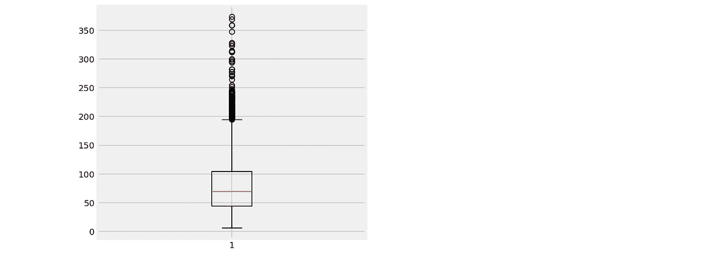

这看起来有点奇怪，因为 twitter 的字符限制是 140。但是从上面的方框图来看，一些推文的长度远远超过了 140 个字符。

```
df[df.pre_clean_len > 140].head(10)
```

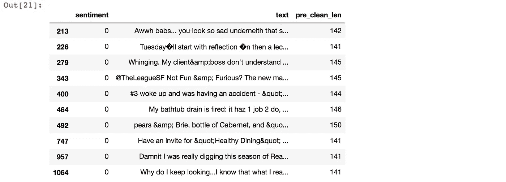

看起来是时候打扫卫生了！

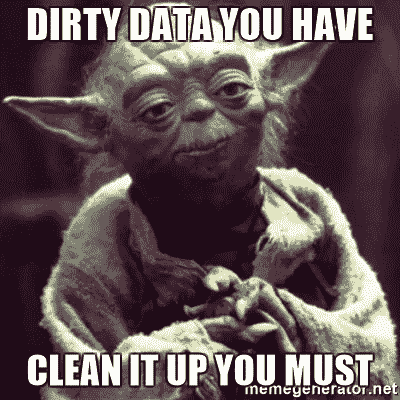

# 资料准备 1: HTML 解码

看起来 HTML 编码没有被转换成文本，并以' &amp '，' &quot '等形式出现在文本字段中。将 HTML 解码为一般文本将是我数据准备的第一步。我会用 BeautifulSoup 来做这个。

```
df.text[279]
```

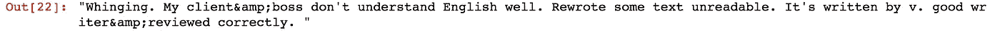

```
from bs4 import BeautifulSoup
example1 = BeautifulSoup(df.text[279], 'lxml')
print example1.get_text()
```

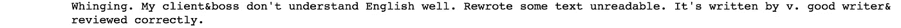

# 数据准备 2: '@ '提及

准备的第二部分是处理@提及。
即使 another 携带了某种信息(该推文提到的另一个用户)，这些信息并没有为建立情感分析模型增加价值。

```
df.text[343]
```

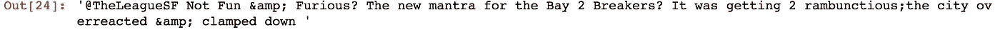

```
import re
re.sub(r'@[A-Za-z0-9]+','',df.text[343])
```

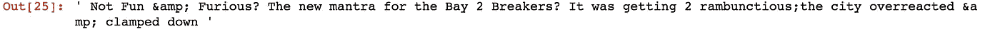

# 数据准备 3: URL 链接

清理的第三部分是处理 URL 链接，与@ reference 相同，即使它携带一些信息，出于情感分析的目的，这可以被忽略。

```
df.text[0]
```

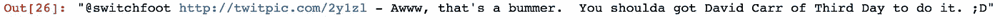

```
re.sub('https?://[A-Za-z0-9./]+','',df.text[0])
```


# 数据准备 4: UTF-8 BOM(字节顺序标记)

```
df.text[226]
```

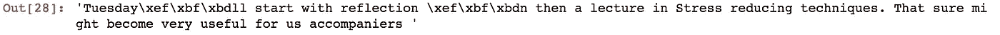

通过查看上面的条目，我可以看到奇怪的字符模式“\xef\xbf\xbd”。经过一些研究，我发现这些是 UTF-8 炸弹。
“UTF-8 BOM 是一个字节序列(EF BB BF)，它允许读者识别以 UTF-8 编码的文件。”

通过用“utf-8-sig”解码文本，这个 BOM 将被替换为 unicode 无法识别的特殊字符，然后我可以将它处理为“？”

```
testing = df.text[226].decode("utf-8-sig")
testing
```

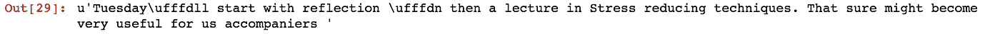

```
testing.replace(u"\ufffd", "?")
```

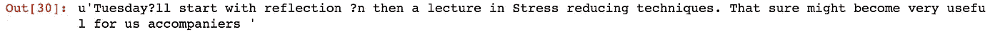

# 数据准备 5:标签/数字

有时与 hashtag 一起使用的文本可以提供关于 tweet 的有用信息。将所有文本和标签一起删除可能有点冒险。所以我决定保持文本不变，只去掉“#”。我将在清理包括数字在内的所有非字母字符的过程中这样做。

```
df.text[175]
```


```
re.sub("[^a-zA-Z]", " ", df.text[175])
```


# 定义数据清理功能

有了以上五个数据清洗任务，我将首先定义数据清洗函数，然后将应用于整个数据集。当使用计数矢量器或 Tfidf 矢量器创建矩阵时，将在稍后阶段处理标记化、词干化/词元化、停用词。

```
from nltk.tokenize import WordPunctTokenizer
tok = WordPunctTokenizer()
pat1 = r'@[A-Za-z0-9]+'
pat2 = r'https?://[A-Za-z0-9./]+'
combined_pat = r'|'.join((pat1, pat2))def tweet_cleaner(text):
    soup = BeautifulSoup(text, 'lxml')
    souped = soup.get_text()
    stripped = re.sub(combined_pat, '', souped)
    try:
        clean = stripped.decode("utf-8-sig").replace(u"\ufffd", "?")
    except:
        clean = stripped
    letters_only = re.sub("[^a-zA-Z]", " ", clean)
    lower_case = letters_only.lower()
    # During the letters_only process two lines above, it has created unnecessay white spaces,
    # I will tokenize and join together to remove unneccessary white spaces
    words = tok.tokenize(lower_case)
    return (" ".join(words)).strip()testing = df.text[:100]test_result = []
for t in testing:
    test_result.append(tweet_cleaner(t))
test_result
```

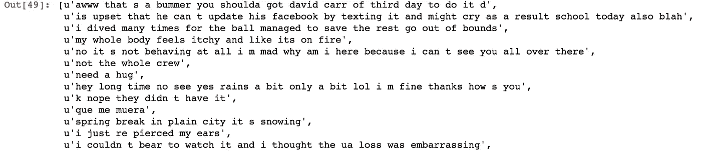

```
nums = [0,400000,800000,1200000,1600000]
print "Cleaning and parsing the tweets...\n"
clean_tweet_texts = []
for i in xrange(nums[0],nums[1]):
    if( (i+1)%10000 == 0 ):
        print "Tweets %d of %d has been processed" % ( i+1, nums[1] )                                                                    
    clean_tweet_texts.append(tweet_cleaner(df['text'][i]))
```

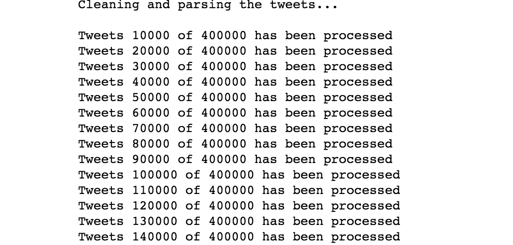

剩下的，你明白了，我把整个数据集分成四批，并清理它们。

# 将清理的数据保存为 csv

```
clean_df = pd.DataFrame(clean_tweet_texts,columns=['text'])
clean_df['target'] = df.sentiment
clean_df.head()
```

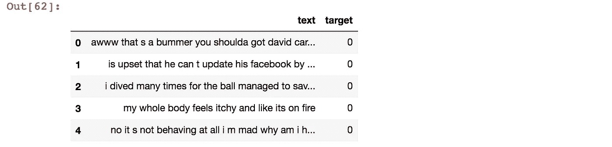

```
clean_df.to_csv('clean_tweet.csv',encoding='utf-8')
csv = 'clean_tweet.csv'
my_df = pd.read_csv(csv,index_col=0)
my_df.head()
```

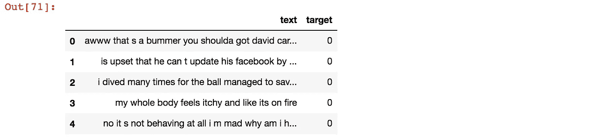

由于帖子越来越长，我将在这里停下来，并尝试在下一个帖子继续。如果你有任何问题，或意见，或建议，请不要犹豫留下评论！谢谢你。

你可以在 Github repo 下面找到 Jupyter 的笔记本文件。

[https://github . com/tthustle sa/Twitter _ 情操 _ 分析 _ part 1/blob/master/Capstone _ part 2 . ipynb](https://github.com/tthustla/twitter_sentiment_analysis_part1/blob/master/Capstone_part2.ipynb)