# 另一个使用 Python 的 Twitter 情感分析——第 2 部分

> 原文：<https://towardsdatascience.com/another-twitter-sentiment-analysis-with-python-part-2-333514854913?source=collection_archive---------1----------------------->

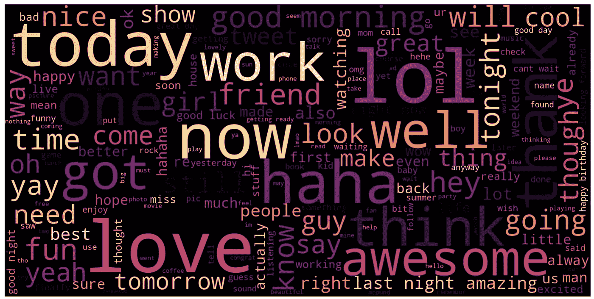

这篇博文是我目前在伦敦大会上为我的顶点项目所做的 Twitter 情绪分析项目的第二部分。你可以在这里找到第一部[。](/another-twitter-sentiment-analysis-bb5b01ebad90)

# 重新清理数据

在我继续学习 EDA 和数据可视化之前，我对数据清理部分做了一些修改，因为我在上一篇文章中定义的数据清理函数存在错误。

我意识到的第一个问题是，在清理过程中，否定词被分成两部分，当我过滤长度超过一个音节的标记时，撇号后面的“t”消失了。这使得像“不可以”这样的词最终和“可以”一样。对于情感分析来说，这似乎不是一件小事。

我意识到的第二个问题是，有些 url 链接不是以“http”开头的，有时人们会以“www.websitename.com”的形式粘贴链接。当我将 url 地址正则表达式模式定义为“https？://[A-Za-z0–9。/]+'.这种正则表达式模式的另一个问题是它只检测字母、数字、句点和斜杠。这意味着如果它包含任何其他特殊字符，如“=”、“_”、“~”等，它将无法捕获 url 的一部分。

第三个问题是 twitter ID 的 regex 模式。在之前的清理函数中，我将其定义为' @[A-Za-z0–9]+'，但是稍微用[谷歌了一下](http://kagan.mactane.org/blog/2009/09/22/what-characters-are-allowed-in-twitter-usernames/comment-page-1/)，我发现 twitter ID 也允许下划线符号作为可以与 ID 一起使用的字符。除下划线符号外，只允许字母和数字字符。

下面是更新的数据清理功能。清洗的顺序是

1.  增加马力
2.  物料清单删除
3.  url 地址(' http:'模式)，twitter ID 删除
4.  url 地址(' www。图案)移除
5.  小写字母的
6.  否定处理
7.  删除数字和特殊字符
8.  符号化和连接

```
**import** **pandas** **as** **pd**  
**import** **numpy** **as** **np**
**import** **matplotlib.pyplot** **as** **plt**
plt.style.use('fivethirtyeight')

%matplotlib inline
%config InlineBackend.figure_format = 'retina'**import** **re**
**from** **bs4** **import** BeautifulSoup
**from** **nltk.tokenize** **import** WordPunctTokenizer
tok = WordPunctTokenizer()

pat1 = r'@[A-Za-z0-9_]+'
pat2 = r'https?://[^ ]+'
combined_pat = r'|'.join((pat1, pat2))
www_pat = r'www.[^ ]+'
negations_dic = {"isn't":"is not", "aren't":"are not", "wasn't":"was not", "weren't":"were not",
                "haven't":"have not","hasn't":"has not","hadn't":"had not","won't":"will not",
                "wouldn't":"would not", "don't":"do not", "doesn't":"does not","didn't":"did not",
                "can't":"can not","couldn't":"could not","shouldn't":"should not","mightn't":"might not",
                "mustn't":"must not"}
neg_pattern = re.compile(r'\b(' + '|'.join(negations_dic.keys()) + r')\b')

**def** tweet_cleaner_updated(text):
    soup = BeautifulSoup(text, 'lxml')
    souped = soup.get_text()
    **try**:
        bom_removed = souped.decode("utf-8-sig").replace(u"**\ufffd**", "?")
    **except**:
        bom_removed = souped
    stripped = re.sub(combined_pat, '', bom_removed)
    stripped = re.sub(www_pat, '', stripped)
    lower_case = stripped.lower()
    neg_handled = neg_pattern.sub(**lambda** x: negations_dic[x.group()], lower_case)
    letters_only = re.sub("[^a-zA-Z]", " ", neg_handled)
    *# During the letters_only process two lines above, it has created unnecessay white spaces,*
    *# I will tokenize and join together to remove unneccessary white spaces*
    words = [x **for** x  **in** tok.tokenize(letters_only) **if** len(x) > 1]
    **return** (" ".join(words)).strip()
```

更新清理函数后，我重新清理了数据集中的全部 160 万个条目。你可以从我的[上一篇](/another-twitter-sentiment-analysis-bb5b01ebad90)中找到清洁过程的细节。

清理之后，我将清理后的数据导出为 csv 格式，然后加载为数据框，如下图所示。

```
csv = 'clean_tweet.csv'
my_df = pd.read_csv(csv,index_col=0)
my_df.head()
```

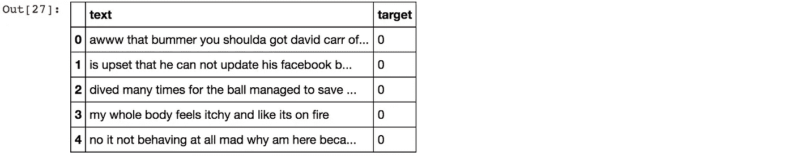

```
my_df.info()
```

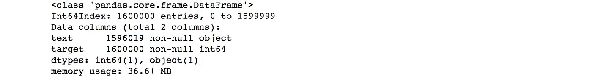

数据中似乎有一些空条目，让我们进一步调查。

```
my_df[my_df.isnull().any(axis=1)].head()
```

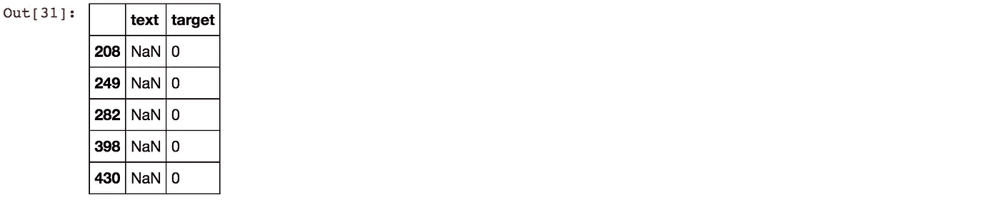

```
np.sum(my_df.isnull().any(axis=1))
```


```
my_df.isnull().any(axis=0)
```

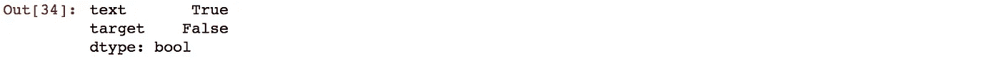

似乎有 3981 个条目的文本列为空。这很奇怪，因为原始数据集没有空条目，因此如果清理后的数据集中有任何空条目，那一定是在清理过程中发生的。

```
df = pd.read_csv("./trainingandtestdata/training.1600000.processed.noemoticon.csv",header=None)
df.iloc[my_df[my_df.isnull().any(axis=1)].index,:].head()
```

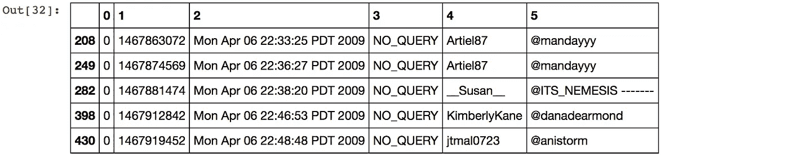

通过查看原始数据中的这些条目，似乎只有文本信息，要么是 twitter ID，要么是 url 地址。无论如何，这些是我决定为情感分析丢弃的信息，所以我将丢弃这些空行，并更新数据框。

```
my_df.dropna(inplace=True)
my_df.reset_index(drop=True,inplace=True)
my_df.info()
```

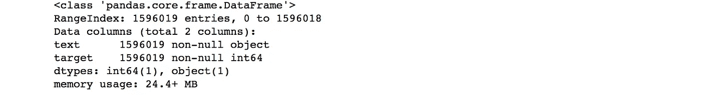

# 词云

我选择的第一个文本视觉化是有争议的单词 cloud。词云通过根据单个词的频率成比例地调整其大小，然后以随机排列的方式呈现它们，来表示词在文档中的用法。围绕 word cloud 有很多争论，我有点同意那些反对使用 word cloud 作为数据分析的人的观点。对 word cloud 的一些担忧是，它仅支持最粗略的文本分析，并且它通常应用于文本分析不合适的情况，并且它让查看者自己找出数据的上下文，而不提供叙述。

但是在推文的情况下，文本分析是最重要的分析，它以一种快速和肮脏的方式提供了关于什么样的词在语料库中频繁出现的一般想法。所以，我将试一试，并找出还有哪些方法可以用于文本可视化。

对于 wordcloud，我使用了 python 库 word cloud。

```
neg_tweets = my_df[my_df.target == 0]
neg_string = []
**for** t **in** neg_tweets.text:
    neg_string.append(t)
neg_string = pd.Series(neg_string).str.cat(sep=' ')**from** **wordcloud** **import** WordCloud

wordcloud = WordCloud(width=1600, height=800,max_font_size=200).generate(neg_string)
plt.figure(figsize=(12,10))
plt.imshow(wordcloud, interpolation="bilinear")
plt.axis("off")
plt.show()
```

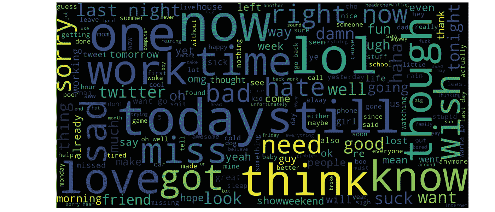

有些大词可以被解释成中性词，如“今天”、“现在”等。我可以看到一些较小的单词在负面推文中是有意义的，比如“该死”、“啊”、“小姐”、“坏”等等。但是有“爱”在相当大的尺寸，所以我想看看发生了什么。

```
**for** t **in** neg_tweets.text[:200]:
    **if** 'love' **in** t:
        **print** t
```


好吧，即使推文包含“爱”这个词，在这些情况下，它是负面情绪，因为推文混合了像“爱”但“想念”这样的情绪。或者有时以讽刺的方式使用。

```
pos_tweets = my_df[my_df.target == 1]
pos_string = []
**for** t **in** pos_tweets.text:
    pos_string.append(t)
pos_string = pd.Series(pos_string).str.cat(sep=' ')wordcloud = WordCloud(width=1600, height=800,max_font_size=200,colormap='magma').generate(pos_string) plt.figure(figsize=(12,10)) plt.imshow(wordcloud, interpolation="bilinear") plt.axis("off") plt.show()
```

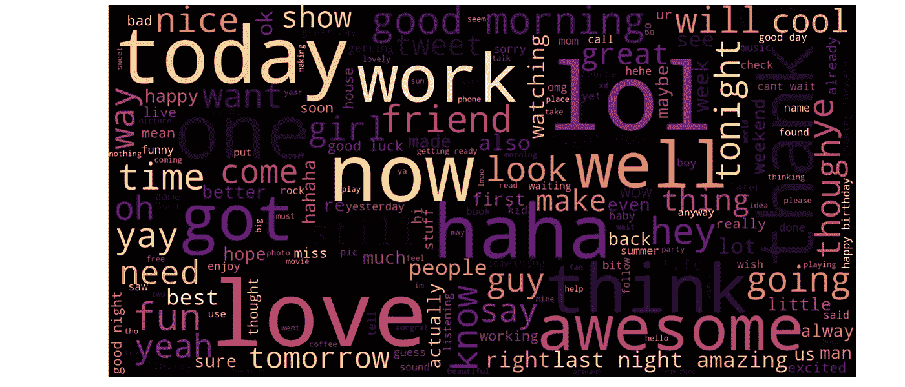

我又一次看到一些自然的大字体单词，“今天”、“现在”，但是像“哈哈”、“爱”、“棒极了”这样的单词也很突出。

有趣的是，“工作”这个词在负面词云中相当大，但在正面词云中也相当大。这可能意味着许多人表达了对工作的负面情绪，但也有许多人对工作持积极态度。

# 为更多数据可视化做准备

为了让我在下一步实现一些数据可视化，我需要词频数据。推文中使用了什么样的词，以及在整个语料库中使用了多少次。我使用计数矢量器来计算术语频率，尽管计数矢量器也用于拟合、训练和预测，但在这个阶段，我将只提取术语频率进行可视化。

计数矢量器有一些可用的参数选项，例如移除停用词、限制最大项数。然而，为了首先获得数据集的全貌，我实现了包含停用词，并且不限制最大术语数。

```
**from** **sklearn.feature_extraction.text** **import** CountVectorizer
cvec = CountVectorizer()
cvec.fit(my_df.text)
```

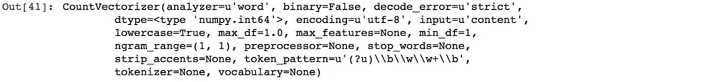

```
len(cvec.get_feature_names())
```


好了，看起来计数矢量器已经从语料库中提取了 264，936 个单词。

**！重要更新(10/01/2018)** :我刚刚意识到，我不必经历我下面做的所有批处理。

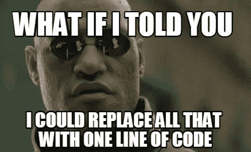

是啊！我下面做的所有批处理和计算都可以用少得多的代码行来完成(虽然不完全是一行)。一旦使用拟合的计数矢量器转换数据，就可以直接从稀疏矩阵中获得术语频率。而这一切都可以在不到一秒的时间内完成！如果你看了下面，你会发现我花了将近 40 分钟才得到术语频率表。我想我用最艰难的方式学到了这一课。直接从稀疏矩阵中获得频率项的代码如下。

```
neg_doc_matrix = cvec.transform(my_df[my_df.target == 0].text)
pos_doc_matrix = cvec.transform(my_df[my_df.target == 1].text)
neg_tf = np.sum(neg_doc_matrix,axis=0)
pos_tf = np.sum(pos_doc_matrix,axis=0)
neg = np.squeeze(np.asarray(neg_tf))
pos = np.squeeze(np.asarray(pos_tf))
term_freq_df = pd.DataFrame([neg,pos],columns=cvec.get_feature_names()).transpose()
```

我将在下面留下我最初写的，作为对我自己愚蠢的提醒。这个故事的寓意是，如果你可以直接用稀疏矩阵工作，你绝对应该不用转换成密集矩阵！

对于下面的部分，我不得不经历许多试验和错误，因为内存使用超载。如果代码需要时间来实现，但仍然在运行，这是可以的，但这不是块运行多长时间的问题，我的 mac book pro 只是简单地放弃了，要么杀死内核，要么冻结。经过无数次尝试，我终于成功地批量处理了数据。

我一直犯的错误是，当我分割文档矩阵时，我试图在' document _ matrix . to array()[start _ index，end_index]'中分割它，我最终意识到，因为我试图首先将整个 documnet_matrix 转换为数组，然后从那里分割，无论我如何更改批处理大小，我可怜的 macbook pro 都无法处理请求。在我将切片更改为' document_matrix[start_index，end_index]之后。toarray()'，我的 mac book pro 为我做了一件非常棒的工作。

此外，在处理以下任务的过程中，您的 mac book 可以在寒冷的冬天成为一个出色的取暖设备。在亚洲，我们称之为“一石二鸟”。不客气


Cats are the best at finding warm spots in winter!

```
document_matrix = cvec.transform(my_df.text)
my_df[my_df.target == 0].tail()
```

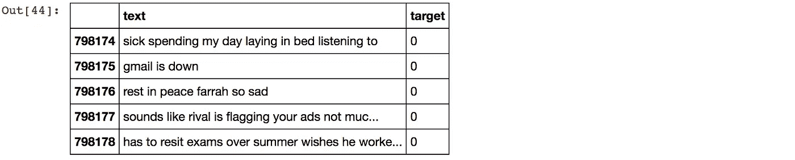

```
%%time
neg_batches = np.linspace(0,798179,100).astype(int)
i=0
neg_tf = []
**while** i < len(neg_batches)-1:
    batch_result = np.sum(document_matrix[neg_batches[i]:neg_batches[i+1]].toarray(),axis=0)
    neg_tf.append(batch_result)
    **if** (i % 10 == 0) | (i == len(neg_batches)-2):
        **print** neg_batches[i+1],"entries' term freuquency calculated"
    i += 1
```

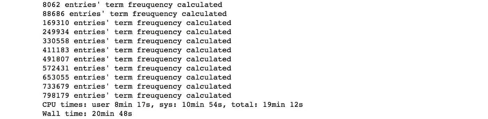

```
my_df.tail()
```

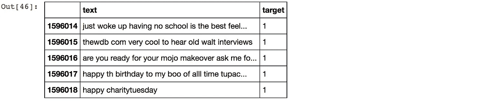

```
%%time
pos_batches = np.linspace(798179,1596019,100).astype(int)
i=0
pos_tf = []
**while** i < len(pos_batches)-1:
    batch_result = np.sum(document_matrix[pos_batches[i]:pos_batches[i+1]].toarray(),axis=0)
    pos_tf.append(batch_result)
    **if** (i % 10 == 0) | (i == len(pos_batches)-2):
        **print** pos_batches[i+1],"entries' term freuquency calculated"
    i += 1
```

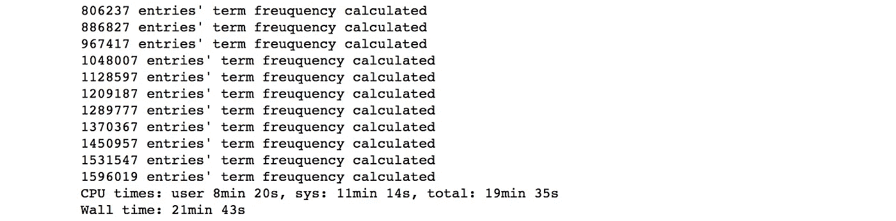

```
neg = np.sum(neg_tf,axis=0)
pos = np.sum(pos_tf,axis=0)
term_freq_df = pd.DataFrame([neg,pos],columns=cvec.get_feature_names()).transpose()
term_freq_df.head()
```

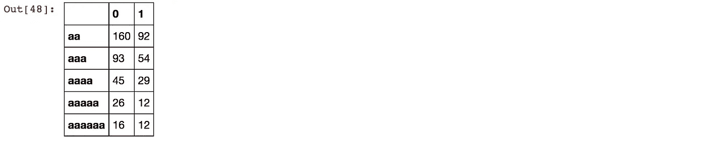

```
term_freq_df.columns = ['negative', 'positive']
term_freq_df['total'] = term_freq_df['negative'] + term_freq_df['positive']
term_freq_df.sort_values(by='total', ascending=False).iloc[:10]
```


好了，术语频率数据框已经创建好了！正如你所看到的，最常见的单词都是停用词，如“to”、“the”等。你可能想知道为什么要经历所有繁重的处理，而不删除停用词，也不限制最大词数，以获得停用词占主导地位的词频率？因为我真的很想用上面得到的结果来检验[齐夫定律](https://en.wikipedia.org/wiki/Zipf%27s_law)。我需要停止字！你会明白我的意思。

我会在下一篇文章中告诉你更多关于齐夫定律的内容，我保证会有更多的可视化。你会发现上面的频率计算并不是毫无意义的。

和往常一样，你可以从下面的链接找到 Jupyter 笔记本。

[https://github . com/tthustle sa/Twitter _ 情操 _ 分析 _ part 2/blob/master/Capstone _ part 3-copy 1 . ipynb](https://github.com/tthustla/twitter_sentiment_analysis_part2/blob/master/Capstone_part3-Copy1.ipynb)