# 另一个使用 Python 的 Twitter 情感分析——第 3 部分(Zipf 定律，数据可视化)

> 原文：<https://towardsdatascience.com/another-twitter-sentiment-analysis-with-python-part-3-zipfs-law-data-visualisation-fc9eadda71e7?source=collection_archive---------2----------------------->


Photo by [Samuel Ramos](https://unsplash.com/@idgeek?utm_source=medium&utm_medium=referral) on [Unsplash](https://unsplash.com?utm_source=medium&utm_medium=referral)

这是 Twitter 情绪分析项目的第三部分，我目前正在为伦敦大会的数据科学沉浸式课程做准备。你可以在下面找到之前文章的链接。

[](/another-twitter-sentiment-analysis-bb5b01ebad90) [## 另一个使用 Python 的 Twitter 情感分析—第 1 部分

### 距离我上次发帖已经有一段时间了。我不在灵媒期间，我的生活发生了很多事情。我终于收集了我的…

towardsdatascience.com](/another-twitter-sentiment-analysis-bb5b01ebad90) [](https://medium.com/@rickykim78/another-twitter-sentiment-analysis-with-python-part-2-333514854913) [## 另一个使用 Python 的 Twitter 情感分析——第 2 部分

### 这篇博文是我目前正在为我的顶点计划做的 Twitter 情绪分析项目的第二部分…

medium.com](https://medium.com/@rickykim78/another-twitter-sentiment-analysis-with-python-part-2-333514854913) 

在第二篇博文的末尾，我创建了一个词频数据框架，看起来像这样。

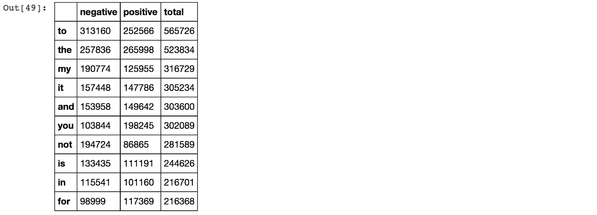

这些索引是来自 tweets 数据集的令牌("[sentitement 140](http://help.sentiment140.com/for-students/)")，而“负”和“正”列中的数字表示该令牌在负推和正推中出现的次数。

# 齐夫定律

[齐夫定律](https://en.wikipedia.org/wiki/Zipf%27s_law)首先由法国速记员[让·巴普蒂斯特·埃斯图普](https://en.wikipedia.org/wiki/Jean-Baptiste_Estoup)提出，后来以美国语言学家[乔治·金斯利·齐夫](https://en.wikipedia.org/wiki/George_Kingsley_Zipf)的名字命名。齐夫定律指出，一小部分单词一直在使用，而绝大多数很少使用。这没什么好奇怪的，我们知道我们非常频繁地使用一些词，如“the”、“of”等，而我们很少使用像“aardvark”这样的词(aardvark 是一种原产于非洲的动物物种)。然而，有趣的是，“给定一些自然语言话语的语料库，任何单词的频率都与其在频率表中的排名成反比。因此，最频繁出现的单词的出现频率大约是第二频繁出现的单词的两倍，第三频繁出现的单词的三倍，等等

如果你想更多地了解齐夫定律，我推荐下面的 Youtube 视频。

Zipf 定律可以写成如下形式:第 r 个最频繁出现的单词的频率 f(r)与下式成比例


为


让我们看看 tweet 标记和它们的频率在图上是什么样子的。

```
y_pos = np.arange(500)
plt.figure(figsize=(10,8))
s = 1
expected_zipf = [term_freq_df.sort_values(by='total', ascending=False)['total'][0]/(i+1)**s for i in y_pos]
plt.bar(y_pos, term_freq_df.sort_values(by='total', ascending=False)['total'][:500], align='center', alpha=0.5)
plt.plot(y_pos, expected_zipf, color='r', linestyle='--',linewidth=2,alpha=0.5)
plt.ylabel('Frequency')
plt.title('Top 500 tokens in tweets')
```

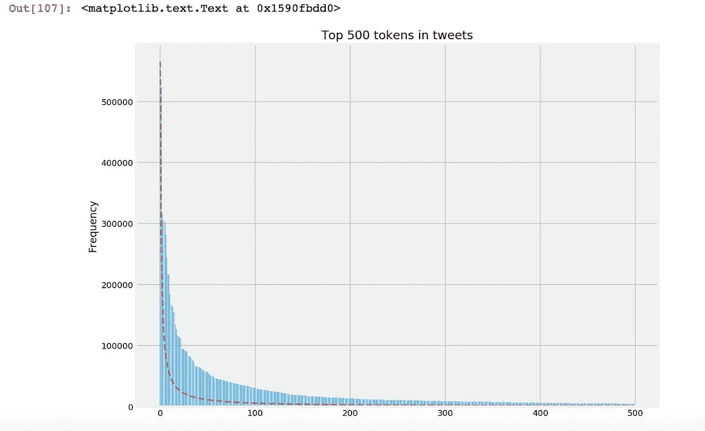

在 X 轴上是频率的等级，从左到右从最高等级到第 500 等级。y 轴是在语料库中观察到的频率(在本例中为“Sentiment140”数据集)。需要注意的一点是，大多数情况下的实际观测值并不严格遵循 Zipf 分布，而是遵循一种“近似 Zipfian”分布的趋势。

尽管我们可以看到该图遵循 Zipf 定律的趋势，但在排名较高的单词中，它看起来有更多的区域在预期的 Zipf 曲线之上。

另一种绘制方式是在对数-对数图上，X 轴是对数(等级)，Y 轴是对数(频率)。通过在双对数标度上绘图，结果将在图上产生大致线性的线。

```
from pylab import *
counts = term_freq_df.total
tokens = term_freq_df.index
ranks = arange(1, len(counts)+1)
indices = argsort(-counts)
frequencies = counts[indices]
plt.figure(figsize=(8,6))
plt.ylim(1,10**6)
plt.xlim(1,10**6)
loglog(ranks, frequencies, marker=".")
plt.plot([1,frequencies[0]],[frequencies[0],1],color='r')
title("Zipf plot for tweets tokens")
xlabel("Frequency rank of token")
ylabel("Absolute frequency of token")
grid(True)
for n in list(logspace(-0.5, log10(len(counts)-2), 25).astype(int)):
    dummy = text(ranks[n], frequencies[n], " " + tokens[indices[n]], 
                 verticalalignment="bottom",
                 horizontalalignment="left")
```

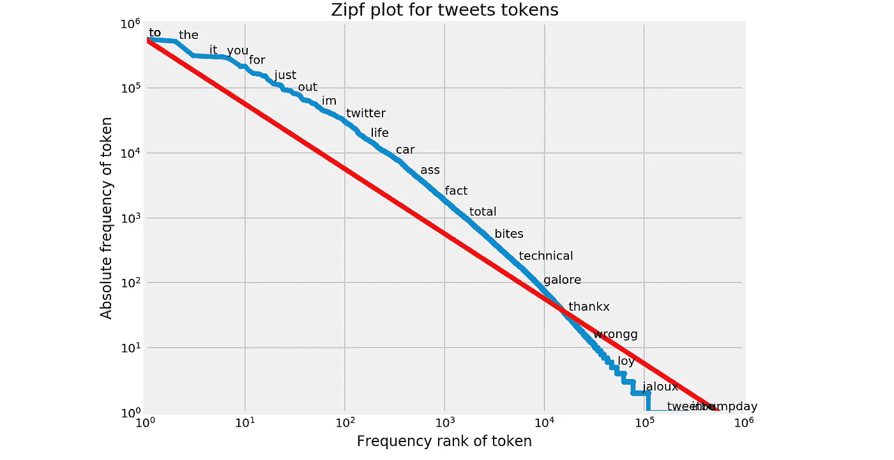

我们再次看到一条大致线性的曲线，但是在较高等级的单词上偏离了预期的线，并且在较低等级，我们看到实际的观察线位于预期的线性线之下。

至少，我们证明了即使是 tweet 令牌也遵循“近似 Zipfian”分布，但这让我对 Zipf 定律的偏离产生了好奇。即使法律本身规定实际观察遵循“近齐夫曼”而不是严格受法律约束，但我们在更高等级中观察到的预期线以上的区域只是偶然吗？还是说 tweets 比其他文本语料库更多地使用了频繁词？与其他文本语料库相比，有统计学上的显著差异吗？

尽管所有这些听起来像是非常有趣的研究课题，但它超出了这个项目的范围，我将不得不转向数据可视化的下一步。

# Tweet 令牌可视化

在了解了标记在整个语料库中的分布之后，我脑海中的下一个问题是两个不同类别(积极和消极)中的标记有何不同。这一次，停用词不会有太大帮助，因为相同的高频词(如“the”、“to”)在两个类中会同样频繁地出现。如果这两个类都被停用词支配，我就不能得到有意义的结果。因此，我决定删除停用词，并用 countvectorizer 将 max_features 限制为 10，000。

我不会重复计数矢量化的步骤，因为在我之前的博客文章中已经以类似的方式完成了。但是它将会在我的 Jupyter 笔记本上，我会在这篇文章的最后分享。总之，在计数矢量化之后，我们现在有了 10，000 个没有停用词的标记的标记频率数据，如下所示。

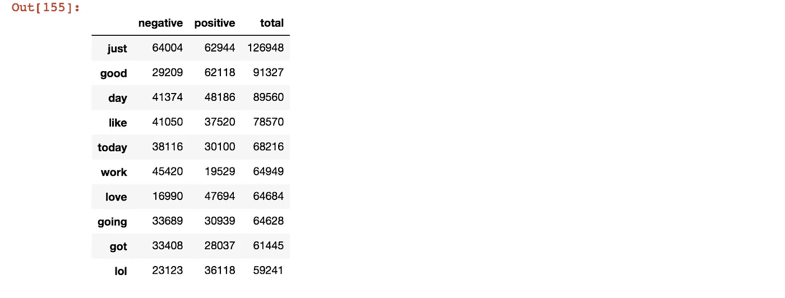

让我们来看看条形图上负面推文的前 50 个词是什么。

```
y_pos = np.arange(50)
plt.figure(figsize=(12,10))
plt.bar(y_pos, term_freq_df2.sort_values(by='negative', ascending=False)['negative'][:50], align='center', alpha=0.5)
plt.xticks(y_pos, term_freq_df2.sort_values(by='negative', ascending=False)['negative'][:50].index,rotation='vertical')
plt.ylabel('Frequency')
plt.xlabel('Top 50 negative tokens')
plt.title('Top 50 tokens in negative tweets')
```


即使前 50 名的一些标记可以提供一些关于负面推文的信息，一些中性词，如“只是”，“天”，是最常见的标记之一。尽管这些是真正的高频词，但很难说这些词都是负面推特中的重要词，这些负面推特描述了负面阶层的特征。

让我们也来看看条形图上的前 50 个积极标志。

```
y_pos = np.arange(50)
plt.figure(figsize=(12,10))
plt.bar(y_pos, term_freq_df2.sort_values(by='positive', ascending=False)['positive'][:50], align='center', alpha=0.5)
plt.xticks(y_pos, term_freq_df2.sort_values(by='positive', ascending=False)['positive'][:50].index,rotation='vertical')
plt.ylabel('Frequency')
plt.xlabel('Top 50 positive tokens')
plt.title('Top 50 tokens in positive tweets')
```

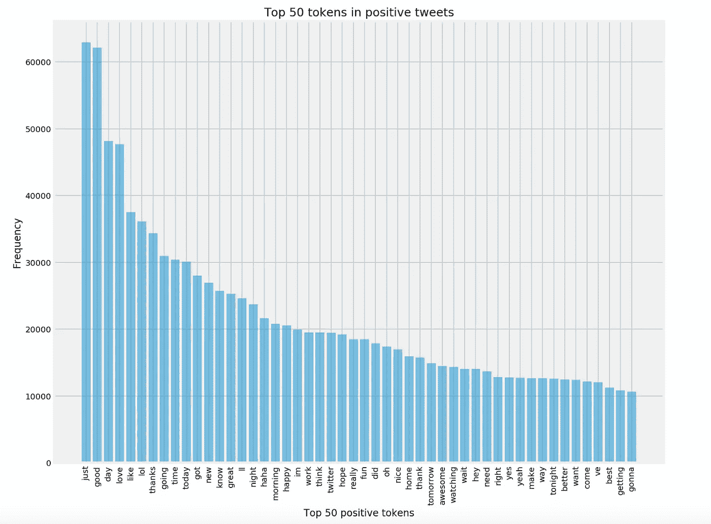

同样，中性词如“只是”，“天”，在排名中相当靠前。

如果我们把一个单词的负频率标在 X 轴上，正频率标在 Y 轴上，会怎么样呢？

```
import seaborn as sns
plt.figure(figsize=(8,6))
ax = sns.regplot(x="negative", y="positive",fit_reg=False, scatter_kws={'alpha':0.5},data=term_freq_df2)
plt.ylabel('Positive Frequency')
plt.xlabel('Negative Frequency')
plt.title('Negative Frequency vs Positive Frequency')
```

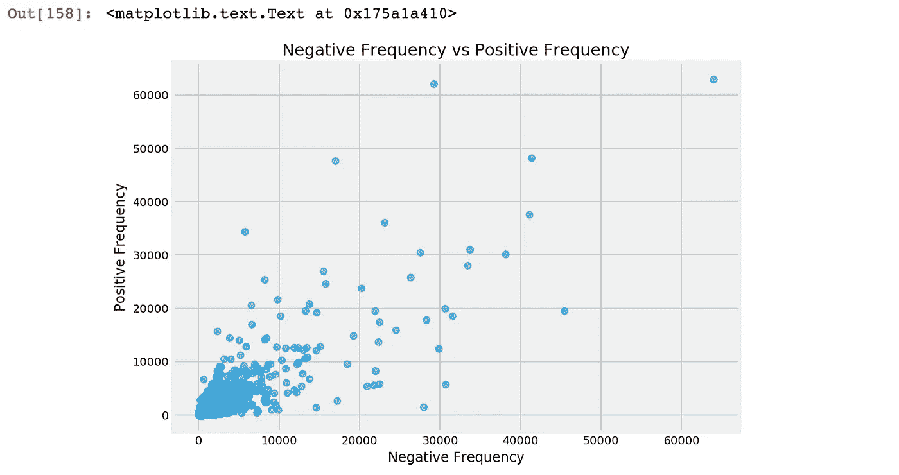

大部分词在 X 轴和 Y 轴上都在 10000 以下，看不出正负频率有什么有意义的关系。

为了提出一个有意义的度量标准，可以表征每个类别中的重要标志，我借用了 [Jason Kessler 在 PyData 2017 Seattle](https://youtu.be/H7X9CA2pWKo) 中提出的度量标准。在演讲中，他展示了一个名为 [Scattertext](https://pypi.python.org/pypi/scattertext/0.0.2.4.6) 的 Python 库。尽管我没有使用这个库，但作为一种可视化文本数据的方式，在从频率数据中过滤有意义的符号时，在散点图中使用的度量是非常有用的。

让我们探索一下我们能从每个令牌的频率中得到什么。直观地说，如果一个单词在一个类中比另一个类中出现得更频繁，这可以很好地衡量该单词对描述该类有多大意义。在下面的代码中，我将其命名为“pos_rate ”,正如您从代码的计算中可以看到的，这被定义为


```
term_freq_df2['pos_rate'] = term_freq_df2['positive'] * 1./term_freq_df2['total']
term_freq_df2.sort_values(by='pos_rate', ascending=False).iloc[:10]
```

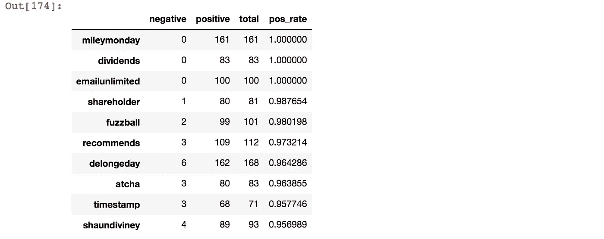

pos_rate 最高的词在负面推文中的频率为零，但这些词的整体频率太低，不能将其作为正面推文的指导原则。

另一个指标是一个单词在课堂上出现的频率。这被定义为


```
term_freq_df2['pos_freq_pct'] = term_freq_df2['positive'] * 1./term_freq_df2['positive'].sum()
term_freq_df2.sort_values(by='pos_freq_pct', ascending=False).iloc[:10]
```

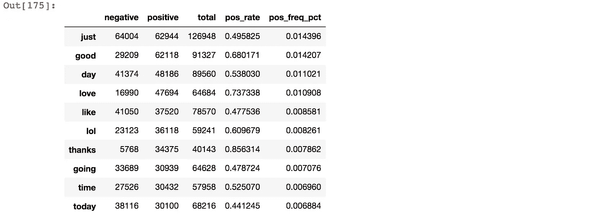

但由于 pos_freq_pct 只是频率总和的比例，因此 pos_freq_pct 的等级与正频率完全相同。

我们现在可以做的是将 pos_rate、pos_freq_pct 组合在一起，得出一个既反映 pos_rate 又反映 pos_freq_pct 的指标。尽管这两个值的取值范围都是从 0 到 1，但 pos_rate 的取值范围实际上要宽得多，从 0 到 1，而所有 pos_freq_pct 值都被压缩在小于 0.015 的范围内。如果我们对这两个数字进行平均，pos_rate 将过于占优势，并且不会有效地反映这两个指标。

所以这里我们用[调和平均值](https://en.wikipedia.org/wiki/Harmonic_mean)代替算术平均值。由于数字列表的调和平均值强烈倾向于列表中最少的元素，因此(与算术平均值相比)它倾向于减轻较大异常值的影响，并加重较小异常值的影响正实数 x1，x2，…xn 的调和平均值 H 定义为


```
from scipy.stats import hmeanterm_freq_df2['pos_hmean'] = term_freq_df2.apply(lambda x: (hmean([x['pos_rate'], x['pos_freq_pct']])                                                               if x['pos_rate'] > 0 and x['pos_freq_pct'] > 0 else 0), axis=1)

term_freq_df2.sort_values(by='pos_hmean', ascending=False).iloc[:10]
```


调和平均秩似乎与 pos_freq_pct 相同。通过计算谐波平均值，小值(在这种情况下，pos_freq_pct)的影响过于严重，最终主导了平均值。这同样与频率值排名完全相同，并没有提供多少有意义的结果。

接下来我们可以尝试的是获得 pos_rate 和 pos_freq_pct 的 [CDF(累积分布函数)](https://en.wikipedia.org/wiki/Cumulative_distribution_function)值。CDF 可以解释为“X 的分布函数，在 X 处取值，是 X 取值小于等于 X 的概率”。通过计算 CDF 值，我们可以看到 pos_rate 或 pos_freq_pct 的值在累积方式分布中的位置。在下面的代码结果中，我们可以看到单词“welcome”的 pos_rate_normcdf 为 0.995625，pos_freq_pct_normcdf 为 0.999354。这意味着大约 99.56%的令牌将采用小于或等于 0.91535 的 pos_rate 值，99.99%的令牌将采用小于或等于 0.001521 的 pos_freq_pct 值。

接下来，我们像前面一样计算这两个 CDF 值的调和平均值。通过计算调和平均值，我们可以看到，pos_normcdf_hmean 度量提供了一个更有意义的方法来衡量一个单词在类中的重要性。

```
from scipy.stats import normdef normcdf(x):
    return norm.cdf(x, x.mean(), x.std())term_freq_df2['pos_rate_normcdf'] = normcdf(term_freq_df2['pos_rate'])term_freq_df2['pos_freq_pct_normcdf'] = normcdf(term_freq_df2['pos_freq_pct'])term_freq_df2['pos_normcdf_hmean'] = hmean([term_freq_df2['pos_rate_normcdf'], term_freq_df2['pos_freq_pct_normcdf']])term_freq_df2.sort_values(by='pos_normcdf_hmean',ascending=False).iloc[:10]
```

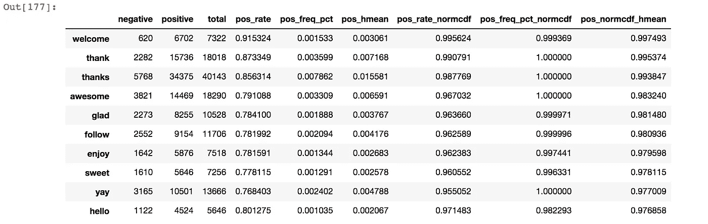

下一步是对每个单词的负频率进行同样的计算。

```
term_freq_df2['neg_rate'] = term_freq_df2['negative'] * 1./term_freq_df2['total']term_freq_df2['neg_freq_pct'] = term_freq_df2['negative'] * 1./term_freq_df2['negative'].sum()term_freq_df2['neg_hmean'] = term_freq_df2.apply(lambda x: (hmean([x['neg_rate'], x['neg_freq_pct']])                                                                if x['neg_rate'] > 0 and x['neg_freq_pct'] > 0                                                                else 0), axis=1)

term_freq_df2['neg_rate_normcdf'] = normcdf(term_freq_df2['neg_rate'])term_freq_df2['neg_freq_pct_normcdf'] = normcdf(term_freq_df2['neg_freq_pct'])term_freq_df2['neg_normcdf_hmean'] = hmean([term_freq_df2['neg_rate_normcdf'], term_freq_df2['neg_freq_pct_normcdf']])term_freq_df2.sort_values(by='neg_normcdf_hmean', ascending=False).iloc[:10]
```

现在让我们看看这些值是如何转换成一个图的。为了比较，我先画出 neg_hmean vs pos_hmean，以及 neg _ normcdf _ hme an vs pos _ normcdf _ hme an。

```
plt.figure(figsize=(8,6))
ax = sns.regplot(x="neg_hmean", y="pos_hmean",fit_reg=False, scatter_kws={'alpha':0.5},data=term_freq_df2)
plt.ylabel('Positive Rate and Frequency Harmonic Mean')
plt.xlabel('Negative Rate and Frequency Harmonic Mean')
plt.title('neg_hmean vs pos_hmean')
```

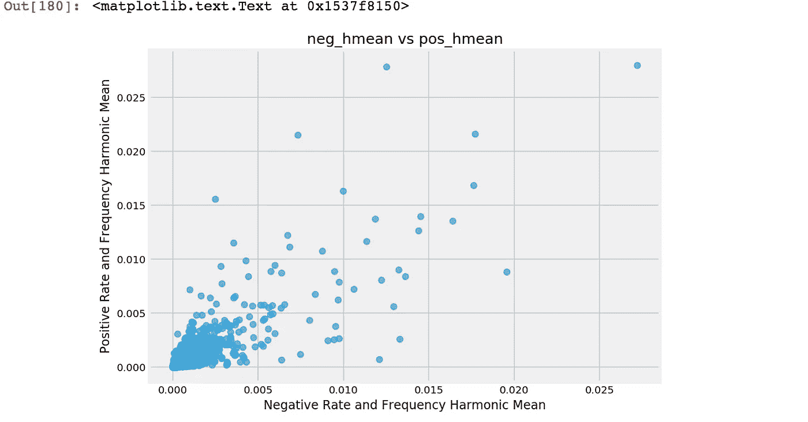

和刚才的正反频率差不了多少。CDF 调和平均值怎么样？

```
plt.figure(figsize=(8,6))
ax = sns.regplot(x="neg_normcdf_hmean", y="pos_normcdf_hmean",fit_reg=False, scatter_kws={'alpha':0.5},data=term_freq_df2)
plt.ylabel('Positive Rate and Frequency CDF Harmonic Mean')
plt.xlabel('Negative Rate and Frequency CDF Harmonic Mean')
plt.title('neg_normcdf_hmean vs pos_normcdf_hmean')
```

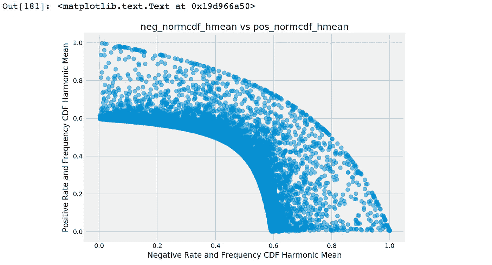

似乎速率 CDF 和频率 CDF 的调和平均值在图上创建了一个有趣的模式。如果一个数据点靠近左上角，它更为积极，如果靠近右下角，它更为消极。

这是一个很好的指标，它从频率中创造了一些有意义的洞察力，但是对于文本数据，将每个标记显示为一个点缺少关于每个数据点代表哪个标记的重要信息。对于 10，000 个点，很难在图上标注所有的点。对于这一部分，我尝试了几种方法，得出的结论是，直接在图上标注数据点不是很实际，也不太可行。

所以我采取了另一种方法，用散景进行交互式绘图。Bokeh 是 Python 的一个交互式可视化库，它以 D3.js 的风格创建图形。Bokeh 可以以 HTML 格式输出结果，也可以在 Jupyter 笔记本中输出结果。而下面是散景创造的剧情。

```
from bokeh.plotting import figure
from bokeh.io import output_notebook, show
from bokeh.models import LinearColorMapper
from bokeh.models import HoverTooloutput_notebook()
color_mapper = LinearColorMapper(palette='Inferno256', low=min(term_freq_df2.pos_normcdf_hmean), high=max(term_freq_df2.pos_normcdf_hmean))p = figure(x_axis_label='neg_normcdf_hmean', y_axis_label='pos_normcdf_hmean')p.circle('neg_normcdf_hmean','pos_normcdf_hmean',size=5,alpha=0.3,source=term_freq_df2,color={'field': 'pos_normcdf_hmean', 'transform': color_mapper})hover = HoverTool(tooltips=[('token','[@index](http://twitter.com/index)')])
p.add_tools(hover)
show(p)
```

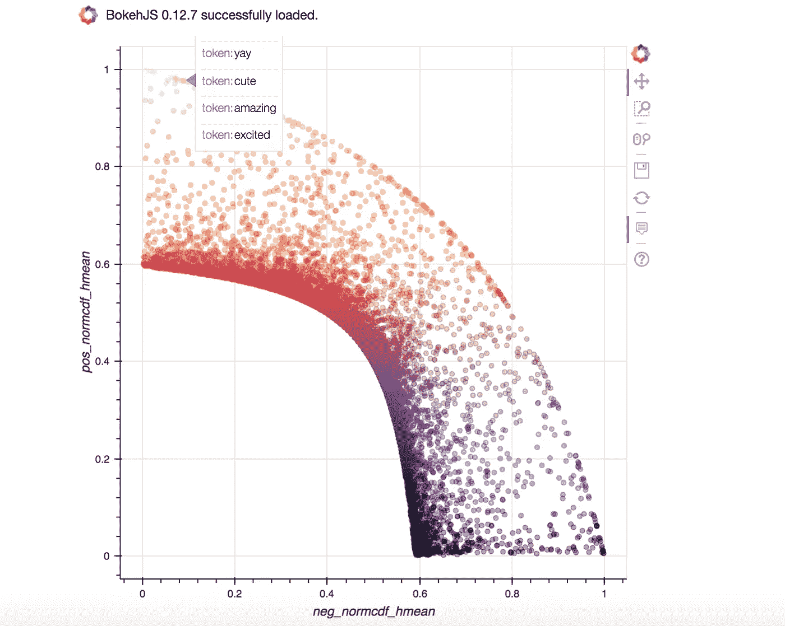

由于互动图不能插入到 Medium post 中，我附上了一张图片，但不知何故散景图也不能在 GitHub 上显示。所以我把这个分享给你可以访问的链接。

 [## 散景图

s3.eu-west-2.amazonaws.com](https://s3.eu-west-2.amazonaws.com/ricksimages/hover.html) 

有了上面的散景图，你可以通过将鼠标悬停在点上来查看每个数据点代表什么。例如，左上角的点表示“感谢”、“欢迎”、“祝贺”等。右下角的一些记号是“悲伤”、“伤害”、“死亡”、“疼痛”等等。而且每个点的颜色都是在 Python 中的“Inferno256”颜色图中组织的，所以黄色是最正的，而黑色是最负的，颜色随着从负到正逐渐从黑到紫到橙再到黄。

根据我稍后将使用哪个模型来对正面和负面推文进行分类，这个度量也可以派上用场。

项目的下一阶段是模型制作。在这种情况下，分类器会将每条推文分为正面或负面类别。我会继续通过媒体分享我的进步。

感谢您的阅读，您可以从下面的链接找到 Jupyter 笔记本。

[https://github . com/tthustle sa/Twitter _ 情操 _ 分析 _ part 3/blob/master/Capstone _ part 3-copy 2 . ipynb](https://github.com/tthustla/twitter_sentiment_analysis_part3/blob/master/Capstone_part3-Copy2.ipynb)