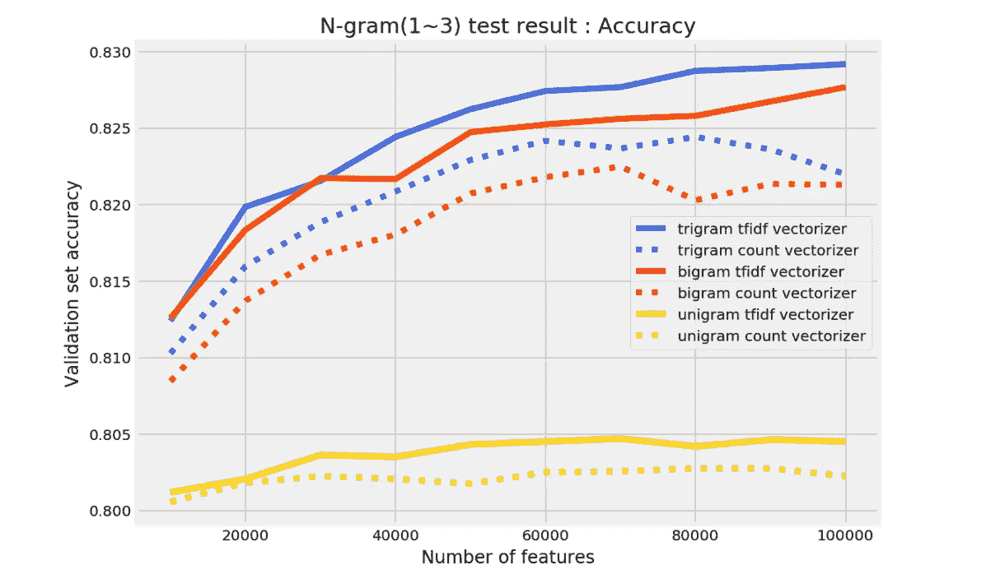
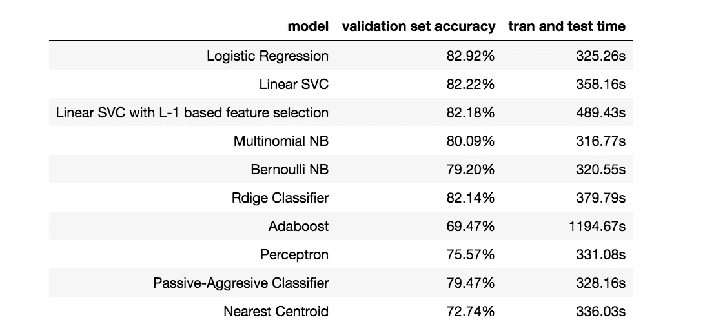
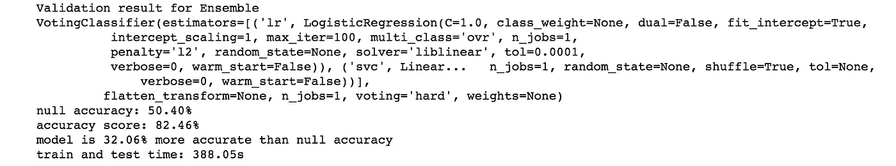
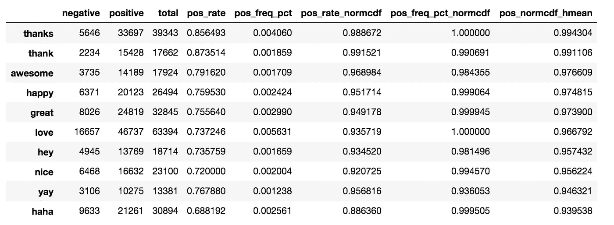

# 使用 Python 的另一个 Twitter 情感分析—第 5 部分(Tfidf 矢量器、模型比较、词汇方法)

> 原文：<https://towardsdatascience.com/another-twitter-sentiment-analysis-with-python-part-5-50b4e87d9bdd?source=collection_archive---------2----------------------->

Photo by [Nathaniel Shuman](https://unsplash.com/@nshuman1291?utm_source=medium&utm_medium=referral) on [Unsplash](https://unsplash.com?utm_source=medium&utm_medium=referral)

这是我正在进行的推特情感分析项目的第五部分。你可以从下面的链接找到以前的帖子。

*   [第一部分:数据清理](/another-twitter-sentiment-analysis-bb5b01ebad90)
*   [第二部分:EDA，数据可视化](/another-twitter-sentiment-analysis-with-python-part-2-333514854913)
*   [第三部分:齐夫定律，数据可视化](/another-twitter-sentiment-analysis-with-python-part-3-zipfs-law-data-visualisation-fc9eadda71e7)
*   [第四部分:特征提取(计数矢量器)、N-gram、混淆矩阵](/another-twitter-sentiment-analysis-with-python-part-4-count-vectorizer-b3f4944e51b5)

在上一部分中，我尝试使用计数矢量器来提取特征并将文本数据转换成数字形式。在这一部分，我将使用另一种称为 Tfidf 矢量器的特征提取技术。

# Tfidf 矢量器

TFIDF 是将文本数据转换为数字形式的另一种方式，是[词频-逆文档频](https://en.wikipedia.org/wiki/Tf%E2%80%93idf)的简称。它产生的向量值是这两项的乘积；TF 和 IDF。

我们先来看词频。我们已经用计数矢量器查看了词频，但是这一次，我们还需要一个步骤来计算相对频率。假设我们的语料库中有两个文档，如下所示。

1.  我喜欢狗
2.  我讨厌狗和编织

每个文档中每个术语的相对术语频率计算如下。

例如，如果我们计算文档 1 和文档 2 中“I”的相对词频，结果如下。

接下来，我们需要得到逆文档频率，它通过下面的计算来衡量一个单词对于区分每个文档的重要性。

如果我们计算“I”的逆文档频率，

一旦我们有了 TF 和 IDF 的值，现在我们可以计算 TFIDF 如下。

按照我们示例的情况，两个文档中术语“I”的 TFIDF 如下。

正如您所看到的，术语“I”在两个文档中出现的次数相同，TFIDF 得分为 0，这意味着该术语在区分文档时并没有真正提供信息。其余部分与计数矢量器相同，TFIDF 矢量器将计算文档中术语的得分，并将文本数据转换为数字形式。

一旦实例化了 Tfidf 矢量器，将 Tfidf 转换后的数据拟合到逻辑回归，并检查不同数量的特征的验证准确性。

在这篇文章中，当我提到代码块时，我会附上一个要点链接，而不是将整个代码作为片段直接粘贴在文章中，此外，你也可以从我将在这篇文章结尾分享的链接中找到整个 Jupyter 笔记本。

因为我也有来自计数矢量器的结果，我在以前的帖子中尝试过，我将它们一起绘制在同一个图形上进行比较。

从上面的图表中，我们可以看到，在计数矢量器和 TFIDF 矢量器中包含二元模型和三元模型提高了模型性能。对于每种从一元到三元的情况，TFIDF 都比计数矢量器产生更好的结果。

# 算法比较

我用逻辑回归得到的最好结果是通过使用包含多达 100，000 个特征(包括三元模型)的 TFIDF 矢量器。在这种情况下，我将首先拟合各种不同的模型，并比较它们的验证结果，然后将建立一个包含前 5 个模型的集成(投票)分类器。

考虑到数据的大小和模型的可扩展性，我没有包括一些计算量大的模型，如 KNN、随机森林。模型的微调将在我尝试其他不同的文本数据矢量化之后进行。

我不会详细解释每个模型是如何工作的，因为这不是这篇文章的目的。你可以在网上找到许多有用的资源，但如果我收到许多关于某个特定算法的问题或请求，我会尝试为所选的模型单独写一篇文章。

*(请注意，在下面的“classifier_comparator”函数中，我调用了另一个自定义函数“accuracy_summary ”,它报告与空精度相比的验证精度，以及训练和评估所用的时间。)*

比较的结果如下。

看起来逻辑回归是我表现最好的分类器。

集成分类器的结果如下，该集成分类器从来自上述结果的前 5 个模型(线性回归、线性 SVC、多项式 NB、岭分类器、被动-主动分类器)中获得投票。注意，我没有在投票分类器中包括“具有基于 L-1 的特征选择的线性 SVC”模型，因为它与线性 SVC 是相同的模型，除了它首先通过 L-1 正则化过滤掉特征，并且比较没有特征选择的线性 SVC 的结果显示出更好的结果。

投票分类器的验证集准确率为 82.47%，比单独的逻辑回归的 82.92%要差。

# 词汇法

我上面演示的是文本分类问题的机器学习方法，它试图通过在带标签的数据集上训练分类器来解决问题。另一个著名的情感分析方法是词汇法。在词汇方法中，情感的定义是基于对单个单词和/或短语的分析；经常使用情感词典:在文本中搜索词典中的情感词汇项，计算它们的情感权重，并应用一些聚合权重函数。”[http://www.dialog-21.ru/media/1226/blinovpd.pdf](http://www.dialog-21.ru/media/1226/blinovpd.pdf)

在本系列的[第 3 部分](/another-twitter-sentiment-analysis-with-python-part-3-zipfs-law-data-visualisation-fc9eadda71e7)中，我计算了“正率 CDF”和“正频率百分比 CDF”的调和平均值，这些给了我在语料库中正面和负面术语的良好表示。如果它成功地过滤了哪些术语对每个类是重要的，那么这也可以用于词汇方式的预测。

所以我决定做一个简单的预测器，利用我计算的谐波平均值。下面我将介绍术语频率的计算，以及获得‘pos _ normcdf _ hme an’的步骤，但这次我仅从训练集中计算术语频率。(*由于我了解到不需要将稀疏矩阵转换为密集矩阵来计算术语频率，所以我直接从稀疏矩阵计算频率)

如果你想更详细地了解我用来得出“pos_norcdf_hmean”最终值的公式，你可以在本系列的[第 3 部分](/another-twitter-sentiment-analysis-with-python-part-3-zipfs-law-data-visualisation-fc9eadda71e7)中找到。

我决定的积极性得分的计算相当简单明了。对于文档中的每个单词，在我构建词汇表的 10，000 个单词的列表中查找它，并获得相应的“pos_normcdf_hmean”值，然后为文档计算平均“pos_normcdf_hmean”值。如果从构建的 10，000 个术语中找不到任何单词，则产生范围在 0 到 1 之间的随机概率。我从一个文档中得到的单个值被处理为该文档是正类的概率。

通常情况下，词法方法会将许多其他方面纳入计算，以完善预测结果，但我将尝试一个非常简单的模型。

对于“pos_hmean”的平均值，我决定阈值为 0.56，这意味着如果“pos_hmean”的平均值大于 0.56，分类器将其预测为正类，如果它等于或小于 0.56，则将其预测为负类。由上述模型得到的结果为 75.96%。准确度不如使用计数矢量器或 TFIDF 矢量器的逻辑回归，但与 null 准确度相比，准确度高 25.56%，甚至与 TextBlob 情感分析相比，我的简单自定义词典模型的准确度高 15.31%。对于这样一个简单的计算来说，这是一个令人印象深刻的结果，并且还考虑到“pos_normcdf_hmean”仅使用训练集计算的事实。

在下一篇文章中，我将尝试实现 Doc2Vec，看看性能是否会变得更好。

感谢您的阅读，您可以通过下面的链接找到 Jupyter 笔记本。

[https://github . com/tthustle sa/Twitter _ 情操 _ 分析 _ part 5/blob/master/Capstone _ part 4-copy 3 . ipynb](https://github.com/tthustla/twitter_sentiment_analysis_part5/blob/master/Capstone_part4-Copy3.ipynb)