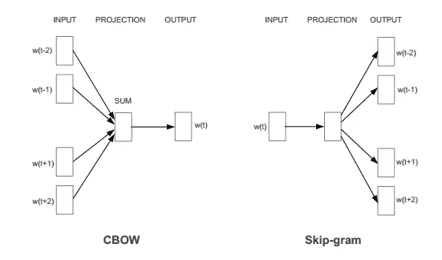
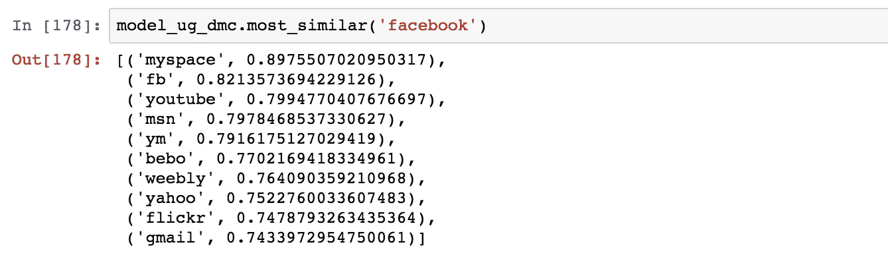
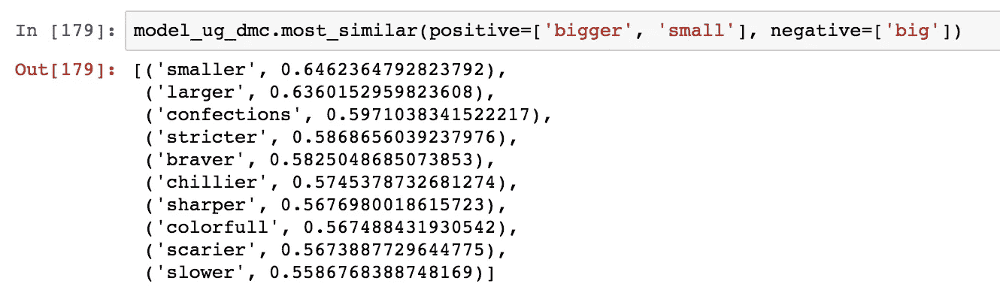
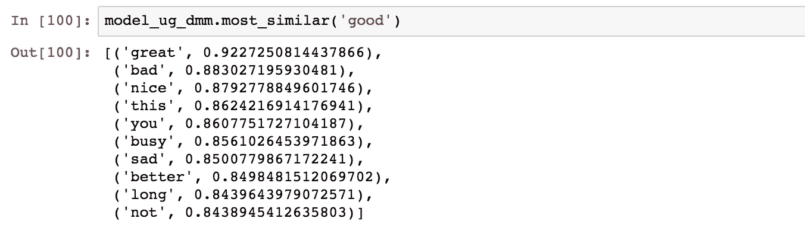

# 使用 Python 的另一个 Twitter 情感分析—第 6 部分(Doc2Vec)

> 原文：<https://towardsdatascience.com/another-twitter-sentiment-analysis-with-python-part-6-doc2vec-603f11832504?source=collection_archive---------1----------------------->

Photo by [Markus Winkler](https://unsplash.com/@markuswinkler?utm_source=medium&utm_medium=referral) on [Unsplash](https://unsplash.com?utm_source=medium&utm_medium=referral)

这是我正在进行的推特情感分析项目的第六部分。你可以从下面的链接找到以前的帖子。

*   [第一部分:数据清理](/another-twitter-sentiment-analysis-bb5b01ebad90)
*   [第二部分:EDA，数据可视化](/another-twitter-sentiment-analysis-with-python-part-2-333514854913)
*   [第三部分:齐夫定律，数据可视化](/another-twitter-sentiment-analysis-with-python-part-3-zipfs-law-data-visualisation-fc9eadda71e7)
*   [第四部分:特征提取(计数矢量器)、N-gram、混淆矩阵](/another-twitter-sentiment-analysis-with-python-part-4-count-vectorizer-b3f4944e51b5)
*   [第 5 部分:特征提取(Tfidf 矢量器)、机器学习模型比较、词法方法](/another-twitter-sentiment-analysis-with-python-part-5-50b4e87d9bdd)

*除了我将附上的简短代码块，你可以在这篇文章的末尾找到整个 Jupyter 笔记本的链接。

在我们跳到 doc2vec 之前，先提一下 word2vec 会比较好。Word2vec 是一组用于产生单词嵌入的相关模型。这些模型是浅层的两层神经网络，经过训练可以重建单词的语言上下文。”

Word2vec 不是一个单一的算法，而是由两种技术组成——CBOW(连续单词包)和 Skip-gram 模型。这两种技术都学习作为单词向量表示的权重。对于语料库，CBOW 模型从周围上下文单词的窗口中预测当前单词，而 Skip-gram 模型在给定当前单词的情况下预测周围上下文单词。在 Gensim 包中，在实现 Word2Vec 时，可以通过传递参数“sg”来指定是使用 CBOW 还是 Skip-gram。默认情况下(sg=0)，使用 CBOW。否则(sg=1)，使用 skip-gram。

例如，假设我们有下面的句子:“我喜欢狗”。当给定“我”、“狗”作为输入时，CBOW 模型试图预测单词“爱”，另一方面，当给定单词“爱”作为输入时，Skip-gram 模型试图预测“我”、“狗”。

下图更正式地展示了这两个模型是如何工作的。

但是，用作单词向量的实际上不是这些模型的预测结果，而是经过训练的模型的权重。通过提取权重，这样的向量以某种抽象的方式来表示单词的“含义”。如果想更详细的了解 word2vec 模型是如何工作的，有一篇[欣荣(2016)](https://arxiv.org/pdf/1411.2738.pdf) 的很棒的论文，详细的讲解了模型的每一步。

那 doc2vec 是什么？Doc2vec 使用与 word2vec 相同的逻辑，但是将其应用于文档级。根据 [Le 和 Mikolov(2014)](https://cs.stanford.edu/~quocle/paragraph_vector.pdf) ，“每个段落被映射到一个唯一的向量，由矩阵 D 中的一列表示，每个单词也被映射到一个唯一的向量，由矩阵 w 中的一列表示。段落向量和单词向量被平均或连接以预测上下文中的下一个单词……段落标记可以被认为是另一个单词。它起到了记忆的作用，记住了当前上下文或者段落主题中缺少的内容。”

DM:这是类似于 Word2vec 中 CBOW 模型的 Doc2Vec 模型。段落向量是通过在基于上下文单词和上下文段落推断中心单词的任务上训练神经网络而获得的。

DBOW:这是 Doc2Vec 模型对 Word2Vec 中的 Skip-gram 模型的模拟。段落向量是通过训练神经网络来获得的，该神经网络的任务是在给定从段落中随机采样的单词的情况下，预测段落中单词的概率分布。

我使用 Python 库 Gensim 实现了 Doc2Vec 模型。在 DM 模型的情况下，我实现了平均方法和连接方法。这是受[乐和 Mikolov (2014)](https://cs.stanford.edu/~quocle/paragraph_vector.pdf) 的研究论文的启发。在他们的论文中，他们用两种不同的方法实现了 DM 模型，一种是平均计算过程，另一种是串联计算方法。这在 [Gensim 的教程](https://github.com/RaRe-Technologies/gensim/blob/develop/docs/notebooks/doc2vec-IMDB.ipynb)中也有展示。

以下是我用来获取每条推文向量的方法。

1.  分布式单词包
2.  分布式存储器级联
3.  分布式存储装置
4.  DBOW + DMC
5.  DBOW + DMM

利用从上述模型中获得的向量，我拟合了一个简单的逻辑回归模型，并在验证集上评估了结果。

作为准备，除了加载所需的依赖项，我们还需要使用 Gensim 的 LabeledSentence 函数用唯一的 id 标记每条 tweet。

为了训练 Doc2Vec，我使用了整个数据集。这背后的基本原理是 doc2vec 训练是完全无人监督的，因此没有必要保留任何数据，因为它是未标记的。这一基本原理的灵感来自于 [Lau 和 Baldwin (2016)](https://arxiv.org/pdf/1607.05368.pdf) 在他们的研究论文《doc2vec 的实证评估与文档嵌入生成的实际见解》中的基本原理

同样的基本原理也应用于 [Gensim 的 Doc2Vec 教程](https://github.com/RaRe-Technologies/gensim/blob/develop/docs/notebooks/doc2vec-IMDB.ipynb)。在 IMDB 教程中，向量训练发生在数据集的所有文档上，包括所有训练/测试/开发集。

## 分布式单词包

我们先训练纯 DBOW 模型。请注意，由于其训练方式，DBOW 模型不会在单词级别产生任何有意义的向量。但是当我们谈到分布式内存模型时，我们也要看看单词向量。

据 Gensim 的开发者拉迪姆·řehůřek 说，“这种算法运行方式的一个警告是，由于学习率在数据迭代过程中下降，在训练期间只在单个带标签的句子中看到的标签将以固定的学习率进行训练。这经常产生不太理想的结果。”

下面的迭代实现了带有附加混洗的显式多遍 alpha 缩减方法。这已经在 Gensim 的 IMDB 教程中介绍过了。

在上面的代码块中，我还定义了一个函数“get_vectors”来从训练好的 doc2vec 模型中提取文档向量，这个函数也将在其他 doc2vec 模型中重用。

用逻辑回归在验证集上测试的准确度是 73.89%。尽管 DBOW 模型不学习单个单词的含义，但作为输入到分类器的特征，它似乎正在完成它的工作。

但它似乎没有胜过计数矢量器或 Tfidf 矢量器(Tfidf 矢量器具有 100，000 个特征，使用逻辑回归的验证集准确率为 82.92%)。

## 分布式存储器串联

现在让我们转到分布式内存模型，看看它是如何执行的。我将首先尝试用串联法进行训练。

不幸的是，验证集上的准确率是 66.47%，这有点令人失望。但这并不意味着该模型未能在单词级别学习到有效的向量表示。

通过在训练后查看与“facebook”相似的单词，看起来该模型恰当地抓住了 SNS，web 服务的含义。此外，该模式还成功地捕捉到了“小”的比较级形式，即“大”和“更大”。上面的代码行就像要求模型将与单词“bigger”和“small”相关联的向量相加，同时减去“big”等于顶部的结果，“small”。

## 分布式存储装置

我们试试另一种训练 DM 模型的方法。

验证集准确率为 72.56%，远优于 DMC 模型，略低于 DBOW 模型。我们也来看看它学到了什么。

看起来它已经很好地理解了“好”的含义，模型为“好”选择的最相似的词是“太好了”。太好了！

## 组合模型

由于我有来自三个不同模型的文档向量，现在我可以将它们连接起来，看看它是如何影响性能的。下面我定义了一个简单的函数来连接来自不同模型的文档向量。

DBOW + DMC 模型的验证集准确率为 74.58%，比纯 DBOW 模型(73.89%)有所提高。让我们试试另一种组合。

这次通过将 DBOW 和 DMM 结合在一起，我得到了 75.51%的验证集准确率。

对于 unigram，我了解到以不同的组合连接文档向量可以提高模型性能。我从单一模型得到的最好的验证准确率是 DBOW 的 73.89%。通过连接向量，我用 DBOW+DMM 模型得到了 75.51%的最高验证准确率。

在下一篇文章中，我将看看使用 Gensim 的短语建模，并将其应用于 Doc2Vec，看看这是否会影响性能。

感谢您的阅读，您可以通过下面的链接找到 Jupyter 笔记本。

[https://github . com/tthustle a/Twitter _ 情操 _ 分析 _ part 6/blob/master/Capstone _ part 4-copy 4 . ipynb](https://github.com/tthustla/twitter_sentiment_analysis_part6/blob/master/Capstone_part4-Copy4.ipynb)