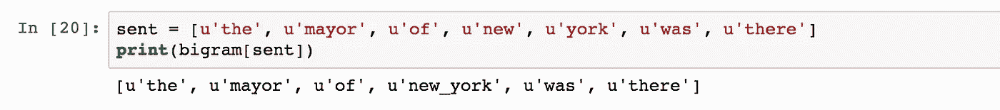
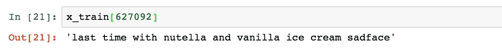
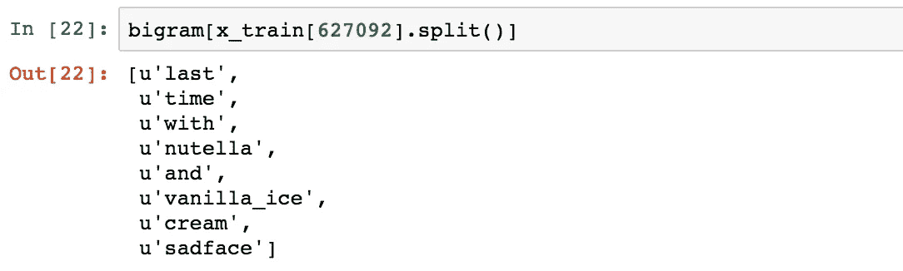
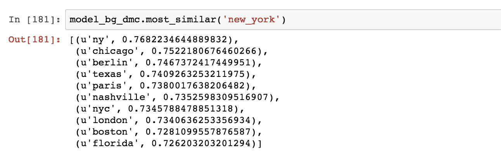
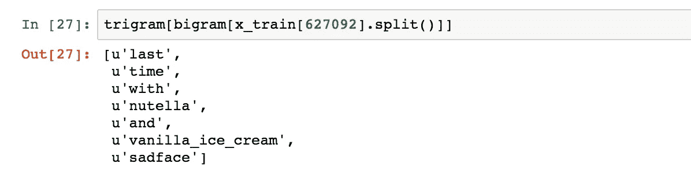
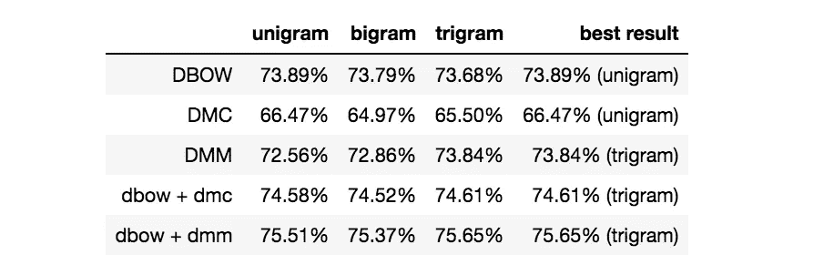

# 使用 Python 的另一个 Twitter 情感分析—第 7 部分(短语建模+ Doc2Vec)

> 原文：<https://towardsdatascience.com/another-twitter-sentiment-analysis-with-python-part-7-phrase-modeling-doc2vec-592a8a996867?source=collection_archive---------3----------------------->

Photo by [Raphael Schaller](https://unsplash.com/@raphaelphotoch?utm_source=medium&utm_medium=referral) on [Unsplash](https://unsplash.com?utm_source=medium&utm_medium=referral)

这是我正在进行的推特情感分析项目的第 7 部分。你可以从下面的链接找到以前的帖子。

*   [第一部分:数据清理](/another-twitter-sentiment-analysis-bb5b01ebad90)
*   [第二部分:EDA，数据可视化](/another-twitter-sentiment-analysis-with-python-part-2-333514854913)
*   [第三部分:齐夫定律，数据可视化](/another-twitter-sentiment-analysis-with-python-part-3-zipfs-law-data-visualisation-fc9eadda71e7)
*   [第四部分:特征提取(计数矢量器)、N-gram、混淆矩阵](/another-twitter-sentiment-analysis-with-python-part-4-count-vectorizer-b3f4944e51b5)
*   [第 5 部分:特征提取(Tfidf 矢量器)、机器学习模型比较、词法方法](/another-twitter-sentiment-analysis-with-python-part-5-50b4e87d9bdd)
*   [第 6 部分:Doc2Vec](/another-twitter-sentiment-analysis-with-python-part-6-doc2vec-603f11832504)

在上一篇文章中，我实现了 Doc2Vec，并用从 Doc2Vec 模型中获得的文档向量尝试了一个简单的逻辑回归。不幸的是，在情感分析任务中，100 维文档向量并没有胜过 100，000 维 Tfidf 特征。这一次，我将尝试短语建模，看看能否进一步提高 Doc2Vec 向量的性能。

*除了我将附上的简短代码块，你可以在这篇文章的末尾找到整个 Jupyter 笔记本的链接。

# 短语建模

另一件可以用 Gensim 库实现的事情是短语检测。它类似于 n-gram，但它不是通过滑动窗口来获得所有的 n-gram，而是检测经常使用的短语并将它们粘在一起。

这已经由 [Mikolov 等人介绍过了。al (2013)](https://papers.nips.cc/paper/5021-distributed-representations-of-words-and-phrases-and-their-compositionality.pdf) ，并且提出学习短语的向量表示，该短语具有不是其单个单词的意思的简单组合的意思。"这样，我们可以在不增加词汇量的情况下形成许多合理的短语."

[Patrick Harrison](https://youtu.be/6zm9NC9uRkk) 在 2016 年 DC PyData 大会上也对 Gensim 的短语建模进行了非常直观的解释。

下面的公式简单地表达了短语建模。

其中:

*   count(A)是 token (token 是 NLP 字段中词汇或单词的另一个单词)在语料库中出现的次数
*   count(B)是记号 B 在语料库中出现的次数
*   count(A B)是单词 A B 在语料库中按顺序出现的次数
*   n 是语料库词汇的总大小
*   count_min 是用户定义的参数，用于确保接受的短语出现的次数最少(Gensim 的短语函数中的默认值为 5)
*   threshold 是一个用户定义的参数，用于控制模型在接受两个单词作为短语之前需要它们之间的关系有多强(Gensim 的短语函数中使用的默认阈值是 10.0)

好，让我们看看这实际上是如何工作的。

现在我们有了一个二元模型，它将检测两个单词的常用短语，并将它们粘在一起。例如，假设我们有一个句子“纽约市长在那里”，看看如果我们将这个句子输入到 bigram 短语模型中会发生什么。

从上面的例子可以看出，通过 tweets 语料库，它已经学会了“纽约”这个常用短语。所以现在给“bigram”输入分隔“new”和“york”的标记，它会自动把它们组合成一个单词“new_york”。

让我们用 tweet 数据集中的一个训练数据来测试二元模型。以下是推文原文。(是的，这的确非常令人难过)

如果我们把这句话输入二元模型，

我们可以看到二元模型已经将“vanilla_ice”识别为一个短语。但如果它只能抓到“香草 _ 冰”而抓不到“香草 _ 冰淇淋”，那么有时候“香草 _ 冰”可以是别的意思。

我稍后将回到这一点。

现在让我们用这个二元模型来转换我们的语料库。

在我获得检测到二元语法短语的语料库后，我经历了与 unigram 相同的 Doc2Vec 过程。

## 检测到二元模型的分布式单词包

在下面的代码块中，你会发现一些在没有导入的情况下使用的依赖项，以及自定义的函数“get_vectors”。你可以在这篇文章的最后找到 Jupyter 笔记本的完整版本。

关于验证的准确性，我将在后面向您展示直到 trigram 之前尝试过的所有 doc2vec 模型。

## 检测到带有 bigram 的 DMC(分布式内存连接)

与 DBOW 模型不同，DM 模型也可以学习每个单词有意义的语义向量表示。

因为现在我们有二元短语检测语料库，如果我们寻找与“纽约”最相似的词，模型说它是“纽约”，这非常令人惊讶，你也可以看到其他城市名称，如“芝加哥”、“柏林”等。

## 检测到带有二元模型的 DMM(分布式内存装置)

## 组合模型

和我在上一篇文章中所做的一样，我尝试了两种组合模型:DBOW + DMC，DBOW + DMM。你可以在我最后分享的 Jupyter 笔记本里找到代码。

# 三元模型

如果我们在二元模型检测的语料库上再次运行相同的短语检测，现在它将检测三元模型短语。

终于！香草冰淇淋！

我再次用 trigram detected 语料库运行了三个不同的 doc2vec 模型，下面是我用不同的 doc2vec 模型从 unigram 到 trigram 得到的结果。

我能得到的最好的验证精度来自 dbow+dmm 模型。

DMM 模型往往随着 n-gram 的增加而表现更好，而纯 DBOW 模型往往随着 n-gram 的增加而表现更差。组合的模型是(即 dbow +dmc)和(dbow +dmm)用二元模型产生较低的结果，用三元模型产生较高的结果，但是考虑到这些差异都在小数位，可能很难说短语检测对组合的模型结构有影响。(请注意，这是在这种特定环境下的经验发现，但如果你想用你选择的语料库尝试这一点，我肯定想知道这是否在不同的情况下成立。)

在我进入下一步之前，我想再做一件事，那就是创建跨不同 n 元文法的联合向量。通过查看上表，对于 DBOW 模型，unigram 表现最佳，因此我将使用来自 unigram DBOW 模型的向量，并将其与 trigram DMM 向量结合在一起。

“unigram DBOW + trigram DMM”模型的验证准确性为 75.76%，略好于“trigram DBOW + DMM”模型，但差异仍然在小数点位置，我不确定是否可以说这是一个显著的改进。

在下一篇文章中，我将使用来自 Doc2Vec 和 Tfidf 稀疏矩阵的向量实现神经网络模型，并将结果与简单的逻辑回归进行比较。

感谢您的阅读，您可以通过下面的链接找到 Jupyter 笔记本。

[https://github . com/tthustle sa/Twitter _ 情操 _ 分析 _ part 7/blob/master/Capstone _ part 4-copy 5 . ipynb](https://github.com/tthustla/twitter_sentiment_analysis_part7/blob/master/Capstone_part4-Copy5.ipynb)