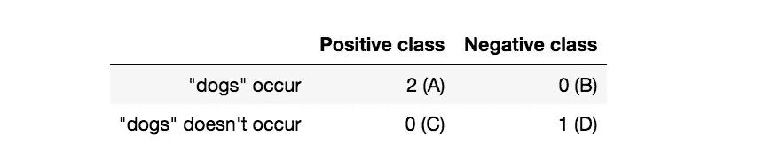
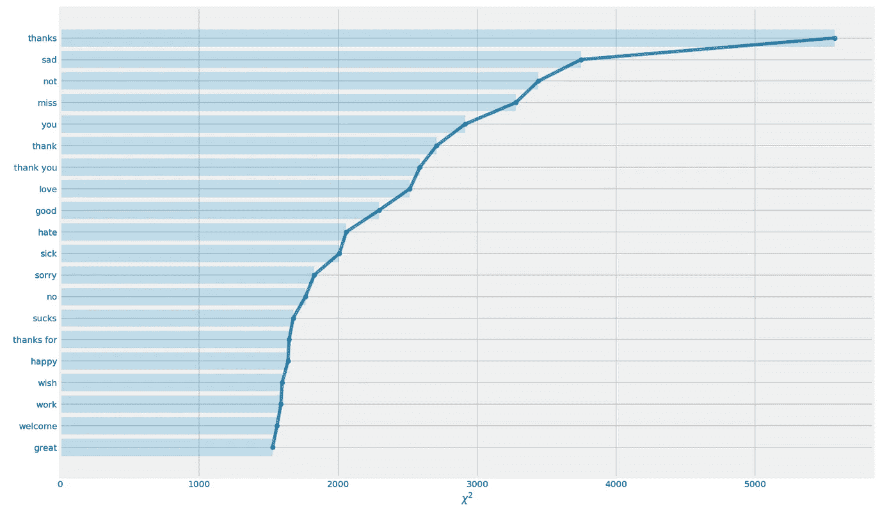
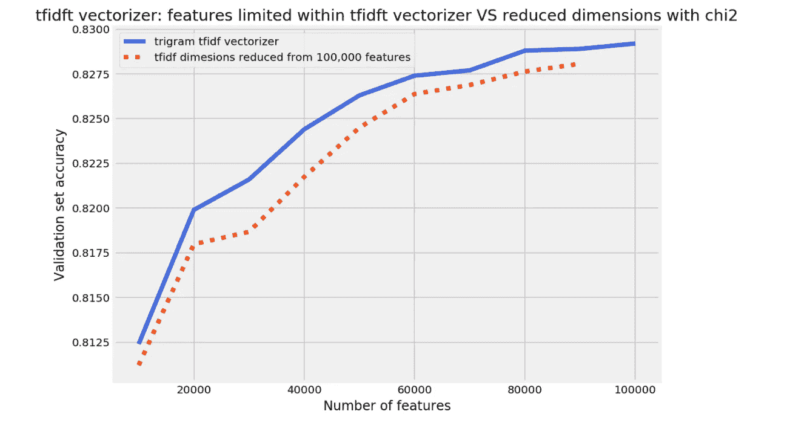
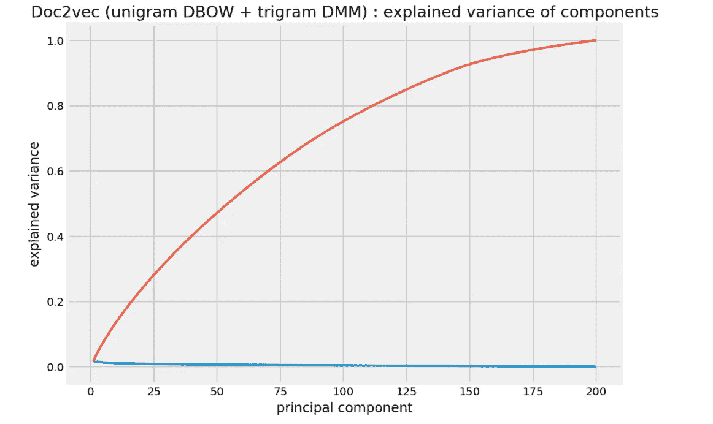

# 用 Python 进行的另一个 Twitter 情感分析—第 8 部分(降维:Chi2，PCA)

> 原文：<https://towardsdatascience.com/another-twitter-sentiment-analysis-with-python-part-8-dimensionality-reduction-chi2-pca-c6d06fb3fcf3?source=collection_archive---------2----------------------->

Photo by [Markus Spiske](https://unsplash.com/@markusspiske?utm_source=medium&utm_medium=referral) on [Unsplash](https://unsplash.com?utm_source=medium&utm_medium=referral)

这是我正在进行的推特情感分析项目的第 8 部分。你可以从下面的链接找到以前的帖子。

*   [第一部分:数据清理](/another-twitter-sentiment-analysis-bb5b01ebad90)
*   [第二部分:EDA，数据可视化](/another-twitter-sentiment-analysis-with-python-part-2-333514854913)
*   [第三部分:齐夫定律，数据可视化](/another-twitter-sentiment-analysis-with-python-part-3-zipfs-law-data-visualisation-fc9eadda71e7)
*   [第四部分:特征提取(计数矢量器)、N-gram、混淆矩阵](/another-twitter-sentiment-analysis-with-python-part-4-count-vectorizer-b3f4944e51b5)
*   [第 5 部分:特征提取(Tfidf 矢量器)、机器学习模型比较、词法方法](/another-twitter-sentiment-analysis-with-python-part-5-50b4e87d9bdd)
*   [第 6 部分:Doc2Vec](/another-twitter-sentiment-analysis-with-python-part-6-doc2vec-603f11832504)
*   [第七部分:短语建模+ Doc2Vec](/another-twitter-sentiment-analysis-with-python-part-7-phrase-modeling-doc2vec-592a8a996867)

在上一篇文章中，我已经将短语建模与 doc2vec 模型结合起来，并看到验证准确性略有提高，我将继续讨论神经网络，看看 ANN 如何提高性能。但是我决定绕道而行，尝试对我从 Tfidf 矢量器和 Doc2Vec 矢量获得的特征进行降维。

到目前为止，在特征提取方面，我尝试了三种不同的方法:count vectorizer、Tfdif vectorizer、doc2vec。我得到的最好的验证结果如下。

分类器:逻辑回归(L2 正则化，正则化强度:1.0)

*   计数矢量器(80，000 个特征，n 元语法范围:1，2，3，停用词移除:X) — 82.44%
*   tfidf 矢量器(100，000 个特征，n 元语法范围:1，2，3，停用词移除:X) — 82.92%
*   Doc2Vec (unigram DBOW + trigram DMM:每条推文的 200 维向量总数)— 75.76%

除此之外，我还使用词法方法自定义了分类器。

*   自定义词典分类器(决策阈值设置为 0.56) — 75.96%

除了词法方法之外，模型所需的特征数量似乎相当大，所以我决定看看是否可以减少 Tfidf 矢量器和 doc2vec 矢量的特征维数。Doc2Vec 模型中的矢量为 200 维，与 Tfidf 矢量器的 100，000 个特征相比，听起来非常小。但是这 200 维向量是全实数的稠密矩阵，而 10 万个特征是零很多的稀疏矩阵。因此，在计算方面，Doc2Vec 向量也需要一些时间来计算。因此，如果我可以减少维度，那么它将有助于运行模型的超参数调整的各种设置。

首先，让我们尝试使用卡方特征选择对 Tfidf 向量进行降维。

*除了我将附上的简短代码块，你可以在这篇文章的末尾找到整个 Jupyter 笔记本的链接。

# Chi2 特征选择

在 Scikit-learn 库中，有三种方法可用于稀疏矩阵的特征选择，如 Tfidf 向量或计数向量。通过查看文档，您可以看到 chi2、mutual_info_regression、mutual_info_classif 将在不使数据密集的情况下处理数据。在我的情况下，我有 150 万条推文，并希望从 10 万个特征中减少维度，因此将其转换为密集矩阵不是一个选项。它不适合我的内存。

卡方统计测量特征(在这种情况下，推文中的一个术语)和类别(推文是正面还是负面)之间缺乏独立性。

你可以首先把一条推文中的一个术语和这条推文所属的类别之间的关系想象成一个列联表。列联表只是显示频率分布的表的一个花哨的词。

假设我们的语料库中有如下三个句子。

1.  我喜欢狗
2.  我讨厌狗
3.  我喜欢狗和烹饪

假设每条推文的情绪等级是积极的，消极的，积极的。(顺便说一句，我喜欢狗和烹饪，也喜欢猫)

让我们将' *t* '定义为我们正在查看的特定术语，在本例中为“狗”，将' *c* '定义为类，因为该类只有两个类，所以它将是 1(正)或 0(负)。使用列联表，其中 A 为' *t* 发生的次数， *c* 为正，B 为' t '发生的次数，【C】为负，C 为' *t* 未发生的次数， *c* 为正，最后 D 为' *t* 未发生的次数， *c* 为负。现在我们准备计算卡方统计量。

其中 *N* 是样本总数，术语“狗”的卡方得分是 3！由于卡方测量的是特征和类之间缺乏独立性，如果某个特征与其他特征相比具有较高的卡方得分，则意味着该特征对于预测类是有用的。

我将首先将训练数据转换为 100，000 个特征的 Tfidf 向量，并查看 chi2 选择了哪些特征作为有用的特征。让我们把我们得到的分数画在图上，看看哪些单词特征对预测有用。我将在下面的图表中只列出前 20 个特征，但是只要你的电脑屏幕允许，你可以尽可能多的列出来。

chi2 选择的最有用的特征是“谢谢”这个词，我假设这主要来自于积极的推文。它选择的第二个最有用的特征是“悲伤”这个词，这次我猜它来自负面推文。如果考虑 chi2 是如何计算的，它不仅在预测正类的术语上得分高，而且在预测负类的术语上得分高。

既然现在我们已经了解了 chi2 特征选择是如何工作的，那么让我们将维度减少到不同数量的特征，并检查验证集的准确性。

还有一件事。当您拟合和转换语料库时，Tfidf 矢量器可以首先限制特征的数量。我想比较相同特征数量下的验证准确性:1)当特征数量受到 Tfidf 矢量化阶段的限制时，2)当使用 chi2 统计将特征数量从 100，000 个特征减少时。

*在下面的代码块中，我绘制了我在不同的 max 特性上运行 Tfidf 矢量器得到的结果，你也可以在本文末尾的 Jupyter 笔记本上找到完整的代码。

在上图中，红色虚线是来自降维的验证集精度，蓝色线是拟合 Tfidf 矢量器时首先限制特征数量的结果。我们可以看到，使用 Tfidf 矢量器首先限制要素的数量比从较大的要素中减少维度会产生更好的结果。这不是一个笼统的说法，而是我在这个特定背景下的发现。如果你在其他语料库中有不同的结果，我很想知道它有什么不同。

# 主成分分析

PCA 是一种降维工具，可用于将一大组变量降维为一个仍包含原始集合中大部分信息的小集合。这听起来很酷，你可以减少数据的特征，但不能保留大部分需要的信息。但是如果你尝试过谷歌搜索“PCA”，你可能会知道它会给你返回所有听起来很难的术语，如“特征值”、“特征向量”、“矩阵投影”等。

在这篇文章中，我不会详细介绍 PCA 实际上是如何计算的，但会尽量保持直观的水平，这样任何阅读这篇文章的人都可以理解它的基础知识，并用 Python 实现。

PCA 所做的是转换坐标系，使坐标轴成为我们整体数据的最简洁、信息最丰富的描述符。

上图摘自[徐萌在 PCA](http://mengnote.blogspot.co.uk/2013/05/an-intuitive-explanation-of-pca.html) 上的博客文章。我发现徐萌的解释非常有助于直观地理解这个概念。您在图(A)中看到的形状是三维的，但如果我们关注数据的形状，而不是轴，形状本身就是平面的二维表面。通过运行 PCA，我们为数据找到新的坐标，这将最好地描述数据是如何形成的。第一个主成分是解释数据中最大差异的成分。在图(B)中，我们看到通过绘制“组件 1”线，它能够保留最分散的数据点的信息。通过添加“成分 2”行，这条“成分 2”行解释了我们数据中的第二大差异。下一步是将原始数据转换到我们新发现的轴上，这个轴是二维的，而不是原来的三维。图(C)中的最终结果给了我们一个很好的画面，展示了即使我们已经放弃了第三维，数据是如何仅用二维来形成的。

并且在实现数据的这种变换时使用特征向量和特征值。特征向量指定通过原始坐标空间的方向，而特征值指示其对应特征向量方向上的变化量。

如果你想更深入地了解 PCA 的概念，还有一些我觉得有用的博客文章。

*   [Victor Powell 的一篇博客文章:“主成分分析”](http://setosa.io/ev/principal-component-analysis/)(你可以操纵和摆弄二维或三维的数据点，这将极大地帮助你直观地理解主成分分析的作用)
*   [George Dallas 的博客文章:《主成分分析 4 个假人:特征向量、特征值和降维》](https://georgemdallas.wordpress.com/2013/10/30/principal-component-analysis-4-dummies-eigenvectors-eigenvalues-and-dimension-reduction/)(他已经成功解释了这个概念，没有一个数学公式，难以置信)

接下来，让我们尝试用 PCA 降低 doc2vec 向量的维数。我们还可以将结果绘制在图表上，看看将特征的数量减少到一个较小的主成分集是否可行，以及给定数量的主成分可以解释多少关于原始特征的方差。

在上图中，红线代表累计解释方差，蓝线代表每个主成分的解释方差。通过看上面的图表，尽管红线不是完美的直线，但非常接近直线。这样好吗？不。这意味着每个主成分对方差解释的贡献几乎相等，基于主成分分析降低维度没有多大意义。这一点从蓝线也可以看出来，蓝线非常接近底部的一条直线。

有点令人失望的是，在我处理 tweets 文本数据的具体案例中，维数约减并没有太大的帮助。当首先使用 Tfidf 矢量器限制特征时，Tfidf 矢量显示出比随后降低维度更好的结果，并且 doc2vec 矢量似乎通过其 200 维特征空间携带大致相似的信息量。

同样，这不是一个普遍的说法，这只是我用我的特殊数据发现的。特别是主成分分析，当它应用于数字特征时，我看到它成功地将数据的维度从 100 个或更多的特征减少到大约 10 个特征，同时能够解释 90%的数据差异。

如果您对这篇文章的神经网络建模有所期待，很抱歉我不得不绕道而行，但在下一篇文章中，我肯定会进行神经网络建模。一如既往的感谢您的阅读。

您可以通过以下链接找到 Jupyter 笔记本:

[https://github . com/tthustle a/Twitter _ 情操 _ 分析 _ part 8/blob/master/Capstone _ part 4-copy 6 . ipynb](https://github.com/tthustla/twitter_sentiment_analysis_part8/blob/master/Capstone_part4-Copy6.ipynb)