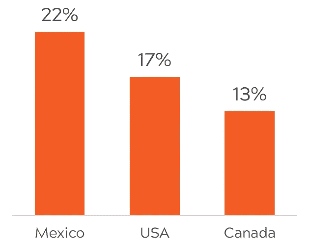
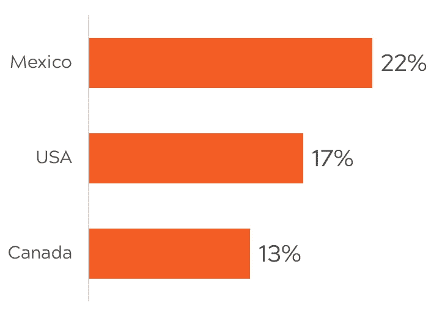
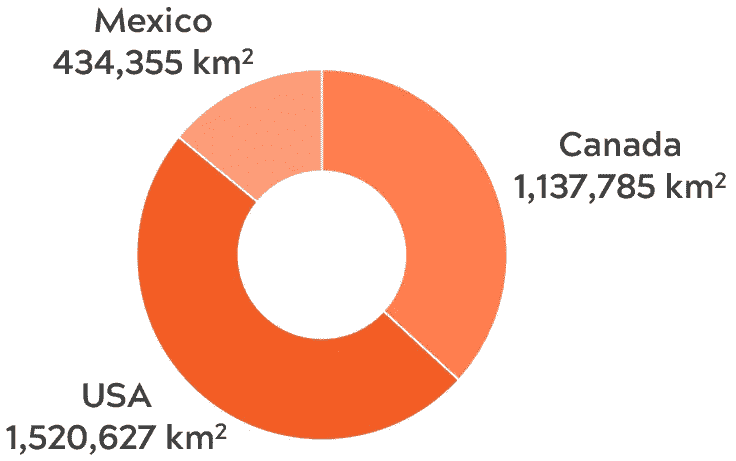
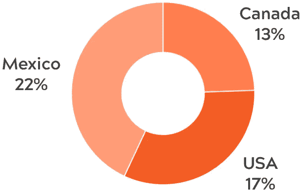
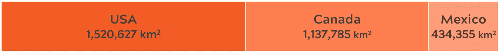
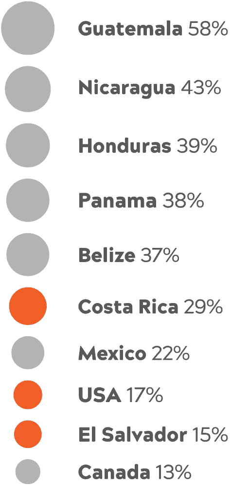
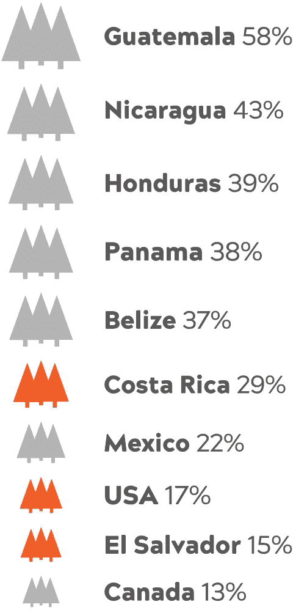
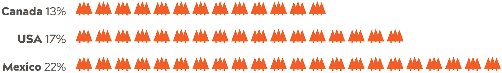
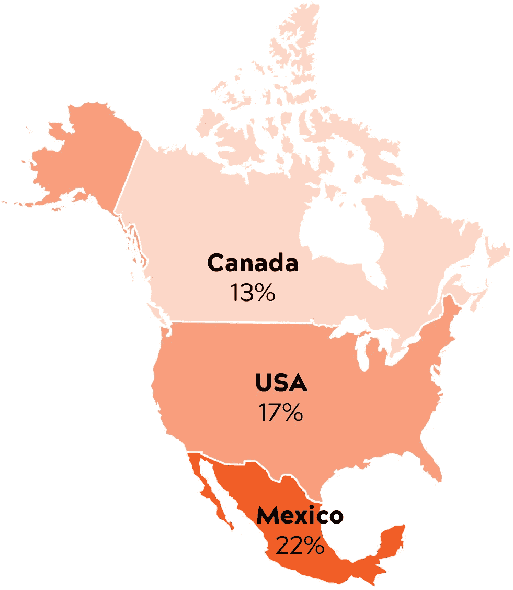

# 除了条形图之外的任何东西:条形图的 10 个最佳替代品

> 原文：<https://towardsdatascience.com/anything-but-bars-the-10-best-alternatives-to-bar-graphs-fecb2aaee53a?source=collection_archive---------1----------------------->

如果你想展示一个对比，但又不能画出另一个条形图，该怎么办？

这个问题我不是随便问的。条形图或折线图可以说明绝大多数数据；他们是 dataviz 世界的两大主力。

但是说实话:一个接一个的条形图让*厌烦*。这时你就想有一两个备选方案。

这里有 10 个最好的方法来用条形图展示没有 T5 的比较*。*

# 为什么我们如此频繁地使用条形图

最常见的图表类型——折线图、条形图和饼图——之所以常见是有原因的。

每种图形类型都专门讲述一个特定类型的故事。线形图显示了**随时间变化的趋势**。饼状图(以及它们的甜甜圈兄弟)显示了整体的**部分。当涉及到**比较**时，条形图真正闪耀。**

条形图利用了人类判断距离的自然能力。我们很擅长确定哪种形状最长，以及最长多少。条形图通过用矩形代替数字来利用这种能力。

折线图、条形图和饼图很常见，因为它们是描述每种故事类型的最简单、最有效的方式。

# 场景:比较一个变量的值

我有时会参加由 Olga Tsubiks 领导的项目[事业数据挑战](http://www.olgatsubiks.com/data-for-a-cause)，该项目让数据可视化人员处理非营利和事业驱动的数据。他们最近特别报道了环境署关于保护区的数据。因为我最近一直在处理数据，所以我想用它作为今天的例子。

该数据集覆盖了全球数十万个保护区，每个保护区都有详细的位置、面积、治理等信息。

像这样显示多方面数据的方法有很多，但今天我们保持简单。我们只是比较一下每个北美国家有多少被划入保护区。(为了便于计算，我忽略了跨越国界的海洋保护区和公园。)

我们的条形图非常简单:三个国家的三个数字。从占总面积的百分比来看，墨西哥似乎在北美留出了最多的土地，其次是美国和加拿大。

条形图完成了工作，但它可能更令人兴奋。让我们看看还能利用这些数据做些什么。

# 1.行图表

*“等一下，”*你可能会说，“*这张图看起来非常熟悉。”*

你是对的。条形图基本上是旋转了 90 度的条形图。但这并不完全是欺骗。这种微妙的变化可能会派上用场。

如果您的数据标签有点长，比如说您想拼出“美利坚合众国”，垂直条形图将很快用尽空间。Excel 通常将标签切换到垂直或对角线方向，但这两种方向都很难阅读。

行图表解决了这个问题，它提供了更多的布局灵活性，同时保持了条形图粗犷的外观和魅力(以及有效性)。如果您正在编写报告，您可以排列图表以匹配一列文本的宽度，而不占用太多垂直空间。

# 2.放射状柱形图

径向柱形图是一个自身卷曲的条形图。在左边的例子中，我加入了中美洲，让事情变得更有趣。(相关说明:干得好，危地马拉！)

与本文中的大多数其他图表不同，我在 Illustrator 中制作了这个径向柱形图。据我所知，Excel 里是没办法做出来的。

说实话，我对径向柱形图百感交集。一方面，它非常引人注目，可以很好地配合“达到我们的目标”的主题。另一方面，读者很难比较数值，因为没有两列是真正并排的。

为了帮助解决这个问题，我添加了标签和微弱的同心环。标签告诉读者精确的数值，而环帮助读者测量距离，就像 Excel 默认的条形图一样。

# 3.圆环图

啊，我们的老朋友甜甜圈图。不久前，我写了一篇关于环形图的文章，但要点是:环形图本质上是饼图和条形图的混合体。你读它就像一个条形图，但它有一个友好的，有空间意识的饼图形状。

你会注意到我这里用的是面积，而不是百分比。这是一排百分比的图表。这是表示数据的错误方式——您能看出为什么吗？

This donut chart is WRONG — please don’t do this!

这不仅仅是百分比加起来不到 100。**如果你把数字分组，人们会认为它们所代表的事物属于同一类。**

在横道图中，将百分比放在单独的行上可以清楚地看出每个数字代表了不同的 T4 国家的覆盖率。但是当我把这些百分比放到同一个饼状图中时，他们现在似乎说这些国家保护了同一块陆地的 17%、13%和 22%——完全不正确。

# 4.堆积横排图

如果你空间有限，也许是时候把你的鸭子排成一排了。堆叠横排图将数据排成一行，因此所有数据都在一条相对较窄的线上。把它想象成一个展平的圆环图——这就是为什么面积而不是百分比又回来了。

和圆环图一样，我们需要小心我们的暗示。堆积一行百分比会发出与第二个圆环图相同的*不正确的*信息。

# 5.泡泡图

在气泡图中，每个圆圈的面积反映了数字的大小——在这种情况下，是每个国家受保护土地的百分比。[在](https://hypsypops.com/the-perils-of-pi/)之前，我已经讨论了使用圆形的挑战和潜在的陷阱，但是我知道，如果你正在寻找一种友好、引人注目的方式来表示数据，圆形仍然是很棒的。

我已经在上面的例子中排列了泡泡，但是你也可以根据你布局的需要将它们聚集成一个圆形或者其他形状。别忘了你的标签！当数值相对接近时(如上)，它们可以帮助读者进行精确的比较，从而化险为夷。

# 6.核标准情报中心

圈子很好玩，但是和手头的话题没有太大关系。在这里，我用树木代替了我们的泡泡来代表受保护的森林覆盖。

我喜欢对所有类别使用相同的图标，以帮助我的读者直接比较国家。如果美国有一个松果，萨尔瓦多有一片香蕉叶，每个图标的差异可能会掩盖不同的大小。**简而言之:保持简单，让你的数据闪闪发光。**

# 7.点阵

点阵对于突出整体的一部分非常有用。在上面的例子中，我们仅用它来说明美国的土地保护。整个矩阵代表所有美国土地，而橙色圆圈代表已被保护的部分。

像本文中的其他图表一样，您仍然需要注意如何组合您的数字。如果你想比较这三个国家，你可以把三个矩阵并排放在一起——但明显是分开的。如果他们走得太近，你可能会给你的读者错误的想法。

点阵也可以很好地组合多个类别——只要这样做有意义。

在上面的例子中，我重新计算了每个国家的保护区，这次是作为整个北美大陆的一部分。通过在同一个矩阵中为每个国家使用不同的颜色，我可以显示每个国家对整体的贡献。

# 8.象形图

象形图用图像取代了条形图中枯燥的矩形；在这种情况下，我们的老朋友森林。在我的图表中，每一个百分点都有一棵树，但是你总是可以以不同的方式缩放——一棵树可以代表 5%或 10 万平方公里，这取决于你对数据的需求。

# 9.Choropleth

choropleth 使用颜色饱和度来表示值；在上面的例子中，它是每个国家保护的土地的百分比。

标签对于 choropleth 地图来说非常重要，因为你的读者不能只盯着你的地图说*“是的，那个橙色的阴影刚好占 17%。”颜色给你的读者一个关于价值的暗示，但是你仍然需要一个标签来完成这个想法。*

我在 Illustrator 中制作了这些，但显然也可以使用插件在 Excel 中制作它们。[这个教程好像知道怎么回事](http://geoawesomeness.com/how-to-create-heat-map-in-excel-in-just-3-minutes/) —试一试请反馈！

# 10.那个大的旧号码

最后但并非最不重要的:大老的号码。如果你只有 1-2 个数字需要强调，简单地写出来也没什么不好。

**记住:永远不要为了说明而说明；只有对你的读者有帮助的时候才这么做！**

Excel、Word 和许多其他在线和离线工具可以为你冰冷的、硬邦邦的数据带来一点艺术性。

# 你最喜欢哪个条形图？我错过了哪些？

请在下面的评论中告诉我们！

*原载于 2017 年 5 月 30 日*[*hypsypops.com*](https://hypsypops.com/10-best-alternatives-bar-graph/)*。*