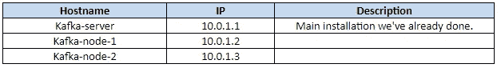
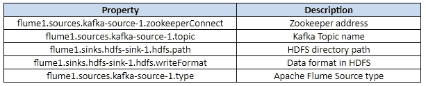

# Apache Kafka 和 Apache Flume 入门(将数据导入 HDFS)

> 原文：<https://towardsdatascience.com/apache-kafka-and-flume-installation-guide-import-data-from-kafka-to-hdfs-c908b0df034c?source=collection_archive---------5----------------------->


Image Source: www.kafka.apache.org

本文包含 Apache Kafka 安装、创建 Kafka 主题、发布和订阅主题消息的完整指南。此外，它还包含 Apache Flume 安装指南以及如何使用 Apache Flume 将 Kafka 主题消息导入 HDFS。

# 1.总说明

*   Hadoop 版本:3.1.0
*   阿帕奇卡夫卡版本:1.1.1
*   Apache Flume 版本:1.8.0
*   操作系统:Ubuntu 16.04
*   Java 版本:Java 8

# 2.先决条件

# 2.1.安装 Java

阿帕奇卡夫卡需要 Java。要确保安装了 Java，首先更新操作系统，然后尝试安装它:

```
sudo apt-get updatesudo apt-get upgradesudo add-apt-repository -y ppa:webupd8team/javasudo apt-get install oracle-java8-installer
```

# 2.2.安装动物园管理员

Apache Kafka 需要安装 Zookeeper 服务，因为它使用它来维护节点心跳、配置和选举领导者。

```
sudo apt-get install zookeeperd
```

默认情况下，zookeeper 使用端口 2181，安装后会自动运行。使用 telnet 命令检查 Zookeeper 是否正在运行:

```
telnet localhost 2181
```

当 telnet 提示符打开时，写下“你还好吗”命令:

```
ruok
```

如果一切正常，它将返回 *imok* 消息。

# 2.3.创建具有 sudo 权限的非超级用户帐户

因为 Kafka 是一个网络应用程序，它可能使用多个节点，所以最好创建一个具有 sudo 权限的服务用户。

```
sudo adduser — system — no-create-home — disabled-password — disabled-login kafkauser
```

# 3.安装和配置 Kafka 服务器

# 3.1.下载卡夫卡

首先，我们需要下载 Kafka 二进制包。

```
wget [http://www-eu.apache.org/dist/kafka/1.1.1/kafka_2.11-1.1.1.tgz](http://www-eu.apache.org/dist/kafka/1.1.1/kafka_2.11-1.1.1.tgz)
```

现在，我们需要提取 tgz 包。我们选择将 Kafka 安装在/opt/kafka 目录中:

```
sudo tar xvf kafka_2.11–1.1.1.tgz -–directory /opt/kafka -–strip 1
```

Kafka 将它的日志存储在磁盘上的/tmp 目录下，最好创建一个新的目录来存储日志

```
sudo mkdir /var/lib/kafkasudo mkdir /var/lib/kafka/data
```

# 3.2.配置 Kafka

现在，我们需要编辑 Kafka 服务器配置文件。

```
sudo gedit /opt/kafka/config/server.properties
```

默认情况下，Kafka 不允许我们删除主题。为了能够删除主题，找到并更改该行(如果没有找到，就添加它)。

```
delete.topic.enable = true
```

现在，我们需要更改日志目录:

```
log.dirs=/var/lib/kafka/data
```

此外，我们可以调整日志删除的时间间隔(Kafka 在特定时间后或根据磁盘大小删除日志):

```
log.retention.hours=168 # according to timelog.retention.bytes=104857600 # according to disk size
```

# 3.3.更改目录权限

我们需要在日志目录和 kafka 安装目录上授予 kafkauser 访问权限:

```
sudo chown –R kafkauser:nogroup /opt/kafkasudo chown –R kafkauser:nogroup /var/lib/kafka
```

# 3.4.开始卡夫卡

要启动 Apache Kafka 服务，可以使用以下命令:

```
sudo /opt/kafka/bin/kafka-server-start.sh /opt/kafka/ config/server.properties
```

如果服务器已经成功启动，您应该会看到以下输出:

```
[2018–07–23 21:43:48,279] WARN No meta.properties file under dir /var/lib/kafka/data/meta.properties (kafka.server.BrokerMetadataCheckpoint)[2018–07–23 21:43:48,516] INFO Kafka version : 0.10.0.1 (org.apache.kafka.common.utils.AppInfoParser)[2018–07–23 21:43:48,525] INFO Kafka commitId : a7a17cdec9eaa6c5 (org.apache.kafka.common.utils.AppInfoParser)[2018–07–23 21:43:48,527] INFO [Kafka Server 0], started (kafka.server.KafkaServer)[2018–07–23 21:43:48,555] INFO New leader is 0 (kafka.server.ZookeeperLeaderElector$LeaderChangeListener)
```

要将 Kafka 作为后台进程启动，可以使用 nohup 命令

```
sudo nohup /opt/kafka/bin/kafka-server-start.sh /opt/kafka/ config/server.properties /var/lib/kafka/data/kafka.log 2>&1 &
```

现在，您有一个 Kafka 服务器正在运行并监听端口 9092。

# 3.5.启动时将 Kafka 作为服务启动

首先，我们需要在/etc/systemd/system 中创建一个服务单元文件

```
sudo gedit /etc/systemd/system/kafka.service
```

**卡夫卡.服务**

```
[Unit]Description=High-available, distributed message brokerAfter=network.target[Service]User=kafkaExecStart=/opt/kafka/bin/kafka-server-start.sh /opt/kafka/config/server.properties[Install]WantedBy=multi-user.target
```

此外，使用可以将日志转发到另一个文件，这样您系统日志就不会被占用

```
ExecStart=/opt/kafka/bin/kafka-server-start.sh /opt/kafka/config/server.properties > /opt/kafka/server.log
```

要启动创建的服务，请使用以下命令:

```
sudo systemctl start kafka.service
```

在操作系统启动时自动启动服务

```
sudo systemctl enable kafka.service
```

您可以使用以下命令检查您的服务状态:

```
sudo systemctl status kafka.service
```

# 3.6.使用卡夫卡主题

# 3.6.1.创造一个卡夫卡主题

要创建 Kafka 主题，我们必须使用 kafka-topics.sh 脚本文件，并且我们需要指定 zookeeper 地址、复制因子、分区因子和主题名称:

```
/opt/kafka/bin/kafka-topics.sh — create — zookeeper localhost:2181 — replication-factor 1 — partitions 1 — topic testKafka
```

# 3.6.2.列出可用主题

要列出所有主题，请使用以下命令:

```
/opt/kafka/bin/kafka-topics.sh — list — zookeeper localhost:2181
```

# 3.6.3.发布和订阅消息

要将消息发布到主题中，我们必须使用 kafka-console-producer.sh 脚本，并且我们必须指定 kafka 服务器地址和主题名称:

```
/opt/kafka/bin/kafka-console-producer.sh — broker-list localhost:9092 — topic testKafka
```

然后，我们需要打开另一个终端，并使用 kafka-console-consumer.sh 脚本创建一个订户。我们需要传递 Kafka 服务器地址和主题名称

```
/opt/kafka/bin/kafka-console-consumer.sh — bootstrap-server localhost:9092 — topic test — from-beginning
```

在第一个终端(生产者)中，输入任意消息(例如:Hello！！)它必须出现在第二个终端中。

# 3.6.4.将文本文件导入 Kafka 主题

要在 Kafka 主题中打开一个文本文件，您需要使用带有管道的 cat 命令:

```
cat filename.txt | /opt/kafka/bin/kafka-console-producer.sh — broker-list localhost:9092 — topic testKafka
```

# 3.7.Kafka 多节点集群

此外，我们可以在多个节点上运行它，以实现数据冗余和意外故障转移。假设我们有 3 个节点:



我们需要遵循我们之前提到的相同步骤，并添加一些内容:

1.在/opt/Kafka/config/server . properties 中:

a.每个节点必须有一个唯一的 broker.id 属性

```
for node-2 broker.id=1for node-3 broker.id=2
```

b.更改 zookeeper.connect 的值，使其列出所有带有端口的 zookeeper 主机

```
zookeeper.connect=10.0.1.1:2181,10.0.1.2:2181,10.0.1.3:2181
```

2.我们必须改变动物园管理员的设置。使用编辑器 sudo gedit/etc/zookeeper/conf/zoo . CFG 打开 **zoo.cfg** 文件，并添加以下几行:

```
server.0=10.0.1.1:2888:3888server.1=10.0.1.2:2888:3888server.2=10.0.1.3:2888:3888
```

3.重新启动 Zookeeper 服务

```
sudo systemctl restart zookeeper.service
```

# 4.安装和配置 Apache Flume

要从 Kafka 主题中读取消息并存储到 HDFS 中，我们需要安装 Apache Flume。该应用程序用于将非结构化和半结构化数据存储到 HDFS 中。

# 4.1.下载水槽

首先，我们需要下载 apache flume 二进制包

```
wget “http://www-eu.apache.org/dist/flume/1.8.0/apache_flume-1.8.0-bin.tar.gz"
```

现在我们需要提取。gz 包。我们选择将 Kafka 安装在/opt/kafka 目录中:

```
sudo tar -xvf apache_flume-1.8.0-bin.tar.gz –-directory /opt/flume –-strip 1
```

# 4.2.配置水槽

您需要编辑**“/etc/profile”**、 **~/。bashrc"** 文件并添加以下几行

```
export FLUME_HOME= /opt/flumeexport PATH=$PATH:$FLUME_HOME/bin/
```

要应用这些更改，请使用 source ~/。巴沙尔司令部。

完成后，flume 代理会自动启动。要确保 flume 安装成功，您可以运行以下命令:

```
flume-ng –help
```

要将数据导入 HDFS，首先我们需要在您的主目录中创建一个日志文件。

```
gedit ~/access.log
```

写入任何数据并保存。

在/opt/flume/conf 中创建一个文件 **"flume.conf"** 文件，并将以下数据写入其中:

```
flume1.sources = kafka-source-1flume1.channels = hdfs-channel-1flume1.sinks = hdfs-sink-1flume1.sources.kafka-source-1.type = org.apache.flume.source.kafka.KafkaSourceflume1.sources.kafka-source-1.zookeeperConnect = localhost:2181flume1.sources.kafka-source-1.topic = testKafkaflume1.sources.kafka-source-1.batchSize = 100flume1.sources.kafka-source-1.channels = hdfs-channel-1flume1.channels.hdfs-channel-1.type = memoryflume1.sinks.hdfs-sink-1.channel = hdfs-channel-1flume1.sinks.hdfs-sink-1.type = hdfsflume1.sinks.hdfs-sink-1.hdfs.writeFormat = Textflume1.sinks.hdfs-sink-1.hdfs.fileType = DataStreamflume1.sinks.hdfs-sink-1.hdfs.filePrefix = test-eventsflume1.sinks.hdfs-sink-1.hdfs.useLocalTimeStamp = trueflume1.sinks.hdfs-sink-1.hdfs.path = /data/kafka/%{topic}/%y-%m-%dflume1.sinks.hdfs-sink-1.hdfs.rollCount=100flume1.sinks.hdfs-sink-1.hdfs.rollSize=0flume1.channels.hdfs-channel-1.capacity = 10000flume1.channels.hdfs-channel-1.transactionCapacity = 1000
```

请注意，flume1 是 flume 代理名称。

下面，一些参数描述:



现在，您需要运行 flume 代理从 Kafka 主题中读取数据，并将其写入 HDFS。

```
flume-ng agent -n flume1 -c conf -f flume.conf — Dflume.root.logger=INFO,console
```

*注意:代理名称由-n FileAgent 指定，并且必须与-f conf/flume.conf* 中给出的代理名称相匹配

数据现在将通过以下路径转储到 HDFS 位置

```
/tmp/kafka/%{topic}/%y-%m-%d
```

*%{topic} > >卡夫卡题目名称*

*%y-%m-%d >*

# 5.参考

[1]“阿帕奇卡夫卡官方文档”，阿帕奇，[在线]。可用:[http://kafka.apache.org。](http://kafka.apache.org.)【访问日期 2018 年 07 月 15 日】。

[2]“Apache Flume 官方文档”，Apache，[在线]。可用:[http://flume.apache.org。](http://flume.apache.org.)【访问时间 2018 年 07 月 20 日】。

[3] Sarad，“如何在 Ubuntu 16.04 上安装 Kafka”，Hevo，2017 年 8 月 20 日。【在线】。可用:【https://hevodata.com/blog/how-to-install-kafka-on-ubuntu. 【2018 年 06 月 30 日获取】。

[4]“15 分钟内完成 Kafka 设置”，ETL-Tools，[在线]。可用:[http://ETL-tools . info/en/examples/Kafka-setup-in-15-minutes . htm .](http://etl-tools.info/en/examples/kafka-setup-in-15-minutes.htm.)【25 07 2018 访问】。

[5] hitjethva，“在 Ubuntu 16.04 上安装和配置 Apache Kafka”，DevOps，2016 年 10 月 3 日。【在线】。可用:[https://devo PS . profit bricks . com/tutorials/install-and-configure-Apache-Kafka-on-Ubuntu-1604-1/。](https://devops.profitbricks.com/tutorials/install-and-configure-apache-kafka-on-ubuntu-1604-1/.)【访问时间 2018 年 07 月 15 日】。

[6] M. Litwintschik，“Hadoop 3 单节点安装指南”，2018 年 3 月 19 日。【在线】。可用:[http://www . tech . marksblogg . com/Hadoop-3-single-node-install-guide . html](http://www.tech.marksblogg.com/hadoop-3-single-node-install-guide.html.)【2018 年 10 月 06 日访问】。

[7]“栈溢出问答”，栈溢出，[在线]。可用:[https://www.Stackoverflow.com。](https://www.Stackoverflow.com.)

[8] Gwen Shapira 和 Jeff Holoman，“Flafka: Apache Flume 遇到 Apache Kafka 进行事件处理”，Cloudera，2014 年 11 月 6 日。【在线】。可用:[http://blog . cloud era . com/blog/2014/11/flafka-Apache-flume-meets-Apache-Kafka-for-event-processing/。](http://blog.cloudera.com/blog/2014/11/flafka-apache-flume-meets-apache-kafka-for-event-processing/.)【访问日期 2018 年 06 月 15 日】。

[9] S. Team，“Apache Flume 安装教程—初学者指南”，Data Flair，2016 年 8 月 22 日。【在线】。可用:[https://data-flair . training/blogs/Apache-flume-installation-tutorial。](https://data-flair.training/blogs/apache-flume-installation-tutorial.)【访问日期 2018 年 06 月 20 日】。