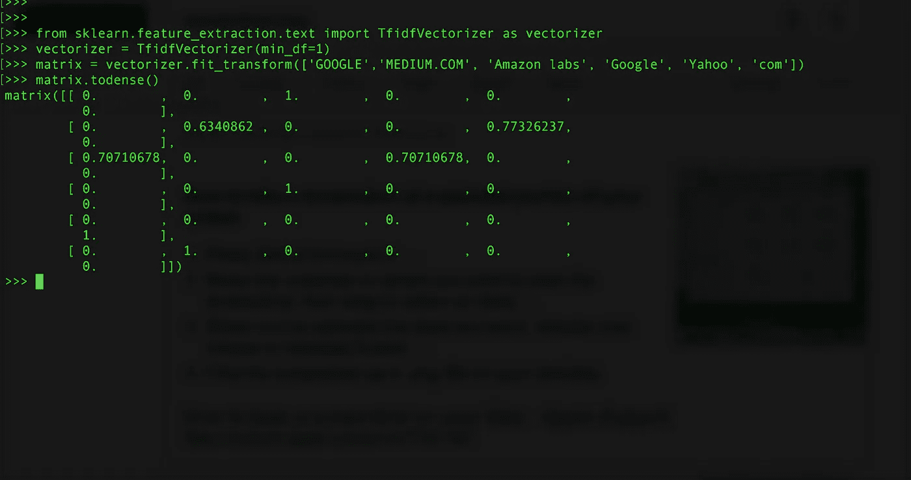
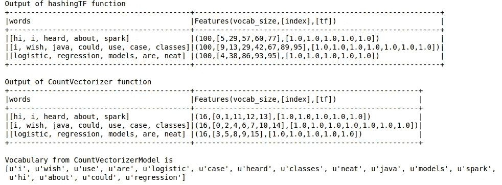

# Apache Spark:哈希还是字典？

> 原文：<https://towardsdatascience.com/apache-spark-hashing-or-dictionary-d23c0e046a19?source=collection_archive---------2----------------------->

作为构建推荐系统的一部分，我最近不得不计算大量数据中的文本相似度。如果你对 Spark 的一个字符串相似性算法感兴趣，可以看看。

本文的结构。

1.  实验背后的动机。
2.  TF-IDF 的 Spark 实现及其重要性。
3.  比较和结论。

# 动机

这不是我的问题陈述，但为了简单起见，让我们假设你有两列这样的单词，我们必须匹配它们。

```
List A       | List B
---------------------
GOOGLE INC.  | Google
MEDIUM.COM   | Medium Inc
Amazon labs  | Amazon
Google, inc  | Yahoo
```

在这个例子中，我们的目标是将 GOOGLE INC .和 GOOGLE，INC .匹配到 GOOGLE；并使 MEDIUM.COM 与媒体公司相匹配；以及亚马逊实验室到亚马逊等。

最简单的方法之一是计算这个单词列表的 TF-IDF 分数，并创建一个这样的矩阵。



该矩阵基本上具有 TF-IDF 得分，行和列元素为“GOOGLE”、“MEDIUM”。com '，'亚马逊实验室'，'谷歌'，'雅虎'，' COM '按顺序。我只是加了‘com’来展示 IDF 有多牛逼。如果一个术语在语料库中出现多次，那么它对于该特定文档就变得不太重要。添加了虚构的公司“com ”,因此“Medium.com”中的“Medium”变得更加重要。

如果 sklearn 行就能搞定这个，为什么还要用 spark？嗯，我的输入文件有 660 万行，正如你所猜测的，我的 Mac 真的不能处理这些。

我们找到动机了。让我们点燃激情。

# Spark 和 TF-IDF

Spark 附带的一个示例脚本是针对文档集的 TF-IDF 的[实现](https://spark.apache.org/docs/2.1.0/ml-features.html#tf-idf)。这当然使事情变得更容易，因为只需要一点点的预处理，我就可以开始了。

由于我不能在这里展示*机密*数据的解决方案，我将只处理这个例子[这里](https://spark.apache.org/docs/2.1.0/ml-features.html#tf-idf)给出的微小数据。



如果您查看第一个表，它是应用标准 TF-TDF 脚本的结果，通过简单的分析，您可以将单词列中的单词映射到特征列中的值。比如‘我’大概 29。

这个方法在我的情况下完全没有用。我有大约 200 万个不同的单词，却没有办法将这些值映射回单词。:(

为什么？Spark 在这里，使用的是一个**哈希函数**。哈希函数利用了哈希技巧。通过应用散列函数将原始特征映射到索引(术语)中。这里使用的哈希函数是 MurmurHash 3。然后基于映射的索引计算术语频率。

虽然这种方法避免了计算全局术语-索引映射的需要，这对于大型语料库来说可能是昂贵的，但是它遭受潜在的哈希冲突，其中不同的原始特征在哈希之后可能变成相同的术语。:/

必须找到一种方法来检索单词到值的映射。解决方案？**计数矢量器。**

在上图中，第二个表是使用 countvectorizer 对数据进行令牌化并获得 TF 而不是散列函数的结果。“词汇表”存储所有不同的单词，它们的索引是值。是的。:)

# 比较和结论

*但是等等。*

这是哈希函数和字典之间的一个古老的权衡。在什么情况下哈希函数会更好？为什么 Spark 有 2 个版本计算 TF-IDF？

再来看**存储:**

HashingTF 需要固定大小的存储，与词汇表的大小无关。CountVectorizer 需要与词汇表大小成比例的存储空间。实际上，计数通常需要额外的特征选择。

**转型呢？**

HashingTF 只需要对数据进行一次扫描，不需要额外的存储和转换。CountVectorizer 必须扫描数据[两次](https://spark.apache.org/docs/2.1.0/ml-features.html#countvectorizer)(一次用于构建模型，一次用于转换)，需要与唯一标记数量成比例的额外空间和昂贵的排序。

显然，这两种实现各有优缺点。这就是我的结论。如果 TF-IDF 只是另一个需要数字特征的算法的预处理步骤，那么与 CountVectorizer 相比，HashingTF 的工作速度更快，内存效率更高。由于我当前的模块仅仅停留在计算单词的相似性，我需要知道反向映射和 CountVectorizer 似乎更合适。:)

感谢阅读！

PS:这篇[论文](http://alex.smola.org/papers/2009/Weinbergeretal09.pdf)让我对特性散列有了很好的了解，可能值得一读。