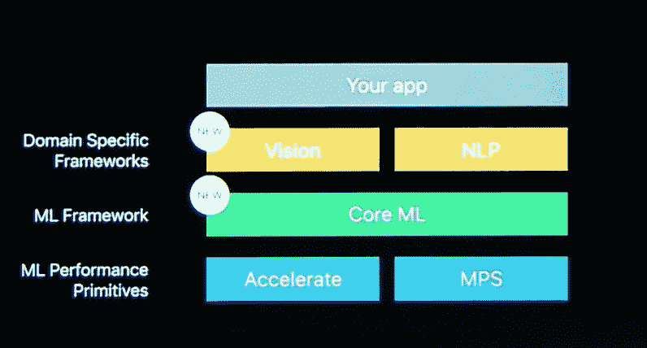
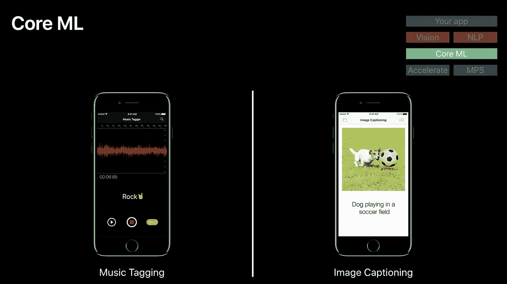
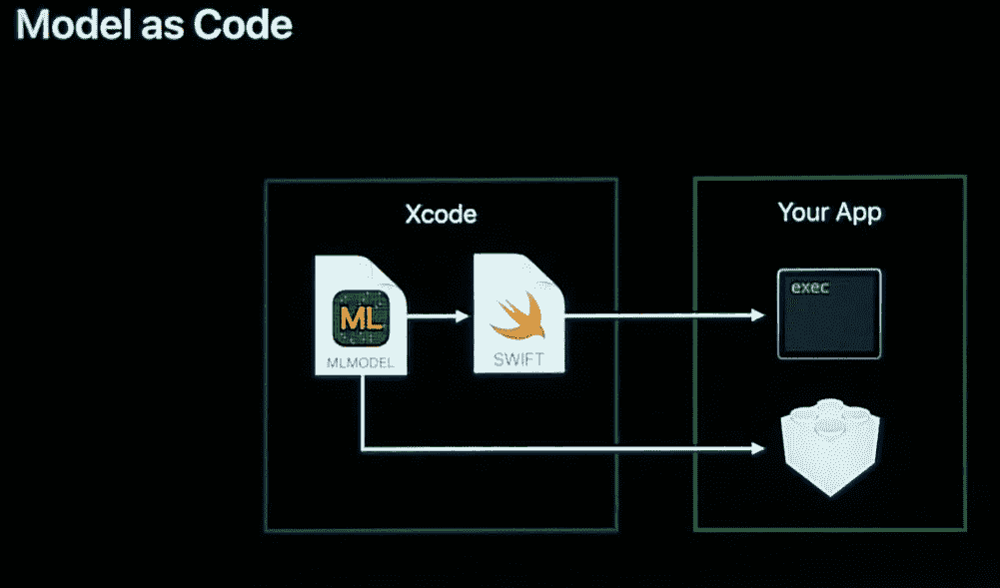
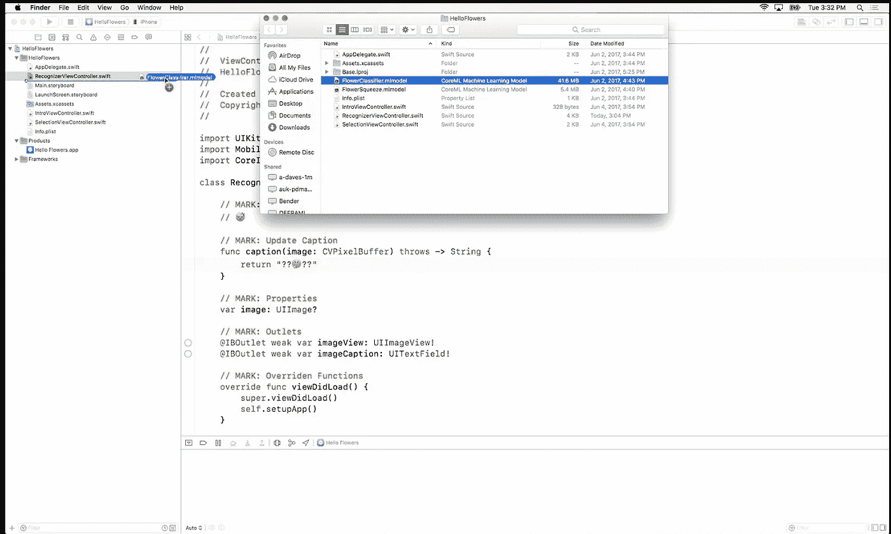
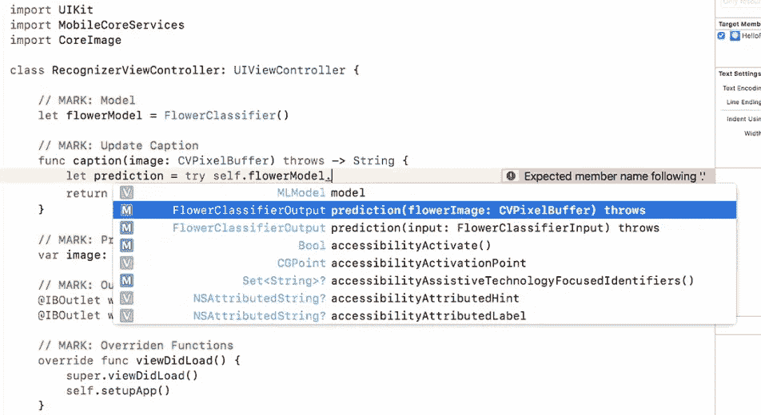
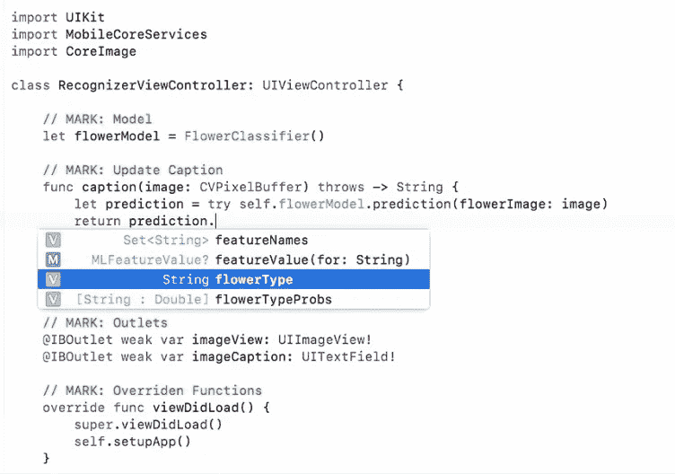
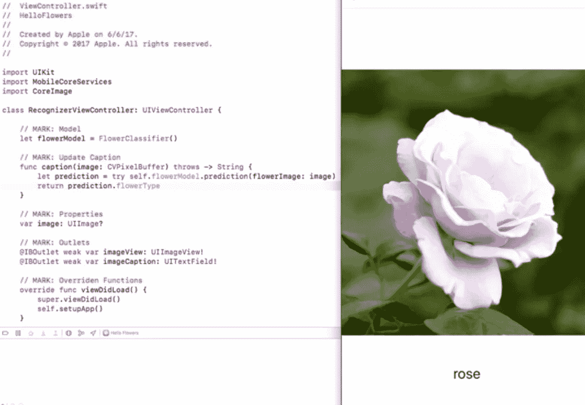
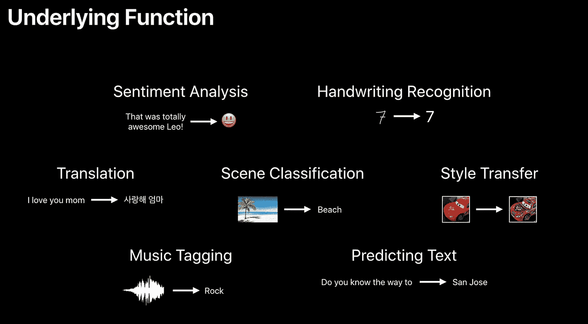

# 苹果也想让你的手机看到

> 原文：<https://towardsdatascience.com/apple-wants-your-phone-to-see-too-1497f244042b?source=collection_archive---------9----------------------->

在谷歌的 I/O 事件之后，我写道[谷歌希望你的手机看到](https://medium.com/@andreistephens/google-wants-your-phone-to-see-bc62b5dfc32c)。当然，在 WWDC，苹果也为 iOS 应用程序推出了令人兴奋的新机器学习驱动功能。

苹果为开发者提供了一些不同可定制级别的框架，实现难度越来越大。

Vision and NLP purpose-built frameworks and CoreML for all kinds of other use cases, and you can build anything you want with the ‘ML Performance Primitives’

无论视觉材料是照片还是视频，Vision framework 都非常擅长查看，这包括人脸识别和对象跟踪，NLP(自然语言处理)有助于从话语或文本中提取意思。

CoreML 可以帮助应用程序做所有你期望的事情，包括识别声音剪辑和图片中发生的事情。

这一切都很酷，但这并不新鲜——其他系统已经有了。这里很酷的一点是，这些技术都是关于在设备上运行*的，而且*启动并运行起来非常容易*。*

**在设备上**更好，因为你不通过网络发送数据进行处理，这意味着你保留了你正在处理的内容的隐私，没有相关的数据成本，即使你没有网络覆盖，也可以使用。如果你关注这些东西，你应该听说过为 HBO 的硅谷开发的[而非热狗应用。该过程中的一个重要经验是决定在设备上运行分类器，以获得准确性、性能和经济性。](https://hackernoon.com/how-hbos-silicon-valley-built-not-hotdog-with-mobile-tensorflow-keras-react-native-ef03260747f3)

Not Hotdog 博客文章还解释了在设备上运行 TensorFlow 模型的一些困难。这需要一些时间，而且没有很好的例子，他们直接与 TensorFlow 团队一起工作*以获得使其工作的技巧。CoreML 更多的是关于在设备上运行，它主要是关于易用性。易用性是…另一回事。*

在 WWDC 的 CoreML 演示中，苹果澄清了任务声明:

> “CoreML 旨在尽可能轻松地将机器学习模型集成到您的应用程序中。”

有一种新的描述模型的公共格式，并且有新的工具可以将现有的*经过训练的模型转换成这种格式。*

The model gets compiled into your app, so it’s bundled right onto the device

# 花

一旦到了那里，演示表明你可以教一个应用程序通过拖动模型并编写 3 行代码来识别图片中的花的类型。真的就这么简单。

苹果公司强调，他们设计这种模式的目的是为了让 Xcode 开发中的其他一切工作起来完全一样，这样工程师就不需要新的技能来利用这些模式。

Literally drag and drop

访问分类器遵循现有的模式，提前输入建议有助于实现。

Converted to an MLmodel type, Xcode can compile the classifier to Swift generated source

应用该模型就像直接将图像作为输入传递给它一样简单。

The Classifier has a prediction output

您可以从模型的预测中访问“flowerType”字符串。对于演示来说，最简单的事情就是将它作为一个标签。

See the available attributes of the prediction

你就完了。

With just that, choosing a picture results in the model predicting the type of flower and changing the caption

# 不是花呢？

显然，弄清楚你正在看的是哪种花是一个利基用例——尽管这确实是在大约一个月前的一次家庭公园散步中出现的——但应用程序开发人员可以轻松地在应用程序中使用机器学习模型才是重点。

Some functions Apple suggests for this capability

有很多方法可以使用这些模型。应用程序可以为社交分享提供预测标记，以确保你的朋友——以及未来的你——可以找到你发布的他们最感兴趣的内容。使用带铅笔的 iPad Pro，应用程序可以像对待打字文本一样对待手写输入。表情符号建议是一个巨大的机会，我对此特别兴奋。

虽然所有这些事情听起来很有趣，但这也是一件严肃的事情。金融科技的应用可能是无穷无尽的，但一些基本的用例包括:

*   上传前，在捕获时识别文档类型；确认客户提供了正确的文件，没有来回
*   客户服务情绪响应度；对心烦意乱的客户和好奇的人做出不同的回应
*   优化建议；基于最佳实践或以前的客户端行为，预测设置和输入

# 今后

苹果向前迈出了一大步，让开发者能够轻松地将这些功能融入他们的应用。与所有事情一样，我们应该期待看到一些简单的用例几乎立即出现。这些大多不会去任何地方，这很好！公司会进行试验，但并不是所有的试验都会成功。

在此之后，我们应该期待下一代体验——无论是第一次体验的迭代，还是需要更长时间才能推向市场的新体验——开始发挥作用。

一如既往，问题是:现在有什么是可能的，而以前没有？