# 应用假设检验和 Spearman 等级相关系数揭示世界范围内的自杀现象

> 原文：<https://towardsdatascience.com/application-of-hypothesis-testing-and-spearmans-rank-correlation-coefficient-to-demystify-b3a554730c91?source=collection_archive---------8----------------------->

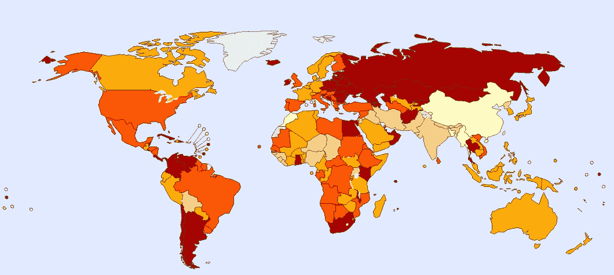

# 介绍

***背景:*** 据世界卫生组织(世卫组织)统计，全球每年约有一百万人自杀，每年死亡率为 11.6/10 万人。每年有如此多的人自杀，这是一个令人震惊的事实。你可以想象每 40 秒就有一个人自杀，据估计，到 2020 年，每 20 秒就有一个人死于自杀。
我们可以使用数据分析来研究全球自杀数据，并使用统计技术量化我们的结果。这将有助于我们了解世界各地发生的自杀事件。

***本研究的目的*** :
展示统计方法在现实世界问题中的应用，以发现我们在对数据集进行初步分析后所做的假设是否具有统计学意义。

在这里，我们将解释和应用两个众所周知的统计技术。假设检验
2。斯皮尔曼等级相关系数

这些统计实验的结果将为我们分析一组数据后所做的假设提供具体的证明。

# 什么是假设检验？

> 《牛津词典》将假设的含义定义为“在有限证据的基础上做出的假设或提出的解释，作为进一步研究的起点”

假设检验，也称为**验证性数据分析**是一种通过统计证据来确定我们假设的假设是真还是假的技术。
例如，我们可以获取两家不同公司生产的相同/相似产品的价格数据集，并想知道一家公司的产品是否比另一家贵。
我们的目的可以通过假设检验来实现。

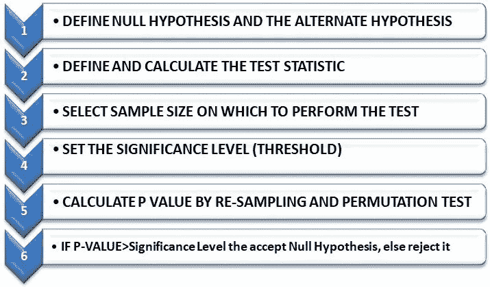

Flowchart for Hypothesis Testing

***零假设*** 是我们在测试开始时做出的默认假设。就像，两组数据之间没有显著差异。 ***交替假设*** 是这种假设的对立面。

***检验统计量*** 是两组数据之间的均值、中值、标准差等的差异，这是我们从两组数据中抽取样本并计算检验统计量后**实际观察到的。**

**决定 ***样本大小*** 是一个非常重要的因素，因为测试统计值会根据样本大小而不同。样本量越大，结果就越准确。**

*****显著性水平或阿尔法*** 是概率的阈值，我们根据它来决定是接受还是拒绝我们的零假设。默认情况下，取 5%或 0.05。如果需要非常高的精确度，您可以降低它。**

*****P 值*** 是通过**重采样和排列测试
计算出来的，下面的插图会让事情更清楚****

**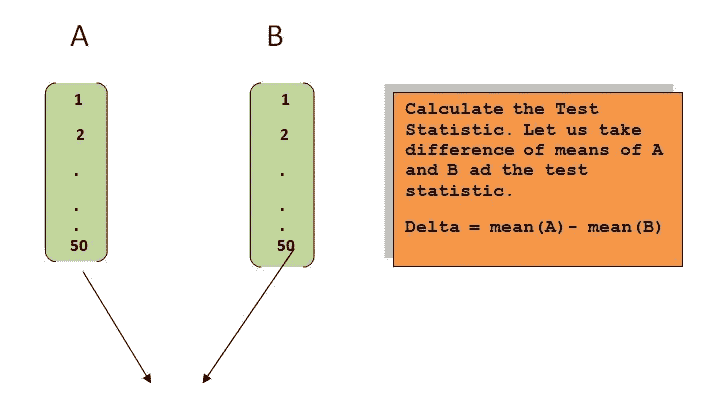**

**Re-Sampling illustration 1**

****

**Re-Sampling illustration 2**

**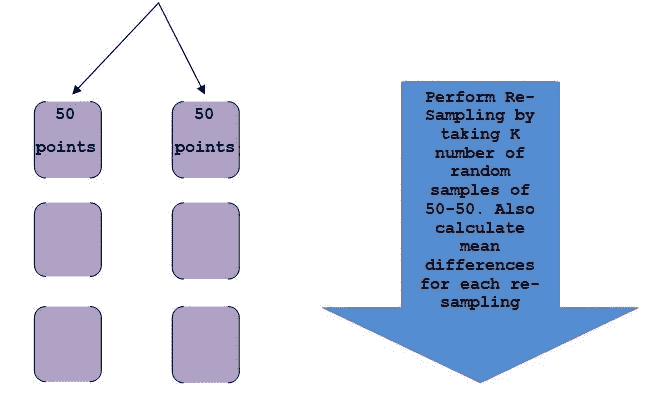**

**Re-Sampling illustration 3**

**下一步是对我们从 K 次重采样中得到的均值差的数据列表进行升序排序。k 可以是 100，1000 或任何我们认为合适的数字。**

**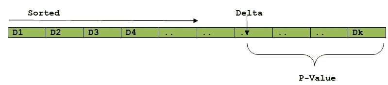**

**Calculation of P-Value**

**所以，p 值是我们测试统计的百分位数(delta)，小于 100%。如果 delta 位于第 90 百分位，则 p 值为 10%或 0.10。**

****做出最终决定****

**我们说，p 值是假设我们的零假设为真，观察到δ的概率。**

**因此，如果我们的假设实际上是真的，观察到我们在进行实验时实际观察到的结果的概率(delta)将会很高。“高”的意思不仅仅是显著性水平。**

**如果 p 值低于显著性水平，这意味着在零假设为真的情况下，我们实际观察的发生概率较低。**

**由此，我们可以说:
***——当 p 值≥显著性水平时接受零假设。
-如果 p 值<显著性水平，拒绝零假设并接受替代假设。*****

# **自杀率数据集**

**数据集来源:[https://www . ka ggle . com/russellyates 88/自杀率-概览-1985 年至 2016 年](https://www.kaggle.com/russellyates88/suicide-rates-overview-1985-to-2016)**

**[](https://www.kaggle.com/russellyates88/suicide-rates-overview-1985-to-2016) [## 1985 年至 2016 年自杀率概览

### 按年份和国家将社会经济信息与自杀率进行比较

www.kaggle.com](https://www.kaggle.com/russellyates88/suicide-rates-overview-1985-to-2016) 

在这项研究中，我使用了 python 库:Numpy、Pandas、Matplotlib、Seaborn 和 scikit-learn。让我向您展示我是如何对这个数据集进行探索性数据分析和假设检验的。

## 正在加载。csv 文件转换成熊猫数据帧

```
#Importing python libraries 
import numpy as np
import pandas as pd
import seaborn as sb
import matplotlib.pyplot as mp
#Loading csv file into pandas dataframe
SuicideData= pd.read_csv('master.csv')
SuicideData.head()
```


## 数据集的初步分析

```
print(SuicideData.shape)
print(SuicideData.columns)
```

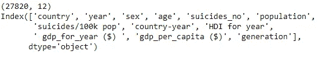

There are 27820 Data points(Rows) and 12 Columns. Also showing column names for future reference

```
print(SuicideData.age.value_counts())
```

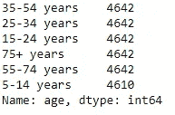

The data set has 6 age groups

```
SuicideData['suicides/100k pop'].mean()
```

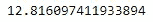

Mean Suicide rate/100k persons on the whole population

上述结果并不准确，但非常接近世卫组织公布的数字 11.6。这可能是因为我们的数据样本较少。
我们进一步挖掘数据，根据性别和年龄组进行分析。下面是代码片段和结果:

```
#DIVIDING BY GENDER
M=SuicideData[SuicideData.sex=='male']
F=SuicideData[SuicideData.sex=='female']print('TOTAL MALE POPULATION = ',M.population.sum())
print('TOTAL MALE SUICIDES = ',M.suicides_no.sum())
print('AVERAGE MALE SUICIDES per 100k Population = ',M['suicides/100k pop'].mean())
print('TOTAL FEMALE POPULATION = ',F.population.sum())
print('TOTAL FEMALE SUICIDES = ',F.suicides_no.sum())
print('AVERAGE FEMALE SUICIDES per 100k Population = ',F['suicides/100k pop'].mean())print('\nAVERAGE SUICIDE RATES BY AGE GROUP')
print(SuicideData.groupby(['age'])['suicides/100k pop'].mean())print('\nAVERAGE SUICIDE RATES OF MALES BY AGE GROUP')
print(M.groupby(['age'])['suicides/100k pop'].mean())print('\nAVERAGE SUICIDE RATES OF FEMALES BY AGE GROUP')
print(F.groupby(['age'])['suicides/100k pop'].mean())print("\nSUICIDE RATE RATIO of FEMALE:MALE = 1 :",(M['suicides/100k pop'].mean()) / (F['suicides/100k pop'].mean()))
```

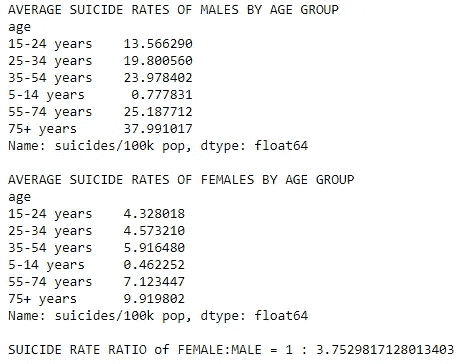

## 箱线图——男性与女性的自杀率

```
sb.boxplot(x='sex',y='suicides/100k pop', data=SuicideData)
mp.show()
```

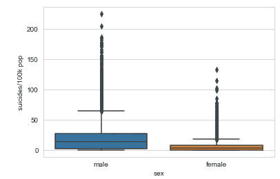

## 小提琴情节——男性与女性自杀率对比

```
sb.violinplot(x='sex',y='suicides/100k pop', data=SuicideData)
mp.show()
```

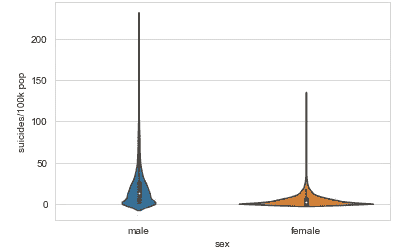

# 根据年龄组显示自杀率——箱线图

```
sb.boxplot(x='age',y='suicides/100k pop', data=SuicideData)
mp.show()
```

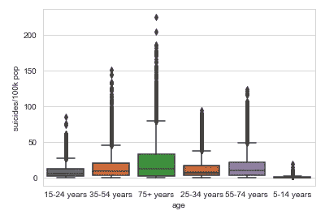

75+ years age group is most Suicidal

## 初步分析的观察结果

1.  男性自杀人数和自杀率都远高于女性。女性:男性= 1 : 3.75
2.  即使我们按照年龄组来研究他们，结果也是一样的。
3.  一个惊人的事实是，75 岁以上年龄组的人自杀倾向最强，无论性别如何。
4.  5-14 岁年龄组自杀倾向最小，这很正常。

# 问题:哪个国家的自杀倾向最强？

我们将找到答案，并使用假设检验对其进行量化。按国家分组后，计算自杀率的平均值和中位数，并对结果进行排序。这将使我们成为自杀率最高的国家。

```
suicide_mean_by_country=pd.DataFrame(SuicideData.groupby(['country'])['suicides/100k pop'].mean())
suicide_mean_by_country = suicide_mean_by_country.sort_values(by='suicides/100k pop', ascending=False)
suicide_mean_by_country
```


Ranking by Mean Suicide Rates

```
suicide_median_by_country=pd.DataFrame(SuicideData.groupby(['country'])['suicides/100k pop'].quantile(0.5))
suicide_median_by_country = suicide_median_by_country.sort_values(by='suicides/100k pop', ascending=False)
suicide_median_by_country
```

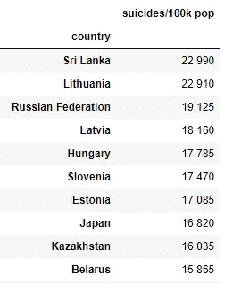

Ranking by Median Suicide Rates

我们观察到，除了斯里兰卡和日本之外，十大自杀国家中几乎 90%来自欧洲和俄罗斯。我们可以宣布立陶宛是自杀率最高的国家，但在做出决定之前，最好用一些统计数据来量化结果。

# 应用假设检验找出世界上自杀率最高的国家

我们进行假设检验，因为当按平均值排名时，立陶宛以高得多的值排名第一，但当按中位数排名时，斯里兰卡以非常小的差距在立陶宛之上。

如果假设检验证明立陶宛和斯里兰卡的自杀率没有显著差异，我们肯定可以认为立陶宛是世界上自杀率最高的国家(基于 1985-2016 年的数据)。

***无效假设*** —立陶宛和斯里兰卡的自杀率没有显著差异。
***交替假设—*** 立陶宛和斯里兰卡的自杀率存在显著差异。

***检验统计*** —立陶宛和斯里兰卡自杀率中位数的差异 ***。***

我们从每个国家的 **100 个**中选取 ***样本量*** ，并设定 ***显著性水平为 5% (0.05)。***

现在我们进行实验。首先我们按国家划分数据。

```
lithuania=SuicideData[SuicideData.country=='Lithuania']
srilanka=SuicideData[SuicideData.country=='Sri Lanka']
```

然后我们从立陶宛和斯里兰卡各随机抽取 100 个数据点。

```
sample_lithuania=lithuania.sample(100)
sample_srilanka=srilanka.sample(100)
```

现在，我们只从样本数据的 pandas 数据帧中取出自杀率列，并将其转换为 numpy 数组，以便于计算。

```
S1=np.array(sample_lithuania['suicides/100k pop'])
print(S1)
median1=np.median(S1)
print('MEDIAN1=',median1)
```

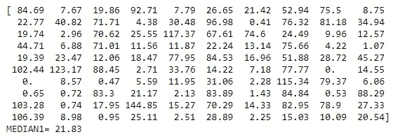

Numpy array of Lithuania sample suicide rates

```
S2=np.array(sample_srilanka['suicides/100k pop'])
print(S2)
median2=np.median(S2)
print('MEDIAN2=',median2)
```

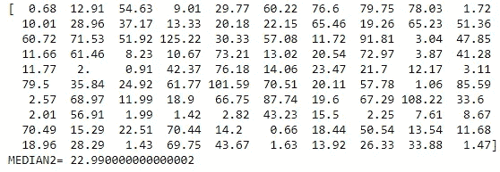

Numpy array of Sri-Lanka sample suicide rates

我们可以看到，即使是两国样本的自杀率中位数也非常接近。因此，我们现在计算我们的测试统计值如下

```
TS= median1-median2
print("Test Statistic is (Median of Lithuania - Median of Sri Lanka)=", TS)
```

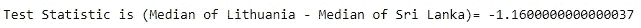

如前所述，下一步是将两组样本数据连接成一组，并对它们进行混排，这样两组数据的观察值就能正确地混合成一组数据。

```
S= np.concatenate((S1,S2), axis=None)
np.random.shuffle(S)
print(S)
```

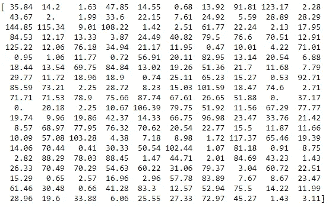

200 mixed observations from both countries

我们通过取 100 个点的两个样本集来执行 1000 次重采样，并且每次计算它们的中位数的差。中值差列表存储在另一个 numpy 数组中。

```
#Randomly sample 100-100 data points and calculate the difference of medians
medianlist=np.zeros(1000)
for i in range(1000):
    _s1= np.random.choice(S,100)
    _s2= np.setdiff1d(S, _s1)
    _median1= np.median(_s1)
    _median2= np.median(_s2)
    medianlist[i]= np.array(_median1 - _median2)
```

最后一步，对 medianlist 进行升序排序，计算 p 值，得出最终结论。代码片段和结果如下:

```
medianlist=np.sort(medianlist)#calculation of p-value
ct=0
for i in medianlist:
    if i < TS:
        ct+=1
pvalue= (1000-ct) / 1000medianlist=pd.DataFrame(medianlist, columns=['mediandiff'])
pv95=medianlist.mediandiff[949]
print('VALUE in 95th Percentile position=', pv95)
print('TEST STATISTIC =',TS)
print('P-VALUE OF TS =', pvalue)if pvalue>0.05:
    print('OBSERVATION VALUE IS LOWER THAN THE 95th Percentile.\nTHUS probability of OCCURENCE OF OUR OBSERVATION GIVEN NULL HYPOTHESIS IS High, AS P-VALUE OF {} IS HIGHER THAN THE SIGNIFICANCE LEVEL OF 0.05'.format(pvalue))
    print('SO WE ACCEPT THE NULL HYPOTHESIS AS TRUE : LITHUANIA AND SRI LANKA HAVE NO SIGNIFICANT DIFFERENCE IN SUICIDE RATES')
else:
    print('OBSERVATION VALUE IS HIGHER THAN THE 95th Percentile.\nTHUS probability of OCCURENCE OF OUR OBSERVATION GIVEN NULL HYPOTHESIS IS Extremely Low, AS P-VALUE OF {} IS LOWER THAN THE SIGNIFICANCE LEVEL OF 0.05'.format(pvalue))
    print('SO WE REJECT THE NULL HYPOTHESIS AND ACCEPT THE ALTERNATE HYPOTHESIS : LITHUANIA AND SRI LANKA HAVE A SIGNIFICANT DIFFERENCE IN SUICIDE RATES')
    if TS > 0:
        print('FROM THE SIGN OF TS WE KNOW LITHUANIA HAS A HIGHER SUICIDE RATE')
    else:
        print('FROM THE SIGN OF TS WE KNOW SRI LANKA HAS A HIGHER SUICIDE RATE')
```

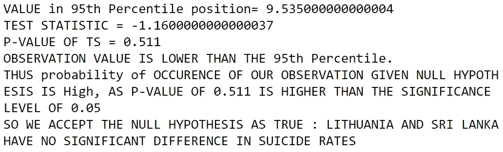

p 值为 0.511 意味着，鉴于立陶宛和斯里兰卡的自杀率之间没有显著差异，我们的样本观察结果出现的概率接近 50%，远高于 5%的显著性水平。因此，我们接受我们的零假设为真。

***所以我们可以说立陶宛是世界上自杀率最高的国家*** 因为立陶宛和第二高的国家——斯里兰卡的平均自杀率差异很大，但中位数差异并不显著。因此，我们通过我们的判断基于平均差异。

**现在你可能会怀疑假设检验的结果，所以我将展示如果我们对立陶宛和日本进行同样的检验会发生什么。**

# 假设检验:立陶宛和日本哪个国家更有自杀倾向？

我们知道日本的自杀率比立陶宛低得多，根据中位数排名，日本排在第八位。因此，如果我们的假设检验给出了相同的结果，那么我们可以相信这种检验方法。

***零假设*** —立陶宛和日本的自杀率没有显著差异。
***替代假设—*** 立陶宛和日本的自杀率存在显著差异。

***检验统计*** —立陶宛和日本自杀率中位数的差异 ***。***

我们从每个国家的 **100 个**中取 ***样本量*** ，并设定 ***显著性水平为 5% (0.05)。***

为日本执行采样:

```
sample_japan=japan.sample(100)S3=np.array(sample_japan['suicides/100k pop'])
print(S3)
median3=np.median(S3)
```

计算测试统计值

```
TS2=median1-median3
print("Test Statistic is (Median of Lithuania - Median of Japan)=", TS2)
```

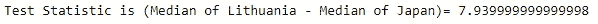

连接和洗牌:

```
SS= np.concatenate((S1,S3), axis=None)
np.random.shuffle(SS)
print(SS)
```

随机抽取 100–100 个数据点，计算中位数的差值

```
medianlist2=np.zeros(1000)
for i in range(1000):
    _s1= np.random.choice(SS,100)
    _s3= np.setdiff1d(SS, _s1)
    #print(_s1)
    #print(_s3)
    _median1= np.median(_s1)
    _median3= np.median(_s3)
    medianlist2[i]= np.array(_median1 - _median3)
```

对中值列表排序后的最终计算和结果

```
medianlist2=np.sort(medianlist2)#calculation of p-value
ct2=0
for i in medianlist2:
    if i < TS2:
        ct2+=1
pvalue2= (1000-ct2) / 1000medianlist2=pd.DataFrame(medianlist2, columns=['mediandiff'])
pv95_2=medianlist2.mediandiff[949]
print('VALUE in 95th Percentile position=', pv95_2)
print('TEST STATISTIC =',TS2)
print('P-VALUE OF TS =', pvalue2)
if pvalue2>0.05:
    print('OBSERVATION VALUE IS LOWER THAN THE 95th Percentile.\nTHUS probability of OCCURENCE OF OUR OBSERVATION GIVEN NULL HYPOTHESIS IS High, AS P-VALUE OF {} IS HIGHER THAN THE SIGNIFICANCE LEVEL OF 0.05'.format(pvalue2))
    print('SO WE ACCEPT THE NULL HYPOTHESIS AS TRUE : LITHUANIA AND JAPAN HAVE NO SIGNIFICANT DIFFERENCE IN SUICIDE RATES')
else:
    print('OBSERVATION VALUE IS HIGHER THAN THE 95th Percentile.\nTHUS probability of OCCURENCE OF OUR OBSERVATION GIVEN NULL HYPOTHESIS IS Extremely Low, AS P-VALUE OF {} IS LOWER THAN THE SIGNIFICANCE LEVEL OF 0.05'.format(pvalue2))
    print('SO WE REJECT THE NULL HYPOTHESIS AND ACCEPT THE ALTERNATE HYPOTHESIS : LITHUANIA AND JAPAN HAVE A SIGNIFICANT DIFFERENCE IN SUICIDE RATES')
    if TS2 > 0:
        print('FROM THE SIGN OF TS WE KNOW LITHUANIA HAS A HIGHER SUICIDE RATE')
    else:
        print('FROM THE SIGN OF TS WE KNOW JAPAN HAS A HIGHER SUICIDE RATE')
```

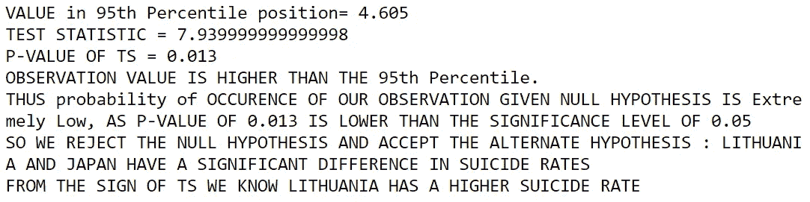

我们的假设检验证明，立陶宛的自杀率高于日本，因为 p 值极低，约为 1%。

**总结一下**

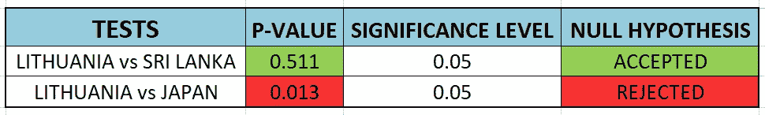

Summary Report

因此，我们可以得出结论，假设检验是一种很好的方法，可以通过统计证明来检验一个假设的可能性。

# 问题:自杀率是否依赖于人均 GDP？

人们可能会想，当一个地方的经济条件恶化时，自杀的人会更多，而当经济条件或收入较好时，自杀的人会更少。我们可以从我们的自杀数据集中找出这种情况是否真的发生，并用另一个测试参数(称为 Spearman 等级相关系数)对其进行量化。

# 什么是斯皮尔曼秩相关系数？

这是一种测试，用来确定一个随机变量的值是否稳定地增加或减少，而另一个随机变量的值是否有相同的变化。称之为**单调地**递增或递减。如果一个增加而另一个增加，则结果为正(+)，如果一个减少而另一个增加，则结果为负(-)。结果介于-1 和+1 之间。

假设有两组随机变量 X 和 Y，首先对它们进行排序。这种相关性是基于他们的排名，而不是他们的价值观。这就是为什么这项技术受**异常值**的影响最小。

# 应用 Spearman 等级相关系数回答我们的问题

在我们的案例中，我们可以测试人均 GDP 的变化是否会带来自杀率的变化。

让我们绘制一个图表并可视化数据，其中 X 轴是人均 GDP*的增长，Y 轴是每 10 万人口的自杀人数*。它也根据 ***年龄组*** 进行颜色编码**

```
**sb.set_style("whitegrid");
sb.FacetGrid(SuicideData, hue="age", height=7) \
   .map(mp.scatter, "gdp_per_capita ($)", "suicides/100k pop") \
   .add_legend();
mp.show();**
```

**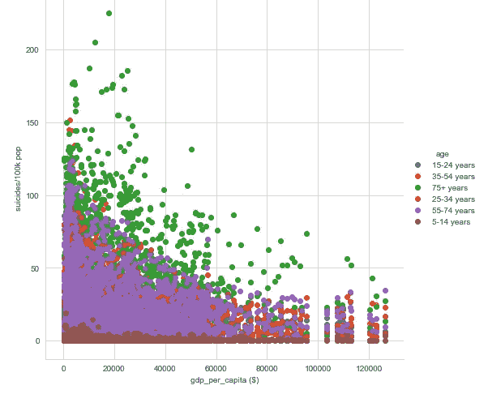**

**我们可以看到，人均国内生产总值较高的点较少，但数据点分散，似乎没有很好的相关性。因此，最好将数据分成不同的年龄组，对它们进行绘图，并找到它们各自的 Spearman 等级相关系数值。我已经使用了***scipy . stats***python 库来计算我们的结果。**

```
**#DIVIDING BY AGE GROUPA5_14=SuicideData[SuicideData.age=='5-14 years']
A15_24=SuicideData[SuicideData.age=='15-24 years']
A25_34=SuicideData[SuicideData.age=='25-34 years']
A35_54=SuicideData[SuicideData.age=='35-54 years']
A55_74=SuicideData[SuicideData.age=='55-74 years']
A75P=SuicideData[SuicideData.age=='75+ years']**
```

**图形的代码片段**

```
**sb.set_style("whitegrid");
sb.FacetGrid(A5_14, hue='sex', height=5) \
   .map(mp.scatter, "gdp_per_capita ($)", "suicides/100k pop") \
   .add_legend();
mp.title('AGE GROUP 5-14')
mp.show();**
```

**类似的代码可以用于每个年龄组**

**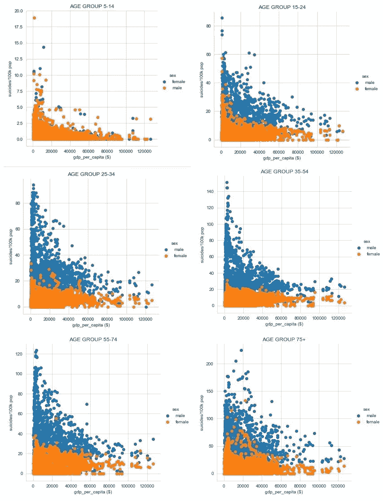**

**即使对于单个年龄组来说，这些特性也是相似的。现在我们计算系数值。**

```
**#Spearman's rank correlation coefficient
#IF THERE IS A CORRELATION BETWEEN GDP PER CAPITA & SUICIDE RATES
#FOR ALL THE AGE GROUPSsp.spearmanr(A5_14['gdp_per_capita ($)'],A5_14['suicides/100k pop'] )
sp.spearmanr(A15_24['gdp_per_capita ($)'],A15_24['suicides/100k pop'] )
sp.spearmanr(A25_34['gdp_per_capita ($)'],A25_34['suicides/100k pop'] )
sp.spearmanr(A35_54['gdp_per_capita ($)'],A35_54['suicides/100k pop'] )
sp.spearmanr(A55_74['gdp_per_capita ($)'],A55_74['suicides/100k pop'] )
sp.spearmanr(A75P['gdp_per_capita ($)'],A75P['suicides/100k pop'] )**
```

**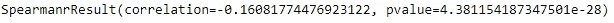****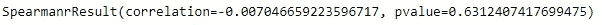****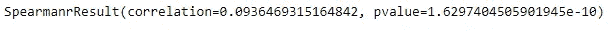****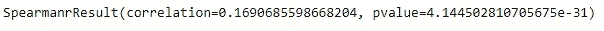****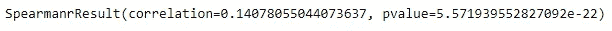****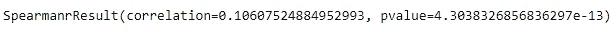**

**我们观察到相关值非常接近于零。这表明人均 GDP 和自杀率之间没有相关性。**

# **结论**

**你已经看到统计方法对于证实我们根据观察到的数据所做的任何假设是多么重要。有时我们观察到的一些东西可能实际上并不真实，这就是这些方法帮助我们证明我们的理论具有统计学意义的地方。**

*****Github 代码链接*****

**[](https://github.com/souravkajuri/suiciderate) [## souravkajuri/自杀率

### 在 GitHub 上创建一个帐户，为 souravkajuri/suiciderate 开发做贡献。

github.com](https://github.com/souravkajuri/suiciderate)****