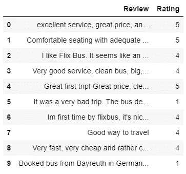
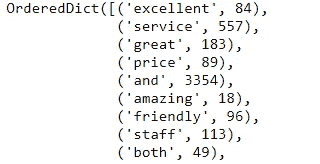
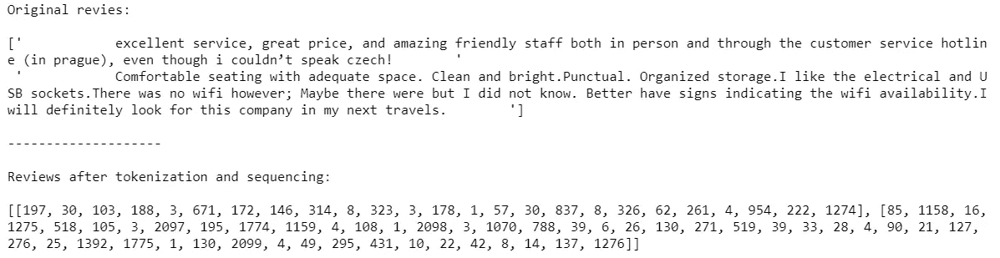
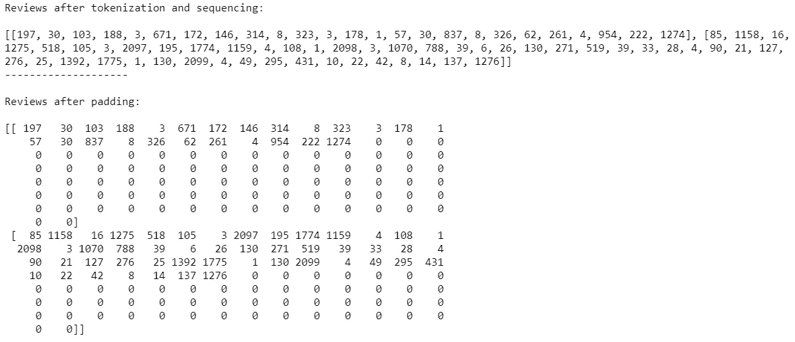
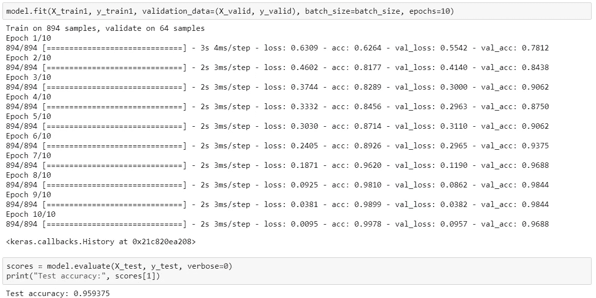
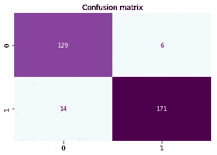
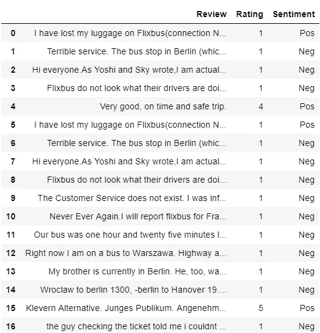
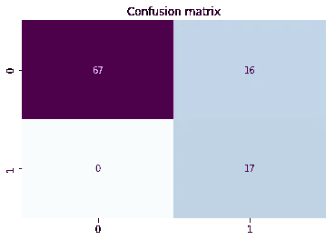
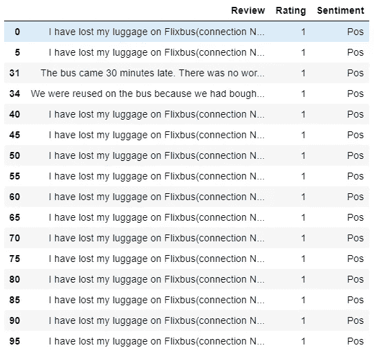

# RNN 在顾客评论情感分析中的应用

> 原文：<https://towardsdatascience.com/application-of-rnn-for-customer-review-sentiment-analysis-178fa82e9aaf?source=collection_archive---------8----------------------->

在我之前的博客文章中，我写了关于使用 BeautifulSoup 收集两千多条 Flixbus 客户评论，并通过执行 NLP 分析来识别公司的优势和劣势。

基于之前的故事，我决定使用收集的文本数据来训练一个递归神经网络模型来预测客户的情绪，这被证明是非常高效的，在测试集上达到 95.93%的准确率。

什么是情感分析？维基百科提供了一个很好的解释:

> “……情感分析旨在确定发言人、作者或其他主体对某个主题的态度，或对某个文档、互动或事件的整体上下文极性或情感反应。”——[来源](https://en.wikipedia.org/wiki/Sentiment_analysis)

事不宜迟，让我们开始实施吧。

## 加载和准备数据

首先，我加载了一个 csv 文件，其中包含 1，780 条英文客户评论，相应的评分从 1 到 5，其中 1 是最低(负面)评分，5 是最高(正面)评分。以下是对数据框的快速浏览:



Data frame with customer reviews and rating

太好了！现在我们有了可以处理的数据。然而，由于我们的目标是预测情绪——无论评论是正面的还是负面的，我们必须为这项任务选择适当的数据。

使用计数器功能，我注意到每个评分的评论分布相当不平衡:

```
# Count of reviews per rating
Counter({5: 728, 4: 416, 1: 507, 3: 86, 2: 43})
```

为了平衡它，并确保情绪类的良好表现，我决定保留“积极”的 5 星评论，而“消极”的 1 星和 2 星评论。结果，我得到了总共 1278 条评论的样本量。不多，但让我们看看能从中得到什么。

在处理评论之前，应该使用列表理解对情感进行二进制编码，1 表示积极情感，0 表示消极情感。

```
data['Sentiment'] = [1 if x > 4 else 0 for x in data.Rating]
```

现在我们有了一个基本的设置，是时候继续进行数据预处理了。

## 数据预处理

RNN 输入需要数组数据类型，因此，我们将“评论”转换为 **X** 数组，并将“情绪”转换为 **y** 数组。

```
X, y = (data['Review'].values, data['Sentiment'].values)
```

文本数据在输入 RNN 模型之前必须进行整数编码。这可以通过使用 Keras 库中的基本工具轻松实现，只需几行代码:

```
from keras.preprocessing.text import Tokenizer
from keras.preprocessing.sequence import pad_sequencestk = Tokenizer(lower = True)
tk.fit_on_texts(X)
X_seq = tk.texts_to_sequences(X)
X_pad = pad_sequences(X_seq, maxlen=100, padding='post')
```

首先，应该通过在数据集上安装标记器类来标记文本。如你所见，我使用“lower = True”参数将文本转换成小写，以确保数据的一致性。然后，我们应该使用 texts_to_sequences 类将单词(标记)列表映射到每个唯一单词的唯一整数列表。



Dictionary

作为一个例子，下面您可以看到在应用预处理后，原始评论是如何变成一个整数序列的。



Original reviews vs after tokenization and sequencing

接下来，我们使用整数列表上的 pad_sequences 类来确保所有评论的长度相同，这是为 RNN 模型准备数据的非常重要的一步。应用这个类要么将评论缩短到 100 个整数，要么在它们更短的情况下用 0 填充它们。



Reviews after padding

现在，我们使用 sklearn 的 train_test_split 将数据集分为训练集和测试集，并保留 25%的原始数据作为保留集:

```
from sklearn.model_selection import train_test_splitX_train, X_test, y_train, y_test = train_test_split(X_pad, y, test_size = 0.25, random_state = 1)
```

此外，训练集可以分为训练集和验证集:

```
batch_size = 64
X_train1 = X_train[batch_size:]
y_train1 = y_train[batch_size:]X_valid = X_train[:batch_size]
y_valid = y_train[:batch_size]
```

是时候使用 Keras 构建模型并使其符合训练数据了:

```
from keras.models import Sequential
from keras.layers import Embedding, LSTM, Dense, Dropoutvocabulary_size = len(tk.word_counts.keys())+1
max_words = 100embedding_size = 32
model = Sequential()
model.add(Embedding(vocabulary_size, embedding_size, input_length=max_words))
model.add(LSTM(200))
model.add(Dense(1, activation='sigmoid'))model.compile(loss='binary_crossentropy', optimizer='adam', metrics=['accuracy'])
```

由于嵌入需要词汇的大小和输入序列的长度，我们将词汇大小设置为 Tokenizer 字典中的单词数+ 1，将输入长度设置为 100 (max_words)，其中后一个参数的值必须与填充(！idspnonenote)的值相同。).嵌入大小参数指定将使用多少维度来表示每个单词。通常使用值 50、100 和 300 作为该参数的输入，但在这种情况下，调整模型值 32 可获得最佳结果。

接下来，我们添加一个隐藏的 200 个内存单元的 LSTM 层。潜在地，添加更多的层和单元可以导致更好的结果。

最后，我们添加带有 sigmoid 激活函数的输出层来预测评论为正面的概率。

在对模型进行 10 个时期的训练后，我们在验证集和测试集上分别获得了 98.44%和 95.93%的准确率。



Training and testing accuracy results



Confusion matrix of hold out set prediction

是不是很牛逼？为了安全起见，我们再检查一下吧！

## 最终验证

为了进一步验证模型的准确性，我另外从 Trustpilot 搜集了 100 条 Flixbus 的最新客户评论，当然这些评论不包括在原始数据集中。新抓取的评论包括 1、4 和 5 星级评论，计数如下:

```
# Count of reviews per rating
Counter({1: 83, 4: 13, 5: 4})
```

为了准备用于预测的评论，在将它们传递到训练模型之前，必须对文本应用相同的预处理步骤。

```
# Prepare reviews for check
Check_set = df.Review.values
Check_seq = tk.texts_to_sequences(Check_set)
Check_pad = pad_sequences(Check_seq, maxlen = 100, padding = 'post')# Predict sentiment
check_predict = model.predict_classes(Check_pad, verbose = 0)# Prepare data frame
check_df = pd.DataFrame(list(zip(df.Review.values, df.Rating.values, check_predict)), columns = ['Review','Rating','Sentiment'])
check_df.Sentiment = ['Pos' if x == [1] else 'Neg' for x in check_df.Sentiment]
check_df
```

最后，我们得到以下结果:



Final check results



Confusion matrix of validation prediction

从上面的截图中，您可以立即发现一些错误分类的情况。在 100 个预测案例中，只有 16 个实际评级为 1 星的评论被错误地归类为“Pos”(具有正面情绪)。然而，如果我们深入挖掘，我们会发现问题实际上并没有看起来那么大:



Misclassifications

16 个案例中，只有 3 个独特的评论！一个评论重复 14 次(不公平💩).与此同时，所有评级为 4 和 5 的其他人都被正确分类为阳性。

## 就是这样！

呜哇！我们已经成功地训练和验证了 RNN 的情感预测性能。总的来说，这是一个相对简单和容易的任务，交付出色的结果。希望你喜欢这篇文章，并努力实现你自己！