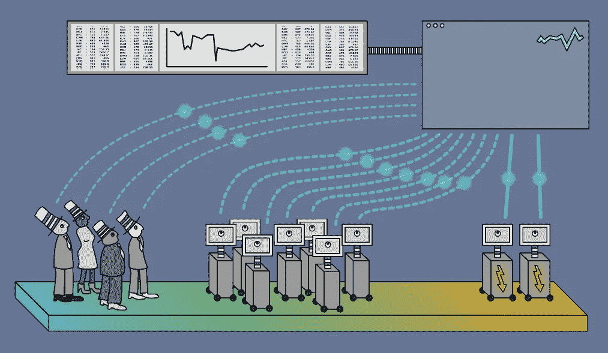

# 人工智能在经济、贸易和预测中的应用

> 原文：<https://towardsdatascience.com/applications-of-ai-in-economics-trading-and-forecasting-288c4a466af8?source=collection_archive---------6----------------------->

随着第一台计算机的出现，许多经济学家对计算机的应用感兴趣。随着互联网的发明，大量的数据可供分析。此外，这种趋势如今仍在继续，在许多现实世界的任务中，如交易，人工智能积极超越并取代金融工作者。

人工智能相对于人类的主要优势是处理大量输入数据的能力。例如，要评估未来的股票价格，你可以使用来自公司活动、评论、新闻、推特和许多其他来源的信息。相反，对于人类交易员来说，实时处理所有这些数据几乎是不可能的。看看这个:

研究人员开发了许多不同的技术，将人工智能应用于金融科技的各个分支。例如，[递归神经网络](http://cognitivechaos.com/understanding-recurrent-nn-basics/)在价格预测中显示出令人信服的结果。相应地，其他深度学习方法在破产和欺诈预测、信誉测量和风险管理方面表现出色。

Left — traders, Center — common machine trading systems, Right — HFT

## 高频交易的人工智能(HFT)

直到去年，HFT 交易员还在使用非常简单的算法。首先，他们的时间框架非常有限，所以十年前大数据分析不是一个选项。如今，机器学习在交易中的影响越来越大，而 GPU 和其他[人工智能硬件](http://cognitivechaos.com/ai-hardware-smart-chips/)为大型神经网络提供了高性能。快速下降的计算成本和延迟也在**外汇交易**的人工智能进化中发挥了重要作用。

## 学习如何制作人工智能驱动的交易软件

30 多年来，人工智能开发人员对其技能在金融领域的应用越来越感兴趣。由于这个原因，他们开发了第一批[神经网络](http://cognitivechaos.com/understanding-neural-networks-fundamentals/)，甚至在 NN 在其他领域受到任何关注之前。这是可以理解的——金融科技公司的薪水相对较高。

今天你可以在网上学习如何创建这种程序。在这种情况下，您可能会对那些免费的审计课程感兴趣:

*   [交易策略](https://www.coursera.org/specializations/trading-strategy)。这个专业涵盖了从最基础的交易到创建投资组合和设计你自己的策略。
*   [计算投资](https://www.coursera.org/learn/computational-investing)。更高级的课程强调计算的观点。
*   [机器学习交易](https://www.udacity.com/course/machine-learning-for-trading--ud501)。Tucker Balch 的另一个在线课程关注的是 ML 在交易中的应用。

总而言之，我建议按照这个顺序去参观。然而，你可能会在 Coursera、edX 甚至 YouTube 等平台上找到更多的在线讲座。

*最初发表于* [*认知混乱*](http://cognitivechaos.com/applications-ai-economics-trading-forecasting/) *。*