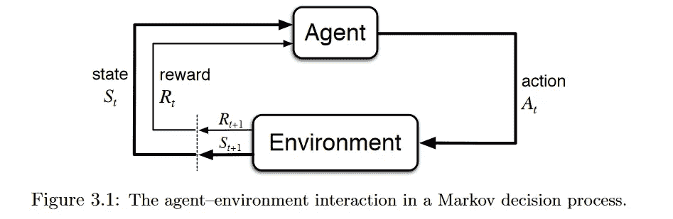
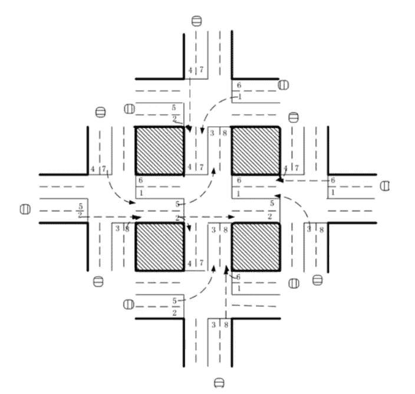
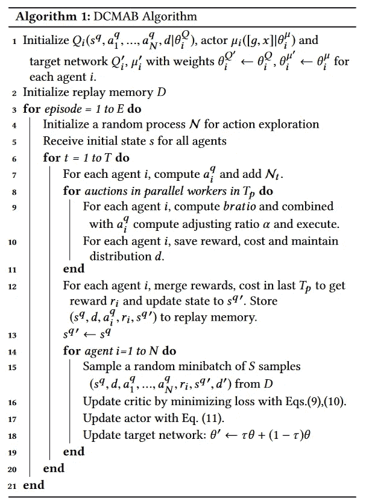

# 强化学习在现实世界中的应用

> 原文：<https://towardsdatascience.com/applications-of-reinforcement-learning-in-real-world-1a94955bcd12?source=collection_archive---------0----------------------->

## 没有推理，没有推论或比较的过程；没有对事物的思考，没有把两两放在一起；没有想法——动物不会想到盒子、食物或它要做的动作。———爱德华·桑戴克(1874-1949)，提出效果定律的心理学家。

虽然卷积神经网络(CNN)和递归神经网络(RNN)因其在计算机视觉(CV)和自然语言处理(NLP)中的应用而对企业变得越来越重要，但强化学习(RL)作为计算神经科学的框架来模拟决策过程似乎被低估了。此外，似乎很少有资源详细介绍 RL 在不同行业中的应用。尽管对 RL 的弱点提出了批评，但鉴于其在辅助决策方面的巨大潜力，RL 在企业研究领域不应被忽视。正如 Deepmind 的研究主管 Koray Kavukcuoglu 在一次会议上所说，

> “如果我们在这里工作的目标之一是人工智能，那么它就是它的核心。强化学习是学习顺序决策任务的一个非常通用的框架。另一方面，深度学习当然是我们用来学习表示的最佳算法集。这两种不同模型的结合是迄今为止我们在学习非常具有挑战性的任务的非常好的状态表示方面的最佳答案，这些任务不仅是为了解决玩具领域，而且实际上是为了解决具有挑战性的现实世界问题。”

因此，本文旨在 1)调查现实世界中强化学习应用的广度和深度；2)从不同角度看待 RL；3)说服决策者和研究人员加大研发力度。

文章的其余部分组织如下。第一节是总论。第二节介绍了 RL 在不同领域的应用，并简要说明了如何应用 RL。第三节总结了应用 RL 需要的东西。第四部分是来自其他学科的直觉，第五部分是关于 RL 在未来如何有用。第六部分是结论。

**一、强化学习简介**

RL 在机器学习中被称为半监督学习模型，是一种允许代理采取行动并与环境交互以最大化总回报的技术。RL 通常被建模为[马尔可夫决策过程](https://en.wikipedia.org/wiki/Markov_decision_process) (MDP)。

Source: [Reinforcement Learning:An Introduction](http://incompleteideas.net/book/bookdraft2017nov5.pdf)

想象一下，在你家(环境)给一个婴儿一个电视遥控器。简单来说，婴儿(代理人)将首先观察和构建他/她自己对环境(状态)的表征。然后，好奇的宝宝会采取某些行动，如按遥控器(行动)，并观察电视会如何反应(下一个状态)。由于没有反应的电视是乏味的，婴儿不喜欢它(接受负面奖励)，并会采取较少的行动导致这样的结果(更新政策)，反之亦然。宝宝会重复这个过程，直到他/她找到一个自己满意的政策(不同情况下该怎么做)(最大化总(贴现)奖励)。

强化学习的研究就是要建立一个数学框架来解决问题。例如，要找到一个好的策略，我们可以使用基于值的方法，如 Q-learning，来衡量一个动作在特定状态下有多好，或者使用基于策略的方法来直接找出在不同状态下要采取什么动作，而不知道这些动作有多好。

然而，我们在现实世界中面临的问题可能在许多不同的方面极其复杂，因此典型的 RL 算法没有解决的线索。例如，在围棋游戏中，状态空间非常大；在扑克游戏中，环境无法完全观察到；在现实世界中，有许多智能体相互作用。研究人员发明了一些方法来解决一些问题，通过使用深度神经网络来建模期望的策略、价值函数甚至转换模型，因此这被称为深度强化学习。这篇文章没有区分 RL 和 Deep RL。

网上有很多关于 RL 的好东西，感兴趣的读者可以访问 [awesome-rl](https://github.com/aikorea/awesome-rl) 、 [argmin](http://www.argmin.net/2018/06/25/outsider-rl/) 和 [dennybritz](https://github.com/dennybritz/reinforcement-learning) 。

**二。应用程序**

这部分是写给一般读者的。同时，对于对 RL 有一定了解的读者来说，也将有更大的价值。

**计算机集群中的资源管理**

设计算法来将有限的资源分配给不同的任务是具有挑战性的，并且需要人类产生的启发。论文“具有深度强化学习的资源管理”[【2】](https://people.csail.mit.edu/alizadeh/papers/deeprm-hotnets16.pdf)展示了如何使用 RL 来自动学习分配和调度计算机资源给等待的作业，目的是最小化平均作业减速。

状态空间被表述为当前的资源分配和作业的资源轮廓。对于动作空间，他们使用了一个技巧，允许代理在每个时间步选择多个动作。奖励是系统中所有工作的总和(-1/工作持续时间)。然后，他们结合强化算法和基线值来计算策略梯度，并找到最佳策略参数，以给出最小化目标的动作概率分布。点击这里查看 [Github](https://github.com/hongzimao/deeprm) 上的代码。

**交通灯控制**

在论文“基于强化学习的网络交通信号控制多智能体系统”[【3】](http://web.eecs.utk.edu/~itamar/Papers/IET_ITS_2010.pdf)中，研究人员试图设计一种交通灯控制器来解决拥堵问题。虽然只在模拟环境中测试，但他们的方法显示出优于传统方法的结果，并揭示了多智能体 RL 在设计交通系统中的潜在用途。

Five-intersection traffic network. [Source](http://web.eecs.utk.edu/~itamar/Papers/IET_ITS_2010.pdf).

五个智能体被放置在五个交叉路口的交通网络中，其中一个 RL 智能体位于中央交叉路口以控制交通信号。状态被定义为八维向量，每个元素代表每条车道的相对交通流量。代理人有八个选择，每个选择代表一个相位组合，奖励函数定义为与前一时间步相比延迟的减少。作者使用 DQN 来学习{状态，动作}对的 Q 值。

**机器人技术**

在机器人学中应用 RL 的工作非常多。读者可以参考[【10】](https://www.ias.informatik.tu-darmstadt.de/uploads/Publications/Kober_IJRR_2013.pdf)了解机器人领域的 RL 概况。特别是，[【11】](https://arxiv.org/pdf/1504.00702.pdf)训练一个机器人学习策略，将原始视频图像映射到机器人的动作。RGB 图像被馈送到 CNN，输出是电机转矩。RL 组件是引导式策略搜索，用于生成来自其自身状态分布的训练数据。

Demo of the paper.

**Web 系统配置**

web 系统中有 100 多个可配置的参数，调整参数的过程需要熟练的操作员和大量的反复试验。论文“在线 web 系统自动配置的强化学习方法”[【5】](http://ranger.uta.edu/~jrao/papers/ICDCS09.pdf)展示了在基于 VM 的动态环境中如何在多层 Web 系统中进行参数的自主重新配置的首次尝试。

重新配置过程可以被公式化为有限 MDP。状态空间是系统配置，动作空间是每个参数的{增加、减少、保持}，奖励定义为给定的目标响应时间和测量的响应时间之差。作者使用无模型 Q 学习算法来完成这项任务。

虽然作者使用了一些其他技术(如策略初始化)来弥补该问题的大状态空间和计算复杂性，而不是 RL 和神经网络的潜在组合，但相信该开创性工作为该领域的未来研究铺平了道路。

**化学**

RL 还可以应用于优化化学反应。[【4】](https://pubs.acs.org/doi/full/10.1021/acscentsci.7b00492)在论文《用深度强化学习优化化学反应》中表明，他们的模型优于最先进的算法，并推广到不同的底层机制。

结合 LSTM 来对策略函数建模，RL 代理使用由{S，A，P，R}表征的马尔可夫决策过程(MDP)来优化化学反应，其中 S 是实验条件(如温度、pH 等)的集合，A 是可以改变实验条件的所有可能动作的集合，P 是从当前实验条件到下一个条件的转移概率，R 是作为状态的函数的回报。

[应用](https://github.com/lightingghost/chemopt)很好地展示了 RL 如何在相对稳定的环境中减少耗时和反复试验的工作。

**个性化推荐**

以往的新闻推荐工作面临着新闻动态变化快、用户容易厌倦、点击率不能反映用户留存率等挑战。关捷等人在题为“DRN:新闻推荐的深度强化学习框架”的论文中已经将强化学习应用于新闻推荐系统，以解决这些问题[【1】](http://www.personal.psu.edu/~gjz5038/paper/www2018_reinforceRec/www2018_reinforceRec.pdf)。

在实践中，他们构建了四类特征，即 A)用户特征和 B)上下文特征作为环境的状态特征，以及 C)用户新闻特征和 D)新闻特征作为动作特征。这四个特征被输入到深度 Q 网络(DQN)以计算 Q 值。基于 Q 值选择推荐一系列新闻，用户对新闻的点击是 RL 代理收到的奖励的一部分。

作者还采用了其他技术来解决其他具有挑战性的问题，包括记忆回放，生存模型，决斗土匪梯度下降等。详情请参考论文。

**招标和广告**

来自阿里巴巴集团的研究人员发表了一篇论文“展示广告中多代理强化学习的实时竞价”[【6】](https://arxiv.org/pdf/1802.09756.pdf)，并声称他们的分布式基于集群的多代理竞价解决方案(DCMAB)取得了令人鼓舞的结果，因此他们计划在淘宝平台进行现场测试。

实现的细节留给用户去研究。一般来说，淘宝广告平台是商家为了向顾客展示广告而进行竞价的地方。这可能是一个多代理人的问题，因为商家正在相互竞价，他们的行为是相互关联的。在论文中，商家和顾客被分成不同的组以减少计算的复杂性。代理的状态空间表示代理的成本-收益状态，行动空间表示出价(连续)，回报表示客户群带来的收益。

The DCMAB algorithm. Source: [https://arxiv.org/pdf/1802.09756.pdf](https://arxiv.org/pdf/1802.09756.pdf)

本文还研究了其他问题，包括不同的报酬设置(自利与协调)对代理人收益的影响。

**游戏**

RL 如今如此知名，是因为它是用于解决不同游戏的主流算法，有时还能达到超人的性能。

RL vs linear model vs Human. Click [here](https://web.stanford.edu/class/psych209/Readings/MnihEtAlHassibis15NatureControlDeepRL.pdf) for the source.

最著名的一定是 alpha go[【12】](https://storage.googleapis.com/deepmind-media/alphago/AlphaGoNaturePaper.pdf)和 alpha go Zero[【13】](https://deepmind.com/blog/alphago-zero-learning-scratch/)。通过在策略网络中使用价值网络和蒙特卡罗树搜索(MCTS ),用无数人类游戏训练的 AlphaGo 已经实现了超人的性能。然而，研究人员后来回想并尝试了一种更纯粹的 RL 方法——从头开始训练。研究人员让新代理 AlphaGo Zero 与自己对弈，最终以 100 比 0 击败 AlphaGo。

**深度学习**

最近可以看到越来越多的将 RL 和其他深度学习架构相结合的尝试，它们显示出令人印象深刻的结果。

RL 中最有影响力的作品之一就是 Deepmind 将 CNN 与 RL[【7】](https://www.cs.toronto.edu/~vmnih/docs/dqn.pdf)结合的开创性工作。这样做，智能体就有能力通过高维度的感官“看见”环境，然后学会与之互动。

RL 和 RNN 是人们用来尝试新想法的另一种组合。RNN 是一种具有“记忆”的神经网络。当与 RL 结合时，RNN 赋予代理人记忆事物的能力。例如:[[8]](https://arxiv.org/pdf/1507.06527.pdf)LSTM 与 RL 相结合，创建了深度递归 Q-Network(DRQN)，用于玩 Atari 2600 游戏。[4]还利用 RNN 和 RL 解决了化学反应优化问题。

Deepmind 向 [[9]](https://arxiv.org/pdf/1804.01118.pdf) 展示了如何使用生成模型和 RL 来生成程序。在该模型中，经过敌对训练的代理人使用信号作为奖励来改进动作，而不是像在 GAN 训练中那样将梯度传播到输入空间。

Input vs Generated result. See [source](https://www.youtube.com/watch?v=N5oZIO8pE40).

**三世。在将 RL 应用于您的问题之前，您需要了解什么**

在应用 RL 之前，需要做几件事:

*   了解您的问题:您不一定需要在您的问题中使用 RL，有时您只是不能使用 RL。在决定使用 RL 之前，您可能需要检查您的问题是否具有以下某些特征:a)试错法(通过接收来自环境的反馈可以学着做得更好)；b)延迟奖励；c)可以模拟为 MDP；d)您的问题是控制问题。
*   模拟环境:在 RL 算法工作之前，需要多次迭代。我敢肯定，你不希望看到一个 RL 代理尝试不同的东西在自动驾驶汽车在高速公路上，对不对？因此，需要一个能够正确反映现实世界的模拟环境。
*   MDP:你的世界需要把你的问题变成一个 MDP。你需要设计状态空间、动作空间、奖励功能等等。您的代理人将在约束条件下执行其应执行的操作。如果你用不同的方式设计，你可能不会得到你想要的结果。
*   算法:有不同的 RL 算法可供您选择，您也可以自己提问。您想直接了解保单还是想了解价值函数？您想要无模型还是基于模型？您是否需要结合其他类型的深层神经网络或方法来解决您的问题？

为了保持客观和公正，您还会被警告 RL 的缺点，这里有一篇关于它的很棒的[帖子](https://www.alexirpan.com/2018/02/14/rl-hard.html)。

**静脉。其他学科的直觉**

RL 与心理学、生物学、神经科学的关系非常密切。如果你想一想，RL 代理所做的只是试错:它根据从环境中获得的奖励来学习其行为的好坏。这正是人类学习做决定的方式。此外，探索和开发问题，信用分配问题，试图模拟环境也是我们在日常生活中面临的问题。

经济学理论也能对 RL 有所启发。特别地，多主体强化学习(MARL)的分析可以从博弈论的角度来理解，博弈论是由约翰·纳西开发的一个研究领域，用于理解系统中主体的交互作用。除了博弈论，MARL，部分可观察马尔可夫决策过程(POMDP)也可以用于理解其他经济主题，如[市场结构](https://en.wikipedia.org/wiki/Market_structure)(如垄断、寡头垄断等)[外部性](https://en.wikipedia.org/wiki/Externality)和[信息不对称](https://en.wikipedia.org/wiki/Information_asymmetry)。

**五、RL 未来可能实现的目标**

RL 仍然有很多问题，不容易使用。然而，只要在解决这些问题上付出更多的努力，研究性学习将在以下几个方面产生影响:

*   协助人类:也许说人工智能有一天会进化成人工智能(AGI)有点过了，但人工智能肯定有潜力协助人类并与之合作。想象一下，一个机器人或一个虚拟助手与你一起工作，将你的行动纳入其考虑范围，以采取行动，从而实现一个共同的目标。那岂不是很棒？
*   理解不同策略的后果:生活如此神奇是因为时间不会倒流，事情只会发生一次。然而，有时我们想知道如果我采取不同的行动，事情会有什么不同(至少在短期内)？或者，如果教练采用另一种策略，克罗地亚会有更大的机会赢得 2018 年世界杯吗？当然，要做到这一点，我们需要对环境、转移函数等进行完美的建模，还要分析代理之间的相互作用，这在目前看来是不可能的。

**六。结论**

本文只是展示了 RL 在各种行业中应用的一些例子。他们不应该限制你的 RL 用例，一如既往，你应该使用第一原则来理解 RL 的本质和你的问题。

如果你是一家公司的决策者，我希望这篇文章足以说服你重新思考你的业务，看看 RL 是否有潜在的用途。如果你是一名研究人员，我希望你会同意我的观点，虽然 RL 仍然有不同的缺点，但这也意味着它有很多改进的潜力和很多研究机会。

你有什么想法？你能想到 RL 能解决的任何问题吗？

**参考文献**

[1]郑，张，郑，向，倪.袁，谢，李。DRN:新闻推荐的深度强化学习框架。2018.

[2] H.Mao，Alizadeh，M. Alizadeh，Menache，I.Menache 和 S.Kandula .具有深度强化学习的资源管理.2016 年 ACM 网络热点专题研讨会。

[3] I. Arel，C. Liu，T. Urbanik，A. Kohls，“基于强化学习的多智能体网络交通信号控制系统”，智能交通系统，2010 .

[4]周志忠、李晓霞和。用深度强化学习优化化学反应。ACSCentral Science3，2017。

[5]卜晓霞，饶军，徐春忠。在线 web 系统自动配置的强化学习方法。分布式计算系统，2009。第 29 届 IEEE 国际会议。IEEE，2019。

[6]靳，宋春春，李，盖，王，张。展示广告中基于多智能体强化学习的实时竞价。arXiv 预印本 arXiv:1802.09756，2018。

[7] V. Mnih、K. Kavukcuoglu、D. Silver、A. Graves、I. Antonoglou、D. Wierstra 和 M. Riedmiller。用深度强化学习玩雅达利。arXiv 预印本 arXiv:1312.5602，2013。

M. J. Hausknecht 和 P. Stone。部分可观测 MDP 的深度递归 Q 学习。继续。Conf .的。人工智能，AAAI，2015。

[9] Y. Ganin、T. Kulkarni、I. Babuschkin、S. Eslami 和 O. Vinyals 使用强化对抗学习的图像合成程序。arXiv 预印本 arXiv:1804.01118。

10j .科贝尔、J. A. D .巴格内尔、j .彼得斯。机器人学中的强化学习:综述。 *Int。j .机器人。2013 年 7 月的决议。*

[11] S. Levine、C. Finn、T. Darrell 和 P. Abbeel。深度视觉运动策略的端到端培训。arXiv 预印本 arXiv:1504.00702，2015。

[12]西尔弗、a .黄、a .、C.J .、A. Guez、L. Sifre、G. van den Driessche、J. Schrittwieser、I. Antonoglou、V. Panneershelvam、M. Lanctot、S. Dieleman、D. Grewe、J. Nham、N. Kalchbrenner、I. Sutskever、T. Lillicrap、M. Leach、K. Kavukcuoglu、T. Graepel 和 D. Has-sabis。用深度神经网络和树搜索掌握围棋。自然，529(7587)。2016.

[13]西尔弗、施里特维泽、西蒙扬、安托诺格鲁、黄、古埃斯、休伯特、贝克、赖、博尔顿、陈、利利卡普、许、西弗尔、范登德里斯切、格雷佩尔和哈萨比斯。在没有人类知识的情况下掌握围棋。《自然》，2017。