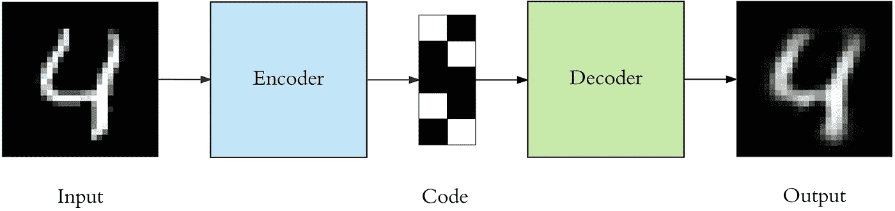
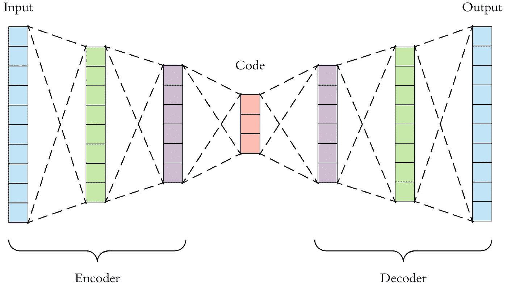
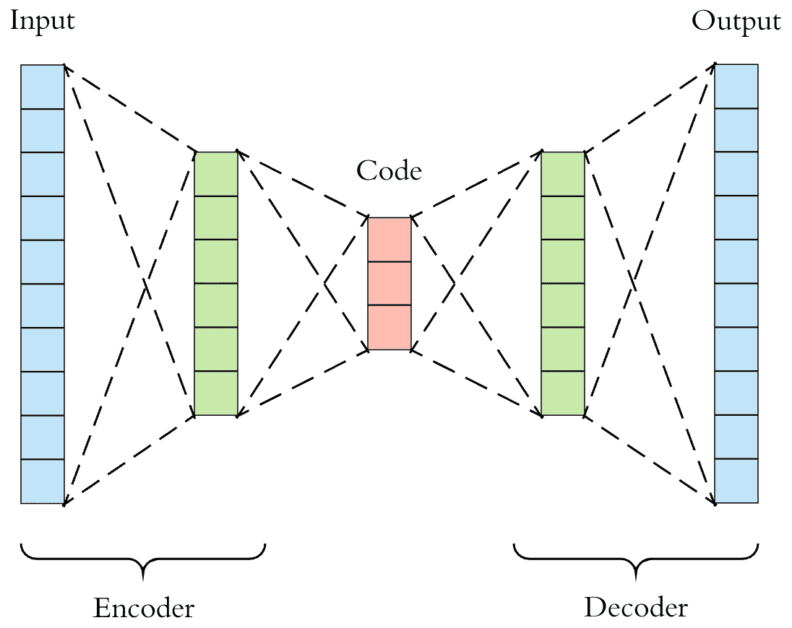
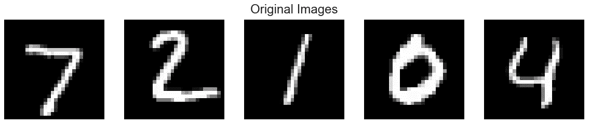
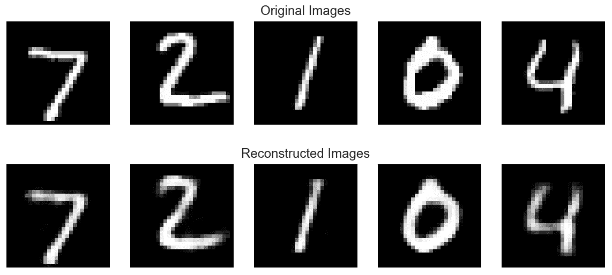
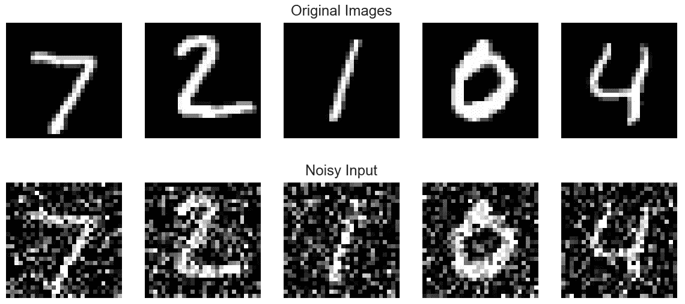
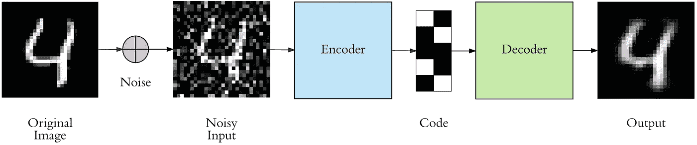
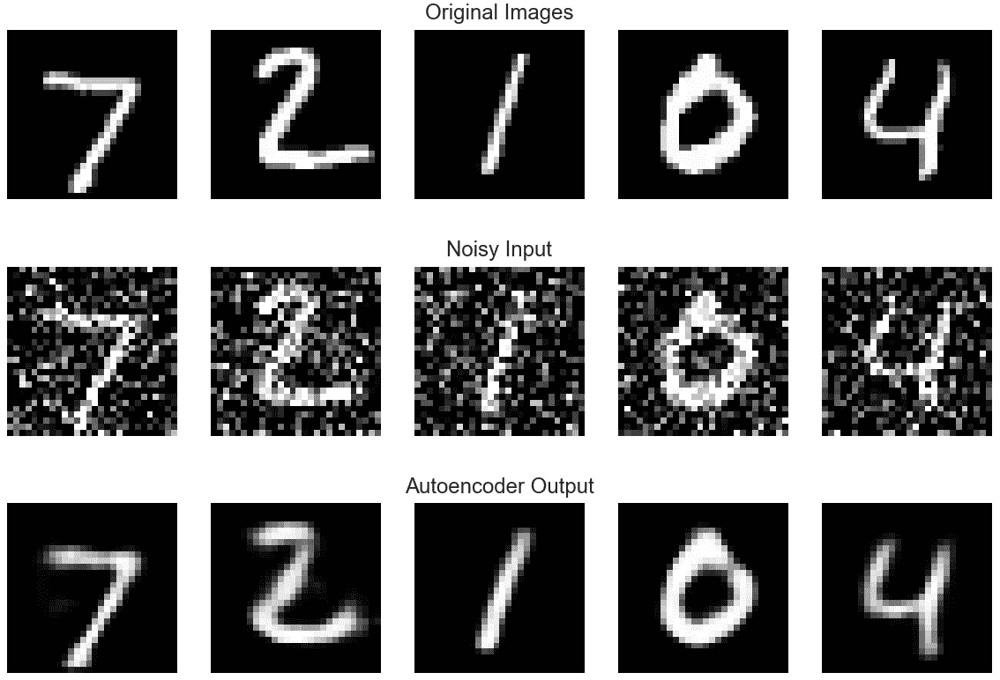
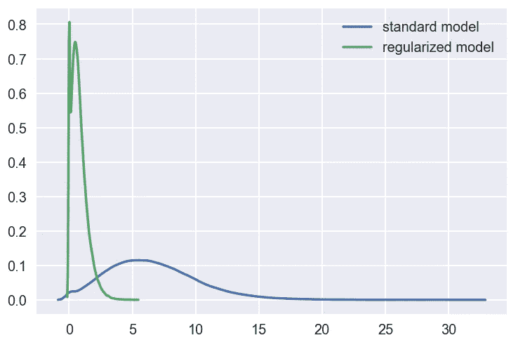

# 应用深度学习-第 3 部分:自动编码器

> 原文：<https://towardsdatascience.com/applied-deep-learning-part-3-autoencoders-1c083af4d798?source=collection_archive---------0----------------------->

# 概观

欢迎来到应用深度学习系列的第 3 部分。第 1 部分是对人工神经网络的实际介绍，包括理论和应用，有很多代码示例和可视化。在[第二部分](https://medium.com/towards-data-science/applied-deep-learning-part-2-real-world-case-studies-1bb4b142a585)中，我们将深度学习应用于真实世界的数据集，涵盖了 3 个最常见的问题作为案例研究:二分类、多类分类和回归。

现在我们将开始深入具体的深度学习架构，从最简单的开始:自动编码器。

1.  [简介](#f686)
2.  [架构](#3f72)
3.  [实施](#4214)
4.  [去噪自动编码器](#28b1)
5.  [稀疏自动编码器](#a265)
6.  [用例](#ad4f)
7.  [结论](#8e50)

这篇文章的代码可以从这里获得[作为一个 Jupyter 笔记本，你可以随意下载并亲自试用。](https://github.com/ardendertat/Applied-Deep-Learning-with-Keras/blob/master/notebooks/Part%203%20-%20Autoencoders.ipynb)

# 1.介绍

自动编码器是一种特定类型的前馈神经网络，其输入与输出相同。他们将输入压缩成一个低维的码，然后从这个表示中重建输出。代码是输入的一个紧凑的“总结”或“压缩”，也称为*潜在空间表示。*

自动编码器由 3 个部分组成:编码器、代码和解码器。编码器压缩输入并产生代码，然后解码器仅使用该代码重建输入。



要构建一个自动编码器，我们需要三样东西:编码方法、解码方法和一个损失函数来比较输出和目标。我们将在下一节探讨这些。

自动编码器主要是一种降维(或压缩)算法，具有几个重要属性:

*   特定数据:自动编码器只能有意义地压缩数据，就像它们被训练的那样。因为它们学习特定于给定训练数据的特征，所以它们不同于像 gzip 这样的标准数据压缩算法。因此，我们不能指望一个经过手写数字训练的自动编码器来压缩风景照片。
*   有损:自动编码器的输出将不会与输入完全相同，它将是一个接近但降级的表示。如果你想要无损压缩，他们不是出路。
*   无监督的:为了训练一个自动编码器，我们不需要做任何花哨的事情，只需要向它扔原始输入数据。自动编码器被认为是一种*无人监管的*学习技术，因为它们不需要明确的标签来训练。但更准确地说，它们是*自我监督的*，因为它们从训练数据中生成自己的标签。

# 2.体系结构

让我们来探讨编码器、代码和解码器的细节。编码器和解码器都是全连接的前馈神经网络，本质上是我们在[第一部分](https://medium.com/towards-data-science/applied-deep-learning-part-1-artificial-neural-networks-d7834f67a4f6)中提到的神经网络。代码是人工神经网络的单层，具有我们选择的维度。代码层中的节点数量(代码大小)是我们在训练自动编码器之前设置的一个*超参数*。



这是一个自动编码器的更详细的可视化。首先，输入通过编码器，这是一个完全连接的人工神经网络，以产生代码。具有类似 ANN 结构的解码器仅使用代码产生输出。目标是获得与输入相同的输出。注意，解码器架构是编码器的镜像。这不是一个要求，但这是典型的情况。唯一的要求是输入和输出的维数需要相同。中间的任何东西都可以玩。

在训练自动编码器之前，我们需要设置 4 个超参数:

*   代码大小:中间层的节点数。尺寸越小，压缩越大。
*   层数:自动编码器可以有多深就有多深。在上图中，我们在编码器和解码器中都有两层，没有考虑输入和输出。
*   每层的节点数量:我们正在开发的自动编码器架构被称为*堆叠自动编码器*，因为这些层是一个接一个堆叠的。通常堆叠的自动编码器看起来像一个“三明治”。每层的节点数量随着编码器的每个后续层而减少，并在解码器中增加。就层结构而言，解码器与编码器也是对称的。如上所述，这是不必要的，我们完全控制这些参数。
*   损失函数:我们或者使用*均方误差*或者*二元交叉熵*。如果输入值在范围[0，1]内，那么我们通常使用交叉熵，否则我们使用均方误差。欲了解更多详情，请查看此[视频](https://www.youtube.com/watch?v=xTU79Zs4XKY)。

通过反向传播，自动编码器的训练方式与人工神经网络相同。查看第 1 部分的[介绍](https://medium.com/towards-data-science/applied-deep-learning-part-1-artificial-neural-networks-d7834f67a4f6#04e7)了解更多关于神经网络如何被训练的细节，它直接应用于自动编码器。

# 3.履行

现在让我们为下面的架构实现一个自动编码器，编码器和解码器中的一个隐藏层。



我们将使用非常流行的 MNIST 数据集作为输入。它包含手写数字的黑白图像。



它们的大小是 28x28，我们用它们作为[0，1]之间的 784 个数字的向量。查看 [jupyter 笔记本](https://github.com/ardendertat/Applied-Deep-Learning-with-Keras/blob/master/notebooks/Part%203%20-%20Autoencoders.ipynb)了解详情。

我们现在将使用 Keras 实现自动编码器。超参数为:隐层 128 个节点，码长 32，二进制交叉熵为损失函数。

这非常类似于我们工作过的人工神经网络，但是现在我们使用的是 Keras 函数式 API。有关详细信息，请参考本指南[，但这里有一个快速比较。之前，我们使用顺序 API 添加层，如下所示:](https://keras.io/getting-started/functional-api-guide/)

`model.add(Dense(16, activation='relu'))
model.add(Dense(8, activation='relu'))`

使用函数式 API，我们可以做到:

`layer_1 = Dense(16, activation='relu')(input)
layer_2 = Dense(8, activation='relu')(layer_1)`

这种定义复杂模型的方式更加冗长，但是更加灵活。我们可以很容易地获取模型的一部分，例如只有解码器，然后用它工作。 *Dense* 方法的输出是一个可调用层，使用函数 API 我们为它提供输入并存储输出。一层的输出成为下一层的输入。使用顺序 API， *add* 方法隐式地为我们处理了这个问题。

注意，所有层都使用 *relu* 激活函数，因为这是深度神经网络的标准。最后一层使用 *sigmoid* 激活，因为我们需要输出在[0，1]之间。输入也在相同的范围内。

还要注意对拟合函数的调用，之前我们用人工神经网络做过:

`model.fit(x_train, y_train)`

但是现在我们知道了:

`model.fit(x_train, x_train)`

请记住，自动编码器的目标与输入相同。这就是我们提供训练数据作为目标的原因。

## 形象化

现在让我们想象一下我们的自动编码器如何重构它的输入。

我们简单地通过使用 Keras 的预测功能在测试集上运行自动编码器。对于测试集中的每一幅图像，我们得到自动编码器的输出。我们期望输出与输入非常相似。



他们确实非常相似，但不完全相同。我们可以在最后一个数字“4”中更清楚地注意到这一点。由于这是一个简单的任务，我们的自动编码器表现得相当好。

## 建议

我们完全控制了自动编码器的架构。我们可以通过增加层数、每层节点数以及最重要的代码大小来使它变得非常强大。增加这些超参数将让自动编码器学习更复杂的编码。但是我们应该小心不要让它太强大。否则，自动编码器将简单地学习将其输入复制到输出，而不学习任何有意义的表示。它将只是模仿身份功能。自动编码器将完美地重建训练数据，但是它将*过度拟合*，而不能推广到新的实例，这不是我们想要的。

这就是为什么我们更喜欢“三明治”架构，并有意保持代码较小。由于编码层比输入数据具有更低的维度，所以自动编码器被称为*欠完成*。它将无法直接将其输入复制到输出，并将被迫学习智能特性。如果输入数据具有某种模式，例如数字“1”通常包含某种程度上的直线，而数字“0”是圆形，则它将学习这一事实，并以更紧凑的形式对其进行编码。如果输入数据是完全随机的，没有任何内部相关性或依赖性，那么欠完整自动编码器将不能完美地恢复它。但幸运的是，在现实世界中，有很多依赖。

# 4.降噪自动编码器

保持较小的代码层迫使我们的自动编码器学习数据的智能表示。还有另一种方法来迫使自动编码器学习有用的特征，即向其输入添加随机噪声，并使其恢复原始的无噪声数据。这样，自动编码器不能简单地将输入复制到其输出，因为输入也包含随机噪声。我们要求它减去噪音并产生有意义的数据。这被称为*去噪自动编码器。*



最上面一行包含原始图像。我们向它们添加随机高斯噪声，噪声数据成为自动编码器的输入。自动编码器根本看不到原始图像。但是我们期望自动编码器重新生成无噪声的原始图像。



去噪 autoencoder 的实现和常规的实现之间只有一个很小的区别。架构一点没变，只有 fit 功能。我们按如下方式训练常规自动编码器:

`autoencoder.fit(x_train, x_train)`

去噪自动编码器被训练为:

`autoencoder.fit(x_train_noisy, x_train)`

就这么简单，其他的都完全一样。自动编码器的输入是有噪声的图像，而预期目标是原始的无噪声图像。

## 形象化

现在让我们想象一下我们是否能够恢复无噪声的图像。



看起来不错。最下面一行是自动编码器输出。我们可以通过使用更复杂的自动编码器架构来做得更好，例如*卷积自动编码器*。我们将在下一篇文章中讨论卷积。

# 5.稀疏自动编码器

我们介绍了两种方法来迫使自动编码器学习有用的特性:保持较小的代码大小和消除自动编码器的噪声。第三种方法是使用*正规化*。我们可以通过使用*稀疏约束*来调整自动编码器，使得只有一小部分节点具有非零值，称为活动节点。

特别地，我们在损失函数中增加了一个惩罚项，使得只有一小部分节点成为活动的。这迫使自动编码器将每个输入表示为少量节点的组合，并要求它发现数据中有趣的结构。即使代码很大，这种方法也是有效的，因为在任何时候只有一小部分节点是活动的。

在 Keras 中，只用一个参数就可以很容易地做到这一点。提醒一下，之前我们创建了如下代码层:

```
code = Dense(code_size, activation='relu')(input_img)
```

我们现在通过指定正则化强度来添加另一个名为*activity _ regulator*的参数。这通常是一个在[0.001，0.000001]范围内的值。这里我们选择了 10e-6。

```
code = Dense(code_size, activation='relu', activity_regularizer=l1(10e-6))(input_img)
```

由于增加了正则化项，稀疏模型的最终损失比标准模型高 0.01。

让我们证明正则化模型生成的编码确实是稀疏的。如果我们查看测试集中图像的代码值的直方图，分布如下:



标准模型的平均值为 6.6，但正则化模型的平均值为 0.8，降幅相当大。我们可以看到正则化模型中的一大块代码值确实是 0，这正是我们想要的。正则化模型的方差也相当低。

# 6.用例

现在我们可能会问以下问题。自动编码器在压缩输入方面有多好？它们是常用的深度学习技术吗？

不幸的是，自动编码器在现实应用中并没有广泛使用。作为一种压缩方法，它们并不比它的替代品表现得更好，例如 jpeg 压缩照片比自动编码器更好。事实上，自动编码器是特定于数据的，这使得它们作为一种通用技术是不切实际的。不过，它们有 3 种常见的使用情形:

*   数据去噪:我们已经在图像上看到了这样的例子。
*   降维:可视化高维数据具有挑战性。t-SNE 是最常用的方法，但它的维数很大(通常在 32 以上)。因此，自动编码器被用作预处理步骤来降低维度，这种压缩的表示被 t-SNE 用于在 2D 空间中可视化数据。关于 t-SNE 的精彩文章，请参考[这里](https://distill.pub/2016/misread-tsne/)和[这里](http://colah.github.io/posts/2014-10-Visualizing-MNIST/)。
*   变型自动编码器(VAE):这是自动编码器的一个更加现代和复杂的用例，我们将在另一篇文章中介绍它们。但是作为一个快速的总结，VAE 学习了模拟输入数据的概率分布的参数，而不是学习普通自动编码器的任意函数。通过从该分布中采样点，我们还可以使用 VAE 作为生成模型。[这里的](http://kvfrans.com/variational-autoencoders-explained/)就是一个很好的参考。

# 7.结论

自动编码器是一种非常有用的降维技术。它们作为深度学习入门课程的教材非常受欢迎，很可能是因为它们的简单性。在这篇文章中，我们详细介绍了它们，希望您喜欢。

如果你想自己动手，这篇文章的全部代码可以在这里[找到](https://github.com/ardendertat/Applied-Deep-Learning-with-Keras/blob/master/notebooks/Part%203%20-%20Autoencoders.ipynb)。如果您有任何反馈，请随时通过推特[联系我](https://twitter.com/ardendertat)。