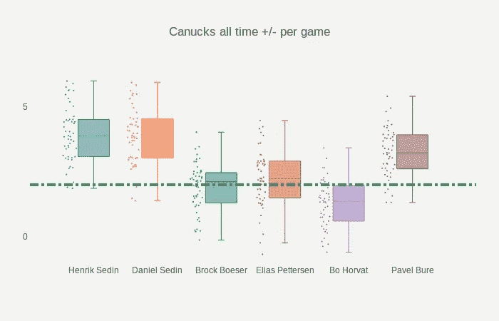
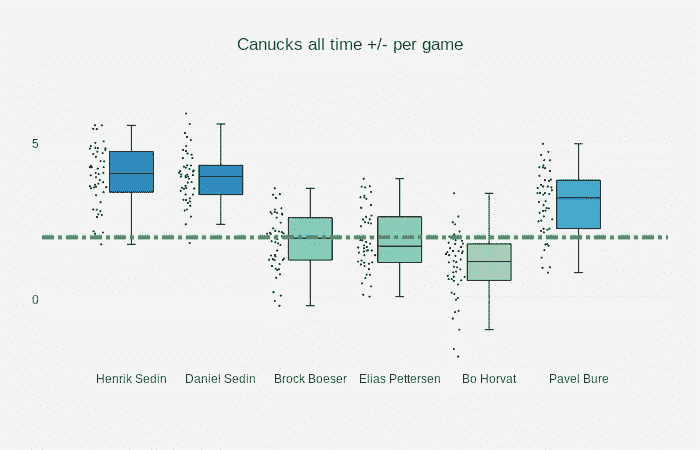

# 给盒图着色

> 原文：<https://towardsdatascience.com/applying-a-custom-colormap-with-plotly-boxplots-5d3acf59e193?source=collection_archive---------3----------------------->

## 将自定义色标应用于绘图箱线图

我的老板最近要求我为一个[破折号](https://plot.ly/products/dash/)应用程序对一系列[plottly](https://plot.ly/)[Box plots](https://plot.ly/python/box-plots/)应用色标。这个想法是在同一个图上绘制多个盒状图，并根据每个盒状图与数据集中总体中值的距离，使每个盒状图变暗或变亮。

# 问题是

这里的问题是 Plotly 只支持热图的[色标](https://plot.ly/python/colorscales/)，散点图&等高线图。

我将通过绘制一些为加拿大人球员生成的数据来演示默认行为，如下所示:

> 注意:完整的代码在文章的最后



绿色虚线代表`NHL league average +/- per game at +2.0`，我的老板想要的是根据`each players median +/-` 值与`league average`的距离将每个方框图涂成更深或更浅的颜色。

# 解决方案

鉴于我已经处于 Python 环境中，我选择使用来自 [Matplotlib](https://matplotlib.org/) Python 模块的`colormap` & `colormap normalizer`特性。

第一步是导入 Matplotlib:

```
import matplotlib.pyplot as plt
import matplotlib
import pandas as pd
```

然后确定数据集中的`min`和`max`值:

```
x_data = ['Henrik Sedin', 'Daniel Sedin',
          'Brock Boeser', 'Elias Pettersen',
          'Bo Horvat', 'Pavel Bure',]# Generate random data
y0 = np.random.randn(50)+4
y1 = np.random.randn(50)+4
y2 = np.random.randn(50)+2
y3 = np.random.randn(50)+2
y4 = np.random.randn(50)+1
y5 = np.random.randn(50)+3y_data = [y0,y1,y2,y3,y4,y5]df = pd.DataFrame(y_data)
vmin, vmax = df.min().min(), df.max().max()
```

初始化 Matplotlib cmap 和规格化器:

```
norm = matplotlib.colors.Normalize(vmin=vmin, vmax=vmax)
cmap = matplotlib.cm.get_cmap('GnBu') # green to blue color way
```

找到每个`y_data`的中间值，并使用规格化器根据中间值将其映射到适当的颜色:

```
for xd, yd in zip(x_data, y_data):

        median = np.median(yd) # find the median
        color = 'rgb' + str(cmap(norm(median))[0:3]) # normalize

        traces.append(go.Box(
            y=yd,
            name=xd,
            boxpoints='all',
            jitter=0.5,
            whiskerwidth=0.2,
            fillcolor=color,      # add the box plot color
            marker=dict(
                size=2,
            ),
            line=dict(width=1)
        ))
```

# 维奥拉。

`players median +/-`离`league average`越远，产生的图将呈现越暗的`fillcolor`，反之亦然。



# 奖金

下面是获得上述结果的完整代码:

```
from plotly import __version__
from plotly.offline import download_plotlyjs, init_notebook_mode, plot, iplot
init_notebook_mode(connected=True)
import plotly.graph_objs as go
import numpy as np
import pandas as pd
import matplotlib.pyplot as plt
import matplotlibx_data = ['Henrik Sedin', 'Daniel Sedin',
          'Brock Boeser', 'Elias Pettersen',
          'Bo Horvat', 'Pavel Bure',]y0 = np.random.randn(50)+4
y1 = np.random.randn(50)+4
y2 = np.random.randn(50)+2
y3 = np.random.randn(50)+2
y4 = np.random.randn(50)+1
y5 = np.random.randn(50)+3y_data = [y0,y1,y2,y3,y4,y5]traces = []df = pd.DataFrame(y_data)
vmin, vmax = df.min().min(), df.max().max()norm = matplotlib.colors.Normalize(vmin=vmin, vmax=vmax)
cmap = matplotlib.cm.get_cmap('GnBu')for xd, yd in zip(x_data, y_data):
        median = np.median(yd)
        color = 'rgb' + str(cmap(norm(median))[0:3])

        traces.append(go.Box(
            y=yd,
            name=xd,
            boxpoints='all',
            jitter=0.5,
            whiskerwidth=0.2,
            fillcolor=color,
            marker=dict(
                size=2,
                color='rgb(0, 0, 0)'
            ),
            line=dict(width=1),
        ))layout = go.Layout(
    title='Canucks all time +/- per game',
    yaxis=dict(
        autorange=True,
        showgrid=True,
        zeroline=True,
        dtick=5,
        gridcolor='rgb(255, 255, 255)',
        gridwidth=1,
        zerolinecolor='rgb(255, 255, 255)',
        zerolinewidth=2,
    ),
    margin=dict(
        l=40,
        r=30,
        b=80,
        t=100,
    ),
    paper_bgcolor='rgb(243, 243, 243)',
    plot_bgcolor='rgb(243, 243, 243)',
    showlegend=False,
    shapes= [{
      'type': 'line',
      'x0': -1,
      'y0': 2,
      'x1': 6,
      'y1': 2,
      'line': {
        'color': 'rgb(50, 171, 96)',
        'width': 4,
        'dash': 'dashdot'
      }
    }]
)fig = go.Figure(data=traces, layout=layout)
iplot(fig)
```