# 应用人工智能帮助人们戒烟:早期结果

> 原文：<https://towardsdatascience.com/applying-artificial-intelligence-to-help-people-quit-smoking-early-results-a3e5581d560?source=collection_archive---------3----------------------->

*注意:报告的所有数据均来自实际用户，经过净化以保护其个人信息。我们的数据收集和报告系统旨在保护用户个人信息的隐私。*

*TL；博士:我们要让世界摆脱吸烟，这很有挑战性，但我们有一个计划，需要你的帮助。在* [*报名 cue.kiwi.ai*](http://cue.kiwi.ai)

你最后一次考虑戒烟是什么时候？如果你像世界上 10 亿吸烟者中的任何一个，那很可能是今年。如果你碰巧有一个智能手表，我们可能有办法证明它的购买，我们的应用程序 [Cue 是你减少吸烟的冠军](http://cue.kiwi.ai)

保持任何习惯的一个关键部分是一致性和易用性。如果改变我的饮食习惯需要我随身携带一个写字板，记录我吃的所有东西，那么我正在改变两个习惯:1)吃得更健康 2)记录饮食…这在一个谷歌搜索一个东西要花更长时间(0.59 秒)的世界里是相当困难的

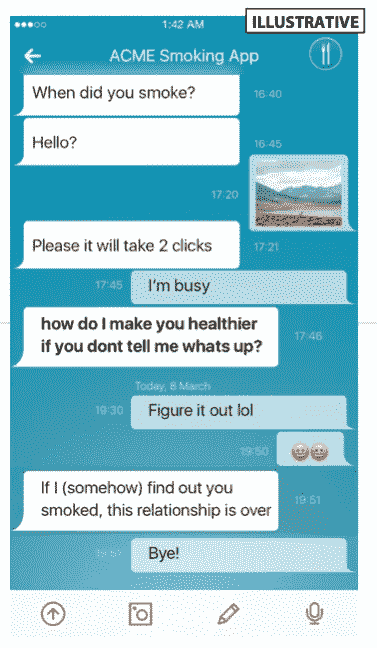

Illustrative Typical Behaviour Change Apps/Products

当我们开始制作减少吸烟的软件时，我们有两个关键原则:1)它不能让用户做更多的工作 2)它必须提供超越新奇阶段的好处…我们不会编造虚荣指标

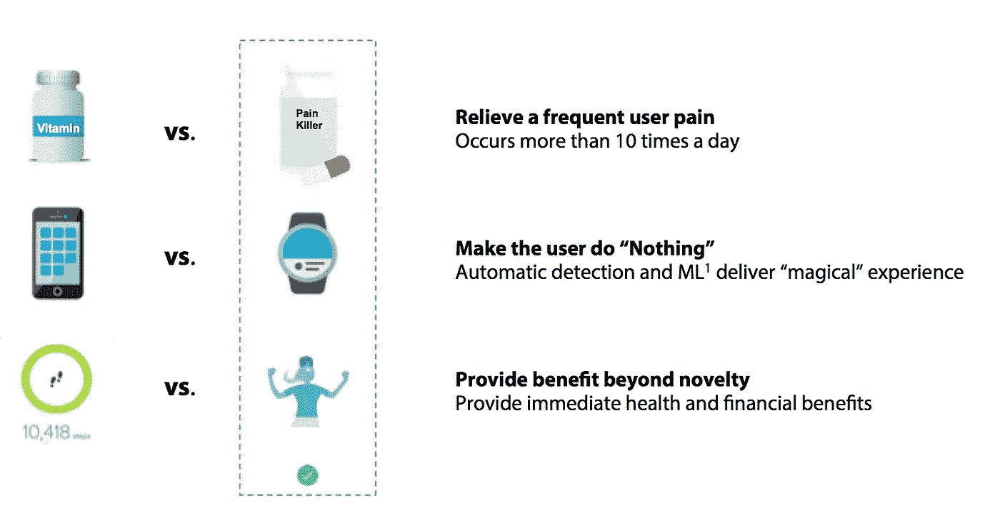

1) Machine Learning to deliver an extremely personalized experience, that drives actual benefit

我们已经将类似的思维应用于跟踪香烟；我们开发了一种算法，可以自动检测你何时吸烟。我们的应用程序是你的冠军，它通过对平均吸烟间隔时间进行微小但持续的改进来推动你戒烟

# **kiwi . ai 和 Cue 背景:**

四年前，我们制作了第一个追踪你吸烟时的原型，这里有一个[开源项目](https://github.com/kiwiwearables/breathe-io)的链接；当时还没有技术和市场的采用，我们也不打算为吸烟定制可穿戴设备……所以我们等待着

在那段时间里，我们开发并授权了运动识别软件，该软件使用嵌入式神经网络以低功耗、高精度地跟踪运动。从那时起，我们已经支持了 20 多个客户，包括大型技术公司的大品牌，如 IBM、OEM 设备制造商、机器人公司和医疗保健提供商

> 我们经常会考虑一些用例，这些用例将会为消费者实质性地解决问题，让他们的健康状况变得更好，为他们省钱，让他们更快乐。也许这是因为我们仍然处于可穿戴设备的早期阶段，但**我们仍然需要给消费者一个佩戴可穿戴设备的理由**。

# 减少吸烟

吸烟是一个真正的问题。它杀死人，花费医疗系统一吨，对除了卖香烟的人之外的所有玩家都是可怕的

这也是一个**难以解决的问题**，否则我们仍然不会有世界各地的十亿烟民，他们每年至少尝试戒烟一次，但收效甚微

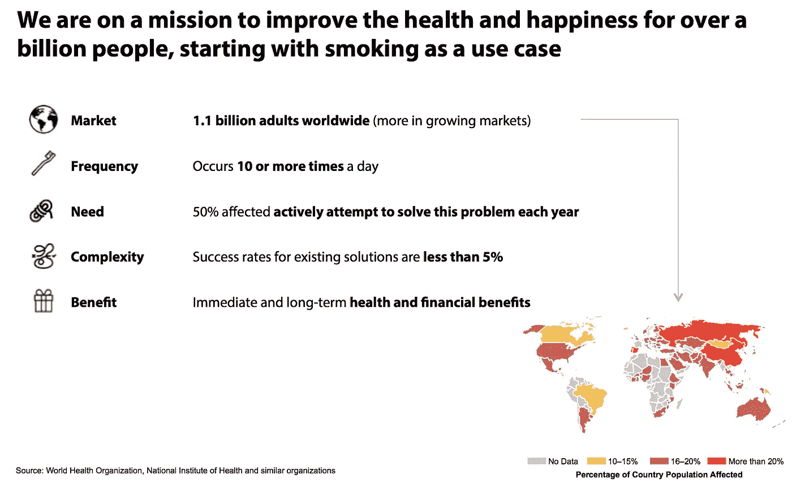

Kiwi is on a mission to make the lives of at least a billion people happier and healthier

这是一种能带来实实在在的健康和经济利益的产品，例如，如果它起作用，你知道，你会感觉+看起来更好，每个人(包括你爱的人、银行账户、医生……都更开心),这是使用手表应用程序比使用电话**能提供好 10 倍的东西**

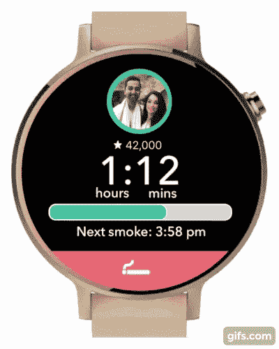

Cue App for Android Wear

这也有助于我们团队中的两个人是吸烟者，所以我们有第一批豚鼠来测试我们软件的最早版本。在与数百名客户交谈后(这很容易，因为他们通常在建筑物外闲逛)，我们继续完善设计、功能和用户体验

我们最近运行了一个初始用户组，基于我们的目标人口统计，但我们不知道的人。我们发现我们的朋友过于担心我们的感受

我们测试的第一个假设是，人们是否真的会比平时等待更长的时间来抽下一支烟。在我们应用程序的第一版中(由于我们在动作识别方面的工作，自动跟踪率达到 99%)，我们对一个人群进行了 30 天的采样

以下是我们目前收集的数据的简要概述:

> 要点: ***人们会比平时等待*** *更长时间，他们* ***经常在下午 3 点*** *吸烟，每天的吸烟模式变化很大(毕竟人生是不可预测的)，而* ***总的趋势是一致地减少吸烟*** *如果部署了一个* ***极其个性化的计划*** *来减少吸烟*

```
**Hypothesis 1: Do People Wait for Suggested Cigarette Time?**Before Suggested Time: 0359
After Suggested Time: 1049
Total Cigarettes : 1408**Answer so far: YES**
```

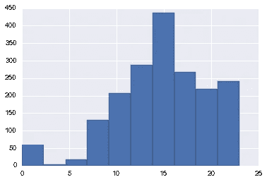

Most Common Time To Smoke (3PM “coffee break”)

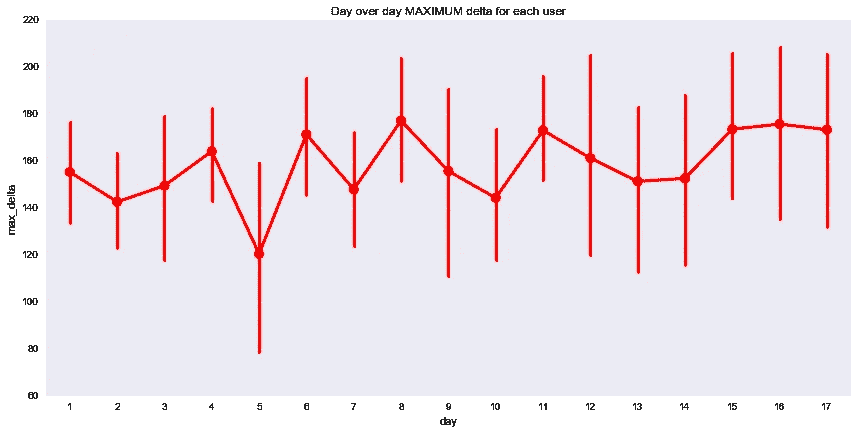

Our Market Test User Base : Wide Variations on a Daily Basis

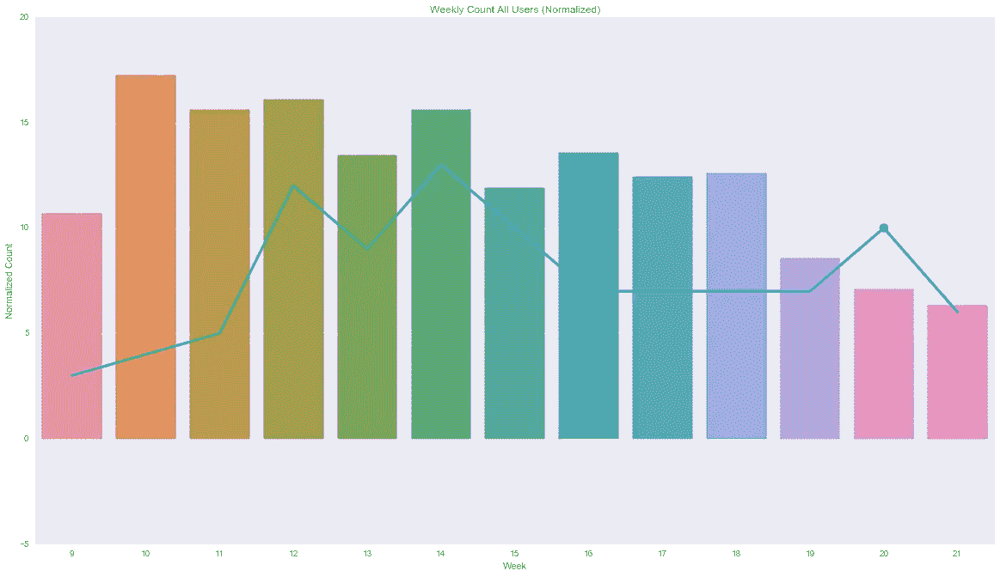

Up to 50% Reduction Across 3 month Period Over a Testing Sample User Base

# 验证我们的假设

这就是我们需要你帮助的地方；我们在多伦多的一个小组中进行了本地测试，每个小组都成功实现了高达 50%的减排。

> 我们现在希望将我们的应用程序推广到尽可能大的群体中；人们进一步测试，并帮助我们进一步完善我们的产品，以杜绝吸烟

该应用程序的习惯改变部分通过积分鼓励你为下次吸烟多等几分钟，这些积分可以让你在星巴克/优步获得奖励，双赢！我们已经请了一些最好的戒烟专家来找出我们计划中的漏洞，他们都鼓励我们继续这个项目。但是没有什么比 10，000 个更健康的用户更能证实一个假设，所以我们需要你的帮助

如果你吸烟，请[注册](http://cue.kiwi.ai)或者通过与吸烟的朋友分享来帮助你。只需轻点几下鼠标，你就能让某人的生活发生巨大变化


Cue Product Screenshots

# 技术方面

这篇文章的剩余部分将讨论我们产品的机器学习方面，包括

1.  识别每个人独特的运动模式&从所有其他动作中辨别吸烟[自动分类]
2.  基于个人和综合数据预测一个人何时会吸烟

# 自动分类:最佳用户体验

我们发现最好的用户体验是用户不需要做任何事情，仍然感觉他们在赢。为了在吸烟时做到这一点，我们需要想出一种方法来自动检测用户何时吸烟。我们通过使用带有动作识别的 kiwi 工具包来实现这一点，就像我们如何计算步数一样，我们检测手到嘴的运动来确定一个人何时吸烟

重要的一点是**我们所有的分类算法都在手表上运行**；因此，一旦应用程序被下载，没有连接到您的手机或互联网需要让它工作！

神经网络用于分离可能重叠的动作，如举起物体、举手行走或热情交谈

这是一个在线性判别分析中展示这种分离的奇特图表:

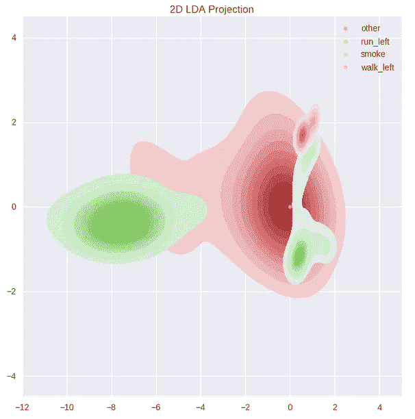

How Smoking Separates From Walking and Other Movements

# 预测一个人何时可能吸烟

为了更好地帮助人们将吸烟的间隔时间推得越来越长；需要预测你预期的下一支烟会是什么时候，从这里我们稍微增加一点时间来保持行为改变的微妙影响

下面是一周内人们每天吸烟的情况:

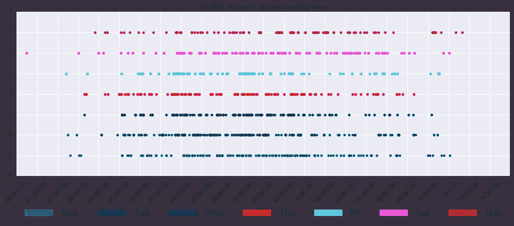

See how there are breaks each day and Saturday and Sunday are a bit later than weekdays

# 预测以及为什么这是有价值的

类似于能够自动检测一个人何时吸烟，可以应用一种方法来预测用户一天中何时吸烟，像大多数模型问题一样，挑战是如何获得干净的数据，并确保您有一个相关的基准。例如，卷积神经网络可以用于照片，其中不同的 RGB 信号可以分离，以定义带标签的猫和狗照片之间的差异。这如何应用于一天中的几个数据点，比如吸烟次数？

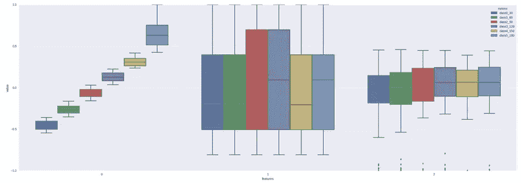

Feature Separation For Predicting a Person’s Next Smoke

我们所做的是生成特征，以在我们的整个用户群中进行归纳，从而找到有区别的信息，上图显示了三个特征的示例:

功能 1:当前和上一次 cig 之间的时间
功能 2:当前星期几，格式:[0..6] - >周一..太阳
特征 3:当前时间，格式:格式

使用这些特征，我们能够得出最近 30 分钟或 60 分钟的预测；有了这个，我们可以帮助用户先发制人，通过散步、玩游戏或喝咖啡来控制下次吸烟的冲动，以后还会有更多！

如果你吸烟，请[注册](http://cue.kiwi.ai)或者通过与吸烟的朋友分享来帮助你。只需轻点几下鼠标，你就能让某人的生活发生巨大变化

由[阿里·纳瓦布](https://medium.com/u/c27a5d82dca7?source=post_page-----a3e5581d560--------------------------------)和[约翰·大卫·奇布克](https://medium.com/u/2aff839e49dc?source=post_page-----a3e5581d560--------------------------------)以及[戴夫·金](https://medium.com/u/b64f32603596?source=post_page-----a3e5581d560--------------------------------)和[马哈茂德·埃尔萨夫塔维](https://medium.com/u/8039999b4144?source=post_page-----a3e5581d560--------------------------------)撰写

附言:我们将尽力回答你的问题，并在本帖中分享常见问题

# 常见问题:

1.  这款应用能在 iPhones 上使用吗？*可以，但是你需要一个智能手表来和你的 iPhone 配对*
2.  app 准备好了吗？是的，这叫谷歌 Play 商店提示。它目前处于测试阶段，所以我们需要邀请您访问它
3.  我如何联系 Kiwi，我想提供帮助，我想为我的公司/团队运行一个程序？[](https://kiwi.ai/#/contact)**是最好的联系方式，如果你愿意参与我们会超级开心**
4.  *这款应用有什么风险吗？这是测试版产品，每周都会更新，所以有时会出错。也有可能该应用程序对特定类型的用户不立即起作用，这有助于我们改进它*
5.  *会消耗我很多手表电池吗？*不会。原因有两个:1)我们的动作识别算法已经过一些世界领先公司的低功耗测试；2)我们针对每个人的吸烟模式进行优化，从而减少电池消耗**
6.  *我的吸烟模式是独特的，例如，我在斋月禁食，它仍然对我有效吗？*是的，我们的产品是成为你教练的软件，只有当它对你的生活非常个性化时才会有用，所以如果你连续一个月在日出和日落时抽两支烟，它会相应地适应**
7.  *我已经戒烟了，这个应用程序会有帮助吗？*如果你已经放弃了，请不要再开始。如果你不幸故态复萌，我们会努力让你下一次的戒烟尝试变得更好**
8.  *该应用程序可以与 vapes 和电子烟一起使用吗？*是的。请报名。我们将对蒸发设备进行单独研究，并将您添加到等候名单中**
9.  *这款应用的价格是多少？*该应用程序对市场调查的参与者免费**
10.  *你如何为我的吸烟数据保密？*kiwi . ai 上的所有项目包括 Cue 都遵守我们公司的隐私政策，可在*[https://kiwi.ai/#/privacy](https://kiwi.ai/#/privacy)获得*

*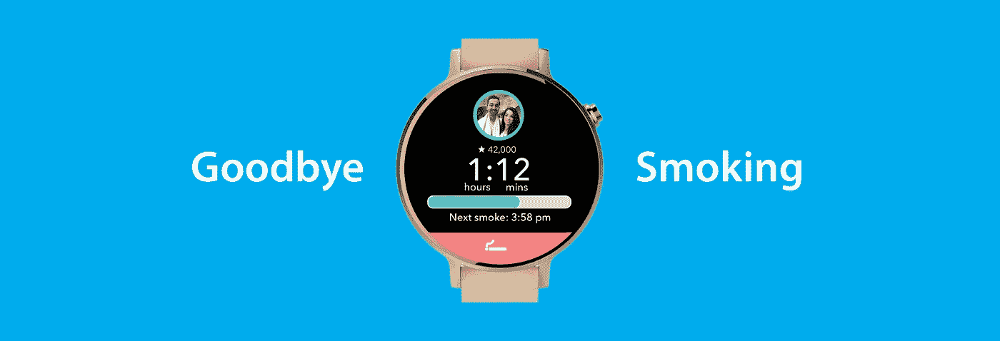*