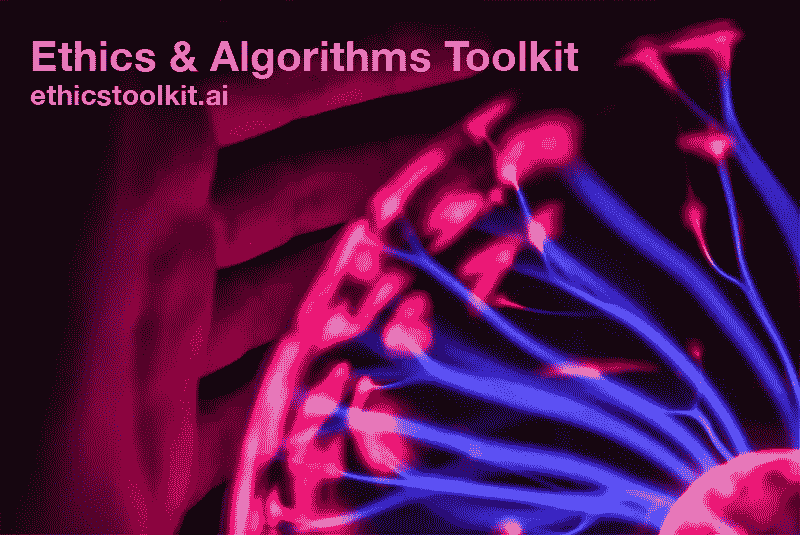

# 将伦理应用于算法

> 原文：<https://towardsdatascience.com/applying-ethics-to-algorithms-3703b0f9dcf4?source=collection_archive---------11----------------------->

*这篇文章是由 GovEx 博客* *整合而来的* [*，做了一些小的编辑。*](https://govex.jhu.edu/wiki/applying-the-same-ethical-principles-to-technologies-that-we-apply-to-humans-finally/)

Photo credit: [Josh Riemer via unsplash](https://unsplash.com/photos/YW11AF7Jjto)

当我受雇于我的第一份政府工作时，我必须签署许多文件。其中一些表格表明我已经阅读了[市的利益冲突法和相关的道德规范。起初，我并不理解它们的重要性，但随着我在公务员队伍中的职业生涯的继续，我见证了一些人如何破坏公众的信任，从轻微的违规到公然的腐败。随着我被提升到更高的职位，拥有更大的权力，我不仅仅需要签署表格承认我阅读了道德声明；我还必须接受背景调查，手写超过 100 页的问题答案，包括我个人财务的例行披露。随着我获得纳税人资金和决策权的机会增加，评估我的可信度的努力也在增加(当然，滥用这两者的可能性也在增加)。为了让政府运作良好，重要的是“我们人民”相信这种权力不会被滥用。这些工具保护了我、政府，最重要的是，保护了我所服务的公众。](http://nyc.gov/ethics/)

几十年来，政府一直在使用技术来更准确地跟踪事情，使事情更有效率，并做出基于事实的决策。今天，我们正在进入一个新时代，政府领导人越来越多地将决策权从人转向技术，特别是随着人工智能(AI)的兴起。然而， ***我们并没有像调查我们赋予权力*** 的人那样仔细地调查技术工具。这部分是因为我们没有希望我们的技术遵循的一套明确的道德规范(例如，“平等对待每个人”与“公平对待每个人”)。但这也部分是因为政府领导人没有获得持续和系统地调查人工智能的工具，以了解它可能在哪里成功或失败。从[社交媒体](https://medium.com/@Brookings/how-social-media-algorithms-are-altering-our-democracy-97aca587ec85)到[社交服务](https://www.npr.org/sections/alltechconsidered/2018/02/19/586387119/automating-inequality-algorithms-in-public-services-often-fail-the-most-vulnerab)我们每天都听到算法如何破坏人们的生活并进一步加剧不信任的故事——通常是在那些已经被边缘化的人群中。

这就是为什么 Joy Bonaguro、Miriam McKinney、Dave Anderson、Jane Wiseman 和我自二月份以来所完成的工作如此重要。2018 年 9 月 16 日，周日，在纽约市的 Data for Good Exchange (D4GX)上，我们公开发布了我们的 [**政府伦理和算法工具包(其他也是！)**](https://ethicstoolkit.ai/) 。该工具包旨在帮助政府管理人员描述将权力转移给自动化工具的相关风险，并有望妥善管理这些风险。这是我们的第一步，我们预计将会有一段漫长的路要走，才能将我们应用于人类的道德原则应用于我们的技术。

在 D4GX，我们举办了一个研讨会，邀请参与者将工具包应用到他们正在处理的问题或我们提供的示例场景中。在房间里呆了一个小时后，我们从参与者那里收集了很多很好的反馈，非常感谢我们一起进行的对话。我们已经收集了由此产生的建议，并将在不久的将来将它们应用到工具包中。下个月，我们将在 [2018 MetroLab 峰会](https://metrolabnetwork.org/annual-summit/2018-summit/)上与政府领导及其学术合作伙伴举办类似的研讨会。我们期待着更多的反馈，但更重要的是，我们希望那些参加研讨会的人能够在他们与我们一起度过的时间之外，继续将该工具包应用到他们的项目中..

毕竟，维护道德标准不仅仅要求人们填写表格并签字；它要求在怀疑存在伤害时进行调查——无论是有意还是无意。这需要认识到公众信任何时受到损害，并找出如何恢复这种信任。因此，这个工具包不仅仅是一个在人工智能项目开始时要完成的清单。更确切地说，它是一个“活的指南”,在该技术仍处于公共服务阶段时，可以持续地用于对话和管理实践。

我们还认为，该工具包的应用范围远远超出了公共部门，只需做一些调整..例如，医疗从业者在使用像 [IBM Watson Health](https://www.ibm.com/watson/health/) 这样的解决方案来帮助诊断和治疗患者时，可以应用该工具包的一个版本。风险投资公司可以使用不同的版本，确保他们的[自动化投资](http://www.theaivc.com/)不仅符合他们的组织使命和价值观，也符合他们将影响的社区的使命和价值观。大型科技公司甚至可能使用不同的版本来思考他们的产品如何可能无意中导致更多的过滤泡沫或更深的边缘化。

如果您对使用该工具包感兴趣并需要帮助，我们很乐意提供帮助！请在[govex@jhu.edu](mailto:govex@jhu.edu)联系，访问 [GovEx 联系页面](https://govex.jhu.edu/contact/)，或在[推特](https://twitter.com/gov_ex)上找到我们。当然，你也可以通过工具包网站联系我们，[https://ethicstoolkit.ai/](https://ethicstoolkit.ai/)