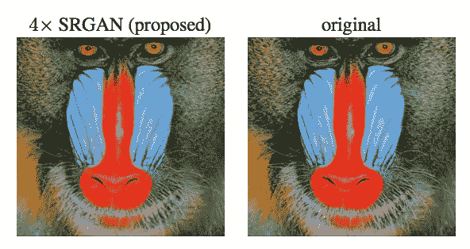

# 将 GANs 应用于超分辨率

> 原文：<https://towardsdatascience.com/applying-gans-to-super-resolution-59224763f960?source=collection_archive---------17----------------------->

SRGAN Results from Ledig et al. [3]

生成对抗网络在深度学习中有很多应用。使用 GANs 可以更好地解决的一个有趣问题是超分辨率。超分辨率是一项将图像从 90 x 90 的低分辨率尺寸放大到 360 x 360 的高分辨率尺寸的任务。在本例中，90 x 90 到 360 x 360 表示放大倍数为 4 倍。

超分辨率的一个解决方案是训练深度卷积网络，该网络接收数据，其中输入是低分辨率补丁，标记的输出是高分辨率补丁。这不同于许多监督学习问题，其中输出是 1 或 0 或者类预测的向量。在这种情况下，输出是一个图像。这些网络通过一系列卷积、全连接或转置卷积层从低分辨率面片学习到高分辨率面片的映射。例如，该网络可以获取一个 30 x 30 的低分辨率面片，对其进行几次卷积，使特征图类似于 22 x 22 x 64，将其展平为一个矢量，应用几个完全连接的层，对其进行整形，最后通过转置卷积层将其上采样为 30 x 30 的高分辨率面片。

这样做的一个问题是很难设计一个有效的损失函数。用于此目的的常见损失函数是网络输出面片和地面实况高分辨率面片之间的 MSE(均方误差)。这个损失函数的一个解决方案是使用 Johnson 等人开发的感知损失函数[1]。该损失函数是通过取网络输出面片和高分辨率面片之间的 VGG 网络[2]的高层中的特征映射激活的差异来计算的。因此，特征图激活被表示为感知损失度量。

Ledig 等人[3]证明，GANs 进一步改善了这种损失函数的发展。除了感知的、内容的损失之外，还增加了对抗性的损失，以进一步将图像推向自然的图像流形。GAN 框架被集成以表示由生成器创建的面片是否类似于高分辨率面片的基本事实集合。然后，通过对抗损失以及感知损失(由来自输出补片和地面真实补片的 VGG 特征图激活的差异表示)来计算发生器网络的误差。

看到如何使用多个损失函数来优化神经网络是非常有趣的。在这种情况下，每个损失函数都提供了对问题的独特视角。感谢您的阅读，如果您对这个话题感兴趣，请查看下面的论文！

**参考文献:**

[1]实时风格转换和超分辨率的感知损失。贾斯廷·约翰逊，亚历山大阿拉希，李菲菲。

[2]用于大规模图像识别的非常深的卷积网络。卡伦·西蒙扬，安德鲁·塞斯曼。

[3]使用生成式对抗网络的照片级单幅图像超分辨率。Christian Ledig、Lucas Theis、Ferenc Huszar、Jose Caballero、、Alejandro Acosta、Andrew Aitken、Alykhan Tejani、Johannes Totz、、史久镛。