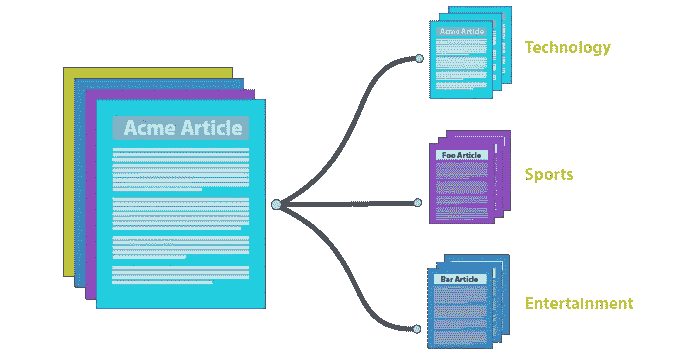
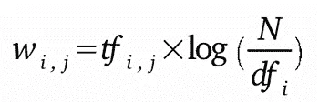
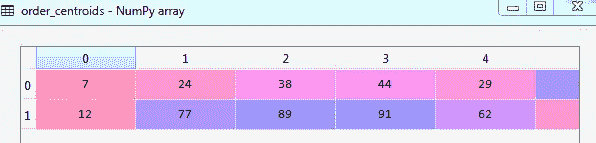
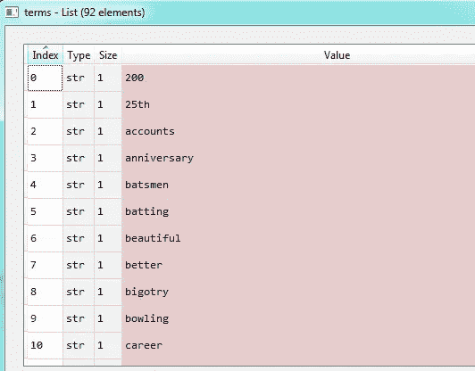

# 应用机器学习对无监督文本文档进行分类

> 原文：<https://towardsdatascience.com/applying-machine-learning-to-classify-an-unsupervised-text-document-e7bb6265f52?source=collection_archive---------3----------------------->



Fig: Text Classification

文本分类是一个问题，其中我们有一组固定的类/类别，并且任何给定的文本都被分配到这些类别之一。相比之下，文本聚类的任务是将一组未标记的文本分组，使得同一组中的文本(称为*簇*)彼此之间比其他簇中的文本更相似。

在这里，我自己创建了一个文档，其中包含两种与*板球*或*旅行相关的句子。*

```
**document** = [“This is the most beautiful place in the world.”, “This man has more skills to show in cricket than any other game.”, “Hi there! how was your ladakh trip last month?”, “There was a player who had scored 200+ runs in single cricket innings in his career.”, “I have got the opportunity to travel to Paris next year for my internship.”, “May be he is better than you in batting but you are much better than him in bowling.”, “That was really a great day for me when I was there at Lavasa for the whole night.”, “That’s exactly I wanted to become, a highest ratting batsmen ever with top scores.”, “Does it really matter wether you go to Thailand or Goa, its just you have spend your holidays.”, “Why don’t you go to Switzerland next year for your 25th Wedding anniversary?”, “Travel is fatal to prejudice, bigotry, and narrow mindedness., and many of our people need it sorely on these accounts.”, “Stop worrying about the potholes in the road and enjoy the journey.”, “No cricket team in the world depends on one or two players. The team always plays to win.”, “Cricket is a team game. If you want fame for yourself, go play an individual game.”, “Because in the end, you won’t remember the time you spent working in the office or mowing your lawn. Climb that goddamn mountain.”, “Isn’t cricket supposed to be a team sport? I feel people should decide first whether cricket is a team game or an individual sport.”]
```

创建上面的文档是为了展示如何将句子分为两个不同的类别，因为这里只提到了两种句子。

因此，我们现在需要导入必要的库，我们开始吧:

```
from sklearn.feature_extraction.text import TfidfVectorizer
from sklearn.cluster import KMeans
import numpy as np
import pandas as pd
```

这里我们使用了 TfidfVectorizer。那么什么是 TF-IDF 呢？

在信息检索或文本挖掘中，术语频率-逆文档频率也称为 tf-idf，是一种众所周知的评估文档中单词重要性的方法。tf-idf 也是将信息的文本表示转换成向量空间模型(VSM)的一种非常有趣的方式。

谷歌已经在用 TF*IDF(或者 TF-IDF，TFIDF，TF。IDF，艺术家原名 Prince)作为你的内容的排名因素已经很长时间了，因为搜索引擎似乎更注重词频而不是计算关键词。

TF*IDF 是一种信息检索技术，它衡量术语的频率(TF)及其逆文档频率(IDF)。每个单词或术语都有其各自的 TF 和 IDF 得分。一项的 TF 和 IDF 得分的乘积称为该项的 TF*IDF 权重。

TF*IDF 算法用于对任何内容中的关键字进行加权，并根据该关键字在文档中出现的次数为其分配重要性。更重要的是，它检查关键字在整个网络中的相关性，这被称为*语料库*。



TF-IDF weights formula

我们必须使用 TfidfVectorizer 类创建矢量器，以适应和转换我们创建的文档:

```
vectorizer = TfidfVectorizer(stop_words='english')
X = vectorizer.fit_transform(document)
```

我们现在需要理解我们将在文本文档中使用的 K-means 算法。

K-means 是解决众所周知的聚类问题的最简单的无监督学习算法之一。该过程遵循一种简单且容易的方式，通过先验固定的一定数量的聚类(假设 k 个聚类)来对给定数据集进行分类。主要思想是定义 k 个质心，每个聚类一个。因为不同的位置会导致不同的结果，所以这些质心应该被巧妙的放置。因此，更好的选择是将它们放置在尽可能远离彼此的地方。下一步是获取属于给定数据集的每个点，并将其与最近的质心相关联。当没有点悬而未决时，第一步完成，早期分组完成。在这一点上，我们需要重新计算 k 个新的质心作为上一步得到的聚类的重心。在我们有了这 k 个新质心之后，必须在相同的数据集点和最近的新质心之间进行新的绑定。

我们现在将在下面的矢量化文档中实现 k-means 聚类算法:

```
true_k = 2
model = KMeans(n_clusters=true_k, init='k-means++', max_iter=100, n_init=1)
model.fit(X)
```

我们将获得以下输出:

```
Out[5]: 
KMeans(algorithm='auto', copy_x=True, init='k-means++', max_iter=100,
    n_clusters=2, n_init=1, n_jobs=1, precompute_distances='auto',
    random_state=None, tol=0.0001, verbose=0)
```

现在执行下面的代码来获得质心和特征

```
order_centroids = model.cluster_centers_.argsort()[:, ::-1]
terms = vectorizer.get_feature_names()
```



Centroids



terms

现在我们可以打印出它们所属的簇的质心

```
for i in range(true_k):
 print(“Cluster %d:” % i),
 for ind in order_centroids[i, :10]:
 print(‘ %s’ % terms[ind])
```

我们将得到下面的输出

```
**Cluster 0:**
 better
 game
 ladakh
 month
 hi
 trip
 stop
 journey
 worrying
 highest
**Cluster 1:**
 cricket
 team
 world
 year
 really
 game
 travel
 place
 beautiful
 skills
```

我们现在可以预测文本句子，这可以告诉我们该句子属于哪个簇

```
print(“\n”)
print(“Prediction”)
X = vectorizer.transform([“Nothing is easy in cricket. Maybe when you watch it on TV, it looks easy. But it is not. You have to use your brain and time the ball.”])
predicted = model.predict(X)
print(predicted)
```

这将产生以下输出:

```
Prediction
[1]
```

因此，这里我们得到了预测为[1]，这意味着它属于与板球相关的集群 1，因此我们的测试句子也在谈论板球的事实。所以我们的预测是正确的。我们也可以用其他句子来测试一下，看看这个是否有效。这个模型并不总是能给你准确的结果，但是为了得到更准确的结果，我们需要更多的数据或更多的文本来改进我们的模型并提供更好的结果。

因此，我们已经建立了我们的第一个文本分类器，它可以预测句子属于哪个类/簇。所以我希望你喜欢这篇文章，请不要忘记在评论区留下你的评论和疑问。也请让我知道，如果你在这里发现任何改进的地方，那将是非常可观的。

你也可以给我发一封关于 vishabh1010@gmail.com 的电子邮件，或者打电话+919538160491 给我。也可以通过 [linkedin](https://www.linkedin.com/in/vishabh-goel-27559aa6/) 联系我。