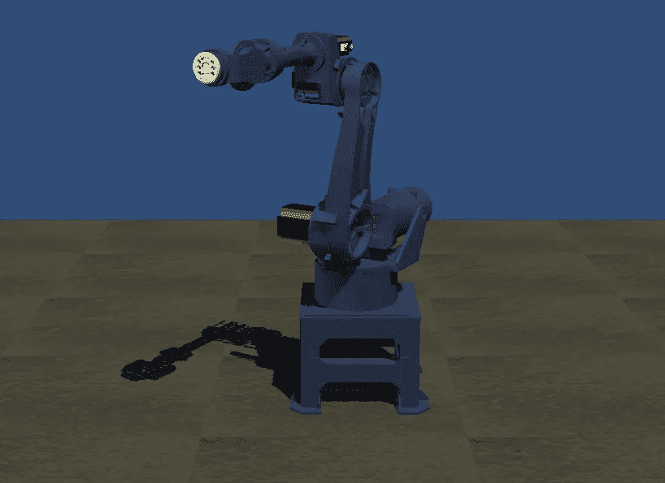
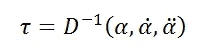
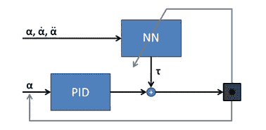
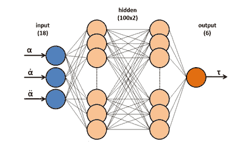
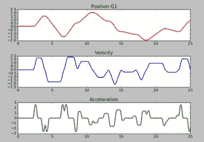
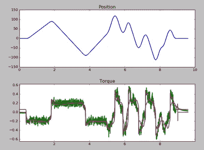
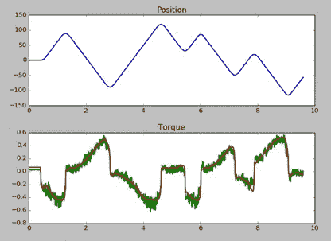
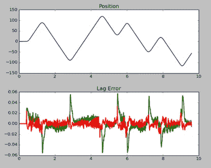
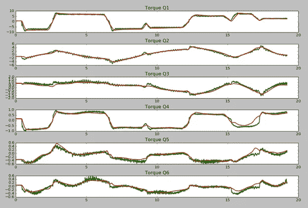

# 用神经网络逼近工业机器人的动态模型

> 原文：<https://towardsdatascience.com/approximating-dynamic-models-of-industrial-robots-with-neural-networks-2474d1a2eecd?source=collection_archive---------5----------------------->

Standard 6-axes industrial robot

工业机器人的运动控制器通常为每个关节轴生成两个循环设定值:位置参考值和扭矩前馈值。轴设定位置由*运动学*模型计算，而电机转矩由*动力学*模型计算。

然而，虽然运动学模型通常更容易实现，并且基于众所周知的参数，但是动态模型更复杂，并且基于通常未知并且必须识别的参数(例如惯性、摩擦)。此外，动态模型可能无法准确描述机械结构的所有物理属性，因为并非所有的影响都被考虑到，或者因为一些影响太难建模。例如，通常不考虑关节的弹性行为。

设计一个试图预测现实的固定模型的替代方案是让机器人自己学习其自身动力学的特征。简单的监督学习算法可以理解不同机械结构的特征，并成功地取代动态模型的标准实现。

这种技术可以应用于以下情况:

特定运动结构的动态模型未知或过于复杂，无法进行分析描述。

可用的动态模型过于简单，无法高精度地预测现实。

此外，由于学习算法可以很容易地在线训练(即，当机器人运动时)，机器人可以适应动态中长期不可预测的变化(例如，由于机械磨损而增加的摩擦，或者由于负载转移而改变的惯性)。

# 控制结构

每个机器人轴的控制结构由一个闭环 PID 和一个开环扭矩前馈组成。

计算前馈值的标准方法是求解一个逆动力学函数 D-1，根据当前设置的关节位置(α)、速度和加速度计算电机扭矩(τ):

Inverse dynamics

该方程通常通过拉格朗日或牛顿-欧拉方法求解，通常假设为刚体结构。模型的参数是离线确定的，不会随时间变化。

我们现在试图用一个序列神经网络形式的函数逼近器来代替动态模型。

网络通过训练集学习机械结构的动力学，训练集由每个轴的三个特征(位置、速度和加速度)和一个目标标签(扭矩)组成。线下和线上培训都可以。

一旦网络经过训练，它就可以用于实时预测电机扭矩值，这些值将作为前馈控制信号发送到伺服驱动器的电流环路。

Controller structure including an online learning function approximator

所使用的神经网络的结构非常简单，包括:

每个轴的设定位置、速度和加速度的一个输入层。

两个全连接的隐藏层，每层 100 个单元，ReLU 激活函数和随机初始化的权重。

一个输出层，每个轴有一个线性单位，代表预测的电机扭矩。

Neural network architecture for a 6-axis robot

对于 6 轴机器人，这种特定的网络配置总共需要 12606 个参数。

# 培训过程

网络训练目前是在完全监督下进行的。强化学习技术(如政策梯度)可用于进一步优化结果的质量，并将在今后的工作中进行研究。

第一个学习步骤包括离线训练，使用机器人运动期间捕获的大量标记数据。单个数据示例包含三个特征(轴位置、速度和加速度)和每个轴的一个目标标签(电机扭矩)。

特别是，编码器位置和电机扭矩在运动过程中被同时记录。然后通过微分从位置计算轴的速度和加速度。

为了使学习过程在输入数据中更加快速和一致，所有特征都以标准缩放形式进行预处理:零均值和单位方差。以下示例显示了为单个轴记录的数据。

Recorded features of a training set for a single axis after passing through a standard scaler

使用 RMSprop 优化器实现训练过程，初始学习率为 1e-4。评估的损失函数是标准的最小平方误差。

出于交叉验证的目的，随机抽取 10%的训练数据子集。然后应用常见的正则化技术来减少验证损失:

-学习率衰减:防止目标最优值附近的振荡，并在学习阶段结束时提高精度。

-网络架构:每个隐藏层 100 个单元，以折衷网络容量和训练时间。

-批量大小:随机梯度下降的 200 个样本的小批量。

-早期停止:训练集循环 120 个时期，直到验证损失开始稳定，并且训练停止以避免网络过度拟合。

一旦离线学习到最佳权重，该网络就可以用于实时预测。此外，培训还可以以在线形式继续，以提供适应网络的行为。

# 扭矩预测

训练好的权重用于根据每个轴的输入状态循环预测电机转矩。

给定网络的浅架构和小层尺寸，矩阵乘法的简单实现仅需要几秒的计算时间就足以实时运行。

与 sigmoid 和 tanh 替代方案相比，ReLU 非线性对于实时计算也是最佳的。

输入数据(轴位置、速度和加速度)与训练中使用的相同系数成比例，然后输入网络。输出预测扭矩值循环发送到伺服驱动器，作为电流回路的前馈值。

出于安全原因，在预测值过高的情况下，扭矩限制器处于活动状态。

# 结果

用不同的动态结构对神经网络进行测试，并将其转矩预测值与实际电机值进行比较。

# 惯性恒定的单轴

第一次测试是在具有恒定惯性负载的单轴系统上进行的，并且将标准 FF 模型作为比较基准。

该网络是在 2000 个小样本上训练的。下图比较了实际电机扭矩与标准 FF 模型和神经网络的预测值。在这种情况下，没有前馈被发送到驱动器。

Comparison between single axis motor torque values: actual (green), standard FF (purple), NN predicted (red)

预测的扭矩值是相似的，尽管标准 FF 模型提供了真实动态的更详细的表示。

# 具有可变惯性的单轴

第二项测试也是在单轴系统上进行的，但这次是在不对称的垂直载荷下进行的，这导致惯性根据轴的位置而变化。通过观察对轴定位误差的影响来检查结果的质量。

下图比较了实际电机扭矩和神经网络的预测值。在这种情况下，没有前馈被发送到驱动器。

Comparison between single axis motor torque values with variable inertia load: actual (green) and NN predicted (red)

接下来的步骤是将预测的扭矩作为前馈值发送到驱动器:当轴移动时，滞后误差的减少是明显可见的，尤其是在加速阶段。

Comparison between axis positioning error values: without torque feed-forward (green) and after applying the NN feed-forward (red)

# 六轴机器人

最后一次测试是在一个 6ax 铰接机器人上进行的，其有效载荷为 8 千克。

这种情况下的神经网络有 18 个输入单元和 6 个输出值。由于运动链的原因，该系统是高度非线性的，并且每个轴的扭矩取决于所有其他轴的动态状态。

经过一组约 10000 个样本的短期离线训练后，该网络已经能够以相当好的近似值预测每个电机的扭矩值，如下图所示，这是在随机运动期间记录的。

Comparison between torque values of the six motors of an articulated robotic arm: actual values (green) and predicted by the NN (red)

使用更深的网络和更大的训练集可能会获得更详细的预测质量。

# 结论

一个简单的具有两个隐层的前向传播神经网络被测试作为函数逼近器来学习不同运动结构的动态模型。

实际结果表明，即使具有这样浅的架构和小的训练集，网络也可以提供足够好的预测，以允许减少每个轴的定位误差。

该技术显然不是要取代众所周知的结构的动态模型，但它在模型不可用或不够精确的一些应用中具有非常有趣的潜力。

几个优点是:

-它可以应用于任何用户定义的运动学，甚至是具有几个关节的高度复杂的运动学(神经网络的容量可能必须相应地增加)

-它可以预测难以分析建模的影响

-它可以适应力学中与时间相关的变化

另一方面，最明显的缺点是网络的内部结构不是人类可读的:任何关于机械动力学的学习信息都无法提取。