# 使用 Numpy 近似积分[黎曼/梯形/辛普森/自适应/蒙特卡罗积分]

> 原文：<https://towardsdatascience.com/approximating-integrals-using-numpy-riemann-trapeze-simpsons-adaptive-monte-carlo-f37e3940985f?source=collection_archive---------12----------------------->


GIf from this [website](https://giphy.com/gifs/fourier-series-HqZuL4RWgf2ms)

积分逼近是计算机科学中非常重要的任务(甚至涉及到[神经网络](https://arxiv.org/abs/1805.12233))。今天我想实现不同的积分近似方法。

**我们将要使用的功能**

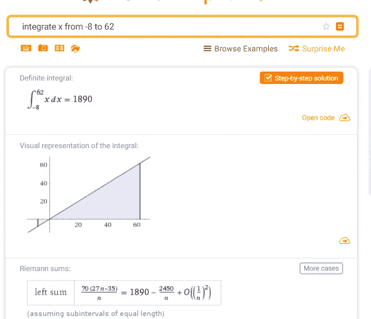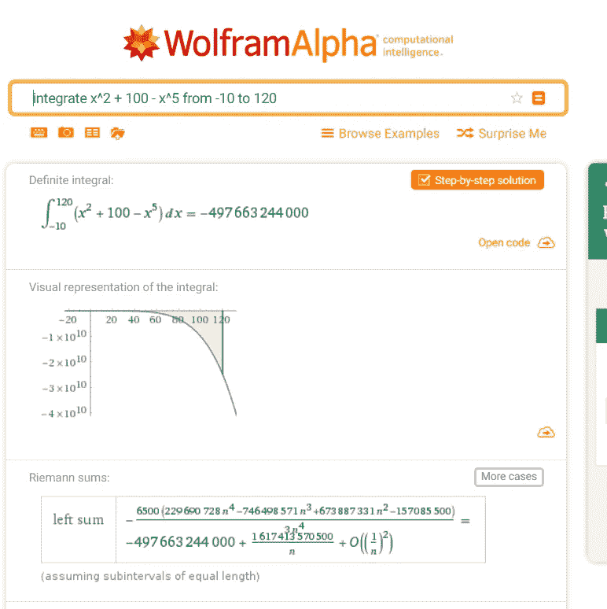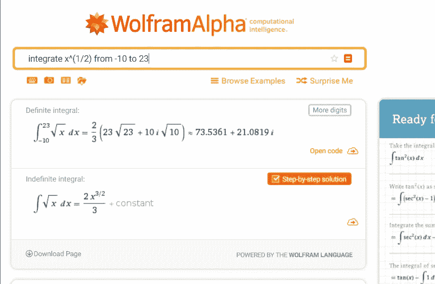

all of the images are from [wolframalpha](https://www.wolframalpha.com/input/?i=integrate+x+from+-8+to+62)

总的来说，我们要近似四个不同函数的积分

```
1\. integral from -8 to 6     x dx = 1890
2\. integral from -10 to 120 (x^2 + 100 - x^5) dx = -497663244000
3\. integral from -10 to 23   sqrt(x) dx = 2/3 (23 sqrt(23) + 10 i sqrt(10))≈73.5361 + 21.0819 i
4\. integral from 0 to pi     x sin(x^2) dx = sin^2(π^2/2)≈0.9513
```

如上所述，我们已经可以看到解析解的结果。

**近似方法**

> 黎曼积分

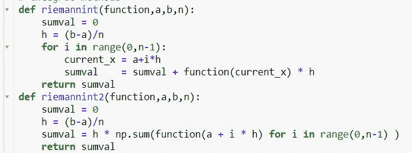

> 吊架集成


> 辛普森积分

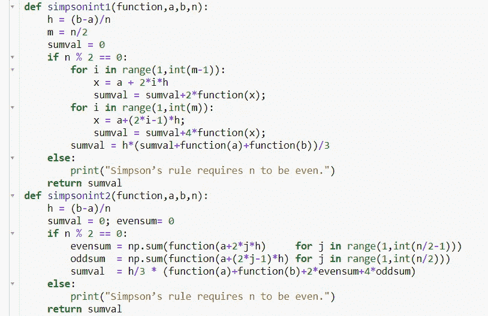

> 适应性整合

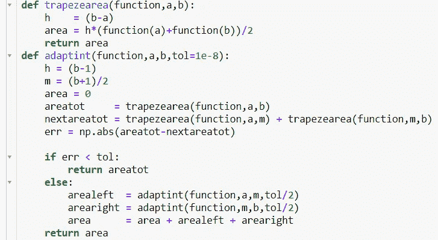

> 蒙特卡罗积分

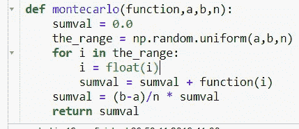

如上所述，我们将使用五种不同的方法来估计积分。顺便提一下，在这五种方法中，有四种(除了自适应积分)有一个作为样本数的超参数。增加该值将导致更好的积分近似，

**功能 1**

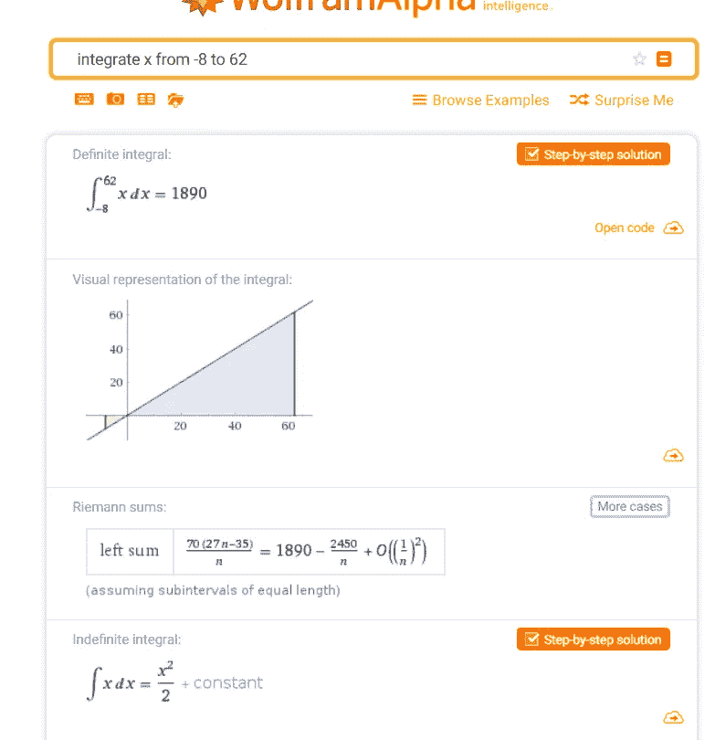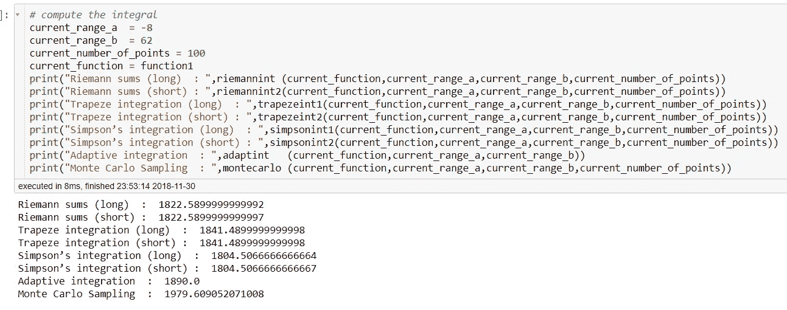

自适应积分得到了最精确的积分值，其他方法要么低估了，要么高估了。(当然，随着样本数量的增加，它会变得更加精确。)

**功能 2**

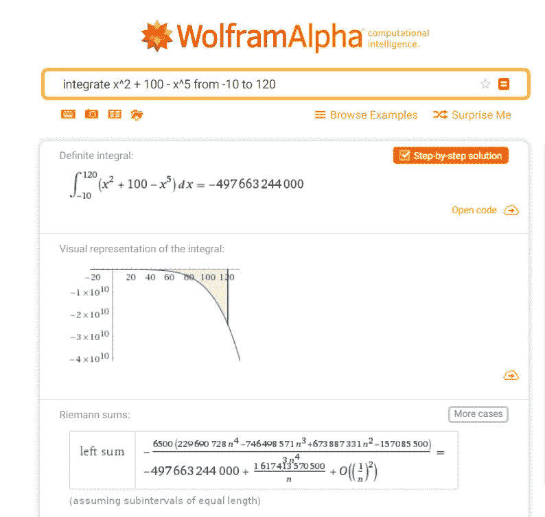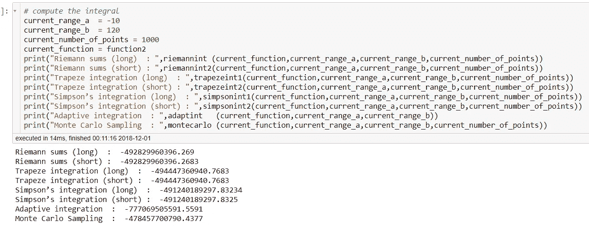

对于这个函数，自适应积分方法低估了大量的积分值。

**功能 3**

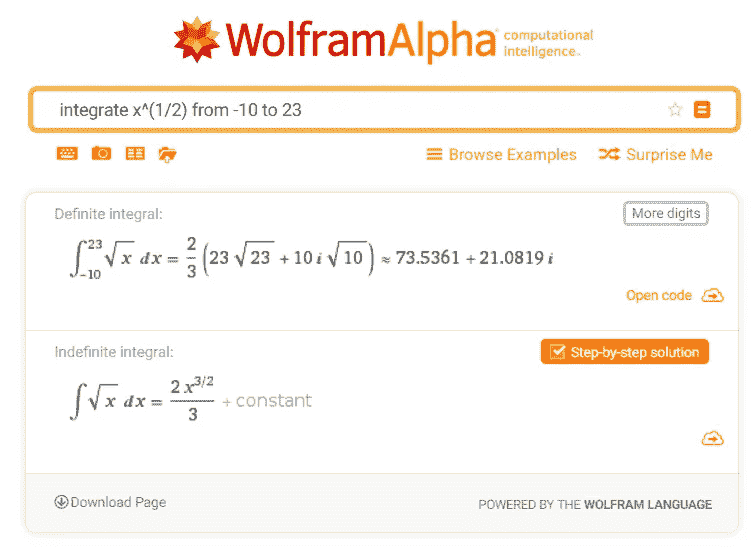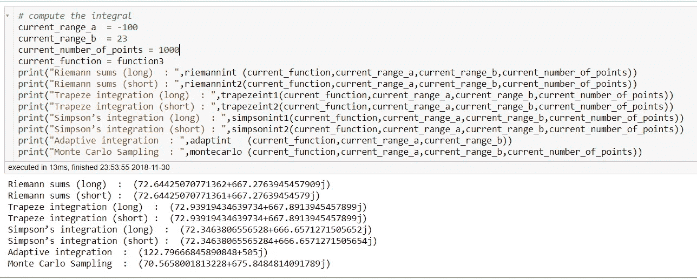

除了自适应积分法之外，对于少量数据点，其他方法总体上做得相当好。

**功能 4**

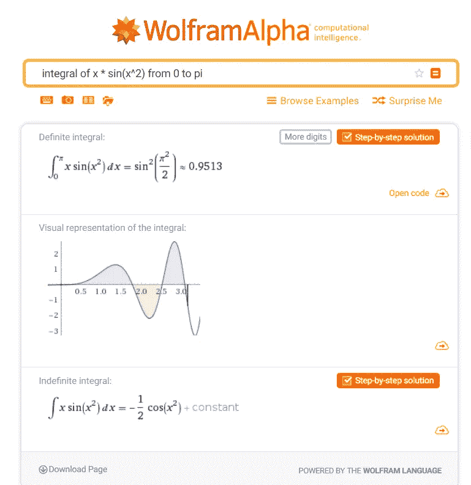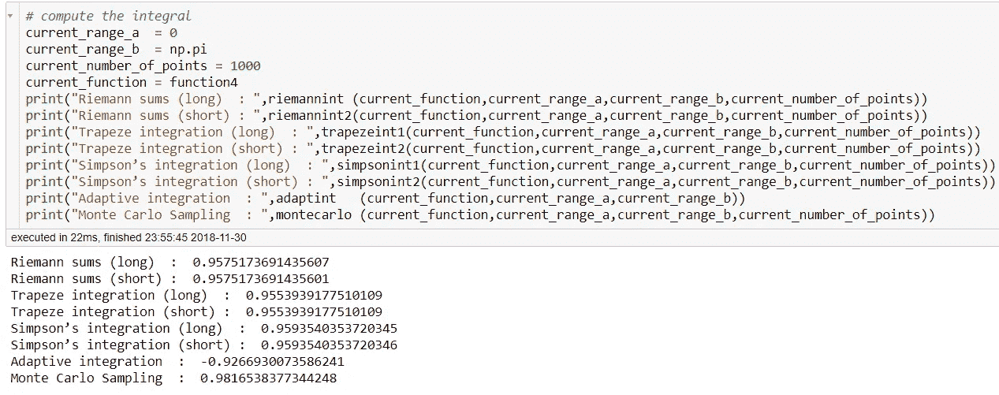

有趣的是正弦函数也有类似的结果。

**交互代码**

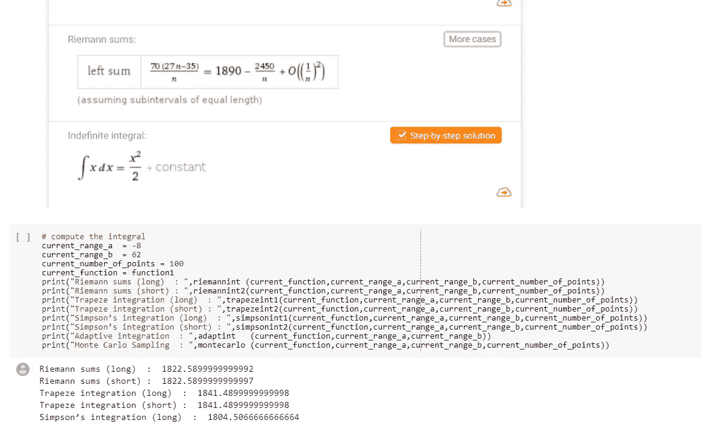

要访问这篇文章的代码，请点击[这里](https://colab.research.google.com/drive/1YJI1XaI6i50e3YDuPsxITiNuRPOjsjnh)。

**惊人的资源**

Paper from this [website](http://www.maths.qmul.ac.uk/~wj/MTH5110/notes/MAS235_lecturenotes1.pdf)

video from this [website](https://www.youtube.com/watch?v=WAf0rqwAvgg)

**最后的话**

这是一次很好的回顾，也是一次很好的编程实践。当我摆弄数值时，很明显蒙特卡罗方法积分是一种强有力的方法，但它需要更多的时间来正确收敛。

如果发现任何错误，请发电子邮件到 jae.duk.seo@gmail.com 给我，如果你想看我所有写作的列表，请在这里查看我的网站。

**参考**

1.  (2018).maths . qmul . AC . uk . 2018 年 12 月 1 日检索，来自[http://www . maths . qmul . AC . uk/~ wj/mth 5110/notes/MAS 235 _ lecture notes 1 . pdf](http://www.maths.qmul.ac.uk/~wj/MTH5110/notes/MAS235_lecturenotes1.pdf)
2.  傅立叶系列 GIF 在 GIPHY 上查找和分享。(2018).吉菲。检索于 2018 年 12 月 1 日，来自[https://giphy.com/gifs/fourier-series-HqZuL4RWgf2ms](https://giphy.com/gifs/fourier-series-HqZuL4RWgf2ms)
3.  面向 Noobs 的 Python 蒙特卡罗集成。(2018).YouTube。检索于 2018 年 12 月 1 日，来自 https://www.youtube.com/watch?v=WAf0rqwAvgg
4.  蝙蝠侠集成雷欧索斯。(2018).Leios.github.io .检索于 2018 年 12 月 1 日，来自 https://leios.github.io/Batman_Montecarlo
5.  Dhamdhere，m . Sundararajan 和 q . Yan(2018 年)。一个神经元有多重要？。Arxiv.org。检索于 2018 年 12 月 1 日，来自[https://arxiv.org/abs/1805.12233](https://arxiv.org/abs/1805.12233)