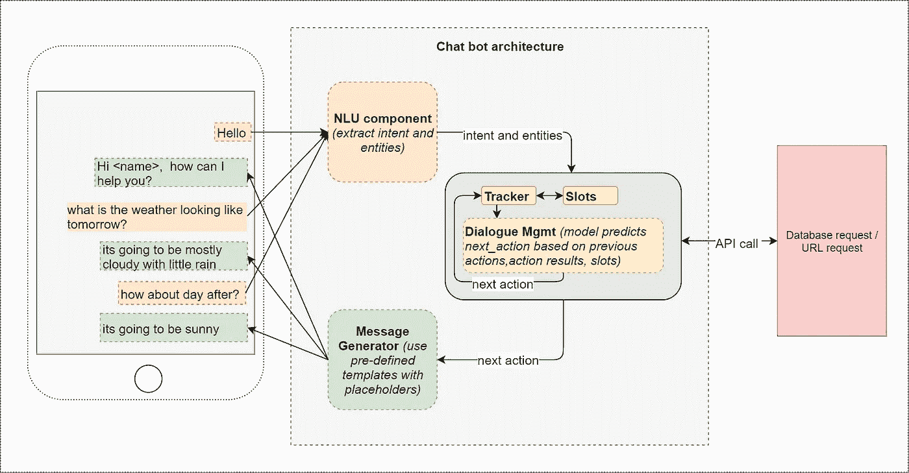

# 对话式人工智能聊天机器人——架构概述

> 原文：<https://towardsdatascience.com/architecture-overview-of-a-conversational-ai-chat-bot-4ef3dfefd52e?source=collection_archive---------0----------------------->

这篇文章的目的是给出一个典型的架构概述，以建立一个对话式人工智能聊天机器人。我们将详细回顾架构和各自的组件(*注* — *本文中引用的架构和术语大多来自我对*[*rasa-core*](https://core.rasa.ai/)*开源软件的理解)。*

所以让我们开始吧…

正如本文标题所示，主要方面是—

1.  **它是一个聊天机器人**——在本文中，为了简单起见，假设用户将输入文本，机器人将以文本的形式用适当的消息作出响应(*因此，我们将不涉及 ASR、语音识别、语音到文本、文本到语音等方面。，根据需要，无论如何都可以使用这些组件增强以下架构*。

**2。这是对话！** —这是什么意思？机器人应该以某种方式维护对话的状态，并在当前上下文中响应用户请求(也称为。它需要是上下文感知的)。例如，假设对话流程是这样的——

*   用户——明天天气怎么样？
*   明天大部分时间是多云，有小雨。
*   用户——后天怎么样？(*因此，当提出这个问题时，机器人应该记住，这次对话的最近上下文是关于实体“天气”(而不是交通拥堵或预订可用性之类的其他东西，假设它们出现在之前的对话中)。*

**3。**这是一个 **AI / ML 驱动的架构:**该模型根据提供的训练数据学习动作(不像传统的基于状态机的架构，它是基于为对话的每个可能状态编码所有可能的 if-else 条件。)

这是一个聊天机器人架构的高级概述。

Chatbot architecture — image copyright@ [Ravindra Kompella](https://medium.com/u/c3f8c66f5451?source=post_page-----4ef3dfefd52e--------------------------------)

在我们浏览流程时，我将参考上图中的组件。首先，让我们看看在对话流程的任何给定时刻，我们需要什么来决定适当的回应？

1.  我们需要知道用户的意图——我们称之为 ***意图*** 。意图的几个例子是——“请求天气”、“请求餐馆”等。上例中的意图是“请求天气”。
2.  我们需要知道请求中的具体意图(我们称它们为 ***实体*** )，例如——什么时候？，哪里？，有多少？等等。，分别对应于从用户请求中提取关于日期时间、位置、数字的信息。这里的日期时间、位置、数字都是 ***的实体*** 。引用上面的天气示例，实体可以是“日期时间”(用户提供的信息)和位置(注意，位置不必是用户提供的显式输入，并且如果没有指定，将根据默认的用户位置来确定)。

意图和实体一起将有助于对天气服务进行相应的 API 调用并检索结果，我们将在后面看到。

现在参考上图，代表 **NLU 组件(** *【自然语言理解】* **)** 的方框有助于从用户请求中提取意图和实体。

**NLU 成分**成分—

*   一个有监督的意图分类模型，以各种句子作为输入，以意图作为目标进行训练。通常，线性 SVM 将足以作为意图分类模型。
*   实体提取模型—这可以是预训练的模型，如 Spacy 或 StanfordNLP 库(或),也可以使用一些概率模型，如 CRF(条件随机场)进行训练。

3.现在，由于我们的是一个对话式人工智能机器人，我们需要跟踪迄今为止发生的对话，以预测适当的反应。为此，我们需要一个 dictionary 对象，它可以持久存储有关当前意图、当前实体的信息，以及用户对 bot 之前的问题、bot 之前的操作、API 调用结果(如果有)提供的持久存储信息。这些信息将构成我们输入的 **X，**特征向量。对话模型将要被训练的目标 ***y、*** 将是“***next _ action”***(***next _ action***可以简单地是对应于我们在训练数据中定义的每个动作的独热码编码向量)。

然后，这将我们带到下一个问题——我们如何获得我们的特征向量的训练值，输入 **X** ？

*   正如我们从 NLU 组件中看到的那样，获取关于意图和实体的信息非常简单。
*   获取剩余的值(*)信息，用户将提供给机器人之前的问题、机器人之前的动作、API 调用的结果等。，*)有点棘手，这里是对话管理器组件接管的地方。这些特征值将需要从用户将以用户和机器人之间的 ***样本对话*** 的形式定义的训练数据中提取。这些 ***样本对话*** 应该以这样一种方式准备，即它们在假装既是用户又是机器人的同时，捕捉大多数可能的对话流。

***注意—*** 如果计划从头开始构建示例对话，那么一个推荐的方法是使用一种叫做 ***交互式学习的方法。*该模型使用该反馈来改进其对下一次的预测(这类似于强化学习技术，其中该模型因其正确的预测而得到奖励)。**

这里我就不赘述提取每个特征值的细节了。它可以从我在上面提供的 rasa-core link 的文档中引用。因此，假设我们以所需的格式从样本对话中提取了所有所需的特征值，那么我们可以训练一个像 LSTM 和 softmax 这样的人工智能模型来预测 ***next_action。*** 参考上图，这就是'**对话管理**'组件的作用。为什么 LSTM 更合适？—如上所述，我们希望我们的模型能够感知上下文，并回顾对话历史来预测 ***next_action。*** 这类似于时间序列模型(请参见我的另一篇 [LSTM 时间序列](/using-lstms-to-forecast-time-series-4ab688386b1f)文章)，因此可以在 LSTM 模型的内存状态中得到最好的捕捉。我们想要回顾的对话历史的数量可以是模型的可配置的超参数。

现在， ***next_action*** 的预测值可以是这样的—

*   用适当的消息响应用户
*   从数据库中检索一些数据(如果我们有的话)
*   进行一次 API 调用，得到一些符合意图的结果。

如果恰好是 API 调用/数据检索，则控制流句柄将保留在“对话管理”组件中，该组件将进一步使用/保持该信息，以再次预测 ***next_action、*** 。对话管理器将基于该动作和检索的结果更新其当前状态，以进行下一次预测。一旦 ***next_action*** 对应于对用户的响应，那么**‘消息生成器’**组件就会接管。

**消息生成器**组件由几个用户定义的模板组成(*模板只是带有一些占位符的句子，视情况而定*)，这些模板映射到动作名称。因此，根据对话管理器预测的动作，调用相应的模板消息。如果模板需要填充一些占位符值，对话管理器也会将这些值传递给生成器。然后，向用户显示适当的消息，机器人进入等待模式，监听用户输入。