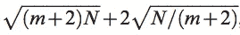
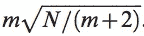
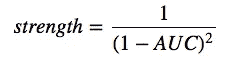
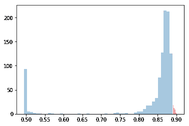

# 基因模型比随机抽样好吗？

> 原文：<https://towardsdatascience.com/are-genetic-models-better-than-random-sampling-8c678002d392?source=collection_archive---------12----------------------->

*下面描述的整个实验的代码和结果可以在我的* [*GitHub 页面找到，作为 Jupyter 笔记本*](https://github.com/shakedzy/notebooks/tree/master/genetic_models_and_neural_networks) *。使用的基因模型库，*[*py Charles*](https://github.com/shakedzy/pycharles)*，是我创建的开源项目。还有一个更基础的版本，* [*查尔斯*](https://github.com/shakedzy/charles) *，用 Scala 写的。*

基因模型总是让我兴奋的事情之一，尽管我不确定我能解释为什么。我猜这是利用自然选择本身的想法，通过让不同的可选解决方案交配、繁殖和变异来寻找给定问题的最佳可能解决方案。但也许这是因为无论这个想法听起来多么激动人心，我都找不到这个概念的任何实际用途——因为学习过程只是试图优化输入，而不是将输入映射到输出的函数。

所以想象一下，当我发现有一篇论文声称基因模型可以用来优化神经网络的结构时，我有多高兴。但是，当我向我有机会与之交谈的另一位数据科学家提出这个想法时，他声称他在研究期间有机会检查基因模型——并表示他发现基因模型就像随机选择解决方案并采取最佳方案一样好。我觉得应该由我来捍卫基因模型和它们的名字，并证明进化比随机进化更好——所以我决定验证这一点。***TL；*—***我输了。*

## 设计实验

这样的实验首先需要的是数据。我需要一些我能处理的简单的东西，所以我决定使用众所周知的[泰坦尼克号数据集](https://www.kaggle.com/c/titanic/data)。

接下来:决定我将要工作的空间和界限。这意味着我需要决定哪些可能的架构是有效的候选。我提到的论文，以及我阅读的其他讨论，表明在许多情况下，多达 2 个隐藏层的神经网络应该足够了。这篇论文还引用了另一篇文章，声称给定 *N* 个样本和 *m* 个输出节点，应该足以学习这些数据的节点数量由下式给出:

对于第一个隐藏层，以及:

对于第二个隐藏层。我已经决定这些将是我的上限，而第一层的下限将是 3(没有特殊的原因)，第二层的下限将是 0(意味着只有一个隐藏层的架构)。由于这是一个二元分类网络， *m=2* 。另外，我只使用了 70%的数据进行训练，所以 *N=623* 。这产生了*【3，75】*和*【0，50】*分别作为第一和第二隐藏层边界——这给出了 3723 种可能的架构。这是很多，因为我需要计算这个实验的每个可能的选项。所以我决定，既然两个输出节点基本上是相反的概率，我可以忽略一个，用 *m=1* ，这样就产生了这些边界:*【3，72】*和*【0，14】—*所以现在我有 1050 种可能的架构。还是很多，但是比以前少多了。

我需要选择的最后一件事是，我应该用什么指标来衡量网络。经过深思熟虑，我决定使用 ROC 曲线下面积(有时简称为 AUC)而不是精确度。

## 实验时间！

我做的第一件事是计算架构空间中所有可能架构的 AUC。我的 MacBook Pro 花了大约 18 个小时来计算所有 1050 种可能性——下面是结果:

AUC scores for all 1050 possible architectures

现在是训练遗传模型的时候了，设置一些数字:我已经决定将种群规模设置为 8，最大代数为 10，提前停止的耐心为 2 代(意思是，如果模型在两代后不能击败它的最佳解决方案，它将停止)。我还决定训练模型 5 次，然后平均结果。模型的强度函数(有时称为适应度函数)被确定为:

这将保证即使 AUC 分数最小的提升也会对其解决方案的生存几率产生重大影响。如果你现在已经读过这篇文章，你可能已经注意到我使用了一个不同的强度函数。7) —但这并没有太大的不同:我只是简单地使用了一个非线性误差，并且没有牺牲准确性( *s=0* )。

## 结果

平均遗传模型 AUC 得分为 0.891，它平均进化了 3 代——这意味着它平均计算出 8+(3*7)=29 个不同的解(8 个初始解和每代 7 个解，因为每代的最佳解也会继承到下一代，参见 *PyChrales* 文档中的*精英比率*)。在 1050 个可能的解决方案中，54 个等于或优于通过模型获得的 AUC 分数，占整个解决方案空间的 5.1%。它们的分布如下:

a histogram of all AUC values in the solutions space. In red: solutions which are equal or better than the averaged AUC of the Genetic Model

但是这就足够好了吗？这是否意味着遗传模型会比随机抽样表现得更好？让我们看看:在尝试了 *n 次*次后，得到更好解决方案的[概率由下式给出:](https://math.stackexchange.com/q/517237/535485)

如果我们画出 *p(n)* 我们会得到这样的结果:

很明显，对于 *n=29* ，我们得到 *p=0.8* ，这意味着当简单地随机抽样解决方案空间时，有 80%的机会获得更好的架构。事实上， *p > 0.5* 对于任何 *n≥13* ，所以一个遗传模型必须只扫描最多 12 个不同的溶液(并达到相同的 AUC 分数)才能比随机抽样更好。不幸的是，我重试时没有成功。

## 结论

这看起来很有希望——但是基因模型在这个案例中失败了。虽然这只是一次尝试，因此我不能说我已经证明了遗传模型确实不如随机采样——我将承认，除非得到证明，否则我可能不会用它们来确定我的下一个神经网络的架构。但这确实让我思考一些问题——我们人类进化了这么多，是因为我们是最适者吗——还是可能是任何其他物种，我们只是运气好而已。嗯，我想我们永远也不会知道:-)

## 参考

[1] D .斯塔塔基斯，“有多少隐藏层和节点？”，国际遥感杂志，第 30 卷第 8 期，2009 年 4 月( [PDF](http://dstath.users.uth.gr/papers/IJRS2009_Stathakis.pdf) )