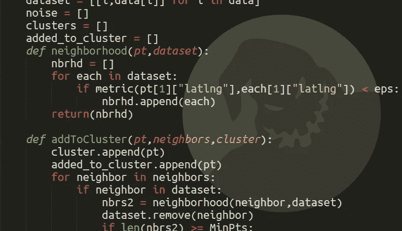

# 是机器有偏见还是我们对机器有偏见？

> 原文：<https://towardsdatascience.com/are-machines-biased-or-are-we-biased-against-machines-17982310152b?source=collection_archive---------4----------------------->

## 一位数据科学家对 ProPublica 关于犯罪预测算法偏差的研究的看法

Algorithms: the new boogeyman.

ProPublica 最近发表了一篇谴责在刑事司法系统中使用算法的文章。“机器偏见”这篇文章记录了司法判决过程中预测算法的使用，以及这些算法表现出的令人不安的种族偏见。报告者表明，这些算法系统地低估了白人罪犯的累犯率，高估了黑人罪犯的累犯率。这具有重要的后果，因为累犯——罪犯未来犯罪的倾向——是决定刑期和改造要求的一个重要因素。

正如可以预测的那样(没有任何算法)，对这篇文章的反应是压倒性的批评在刑事司法中使用数据科学。虽然这项研究是新闻业的一个重要部分，但我担心它对算法使用的寒蝉效应可能会产生与减轻种族偏见的*相反的*效果。不幸的是，ProPublica 的文章本身利用了我们的许多认知偏见，这可能最终加剧他们希望解决的问题。

ProPublica’s main findings: Prediction algorithms fail differently for black defendants

## 量化和显著性偏差

理解预测算法如何不同地影响种族无疑是重要的。然而，更重要的问题——尤其是在公共政策的背景下——是**算法的性能如何与其他替代方案相比较**(当前的基线是特殊的人类判断)。标题“算法有偏见”的含义与“算法比人类更少偏见，更准确”的含义大相径庭(尽管两者可能同时成立)。

算法的缺点是它们实际上量化了它们的预测，这使得我们能够首先对它们的偏差进行事后评估。人类在许多领域做出预测，但他们很少把预测写在纸上，并让任何人在事后分析。当科学家们实际分析了人类预测准确性的数据后，发现它们非常糟糕，并且受到多种类型的偏见的影响。(见 [Philip Tetlock 的著作](http://www.amazon.com/Superforecasting-Science-Prediction-Philip-Tetlock/dp/0804136696)关于所谓的“专家”在预测方面有多糟糕。)

 [## 菲利普·泰特洛克在魔鬼经济学电台

### 众所周知，专家和学者不擅长预测，部分原因是他们不会因为预测失误而受到惩罚…

freakonomics.com](http://freakonomics.com/podcast/how-to-be-less-terrible-at-predicting-the-future-a-new-freakonomics-radio-podcast/) 

事前算法预测数据的可用性意味着我们比其他(也许更有害)类型的偏差更容易意识到算法偏差。因此，我们对算法的判断受制于显著性偏差，这扭曲了我们做出客观决策的能力。

我对累犯算法的种族偏见和人类法官的种族偏见之间的比较更感兴趣。(幸运的是，刑事司法是一个实际记录数据和结果的领域，因此可以进行这样的比较——我在看你们这些犯罪学研究生。)对所有可用选项进行比较，将让我们做出比一篇声称算法是新恶魔的文章更明智的决定。

## 算法厌恶

沃顿商学院(Wharton School)的伯克利·迪特沃斯(Berkeley Dietvorst)最近的研究也表明，我们对算法错误的判断比人类犯同样的错误更严厉。在他的论文“算法厌恶:人们在看到算法出错后错误地避免使用算法”中，Dietvorst 和合著者描述了即使当算法在客观上比人类更擅长决策时，我们在看到它们失败后也避免使用它们。然而，当我们看到人类以同样的方式失败时，我们更容易合理化他们的缺点，原谅他们的错误。

 [## 这就是为什么人们相信人类对算法的判断

hbr.org](https://hbr.org/2015/02/heres-why-people-trust-human-judgment-over-algorithms) 

算法厌恶可能是对 ProPublica 文章反应的核心。当算法出错时(在这种情况下，当算法错误地获得黑人和白人之间的再犯率时)，人们会非常苛刻。即使有人进行了我上面建议的比较研究，并且结果表明算法比人类法官更准确，更少偏见，我们仍然可能避免使用它们，并更严厉地判断它们的错误。

我们当然应该意识到算法的缺点，但也应该意识到我们对算法的固有偏见。**如果事实证明，算法实际上比做出预测的替代方法更少偏差，那么避免它们有可能实际上增加刑事司法系统中的种族主义。**这就是为什么当算法(不可避免地)犯错误时，对算法进行非理性和不适当的指责会产生重大后果。

## 理解权衡

算法只不过是美化了的优化问题。在这种情况下，统计学家的目标是，“最大限度地提高我们预测累犯的准确性”，并建立了一个程序来准确地做这件事。重要的是要认识到最小化种族偏见与最大化预测准确性是不同的目标。减少偏见当然是一个值得称赞的目标，但当处理统计和不确定性的世界时，在不同的目标之间总是有*和*的权衡。

如果统计学家确实将种族偏见考虑在内，他们模型的预测有效性几乎肯定会下降。这不是我们是否应该减少种族偏见的问题，而是我们希望如何在公共政策的不同目标之间进行权衡的问题。减少种族偏见好还是减少我们不必要地将个人关在监狱里的年数好？我不知道答案，但重要的是，我们要意识到要有所取舍。

## 无知不是福

原来机器是有偏见的*和*我们也对机器有偏见。ProPublica 在报道第一个偏见方面做得很好，但却公然忽略了第二个。由于没有回答算法在这一领域如何与人类相比较的问题，我们对算法如何适应刑事司法系统的了解并不全面。这使得我们无法知道我们应该更多还是更少地使用算法。

ProPublica 也没有解决需要在减少偏差和预测准确性之间做出的基本权衡。与刑事司法系统中的传统做法不同，算法和数据科学的应用使我们政策目标之间的这些权衡变得非常突出——即使我们不喜欢它们向我们展示的内容。但是妖魔化数据科学就像对着浴室镜子生气，因为它让你看到了你额头上的青春痘。

改进 ProPublica 工作的唯一方法是*增加*数据科学在公共政策中的作用，而不是降低它。在对算法在刑事司法中的效用得出结论之前，还有许多工作要做。这就是为什么我们这些想要改善系统的人最好用我们的干草叉去换电子表格。

在推特上通过 [@alexpmil](https://twitter.com/alexpmil) 找到我。这个帖子最初出现在我的个人网站 [http://alex.miller.im](http://alex.miller.im/posts/are-we-biased-against-machines-propublica-recidivism/) 。