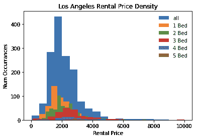
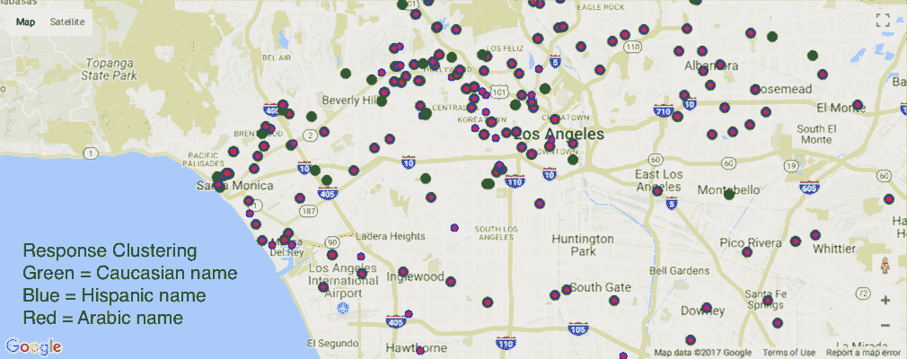
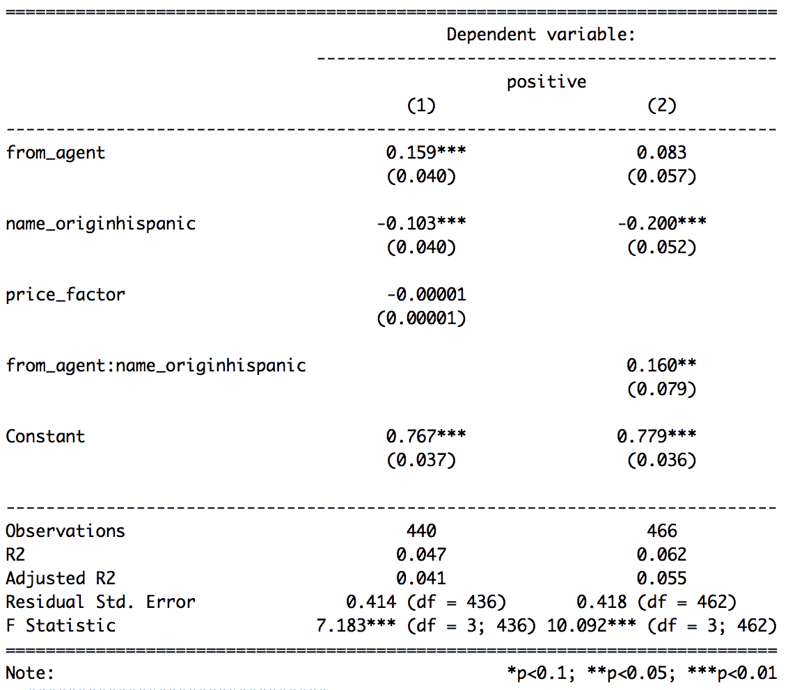

# 洛杉矶的种族主义房东歧视拉丁裔吗？

> 原文：<https://towardsdatascience.com/are-racist-landlords-discriminating-against-latinos-in-la-118daeb565da?source=collection_archive---------3----------------------->

洛杉矶是一个困难的租赁市场。很难找到你买得起的公寓，更不用说你梦想的地方了。有时候，你会觉得整个系统都在追杀你。新的证据表明，如果你是拉丁美洲人，你可能是对的。

Average Los Angeles rental is $2000 / month

在一项对 1484 名 Craigslist 房东的研究中，来自高加索人和拉丁人名字的相同电子邮件被发送。当控制租赁代理的中和效应时，与来自高加索人姓名的同一封电子邮件相比，拉丁美洲人收到正面反馈的可能性要低 20%。

Mapping response — white bias is seen by green dots without blue/red overlay.

各种形式的歧视都是可怕的，但这些发现中最令人震惊的是少数人在压迫多数人。2010 年人口普查显示，洛杉矶的人口构成是 49%的拉丁裔，28%的白人。尽管自由主义盛行，拉丁裔人口占多数，但种族主义似乎在洛杉矶依然存在。

Regression analysis results: 1484 Craigslist rental ad respondents comparing emails originating from Caucasian and Latino names