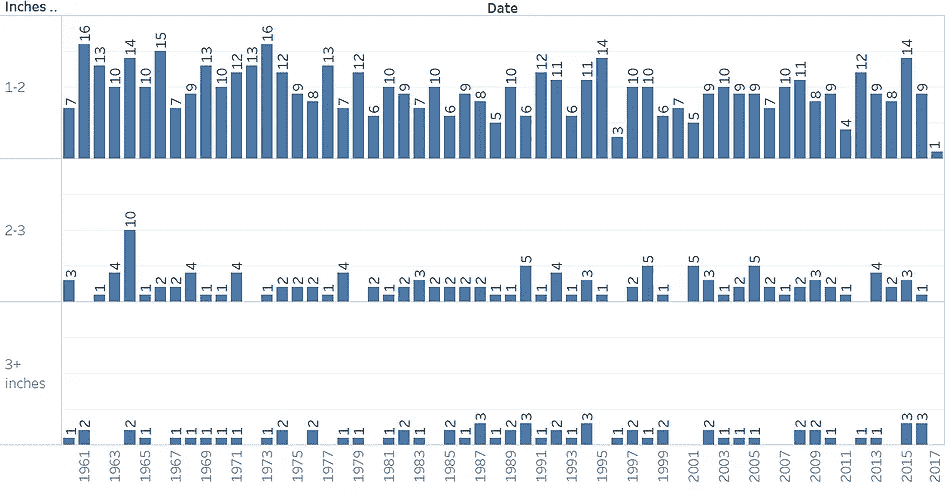
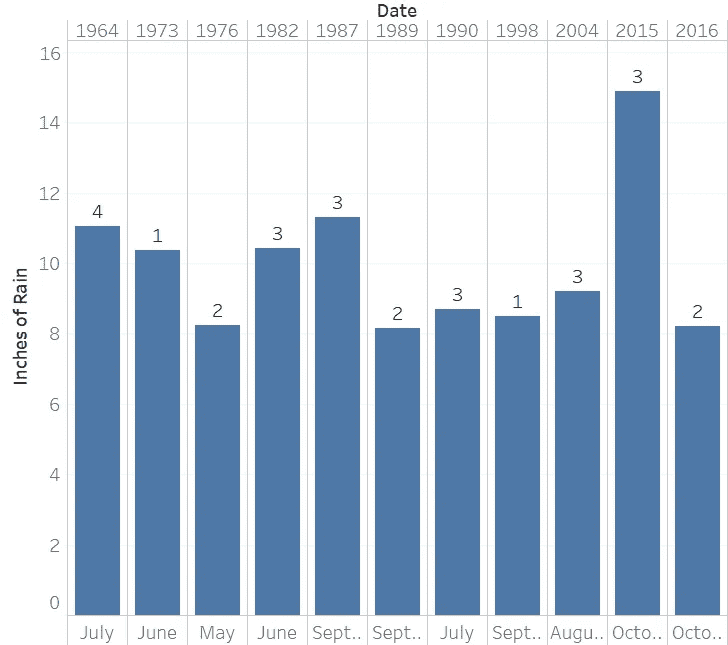
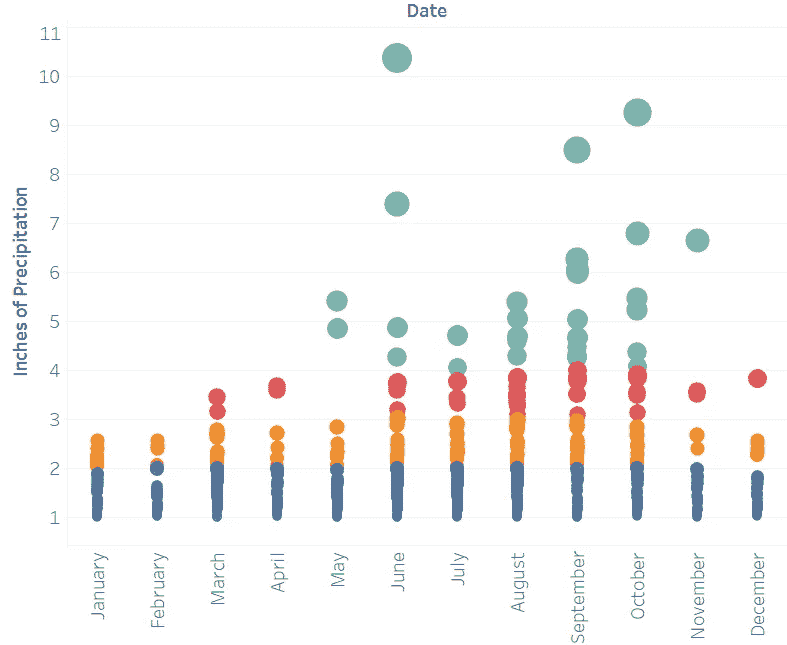
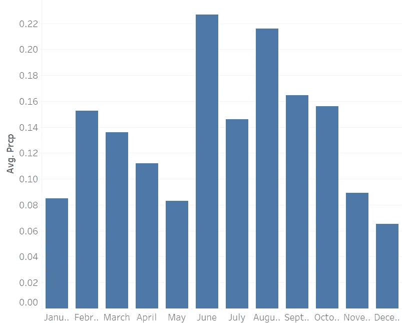

# 查尔斯顿的暴雨更严重吗？

> 原文：<https://towardsdatascience.com/are-these-charleston-rainstorms-more-severe-bfbe82f361fe?source=collection_archive---------9----------------------->

我和妻子每天早上带着我们的狗和孩子在查尔斯顿附近散步。我妻子说，在我们住在查尔斯顿的三年里，这里的天气总是阴雨连绵，而在这特殊的一天，又一场暴雨即将来临。我在查尔斯顿长大，我发誓不是在这种暴风雨中长大的。我记得，在夏季的几个月里，下午下了一个小时的倾盆大雨，但我们从来没有像现在这样连续下了几天的大雨。查尔斯顿的洪水似乎也成了我小时候不记得的问题。我知道这些数据可以从 NOAA 网站上获得，所以我开始回答这个问题:“查尔斯顿的暴雨变得越来越严重和频繁了吗？”

首先，我调查了每年下几次大雨。我带着不到一英寸的雨水出去了一整天。乍一看，我的预感似乎是错误的。本世纪只有两年有三天降雨量超过三英寸。他们只是碰巧在 2015 年和 2016 年，2015 年是我和妻子搬回查尔斯顿的那一年。2015 年是一个多雨的年份，有 14 天超过 1 英寸，3 天超过 2 英寸，3 天降雨量超过 3 英寸。

基于这些发现，我们似乎没有经历过导致更严重降雨的可测量的气候变化——除非它在 2015 年才开始。那么为什么所有的洪水？雨季似乎出现在零星的街区。我把数据按月分解，认为现在的月份肯定比以前多雨。我取出了降雨量少于两英寸的典型日子，并认为我已经找到了关键变量——不是多雨的日子，而是多天的事件。

没有。本世纪只有三个月的降雨量达到了至少 8 英寸，而且只有大暴雨(每天超过 2 英寸)。过去的两个十月恰好是其中的两个——2016 年 10 月 7 日和 8 日的马修飓风和 2015 年 10 月 1 日、3 日和 4 日的百年一遇风暴。

查尔斯顿的暴风雨似乎没有变得更猛烈。我们最近运气不好，尤其是在十月初。下图显示了自 1960 年以来最严重的几个月。在本世纪，我们只有五天的降雨量超过四英寸，而且都是在八月、九月或十月(其中三天在十月)。两年不完全是一个趋势，但为了安全起见，我会在 10 月初检查我的排水泵。

因此，虽然这些夏季风暴每月平均降雨量最多(见下图)，但自 1982 年以来，我们还没有在五月或六月遇到大风暴。这些降雨大多出现在 9 月和 10 月，这两个月比较干燥，但也有更多的极端风暴。我和妻子提出的查尔斯顿的天气越来越恶劣的假设没有数据支持。也就是说，随身携带你的雨伞！毕竟这是查尔斯顿。

Avg. Daily Precipitation

2017 年 5 月 27 日

丹尼尔·佩尔穆特

www.risingtide.marketing/blog