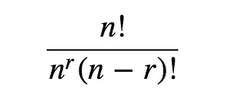
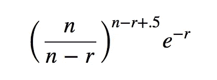
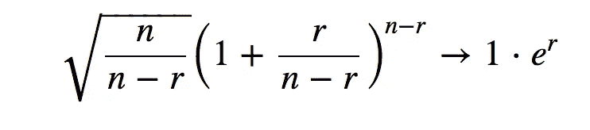
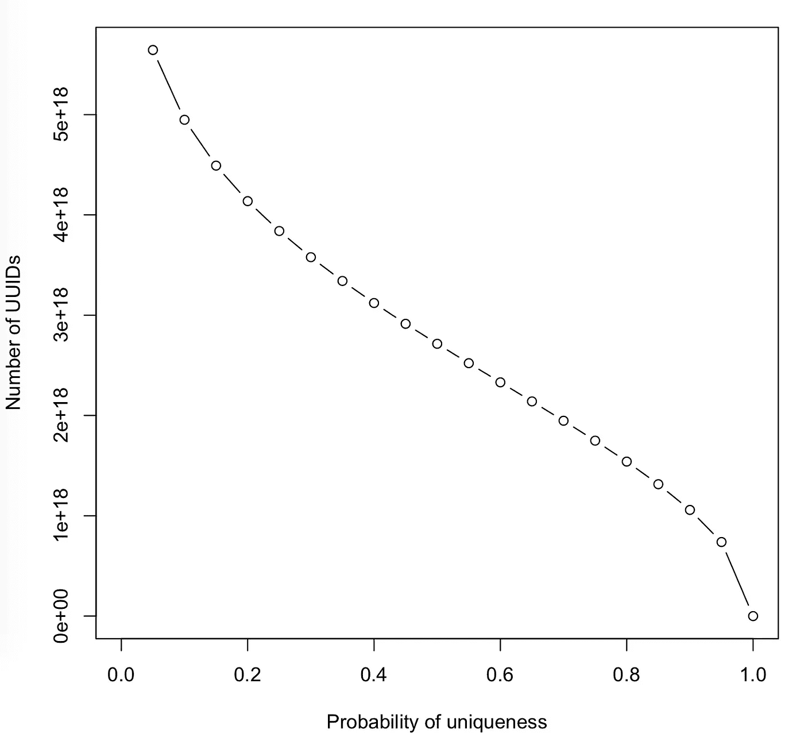

# UUIDs 真的唯一吗？

> 原文：<https://towardsdatascience.com/are-uuids-really-unique-57eb80fc2a87?source=collection_archive---------0----------------------->

UUID 一般代表**u**u**u**nique**id**标识符。它看起来像由破折号分隔的 32 个字符的字母和数字序列。一些例子:

8 f14 a65f-3032-42 c8-a196-1 cf 66d 11 b 930

b 400 af 61-6cb 4-4565-89 C4-d6ba 43 f 948 b 7

UUIDs 便于给实体起自己的特殊名称，例如在数据库中。有几种方法可以生成它们，包括基于时间、MAC 地址、哈希和随机数的方法，但它们都做出了相同的承诺:没有两个是相同的。每一个在空间和时间上都是独一无二的。

直觉上，这似乎不对。如果 UUIDs 是随机生成的，那么一定有*某种*的机会，一个序列被生成不止一次，特别是当我们生成越来越多的时候。让我们计算在一组 UUIDs 中没有重复的概率。

UUID 的 32 个字符是十六进制的，或以 16 为基数的表示法。每个字符可以是数字 0 到 9，或者是字母 a 到 f。在 UUID 中，32 个十六进制 x log2(16)位/十六进制= 128 位。在版本 4，变体 1 类型的 UUID 中，6 个比特是固定的，剩余的 122 个比特是随机生成的，总共有 2 个可能的 uuid。我们将这个值称为 *n* 。我们马上知道，如果生成的 uuid 的数量超过了可能的 uuid 的空间，即如果 *r* > *n* ，那么一定有一些重复。

无重复的方式数为*n**(*n*-1)*(*n*-2)*……(*n*-(*r-*1)。第一个 UUID 可以是 *n* 种可能性中的任意一种，第二个可以是除第一个之外的 *n* 中的任意一种( *n* -1)，第三个可以是除前两个之外的任意一种( *n* -2)，以此类推。生成*r*uuid 的方式总数是 *n^r* ，因为每个*r*uuid 有 *n* 种不同的可能性。将两个计数相除，得到没有重复 UUIDs 的概率:

Probability of generating r unique UUIDs

对于如此大的数量，直接计算概率在计算上是不可行的。大阶乘可以通过[斯特林公式](https://en.wikipedia.org/wiki/Stirling%27s_approximation)来近似，给出:

Approximate probability of generating r unique UUIDs

如果 r 固定且 n →∞，则上述等式的第一部分可表示为:

乘以第二部分，乘积为 1。因此如果 *n* ≫ *r* 几乎可以肯定不会有重复。但是如果 *r* 确实接近 *n* ，UUID 可能会重复。

r 到底应该有多大？我们可以从不同的角度来处理这个问题，这里我们不是从 *n* 和 *r* 开始，并试图计算 *p，*而是从 *n* 和 *p* 开始，并得到 *r* 。下面的图表显示了给定唯一性概率下 UUIDs 的大致数量。它的值是用维基百科引用的一篇[论文的近似公式计算出来的，其中*r*= . 5+sqrt(. 25–2 * ln(p)**n*)。](https://en.wikipedia.org/wiki/Universally_unique_identifier#cite_note-14)

3.26 * 10⁶uuid 的样本有 99.99%的可能性没有任何重复。以每秒一个的速度生成这么多 UUIDs 需要十亿年。因此，虽然 UUIDs 并不是真正唯一的，但考虑到人类寿命的自然限制和系统的分离，它们对于实际用途来说是足够唯一的。