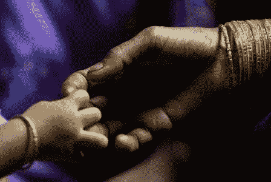
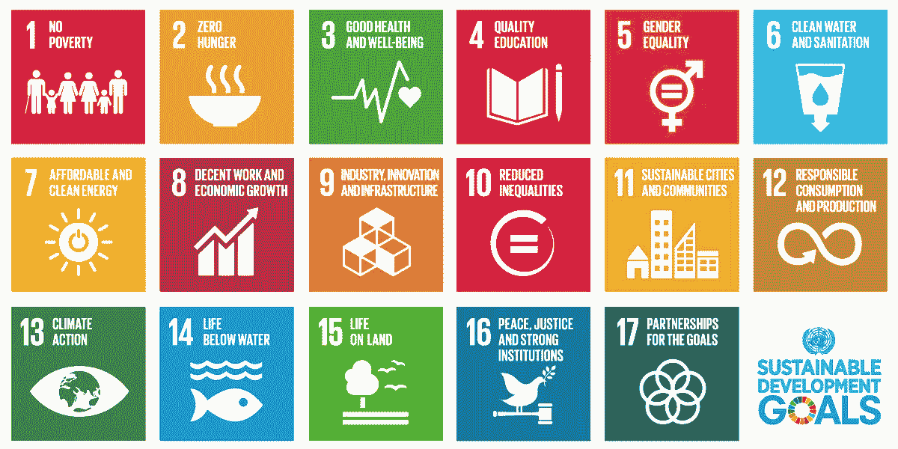

# 我们在照顾我们的孕妇吗？

> 原文：<https://towardsdatascience.com/are-we-taking-care-of-our-pregnant-women-8863980f3830?source=collection_archive---------4----------------------->

Image by [CARE International](http://www.care-international.org/what-we-do/maternal-health)

不可否认，分娩是所有物种最珍贵和最美丽的时刻之一，当然也是人类最珍贵和最美丽的时刻之一。这对女性来说是一个非常重要的时刻，她们应该采取一切可能的安全措施来保护自己和孩子的健康，对吗？这听起来非常简单明了，但实际上并非如此。

根据世界卫生组织的报告，每天约有 **830 名妇女死于与怀孕和分娩相关的可预防原因**，据估计，2015 年约有 303 000 名妇女在怀孕和分娩期间或之后死亡。

尽管在 1990 年至 2015 年间取得了巨大进步，全球孕产妇死亡率下降了约 44%，这要归功于**千年发展目标 5——改善孕产妇健康**，但在一些国家，分娩仍然是一个危险的过程。这主要是由于获得保健服务的不平等，因为 99%的孕产妇死亡发生在发展中国家。

Image by UNFPA Philippines

**你知道在你们国家，妇女一生中产妇死亡的风险有多大吗？**

世界银行与世卫组织、儿童基金会、人口基金和联合国人口司共同提供的一些统计数据显示，平均而言:

*   在发达国家，4900 名妇女中有 1 名最终会死于母亲原因；
*   在发展中国家，180 名妇女中有 1 名最终会死于母亲原因。
*   在脆弱的国家，每 54 名妇女中就有 1 名最终会死于母亲的原因。

很清楚的数字，你不觉得吗？*点击* [*此处*](http://data.worldbank.org/indicator/SH.MMR.RISK) *了解你们国家的费率是多少。*

据世卫组织称，妊娠和分娩期间及之后与孕产妇死亡相关的最常见并发症有:

*   严重出血(多为产后出血)
*   感染(通常在分娩后)
*   妊娠期高血压(先兆子痫和子痫)
*   分娩并发症
*   不安全堕胎
*   怀孕期间的疟疾或艾滋病。

为了缩小发达国家和发展中国家之间仍然存在的巨大差距，并保证全世界的妇女、青少年和儿童能够获得高质量的医疗保健，世卫组织和利益攸关方制定了**2016-30 年全球妇女、儿童和青少年健康战略**，我们进入了**可持续发展目标** (SDGs)时代。第三项可持续发展目标为妇女和孕产妇健康设定了非常重要的目标:

可持续发展目标 3:确保健康生活，促进所有年龄段所有人的福祉*(点击**查看可持续发展目标 [*的完整列表)*](http://www.un.org/sustainabledevelopment)*

*   *到 2030 年，将全球孕产妇死亡率降至每 100 000 例活产中不到 70 例。*
*   *到 2030 年，确保普遍获得性保健和生殖保健服务，包括计划生育、信息和教育，并将生殖健康纳入国家战略和方案。*

**

*可持续发展目标和全球战略对于解决国家内部和国家之间令人震惊的不平等和不公平极其重要，对全世界妇女来说当然也很重要。为确保所有战略和举措得到有效实施，联合国任命了独立问责小组(IAP ),每年报告全球战略和可持续发展目标的进展情况。在他们去年九月发布的第一份报告中，不平等是结果回顾的核心:*

> **国家内部和国家之间的不平等是妇女、儿童和青少年健康的根源。**

*IAP 指出的挑战之一是准确数据的**可用性**，尤其是在欠发达的卫生信息系统场景中，因为信息是正确分析进展的基础。该报告指出，在一个技术迅速发展的时代，我们不得不依赖对基本指标，如孕产妇死亡率的估计，这是不可接受的，这是完全正确的。*

*《国际行动计划》强调，需要在加强卫生管理信息系统的同时，监测《全球战略》下的进展，包括提高国家统计机构的能力和独立性。*

*不可否认的是，在妇女、儿童和青少年健康方面取得了巨大进步，但同样不可接受的是，妇女仍然死于怀孕期间或之后可预防或可治疗的并发症，这主要是由于获得保健服务方面的不平等。*

***所以，还是照顾好我们的孕妇吧！***

**参考文献**

**世界卫生组织—* [*孕产妇健康*](http://www.who.int/mediacentre/factsheets/fs348/en/)*

**联合国—* [*可持续发展目标*](http://www.un.org/sustainabledevelopment/sustainable-development-goals/)*

**独立问责小组—* [*【妇孺】*](http://iapewec.org/)*