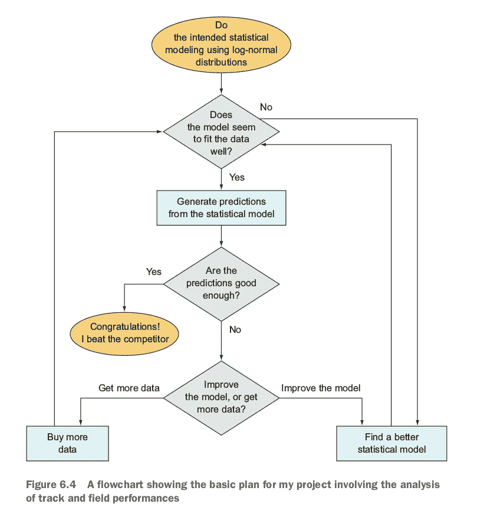
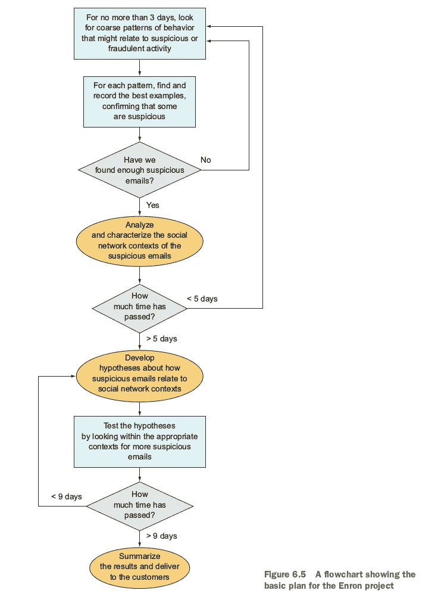

# 我们到了吗？

> 原文：<https://towardsdatascience.com/are-we-there-yet-daceccfdea38?source=collection_archive---------18----------------------->

## 数据科学中的项目管理

昨天，一位 Redditor 在[*r/data science*](https://www.reddit.com/r/datascience)*上问了一个很棒的问题，当我写下回应时，这个问题让我的思绪向几个方向移动。我也希望在这里听到每个人的想法，特别是如果你有自己处理项目风险的技巧。reddit 的帖子可以在这里找到。* *我(略加编辑)的回应如下。*

Project management can be dirty work.

# 问:数据科学家如何管理项目和团队？你如何估计持续时间和资源？

这些都是很棒的问题，我认为人们问得不够多，这也是我写[像数据科学家一样思考](https://www.manning.com/books/think-like-a-data-scientist?a_aid=thinklikeadatascientist&a_bid=eb49dc22)的主要原因之一。一个完整的章节致力于项目规划，另一个完整的章节是关于各种环境下的项目执行。我认为要很好地运行项目需要很多思考和考虑，我不认为我能在这里做到公正，但我会看看我是否能指出在这种情况下有所帮助的一些事情:

## 不确定性意识

首先，我一直在谈论“不确定性意识”的概念，因为数据科学和统计任务远比软件开发更不确定，例如，在一项任务可能需要多长时间方面，甚至*该任务是否可能*。

> 考虑一个数据科学项目的基本示例，其中您可能会看到这样一句话，“我们的目标是能够以 95%的准确率预测业务成果 X。”在项目开始时，我们不仅不确定需要多少时间和精力才能达到 95%，而且我们甚至不知道数据是否支持达到 95%。

因此，我喜欢强调的一点是，需要正式承认项目的哪些部分具有最大的不确定性，并制定计划来减少不确定性。减轻上述例子的一个方法是与产品/业务/客户人员讨论是否“95%或破产”，或者 80%对于产品的第一个版本是否合适，或者类似的事情。

## 灌篮+尽可能好，否则

以这种方式思考可以让你制定一个项目计划，其中包括在确定性方面“稳操胜券”的部分，然后对于不确定的部分，你可以计划让它们“在 2 周内尽可能好”或类似的东西。

如果你这样做了，你将拥有一个数据科学产品，它将花费同样多的时间来构建一个等效的——更可预测的——软件工程产品。主要缺点是结果的准确性/质量不会像你希望的那样高，但至少你有一个完整的结果和产品可以展示。以后改善结果可以是后续项目。

这可能不是在每种情况下都理想，但我发现它非常有帮助。

## 进入:流程图

我喜欢使用的一个概念规划工具是显示项目步骤的流程图，我在流程图中包含了我的不确定性。为此，我在流程图中加入了一些提问“这些结果够好了吗？”如果*是*则路径通向一条路，如果*否*则通向另一条路。您还可以对项目中的某些步骤设置时间限制。我喜欢将这些想法形式化，这样团队中的每个人都知道它将如何工作。

下面是《T5》一书中[的几个流程图示例:](https://www.manning.com/books/think-like-a-data-scientist?a_aid=thinklikeadatascientist&a_bid=eb49dc22)

Examples of flowcharts for projects in data science, from [Think Like a Data Scientist](https://www.manning.com/books/think-like-a-data-scientist?a_aid=thinklikeadatascientist&a_bid=eb49dc22), chapter 6.

# 问:你对数据科学家的项目管理有什么建议？

如果你喜欢这个，看看我的其他帖子:

 [## 数据科学真的是“科学”吗？

### 为什么数据科学可能是一个严格的领域，不同于它的前辈

towardsdatascience.com](/is-data-science-really-a-science-9c2249ee2ce4)  [## 检查您对数据的假设

### 没有人喜欢糟糕的假设

towardsdatascience.com](/check-your-assumptions-about-your-data-20be250c143) 

*Brian Godsey 博士是一名数学家、企业家、投资者和数据科学家，他的著作* [*像数据科学家一样思考*](https://manning.com/books/think-like-a-data-scientist?a_aid=thinklikeadatascientist&a_bid=eb49dc22) *现已有印刷版和电子书。——*[*briangodsey.com*](http://www.briangodsey.com/)

*要了解更多，请下载免费的第一章* [*像数据科学家一样思考*](https://manning.com/books/think-like-a-data-scientist?a_aid=thinklikeadatascientist&a_bid=eb49dc22) *并查看此* [*幻灯片演示文稿*](http://www.slideshare.net/ManningBooks/think-like-a-data-scientist) *了解更多信息和折扣代码。*