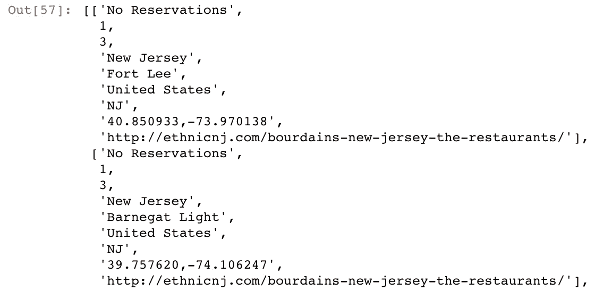
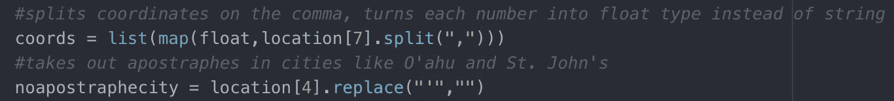
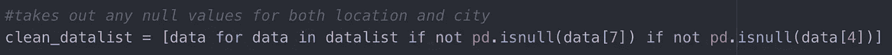
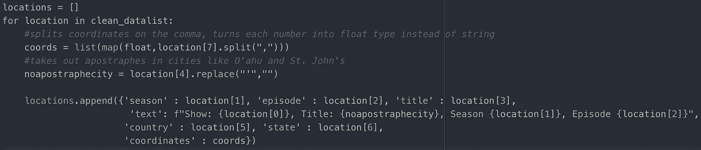
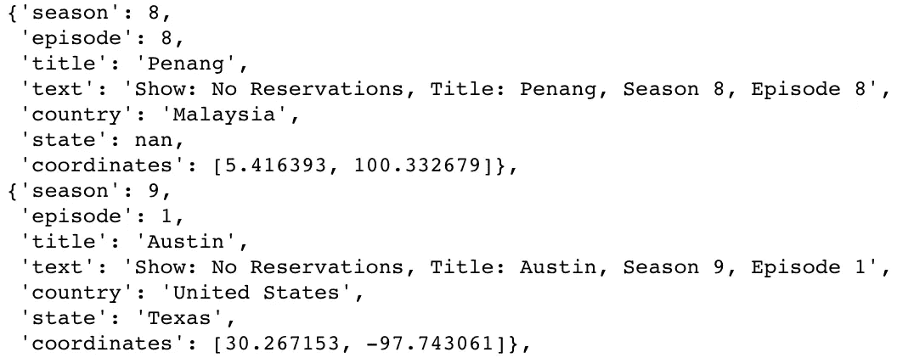
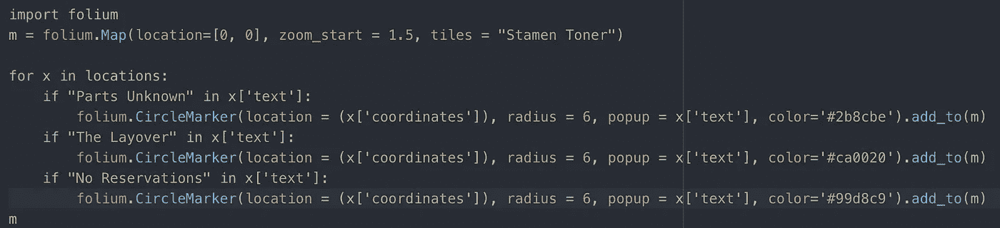
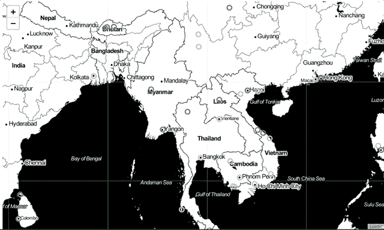
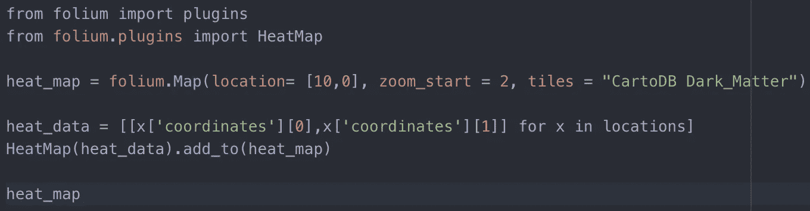
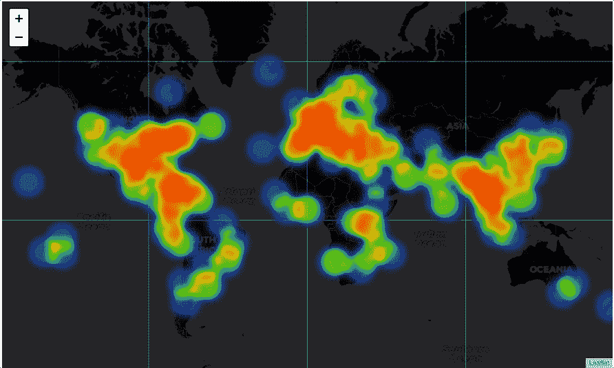

# 和安东尼·鲍代恩一起环游世界——一个叶子教程

> 原文：<https://towardsdatascience.com/around-the-world-with-anthony-bourdain-a-folium-tutorial-7e9ad63fb650?source=collection_archive---------5----------------------->

食物和旅行是我童年成长的核心。提供热腾腾的饭菜是我家人表达爱的方式，我是在缅甸和中国美食的熏陶下长大的(谢谢妈妈！).我父母带我们去了他们能去的任何地方，以此来拓宽我们在德克萨斯州达拉斯郊区以外的视野。夏天的公路旅行，偶尔去香港拜访我爸爸的家人，大学毕业时去挪威，最近一次是去日本的家庭旅行。

我们决定去日本后做的第一件事是什么？当然是看《无预约》东京集。我的整个家庭一直喜欢安东尼·鲍代恩的所有表演，他激发了我们长久以来的旅行欲望。所以当我看到一个包含他的节目每一集的位置数据的文件时(感谢 [Christine Zhang](https://github.com/underthecurve) 提供的数据集)，我知道我想要弄清楚如何映射它。我想要一个交互式地图，你可以放大和缩小，点击一个特定的城市，并查看它播出的节目、季节和剧集。让我们开始吧。

# 用叶子作图

在对交互式地图工具和库做了一些研究后，我选择了 follous，因为它可以在 Jupyter 笔记本中轻松地进行内置地图渲染。地图本身是一个名为[传单](https://leafletjs.com/)的 Javascript 地图库的一部分，而 Folium 是一个类似于传单包装器的工具，可以让你用 Python 调用地图。他们的 Github 上有几个令人难以置信的关于叶子地图的例子，我强烈建议看一看！

在用熊猫阅读了。csv 并将其转换为列表，检查我们正在处理的数据:

非常酷，它有我们需要的一切，但我们必须清理一下。通过文档查看映射函数和标记变量所需的数据类型。在这种情况下，我只需要坐标和弹出文本。正如我提到的，我希望弹出文本包含剧集、季节和城市名称。

我开始使用的数据看起来完美无瑕，直到我遇到似乎无穷无尽的数据类型错误。我将简短地讲述我所学到的东西:

1.  **坐标数据类型需要是元组或列表。**原始数据集将经度和纬度设置为一个长字符串，即‘29.951066，-90.071532’。将数据类型更改为:[29.951066，-90.071532]。
2.  **没有撇号**？？如果你的标记中有撇号，叶子就不会渲染。它不会绘图，但也不会向您抛出错误。您的地图将无法渲染。我坐了很久，心想可能是我的数据集太大了，结果发现地图刚刚坏了。我希望这能节省你一些时间。

a simple .split() and .replace() fixes both of these errors!

3.**取出所有空/南值。**这很容易用熊猫函数 isnull()来完成。

pd.isnull() Detects missing values for an array-like object.

很好。干净的数据是最好的数据。现在我们可以设置变量了。我更喜欢在设置变量时使用字典，所以让我们把这个列表变成字典列表:

现在我们的数据更容易阅读，因此更容易调用。

现在我们有了字典列表，我们终于可以映射了！正如你在下面看到的，我把原始地图的参数硬编码到了参数中。然后，我浏览了每本字典，并在每个坐标上做了标记。我想为这个地方播出的每个节目做一个不同颜色的圆形标记，这是通过三个“如果”语句完成的:

现在我们只需要调用我们的地图，然后..

出现野图！我们现在有了一个漂亮的地图(我用了雄蕊调色砖),每个位置都有彩色编码的圆圈标记。而且是可以点击的！

“未预订”是浅蓝色圆圈
“零件未知”是深蓝色圆圈
“中途停留”是红色圆圈

# 带上热火…地图

好吧，让我们再加把劲。Folium 拥有大量令人惊叹的插件，可以轻松定制地图的美感以及与地图交互的方式。

在这种情况下，一个有用的方法是 Heatmap，在导入插件后，通过将每个位置循环到 HeatMap()函数中就可以很容易地做到这一点。

Folium 有许多图块(地图样式)可供选择，所以我在这里切换到“CartoDB Dark_Matter ”:

就是这样！为了更进一步，还有另一个名为 HeatMapWithTime 的插件，它将根据日期(或季节)为您的地图制作动画。)与您的坐标相关联。

Folium 非常容易使用，并且有许多内置的功能来帮助你定制你的地图。我希望这个教程是有帮助的，或者你已经被激励去继承 Bourdain 鼓舞人心的遗产，去新的地方旅行。