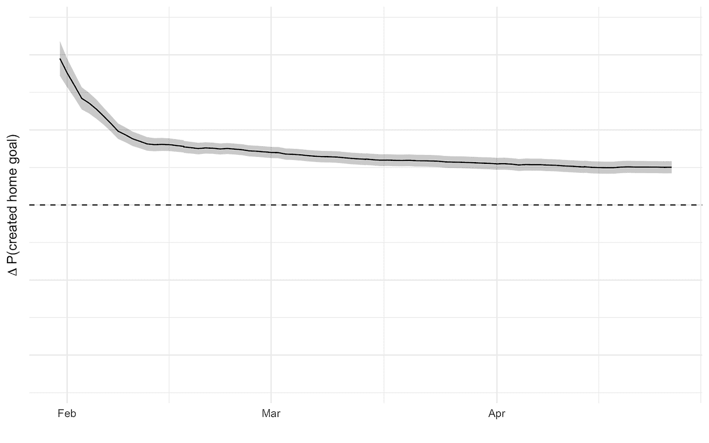
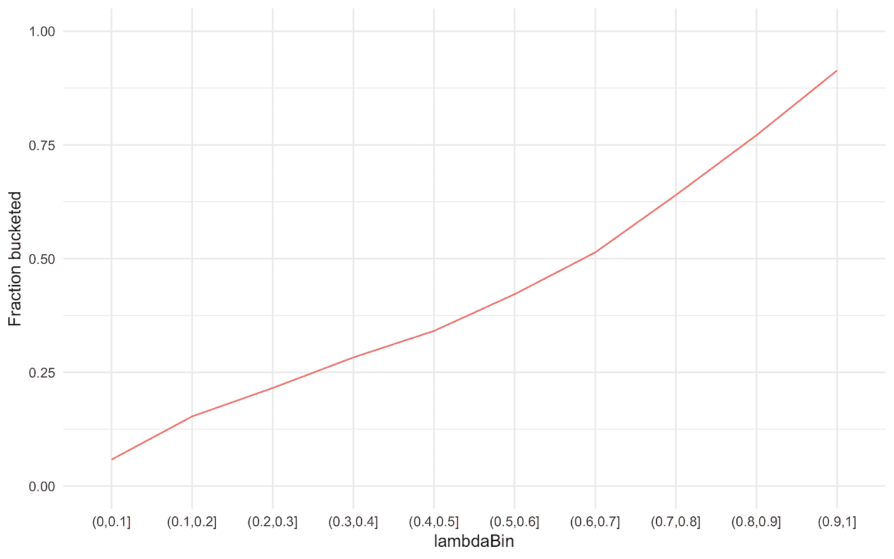
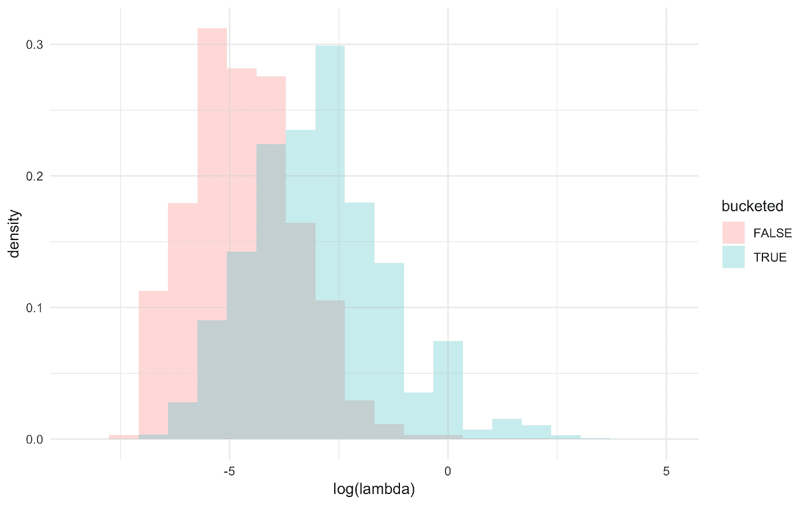
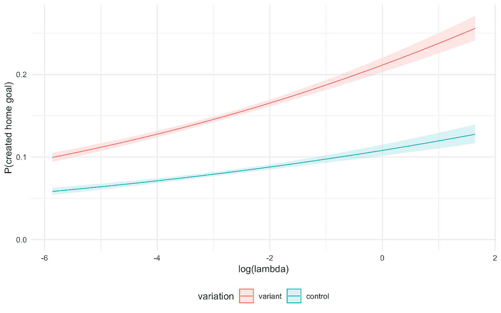
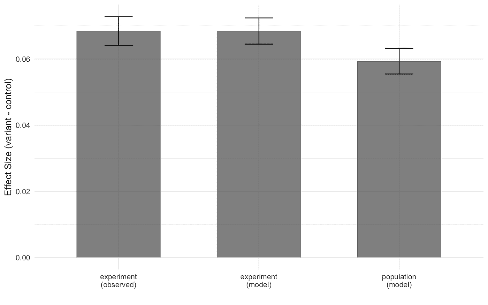
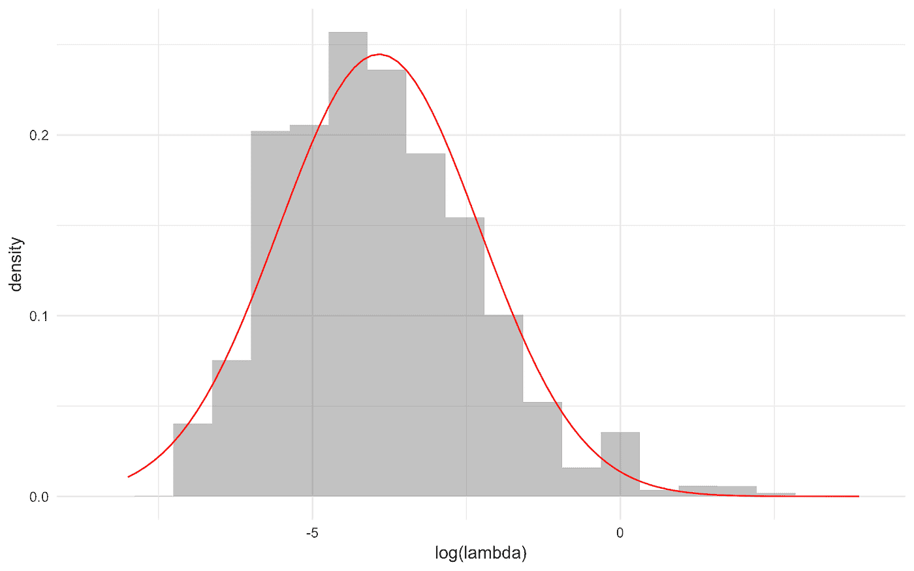
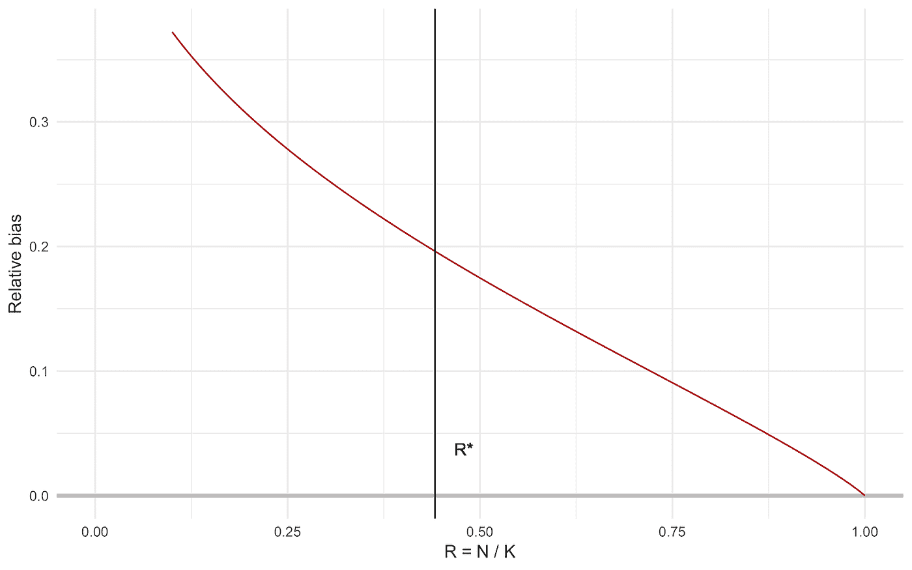
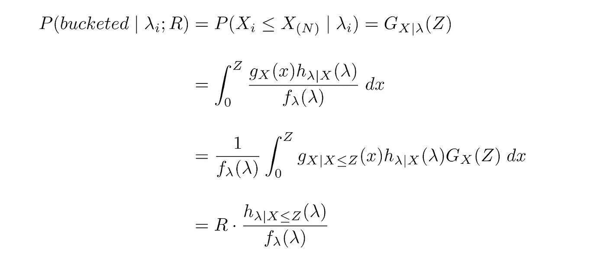

# A/B 测试中的到达率偏差

> 原文：<https://towardsdatascience.com/arrival-rate-bias-ab-testing-1-d291ae9d0cab?source=collection_archive---------2----------------------->

## 好事降临在那些迫不及待的人身上，第 1 部分

*这篇文章与* [*艾伦·西罗利*](https://medium.com/u/a6e97302d690?source=post_page-----d291ae9d0cab--------------------------------) *合著，是我们关于 A/B 测试中到达率偏差校正的两部分系列文章中的第一篇。我们非常感谢我们的* [*财富前沿数据科学*](https://medium.com/u/6b928e7e4b4d?source=post_page-----d291ae9d0cab--------------------------------) *同事* [*林秀吉*](https://medium.com/u/90dc7a9d1c04?source=post_page-----d291ae9d0cab--------------------------------) *，感谢他的宝贵投入。第二部分可以在这里找到***。**

**

*“people walking on sidewalk” by [rawkkim](https://unsplash.com/@rawkkim?utm_source=medium&utm_medium=referral) on [Unsplash](https://unsplash.com?utm_source=medium&utm_medium=referral)*

*像许多科技公司一样， [Wealthfront](https://medium.com/u/5a23996c5db9?source=post_page-----d291ae9d0cab--------------------------------) 利用产品内测试和实验来学习和决策。特别是，我们利用现有客户群的产品内 A/B 测试来了解产品决策如何导致行为变化。然而，我们的产品和业务有一些特点，使得进行这些实验和从实验结果中做出有效的推论变得复杂。例如，在客户端级别而不是会话级别测量效果，[需要小心](/the-second-ghost-of-experimentation-the-fallacy-of-session-based-metrics-fb65006d30ff)。与治疗同时显现相反，效果的测量可能需要[天或数周才能实现](https://ww2.amstat.org/meetings/jsm/2018/onlineprogram/AbstractDetails.cfm?abstractid=330383)。最后，现有客户的产品内测试所特有的一个挑战来自于产品使用率的异质性所导致的遵从偏差。这种现象，我们称之为“到达率偏差”，是我们接下来两篇文章的主题。在第 1 部分中，我们涵盖了以下几个部分:*

1.  *定义问题*
2.  *实施到达率*
3.  *展示这种偏见在真实实验中是如何体现的*
4.  *介绍潜在的解决方案*

*在第 2 部分中，我们将更深入地探讨我们实现的解决方案的细节，并讨论其对功耗计算的影响。*

# *问题是*

*作为随机对照试验(RCT)的一种形式，A/B 检验要求观察值随机抽样。虽然这个相当明显的要求很容易解释，但在实践中实现起来可能比预期的要困难。例如，很难简单地确保观察结果在对照组和治疗组之间随机分割。当在移动设备上进行 [A/B 测试时，这可能特别具有挑战性，在这种情况下，治疗组(而非对照组)的用户需要升级他们的应用程序，以暴露于一种变体。然而，在随机分配之前的样本选择过程中引入的偏差似乎没有得到足够的重视。](http://www.unofficialgoogledatascience.com/2018/03/quicker-decisions-in-imperfect-mobile.html)*

## *桶装*

*当运行产品内 A/B 测试时，我们首先将所有现有客户随机“分配”到对照组或治疗组。原则上，这种随机分配应该给我们一个[平均治疗效果(ATE)](https://en.wikipedia.org/wiki/Average_treatment_effect) 的无偏估计。然而，直到客户实际登录网络或移动设备时，他们才“进入”给定的实验。我们对分桶客户的样本进行推断，以避免[因未曝光而稀释测量的效应大小](https://en.wikipedia.org/wiki/Intention-to-treat_analysis)。然而，这种机制在我们的聚合实验样本中引入了偏差，因为登录越频繁的客户端越有可能被淘汰。因此，平均而言，这些客户在我们的样本中被过度代表，并且更早进入实验。此外，如果客户“到达”财富前线的倾向与他们对我们实验的反应倾向相关，那么在我们测量的 ATE 中可能存在选择偏差。例如，如果年轻客户(根据生物年龄)比年长客户登录更频繁，并且如果这一年轻群体更有可能对我们对 UI 所做的更改做出积极响应，那么我们可能会看到年龄混淆因素引入的偏差。*

*我们有证据表明这种事情可能正在发生。我们的财务规划团队最近进行了一项实验，以更清楚地推销我们的[家庭规划功能](https://www.wealthfront.com/home-guide)。这项测试的目的是，看看我们是否能够增加制定家居规划目标的客户比例，同时避免对其他指标(如保留率和参与度)产生任何负面影响。使用我们的内部 A/B 测试平台，它提供了对存储和处理效果的实时监控，我们观察到了这样的 ATE 时间序列:*

**

*Lift Decay in an experiment with Arrival Rate Bias*

*这个问题可能存在于任何在用户层面衡量效果大小的公司，但到达率偏差对 Wealthfront 来说尤其严重，原因有三。最重要的是，我们的客户在到达率方面表现出显著的异质性:许多客户每月或每季度登录一次进行检查，而其他客户则每天登录并更加关注他们的投资组合。此外，与其他数字产品相比，我们的客户登录的频率相对较低(可能是按照我们的建议“[设置好就忘了](https://blog.wealthfront.com/dont-let-fear-get-in-the-way/)”。最后，由于我们经常测量在数周或更长时间内实现的治疗效果，我们的客户到达率分布的性质所导致的问题变得更加严重。例如，401(k)账户展期并不是客户完全可以在应用程序中完成的事情，一旦这个过程开始，可能需要几周才能完成。我们的[投资组合信用额度](https://www.wealthfront.com/portfolio-line-of-credit)功能通常被客户用来满足大量但不常见的流动性需求，这意味着我们对他们使用的任何影响都不会很快得到衡量。*

## *到达率*

*为了研究未观察到的到达倾向和它对我们的实验推论的影响之间的关系，我们定义了一个事前观察到的度量，它可以预测客户的事后到达时间(X)。这些“到达率”可以从客户在给定实验开始之前的最近会话历史来估计。参照泊松过程的速率参数，我们将到达速率度量表示为λ(*λ*)。该参数的无偏估计是从用户在实验开始前的倒数第二次会话开始的时间的倒数( *T* )(其中 *S_k* 是第 k 次到最后一次会话的时间):*

**

*这个定义具有连续的优点。考虑的会话数量很少，足以有效地代表客户端的瞬时到达率，我们知道这很重要，因为我们有证据表明到达率是随时间变化的。重要的是， *λ_i* 的这些启发式计算仅利用实验开始之前的用户会话历史，而不是分桶时间之前的用户会话历史。这是有意的，因为在声明两者之间的关系时， *λ_i* 和直到分桶的时间应该是独立的。*

**

*Frequent arrivers are more likely to be bucketed*

*上面的图表明，通过证明 *λ* 与我们在家庭规划实验中遇到的客户比例正相关且单调相关，事前估计的 *λ* 可以准确捕捉事后到达倾向。最后，当我们比较加入实验的客户和没有加入实验的客户的到达率分布时，很明显存在有意义的选择效应。*

**

*Bucketed users have higher arrival rates*

# *量化到达率偏差*

*到达率偏差的第二个必要条件是作为 *λ* 的函数的差分效应大小。如果频繁的到达者和不频繁的到达者一样有可能改变他们的行为来回应我们的实验，那么我们没有什么可担心的。但是如果它们的反应不同，那么 ATE 可能会有偏差。在我们的家庭计划实验中，我们可以使用逻辑回归来估计治疗效果的异质性:*

**

*其中如果客户在治疗组中，Z 等于 1，否则等于 0。我们之所以选择这种形式，是因为我们的实验测量了创建家庭规划目标的客户的比例。如果我们绘制治疗组和对照组的反应函数，我们会看到异质性的证据:*

**

*We observe heterogeneous treatment effects in lambda*

*对此的一种解释是, *λ* 与可观察指标——任期、年龄、净资产、收入——相关，而这些与客户行为更直接相关。事实上，我们知道情况是这样的。此外，治疗组中的高- *λ* 客户在遭遇挫折后有更多的机会采取行动，因为他们更频繁地接触我们的治疗。*

*为了估计本例中到达率偏差的严重程度，我们可以使用模型的预测值来计算 ate，该模型的预测值是从 *λ* 的总体分布中采样的值。预测的反事实平均值的标准误差是自举的。我们观察到，分桶客户样本下的 ATE 与观察到的平均效应大小相匹配，这让我们对模型的准确性充满信心。客户群体的预测效应大小较低，这与上述反应图中效应大小的增加和本文第一个图中 ATE 的减少是一致的。*

**

*Under our model, the population effect size is below the that of the experiment*

# *一个简单的层次模型*

*我们可以进一步探索到达率偏差的严重程度如何随着收集的样本分数而变化。在这一点上，写下一个简单的层次模型是有益的。假设每个客户的到达率来自某种分布 *F_λ* ，他们的首次到达时间 *X_i* 来自指数分布(泊松假设):*

**

*目测表明 LogNormal(μ，σ)是 F_ *λ* 的合理参数化。下图显示了我们的家庭规划实验中 *λ* 的经验总体分布的最大似然拟合:*

**

*A lognormal model captures the empirical population distribution of *λ**

*然后，我们将 *K* 定义为随机分配给我们的实验的客户端数量， *N* 定义为到达并被分桶的累计数量，*R*:=*N*/*K*定义为在给定时间分桶的已分配客户端的比例。使用拟合的分布，我们可以很容易地计算基于 *R* 的到达偏差分布。在有偏分布 *H_λ* ( *λ* 上对估计的效应函数τ(λ)进行积分； *R* )，我们可以估计 *R* 的任何值的相对偏差 *B* ( *R* )，而不仅仅是实现的 *R** (实际进入实验的客户比例)。下面我们画出相对偏差*

**

*作为我们家庭规划实验的功能。注意，当 *R* 接近 1 时，偏差接近 0。我们看到，对这些实验估算升力的天真解释会产生明显有偏差的推论。*

**

*Significant bias remains even after nearly half of the eligible clients arrive*

# *潜在的解决方案*

*我们考虑到达率偏差问题的三种可能的解决方案。首先，用于量化上述偏差的回归方法可以通过控制混杂变量来进行修正。然而，这只能控制可观察的，而我们下面研究的方法也允许我们控制不可观察的(因为我们知道分桶机制)。第二，我们随机预选要被包括在实验中的客户，并等待这些客户中的一部分到达现场。最后，我们对到达并加入到我们实验中的客户的回答进行重新加权，以近似我们整体客户群的分布。对于结合回归和倾向加权的“双重稳健”估计量，[见本文](https://academic.oup.com/aje/article/173/7/761/103691)。*

## *预选*

*在一个没有时间限制的世界里，我们更愿意预先选择 K 个现有的客户，然后等待他们全部到达站点。这将在实验开始时给我们一个关于现有客户群的无偏见的样本。但是，如前所述，这 K 个客户需要几个月才能到达，我们需要在更短的时间内进行因果推断。*

*一种解决方法是通过测量到达的前 N 个客户端的影响大小来权衡时间偏差。认识到我们估计的偏差随着 R 的增加而下降，可以让我们做出明智的决定:我们愿意接受多大的偏差，以及这是否允许我们在分配给实验的时间内收集我们需要的样本。例如，我们可能随机抽取 K = 20，000 个客户端，并等待其中第一个 N = 15，000 个客户端被存储(R = .75)。这个 R 意味着一定量的预期偏差，可以简单地通过增加 R 来减小该偏差。这种方法的好处在于，等待第 N 个客户端到达的时间仅取决于 R，而不单独取决于 N 或 K。*

*上一节中介绍的我们的住宅规划实验的相对偏差图显示，我们实际收集的样本数量意味着大约 20%的相对偏差——超过了我们可以容忍的程度。我们本可以等待更多样本的到来，但是 R 越接近 1，采集样本的时间就越长。考虑到我们的客户每月、每季度甚至更少登录，这是不可行的。此外，预选不适于实时监控，因为它仅在 R 接近 1 时收敛到正确的答案，而我们希望在每个时间步长对 ate 进行无偏估计。幸运的是，这是我们解决问题的下一个方法的特征。*

## *反向倾向加权*

*加权采样是解决到达率偏差问题的另一种可能的解决方案。在因果推理文献中可以找到对[样本重新加权](https://en.wikipedia.org/wiki/Inverse_probability_weighting)的各种方法。这些重新加权的方法允许在选择可观察物的情况下进行稳健和灵活的因果建模，但是，如前所述，它们不能消除由于未观察到的混杂而产生的偏差。然而，我们对分桶机制的了解允许我们直接控制这些未观察到的因素。*

*我们实施的具体方法被称为反向倾向加权(IPW)。我们减持了高到达率的客户(那些极有可能被炒股的客户)，增持了低到达率的客户。通过选择适当的权重，我们可以对*进行采样，就好像来自*的无偏分布。为了说明这一点，让我们回顾一下前面描述的层次模型。假设λ的总体分布具有密度 f_λ(λ)，到达时间 X 的边际分布具有分布 G_X(x)。则λ的到达有偏分布具有某个密度 h_(λ|X≤Z)(λ)，其中 Z := G_X^-1(R)(使用 X_(N)的渐近论证，第 *N* 次跳跃/到达的时间)。我们想要一个将 *h* 转换成 *f* 的权重函数:*

**

*这恰恰是似然比 f _λ(λ)/h _(λ| X≤Z)(λ；r)。一个更有用的表达是:*

**

*其中分母表示到达速率为λ_i 的客户端在收集到 *R = N / K* 个样本时将被分桶的概率。一点数学表明，这个表达式等价于似然比:*

**

*直觉上，对于可能被淘汰的客户来说，权重较小(因为他们的到达率很高，在我们的样本中他们的比例更高)，而对于不太可能被淘汰的客户来说，权重较大。事实上，倾向是 *R* 的函数，这意味着权重为我们提供了收集的任意数量样本的 ate 的无偏估计，这是我们实时监控设置所需的一个关键属性。*

# *后续步骤*

*虽然它解决了我们最初的问题，但是 IPW 引入了一个折衷。也就是说，虽然我们可以恢复 ate 的无偏估计，但是估计量的[方差被权重](https://www.ncbi.nlm.nih.gov/pmc/articles/PMC5157758/)放大。这意味着对于一个给定的实验，我们需要更大的样本量来达到一些设定的统计功效目标。一个需要回答的关键问题是“大多少？”在这篇文章的第二部分，我们将提供一个解决方案，并记录 IPW 校正对模拟和实际实验的影响。*