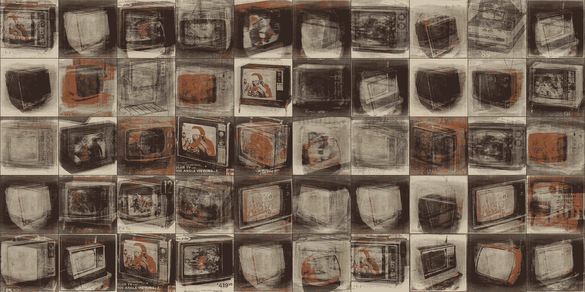
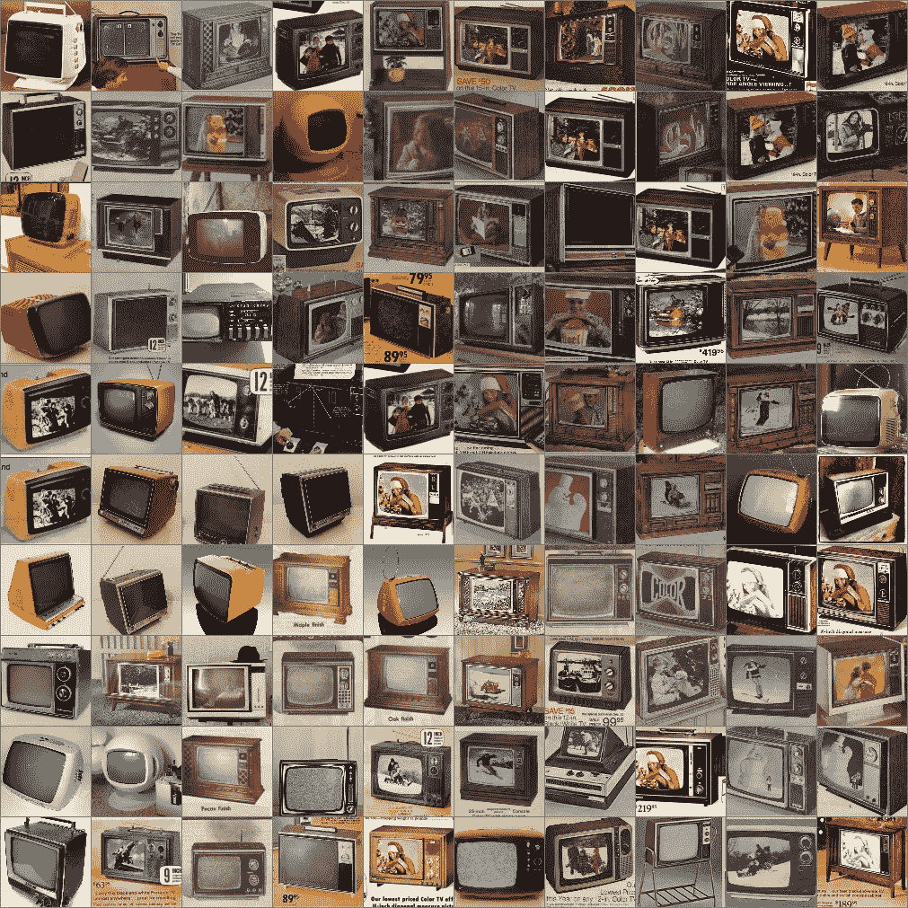
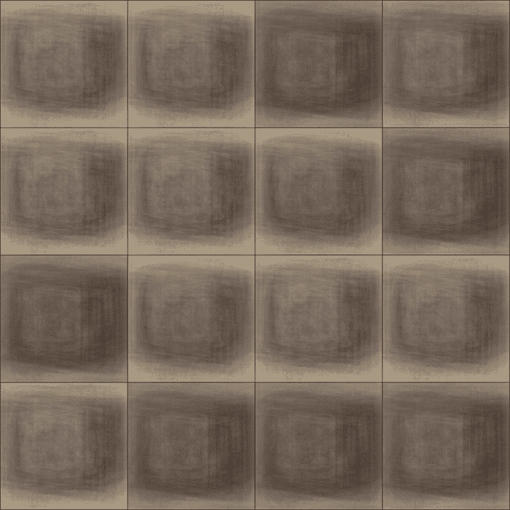
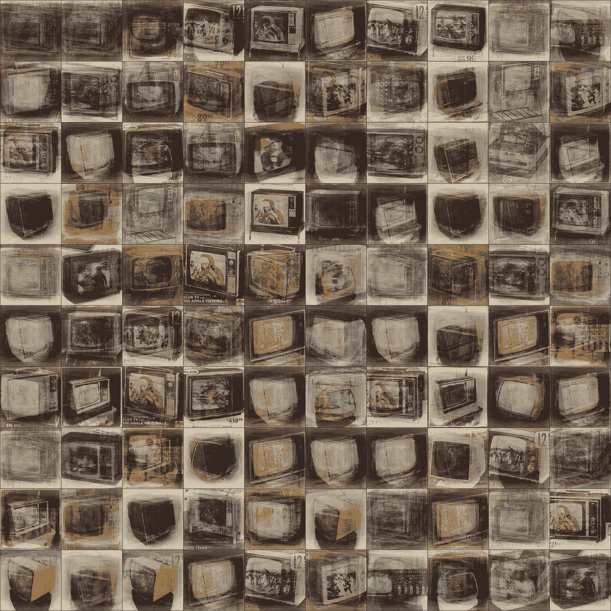

# 巧妙的压缩:如何教神经网络画 70 年代的电视

> 原文：<https://towardsdatascience.com/artful-compression-52c2b7347154?source=collection_archive---------5----------------------->

到目前为止，我已经完成了我那份深度学习 MOOCs 最近是[吴恩达在 Coursera](https://www.coursera.org/specializations/deep-learning) 的优秀系列。

但很少有面向有艺术倾向的人的。这就是 TensorFlow 与[深度学习的创造性应用的区别。](https://www.kadenze.com/courses/creative-applications-of-deep-learning-with-tensorflow/info)

这是帕拉格·米塔尔正在进行的卡丹泽课程。他通过大量精心制作的视频和 TensorFlow iPython 笔记本，涵盖了深度学习技术的所有领域。你可以随心所欲地调整后者。在这个过程中，您将了解卷积神经网络、自动编码器(我今天的主题)、风格转换和各种生成模型。

> **但总是着眼于创造具有高度视觉冲击力的作品。**

他关于可变自动编码器的课启发我尝试训练一个网络，它可以为人类提供一项重要服务:生成新颖但看起来真实的 70 年代电视图片。

# 什么是可变自动编码器？

这个人的帖子比我更好地回答了这个问题，但是你可以把它看作是一个巧妙压缩和重构的工具。在许多例子的训练下，它学会了将它们编码成所谓的潜在向量。对于每个训练步骤，它通过将当前潜在向量解码成图像来检查其进度。换句话说，它从潜在向量中的一系列简洁的数字中重建输入图像。

损失函数衡量这些输出与输入的匹配程度。

最酷的部分是，一旦网络被训练，你可以给它的解码部分输入一系列数字(潜在向量的一种变体)，然后就会弹出一个它被训练过的图像的新颖表示。

## 数据输入

帕拉格鼓励学生寻找有趣的数据集。我创建了自己的 groovy 数据集，大约有 100 张 70 年代电视的图片，是从这个网站上搜来的。它的粉丝扫描并上传整个目录(西尔斯、JCPenney 等。从几十年前开始。)(是的，有人将此作为一种爱好，为此，我很感激他们。)

Part of my 70s TVs dataset.

那些 70 年代的电视机很漂亮。但问题是，正如我们将要看到的，这个数据集太小了。

## 培养

有了这些数据，我调整了帕拉格的笔记本，用我 70 年代的电视数据集进行训练。您可以在下面观看训练的进展。我认为，看着它让我有了写这篇文章的灵感，真是太酷了。是本帖的钱拍！

A variational autoencoder learns to make 70s TVs (hit reload if you’re not see an animation).

## 问题

可悲的是，虽然我从来没有得到一个训练有素的网络。很可能数据集太小，即使使用像图像翻转这样的增强技术。如果我超过动画 gif 中显示的时代数，进程最终会停止。误差率将上升，并且输出图像将开始偏离输入图像。

确切的原因将不得不保持神秘，因为这对我来说只是一个有趣的玩具项目(但我欢迎任何改善评论结果的建议)。(下一步将是扩大数据集，看看生成式对抗网络是否能做得更好。)

尽管如此，如下所示，半训练的网络仍然能够产生一些有趣的，如果不完美的结果。事实上，正是它们缺乏完美的保真度，才给了它们一种很好的绘画品质。

Some 70s TVs generated by my variational autoencoder.

这些神经网络很有趣。

如果你想要数据集的副本，请联系我。它很小，但需要大量的体力劳动，这对任何人都没有用。