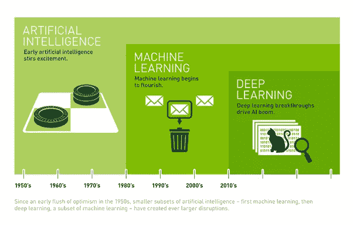

# #1 —人工智能:简介

> 原文：<https://towardsdatascience.com/artificial-intelligence-1-introduction-b305a878af6f?source=collection_archive---------2----------------------->

*(目的是围绕人工智能，特别是人工智能的投资主题，建立和分享见解。我在伦敦商学院的任期开启了人工智能投资的世界，这一系列涂鸦是我跟上这个话题的方式，当然也是相互学习的方式。希望在某个地方，这些将开始创造价值。在那之前，请继续阅读！)*

# **人工智能简介**

人工智能不再是一个影响无处不在的术语。在某种程度上，包括我自己在内的许多人都对自动化和模拟接管世界的整个概念漠不关心。现实是它将会发生，更令人担忧的是，就在我们说话的时候，它正在发生。

有预测和理论表明，到 2050 年，发达国家大约 50%的人类工作将被机器人取代。技术奇点被定义为人工智能超越人类智能的时刻，它将真正发生，我们这一代人将真正看到技术是如何扰乱我们周围的世界的。

但除了对人工智能的普遍兴奋之外，理解它的实际含义也很重要。人工智能就是机器为你执行事情。作为机器，这些不一定是物理机器人，而是类似人脑运作方式的计算代码。类似于我们的大脑:

**收到**比如热对冷，近对远

记得你的生日或当月的购物清单

**回归**寻找逃避与伴侣打架或把足球踢向正确方向的最佳方式

**通过分析交易对手的行动来回应**

一个计算机程序可以完成这一切。因为我们的大脑在计算能力上有局限性，而且因为今天我们有如此多的带标签的数据来校准和验证这些程序，所以人工智能和机器学习(让计算机学习的行话)的概念正变得真实而同样重要。让我们暂停一下，理解 AI 和 ML 这两个词的真正含义。

人工智能是一个广义的术语，用来描述人类可以做的由计算机做的任何事情。首先，数据存储(软盘、存储总线等)是人工智能的最初版本之一。我拿科学来类比:算法= AI:机器学习。机器学习是实现人工智能的一种方法。机器学习与计算机能够解析数据、从中学习和预测洞察力有关。这些术语在人工智能的世界里可以互换使用，但是我们总是用人工智能这个词来描述计算机智能的一般主题。

现在，在机器学习的广泛类别中，最热门和最具趋势的人工智能领域是深度学习。深度学习特别关注通过各种算法来模拟大脑，这些算法包括人工神经网络、遗传算法*(以及一系列其他算法，我打算在下面的文章中详细理解和阐述)*以将其塑造成人类大脑的行为方式。深度学习通过数据处理、计算机编程和逻辑领域的启示推动了人工智能的发展。

Source: Nvidia corporate blog

# **定义人工智能市场——横向与纵向人工智能**

从广义上讲，人工智能公司可以分为垂直人工智能和水平人工智能。横向 AI 专注于解决更大的问题陈述，而纵向 AI 专注于小众。例如，苹果的 Siri 或亚马逊的 Alexa 就是横向人工智能应用的例子。只要需求和资源存在，横向人工智能可以在内部开发人工智能技术。当他们不能且问题陈述过于小众时，一般从市场上的垂直 AI 玩家那里获得。因此，横向人工智能侧重于更实用的方法，以迎合终端用户可能需要的广泛主题。例如，语音识别已经成为当今主流的人工智能，大多数大型科技公司都配备了这项技术。然而，基于对客户数据的深度学习洞察，为仓库提供最后一公里物流服务的自动驾驶卡车显然是一个横向人工智能。因此，这个游戏很简单，在某个时候，将会有一个由现有者(我们称之为传统市场)主导的行业，依靠利基技术来完成自身。因此，水平人工智能将与垂直人工智能相结合并实现垂直人工智能。

在人工智能的世界里，这些在职者通常被归类为**黑手党**，由 **M** 微软、 **A** mazon、 **F** acebook、 **I** BM 和 **A** lphabet 组成。其他包括苹果推特、英特尔、百度、阿里巴巴([https://TechCrunch . com/2017/01/27/Apple-joins-Amazon-Facebook-Google-IBM-and-Microsoft-in-ai-initiative/](https://techcrunch.com/2017/01/27/apple-joins-amazon-facebook-google-ibm-and-microsoft-in-ai-initiative/))

*我将通过横向玩家在以下作品中触及价值、倍数、数量和主题来关注人工智能中的 M&A*

# **人工智能风险投资的主要宏观趋势**

1.增长:从根本上推动人工智能增长的是强大的计算和处理器芯片的可用性。计算速度和芯片制造的指数级发展实际上解除了计算限制，使人工智能得以发展

2.**相关性**:在所有公司的活动记录中(> 70%的公司使用与人工智能相关的关键词)。人工智能不仅仅局限于移动和互联网，还被用于医疗保健、诊断、药物研发、移动性等领域，直到最近，甚至被用于政治活动

3.**人才:“获取”在人工智能投资领域非常普遍。在许多情况下，收购风险企业主要是为了团队中的人才。这些企业通常还没有单一产品，但市场上人才的严重短缺推动了并购。毫不奇怪，在某些情况下，风险企业的估值相对高于电动汽车/博士，以此来衡量价值**

4.**态度转变**(拥有比必须拥有更好)——今天几乎所有的应用都有人工智能元素，但仅限于基本的用户需求，如预测分析。人工智能现在被视为使能者，而不是破坏者。人工智能不仅仅是一个就业杀手，从经济意义上来说，它被理解为创造价值

5.**生态系统:**存在一个支持性的生态系统，主要利益相关者之间的协调日益加强，包括专注于人工智能的企业家、大学、加速器和结构化风险投资基金，特别是在美国(硅谷)、英国(剑桥、伦敦)、中国等。其他国家很快也会效仿

***6。*** **风险企业的战略重点:**不考虑目标行业，专注于**利基市场的初创企业都有非常成功的退出。几乎所有这些都是现任者在寻找人才和某些产品时收购的。但因为人工智能的范围是无限的，所以很难给大多数风险投资定价。因此，大多数企业在退出时都获得了疯狂的早期倍数。就行业而言，移动、广告技术、制造、医疗诊断和金融是一些领先的人工智能用户。然而，农业、药物研发甚至创意媒体都是一些未充分渗透的领域。*(我接下来的一篇文章将关注人工智能渗透率的行业分类)***

**7.时间表:人工智能革命已经开始，预计未来 3 年人工智能投资和增长将大幅增长。从今天到未来 20 年，我们所说的变化可能会重现我们从后工业革命到今天的移动和互联网世界所看到的情况。轴不再是线性的而是指数的！**